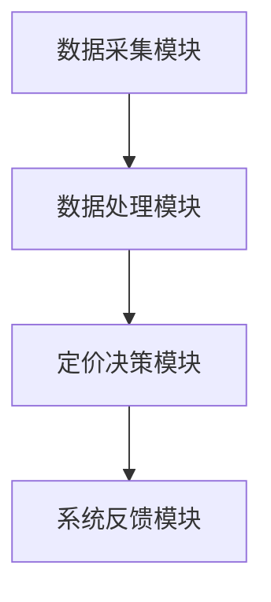
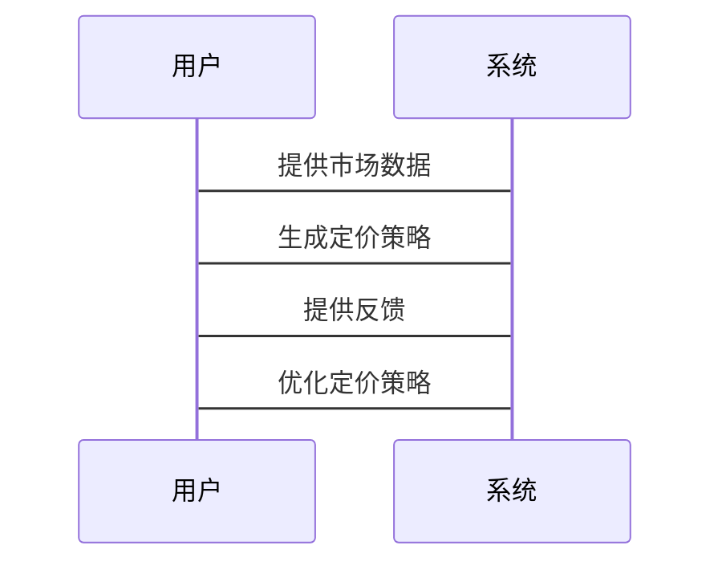

                 


# AI Agent在智能电子商务定价策略中的角色

> 关键词：AI Agent, 智能电子商务, 定价策略, 动态定价, 机器学习, 强化学习, 博弈论

> 摘要：本文深入探讨了AI Agent在智能电子商务定价策略中的角色与应用。通过分析定价策略的核心要素、AI Agent的决策机制以及基于机器学习和强化学习的定价算法，本文揭示了AI技术如何优化定价策略，提升企业的市场竞争力。文章还结合实际案例，展示了AI Agent在智能定价系统中的系统架构和实现方案，为读者提供了全面的理论与实践指导。

---

# 第一部分: AI Agent与智能电子商务定价策略概述

## 第1章: AI Agent与智能电子商务定价策略概述

### 1.1 AI Agent的基本概念与特点

#### 1.1.1 AI Agent的定义与核心特征
AI Agent（人工智能代理）是指能够感知环境、自主决策并执行任务的智能实体。其核心特征包括：
- **自主性**：能够独立执行任务，无需人工干预。
- **反应性**：能够实时感知环境变化并做出响应。
- **目标导向**：基于目标驱动决策。
- **学习能力**：通过数据和经验不断优化性能。

#### 1.1.2 AI Agent在智能系统中的作用
AI Agent在智能系统中主要负责信息处理、决策优化和执行控制。例如，在电子商务场景中，AI Agent可以用于自动化商品推荐、库存管理和定价策略优化。

#### 1.1.3 AI Agent与传统定价策略的对比
传统定价策略通常基于静态数据分析，而AI Agent可以通过实时数据处理和动态决策显著提升定价的灵活性和准确性。

### 1.2 智能电子商务定价策略的基本原理

#### 1.2.1 定价策略的分类与应用场景
定价策略主要分为成本导向定价、需求导向定价和竞争导向定价。在智能电子商务中，需求导向定价和竞争导向定价是应用最广泛的两类。

#### 1.2.2 智能定价的核心要素
智能定价的核心要素包括：
- **数据驱动**：基于实时数据进行分析。
- **动态调整**：根据市场变化自动调整价格。
- **个性化推荐**：基于用户行为进行个性化定价。

#### 1.2.3 AI Agent在定价中的角色定位
AI Agent在定价策略中扮演着决策者和执行者的双重角色，能够实时分析市场数据并优化定价方案。

---

# 第二部分: AI Agent在定价策略中的核心概念与原理

## 第2章: AI Agent与定价策略的核心概念

### 2.1 AI Agent在定价策略中的核心概念

#### 2.1.1 定价策略的数学模型
定价策略可以通过数学模型进行描述，例如：
$$ \text{价格} = f(\text{成本}, \text{需求}, \text{竞争}) $$
其中，$f$ 是基于AI Agent的定价函数。

#### 2.1.2 AI Agent的决策机制
AI Agent的决策机制包括以下步骤：
1. **数据采集**：收集市场、用户和竞争数据。
2. **数据处理**：对数据进行清洗和特征提取。
3. **决策推理**：基于模型进行定价决策。
4. **执行反馈**：根据市场反馈优化决策模型。

#### 2.1.3 数据驱动的定价逻辑
数据驱动的定价逻辑基于以下几点：
- **市场需求预测**：通过机器学习模型预测用户需求。
- **竞争分析**：分析竞争对手的定价策略。
- **成本优化**：根据成本变化调整价格。

### 2.2 定价策略中的关键因素分析

#### 2.2.1 市场需求分析
市场需求分析是定价策略的核心，可以通过以下步骤实现：
1. **数据采集**：收集用户行为数据。
2. **需求建模**：构建需求预测模型。
3. **需求弹性分析**：评估价格变化对需求的影响。

#### 2.2.2 竞争对手分析
竞争对手分析是定价策略的重要组成部分，可以通过以下步骤实现：
1. **竞争数据采集**：收集竞争对手的价格、库存和促销信息。
2. **竞争分析模型**：构建竞争对手定价模型。
3. **竞争策略优化**：制定差异化定价策略。

#### 2.2.3 成本与收益平衡
成本与收益平衡是定价策略的核心，可以通过以下步骤实现：
1. **成本分析**：分析产品成本结构。
2. **收益预测**：预测不同价格下的收益。
3. **定价优化**：找到成本与收益的平衡点。

### 2.3 AI Agent定价策略的系统架构

#### 2.3.1 数据采集模块
数据采集模块负责收集市场、用户和竞争数据，主要包括：
- **市场数据**：市场趋势、用户行为数据。
- **竞争数据**：竞争对手的定价、促销信息。
- **产品数据**：产品成本、库存信息。

#### 2.3.2 数据处理模块
数据处理模块负责对数据进行清洗和特征提取，主要包括：
- **数据清洗**：去除噪声数据。
- **特征提取**：提取关键特征，例如用户需求弹性、竞争对手定价策略。
- **数据转换**：将数据转换为适合模型输入的格式。

#### 2.3.3 定价决策模块
定价决策模块负责根据数据处理结果生成定价策略，主要包括：
- **定价模型**：基于机器学习或强化学习的定价模型。
- **定价决策**：根据模型输出生成价格建议。
- **定价优化**：根据市场反馈优化定价策略。

---

# 第三部分: AI Agent定价策略的算法原理

## 第3章: AI Agent定价策略的算法原理

### 3.1 基于机器学习的定价模型

#### 3.1.1 线性回归模型
线性回归模型是一种简单的定价模型，适用于线性关系较为明显的场景。其数学表达式为：
$$ \text{价格} = \beta_0 + \beta_1 \times \text{需求} + \epsilon $$
其中，$\beta_0$ 是截距，$\beta_1$ 是需求的回归系数，$\epsilon$ 是误差项。

#### 3.1.2 支持向量机模型
支持向量机（SVM）是一种常用的分类和回归模型，适用于高维数据的定价预测。其核心思想是通过构建超平面将数据分隔开来。

#### 3.1.3 神经网络模型
神经网络模型是一种深度学习模型，适用于复杂非线性关系的定价预测。其数学表达式为：
$$ \text{价格} = W \times \text{输入} + b $$
其中，$W$ 是权重矩阵，$b$ 是偏置向量。

### 3.2 基于强化学习的定价策略

#### 3.2.1 强化学习的基本原理
强化学习是一种通过试错优化决策的机器学习方法，适用于动态变化的市场环境。

#### 3.2.2 状态空间与动作空间的定义
在强化学习中，状态空间和动作空间的定义至关重要。例如：
- **状态空间**：市场环境、用户行为。
- **动作空间**：价格调整、促销策略。

#### 3.2.3 奖励函数的设计
奖励函数是强化学习的核心，用于衡量决策的好坏。例如：
$$ \text{奖励} = \text{收益} - \text{成本} $$
其中，收益是定价后的销售额，成本是产品成本。

### 3.3 基于博弈论的定价策略

#### 3.3.1 博弈论基础
博弈论是研究策略互动的数学理论，适用于多主体竞争的市场环境。

#### 3.3.2 市场博弈模型
市场博弈模型可以描述为：
$$ \text{价格}_i = \arg \max_{p_i} \left( \text{收益}_i - \sum_{j \neq i} \text{收益}_j \right) $$
其中，$\text{收益}_i$ 是企业i的收益，$\text{收益}_j$ 是竞争对手j的收益。

#### 3.3.3 Nash均衡与定价策略
Nash均衡是博弈论中的一个均衡概念，适用于多方利益平衡的定价策略。

---

# 第四部分: AI Agent定价策略的系统设计与实战

## 第4章: AI Agent定价策略的系统设计

### 4.1 系统功能设计

#### 4.1.1 系统功能模块
系统功能模块包括：
- **数据采集模块**：负责市场、用户和竞争数据的采集。
- **数据处理模块**：负责数据的清洗和特征提取。
- **定价决策模块**：负责定价策略的生成和优化。
- **系统反馈模块**：负责根据市场反馈优化定价策略。

#### 4.1.2 系统功能流程
系统功能流程可以描述为：
1. 数据采集模块采集市场、用户和竞争数据。
2. 数据处理模块对数据进行清洗和特征提取。
3. 定价决策模块基于数据生成定价策略。
4. 系统反馈模块根据市场反馈优化定价策略。

### 4.2 系统架构设计

#### 4.2.1 系统架构图
以下是系统的架构图：


#### 4.2.2 系统交互流程
以下是系统的交互流程：


### 4.3 项目实战

#### 4.3.1 项目背景与目标
项目目标是开发一个基于AI Agent的动态定价系统，实现价格的实时优化。

#### 4.3.2 项目实现步骤
项目实现步骤包括：
1. 数据采集：收集市场、用户和竞争数据。
2. 数据处理：清洗和特征提取。
3. 模型训练：训练定价模型。
4. 系统部署：实现定价决策模块。
5. 系统测试：测试系统性能。

#### 4.3.3 项目代码实现

##### 4.3.3.1 数据采集模块
以下是数据采集模块的代码示例：
```python
import requests
import json

def collect_data(url):
    response = requests.get(url)
    data = json.loads(response.text)
    return data
```

##### 4.3.3.2 数据处理模块
以下是数据处理模块的代码示例：
```python
def preprocess_data(data):
    processed_data = []
    for item in data:
        processed_item = {
            'price': item['price'],
            'demand': item['demand']
        }
        processed_data.append(processed_item)
    return processed_data
```

##### 4.3.3.3 定价决策模块
以下是定价决策模块的代码示例：
```python
def pricing_strategy(processed_data):
    prices = []
    for item in processed_data:
        # 假设我们使用线性回归模型进行定价
        price = 1.5 * item['demand'] + 10
        prices.append(price)
    return prices
```

#### 4.3.4 项目案例分析
以下是一个具体的定价案例：
- **市场需求**：用户需求弹性较大。
- **竞争对手分析**：竞争对手价格较高。
- **定价策略**：制定略低于竞争对手的价格，吸引用户。

---

# 第五部分: 总结与展望

## 第5章: 总结与展望

### 5.1 本章总结
本文深入探讨了AI Agent在智能电子商务定价策略中的角色与应用，分析了定价策略的核心要素、AI Agent的决策机制以及基于机器学习和强化学习的定价算法。

### 5.2 未来展望
未来，随着AI技术的不断发展，AI Agent在定价策略中的应用将更加广泛。例如，可以进一步研究基于深度学习的定价模型，以及如何在多主体博弈中优化定价策略。

---

通过以上目录结构和内容安排，我们可以系统地撰写一篇关于AI Agent在智能电子商务定价策略中的角色的技术博客文章。每一章的内容都围绕核心主题展开，既有理论分析，又有实际案例，确保文章内容丰富且易于理解。

