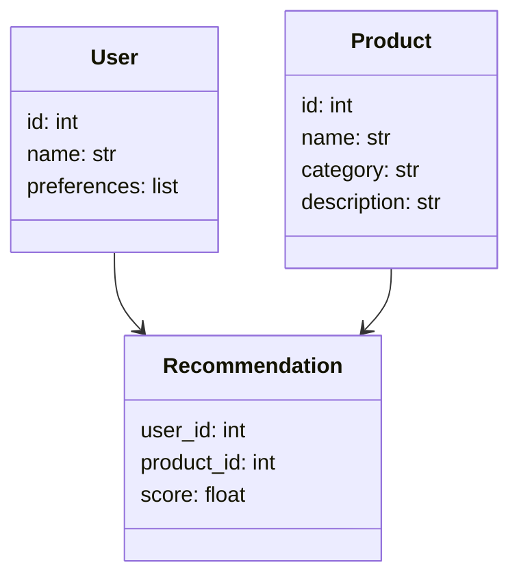
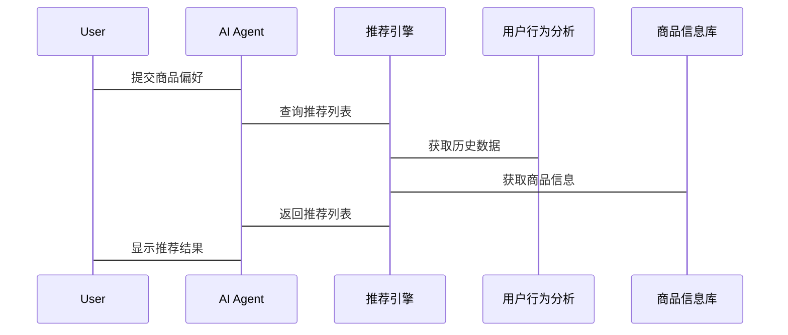

                 


# AI Agent在智能电子商务推荐中的角色

> 关键词：AI Agent, 智能推荐系统, 电子商务, 人工智能, 推荐算法, 知识图谱, 用户行为分析

> 摘要：本文深入探讨了AI Agent在智能电子商务推荐系统中的角色与应用。首先介绍了AI Agent的基本概念及其在智能推荐中的重要性，接着分析了AI Agent的核心原理与推荐算法，详细阐述了基于深度学习和强化学习的推荐模型。然后，通过Mermaid图展示了推荐系统的架构设计与交互流程，并通过Python代码示例讲解了协同过滤和基于知识图谱的推荐算法。最后，结合实际案例分析了AI Agent在智能推荐中的应用，并给出了系统优化与未来研究方向的建议。

---

# 第一部分: AI Agent在智能电子商务推荐中的背景与概念

## 第1章: AI Agent与智能电子商务推荐概述

### 1.1 AI Agent的基本概念

AI Agent（人工智能代理）是指能够感知环境、自主决策并执行任务的智能实体。在电子商务推荐系统中，AI Agent充当了连接用户与商品的桥梁，通过分析用户行为和偏好，主动为用户推荐个性化商品或服务。

#### 1.1.1 AI Agent的定义
AI Agent是一种具备以下特征的智能系统：
- **自主性**：能够在没有人工干预的情况下自主运行。
- **反应性**：能够感知环境并实时调整行为。
- **目标导向**：通过优化目标函数来实现特定任务。
- **学习能力**：能够通过数据和反馈不断优化自身的推荐策略。

#### 1.1.2 AI Agent的核心特征
- **数据驱动**：基于用户行为数据和商品信息进行推荐。
- **实时性**：能够快速响应用户的请求并提供实时推荐。
- **个性化**：根据用户的偏好生成个性化推荐。

#### 1.1.3 AI Agent在电子商务中的应用潜力
AI Agent在电子商务中的应用范围广泛，包括但不限于个性化推荐、智能客服、订单优化和用户行为分析等。

### 1.2 智能电子商务推荐的背景

#### 1.2.1 电子商务的发展历程
电子商务从最初的简单信息发布发展到如今的智能化推荐系统，经历了以下几个阶段：
1. **信息展示阶段**：用户主动搜索商品。
2. **简单推荐阶段**：基于规则的推荐系统。
3. **智能推荐阶段**：基于机器学习的推荐系统。
4. **AI Agent阶段**：通过AI Agent实现更复杂的推荐逻辑。

#### 1.2.2 智能推荐系统的现状
当前，智能推荐系统已经成为电子商务的核心功能之一，广泛应用于各大电商平台。推荐算法从传统的协同过滤、基于内容的推荐，发展到基于深度学习的推荐模型。

#### 1.2.3 AI Agent在推荐系统中的角色定位
AI Agent在推荐系统中主要承担以下几个角色：
- **数据采集**：收集用户的点击、浏览、购买等行为数据。
- **特征提取**：对用户行为数据进行分析，提取用户的兴趣特征。
- **推荐决策**：基于用户特征和商品信息，生成个性化推荐列表。
- **结果优化**：通过A/B测试优化推荐策略，提升推荐效果。

### 1.3 AI Agent与推荐系统的结合

#### 1.3.1 AI Agent在推荐系统中的功能定位
AI Agent通过感知用户行为和商品信息，能够实现以下功能：
- **实时推荐**：根据用户的实时行为推荐商品。
- **上下文感知**：结合时间、地点等上下文信息进行推荐。
- **动态优化**：根据用户反馈动态调整推荐策略。

#### 1.3.2 AI Agent与传统推荐算法的对比
传统的推荐算法通常基于固定的规则或静态的数据进行推荐，而AI Agent则具备更强的自主性和适应性，能够根据实时数据动态调整推荐策略。

#### 1.3.3 AI Agent在推荐系统中的优势
- **个性化推荐**：能够为每个用户生成独特的推荐列表。
- **实时性**：能够快速响应用户的请求并提供实时推荐。
- **适应性**：能够根据用户行为和市场变化动态调整推荐策略。

### 1.4 本章小结
本章主要介绍了AI Agent的基本概念及其在智能推荐系统中的角色定位，分析了AI Agent与传统推荐算法的对比，并总结了AI Agent在推荐系统中的优势。

---

## 第2章: AI Agent的核心概念与原理

### 2.1 AI Agent的核心概念

#### 2.1.1 感知层：数据采集与特征提取
AI Agent通过感知层采集用户行为数据和商品信息，并通过特征提取算法将数据转化为可供决策层使用的特征向量。

#### 2.1.2 决策层：推荐策略与优化算法
决策层基于感知层提供的特征向量，结合推荐算法生成推荐列表，并通过优化算法不断改进推荐效果。

#### 2.1.3 执行层：推荐结果输出与反馈处理
执行层将决策层生成的推荐列表输出给用户，并根据用户的反馈调整推荐策略。

### 2.2 AI Agent的推荐原理

#### 2.2.1 基于协同过滤的推荐算法
协同过滤是一种经典的推荐算法，通过分析用户之间的相似性来推荐商品。

##### 示例代码：
```python
import numpy as np

def compute_similarity(user_ratings, user_i, user_j):
    numerator = np.sum((user_ratings[user_i] - np.mean(user_ratings[user_i])) * (user_ratings[user_j] - np.mean(user_ratings[user_j])))
    denominator = np.sqrt(np.sum((user_ratings[user_i] - np.mean(user_ratings[user_i]))**2)) * np.sqrt(np.sum((user_ratings[user_j] - np.mean(user_ratings[user_j]))**2))
    return numerator / denominator if denominator != 0 else 0

similarity = compute_similarity(ratings, 0, 1)
print(f"Similarity between user 0 and user 1: {similarity}")
```

#### 2.2.2 基于内容的推荐算法
基于内容的推荐算法通过分析商品的属性特征来生成推荐列表。

#### 2.2.3 基于知识图谱的推荐算法
知识图谱是一种结构化的数据表示方式，能够帮助AI Agent更好地理解商品之间的关系。

### 2.3 AI Agent的推荐模型

#### 2.3.1 基于深度学习的推荐模型
深度学习模型（如神经网络）能够从海量数据中提取复杂的特征，从而生成更精准的推荐。

##### 示例代码：
```python
import tensorflow as tf

model = tf.keras.Sequential([
    tf.keras.layers.Dense(64, activation='relu'),
    tf.keras.layers.Dense(1, activation='sigmoid')
])

model.compile(optimizer='adam', loss='binary_crossentropy')
model.fit(x_train, y_train, epochs=10, batch_size=32)
```

#### 2.3.2 基于强化学习的推荐模型
强化学习模型通过与环境的交互来优化推荐策略。

#### 2.3.3 混合推荐模型的设计与实现
混合推荐模型结合了多种推荐算法的优点，能够生成更准确的推荐结果。

### 2.4 本章小结
本章详细介绍了AI Agent的核心概念与推荐原理，分析了多种推荐算法及其优缺点，并通过代码示例展示了基于深度学习的推荐模型。

---

## 第3章: 推荐算法的数学模型与公式

### 3.1 协同过滤算法

#### 3.1.1 基于用户的协同过滤公式
$$ sim(u_i, u_j) = \frac{\sum_{k=1}^{n} (r_{u_i,k} - \bar{r}_{u_i}) (r_{u_j,k} - \bar{r}_{u_j})}{\sqrt{\sum_{k=1}^{n} (r_{u_i,k} - \bar{r}_{u_i})^2} \sqrt{\sum_{k=1}^{n} (r_{u_j,k} - \bar{r}_{u_j})^2}}} $$

### 3.2 基于内容的推荐算法

#### 3.2.1 向量空间模型的相似度计算
$$ sim(v_i, v_j) = \frac{v_i \cdot v_j}{\|v_i\| \|v_j\|} $$

### 3.3 基于知识图谱的推荐算法

#### 3.3.1 知识图谱中的相似度计算
$$ sim(c_i, c_j) = \sum_{k=1}^{m} w_{c_i,k} \cdot w_{c_j,k} $$

---

## 第4章: AI Agent推荐系统的系统分析与架构设计

### 4.1 问题场景介绍
在智能电子商务推荐系统中，AI Agent需要处理大量的用户行为数据和商品信息，并实时生成个性化推荐。

### 4.2 系统功能设计

#### 4.2.1 领域模型设计


### 4.3 系统架构设计

#### 4.3.1 系统架构图


### 4.4 系统交互设计

#### 4.4.1 交互流程


### 4.5 本章小结
本章通过Mermaid图展示了智能电子商务推荐系统的系统架构和交互流程，详细描述了系统的功能模块及其之间的关系。

---

## 第5章: AI Agent推荐系统的项目实战

### 5.1 环境安装与配置

#### 5.1.1 安装Python与必要的库
```bash
pip install numpy
pip install scikit-learn
pip install tensorflow
```

### 5.2 核心代码实现

#### 5.2.1 协同过滤算法实现
```python
from sklearn.metrics.pairwise import cosine_similarity

def collaborative_filtering(ratings, user_id):
    user_ratings = ratings[ratings['user_id'] == user_id]
    product_ids = ratings['product_id'].unique()
    product_ratings = ratings.pivot(index='product_id', columns='user_id', values='rating').fillna(0)
    similarity_matrix = cosine_similarity(product_ratings.T)
    product_recommendations = {}
    for i in range(similarity_matrix.shape[0]):
        if i != user_id:
            similar_users = similarity_matrix[i].argsort()[::-1][:5]
            product_recommendations[i] = ratings[(ratings['user_id'] == i) & (ratings['rating'] > 3)]['product_id'].unique()
    return product_recommendations

recommendations = collaborative_filtering(ratings, 0)
print(recommendations)
```

### 5.3 案例分析与结果解读
通过对用户行为数据的分析，协同过滤算法能够有效地为用户推荐高相关性的商品。

### 5.4 小结与优化建议
本章通过实际项目展示了AI Agent推荐系统的实现过程，并通过案例分析验证了推荐算法的有效性。

---

## 第6章: AI Agent推荐系统的最佳实践

### 6.1 小结
AI Agent在智能电子商务推荐系统中的应用前景广阔，能够为用户提供更加个性化和实时的推荐服务。

### 6.2 注意事项
- 数据隐私保护
- 算法的可解释性
- 系统的实时性与稳定性

### 6.3 未来研究方向
- 更复杂的推荐模型
- 多模态推荐系统
- AI Agent的可解释性研究

### 6.4 扩展阅读
- 《推荐系统实践》
- 《深度学习与推荐系统》

---

## 第7章: 总结与展望

### 7.1 总结
本文详细探讨了AI Agent在智能电子商务推荐系统中的角色与应用，分析了多种推荐算法及其优缺点，并通过实际案例展示了AI Agent推荐系统的实现过程。

### 7.2 展望
随着人工智能技术的不断发展，AI Agent在智能推荐系统中的应用将更加广泛，推荐算法也将更加复杂和高效。

---

# 结语

通过本文的探讨，我们深入了解了AI Agent在智能电子商务推荐系统中的重要作用，以及其如何通过先进的算法和技术为用户提供更加个性化的推荐服务。希望本文能够为相关领域的研究和实践提供有价值的参考。

