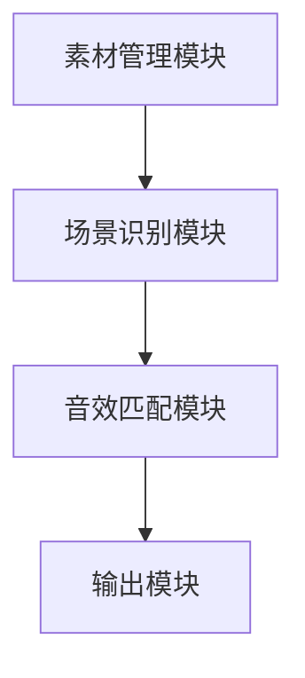
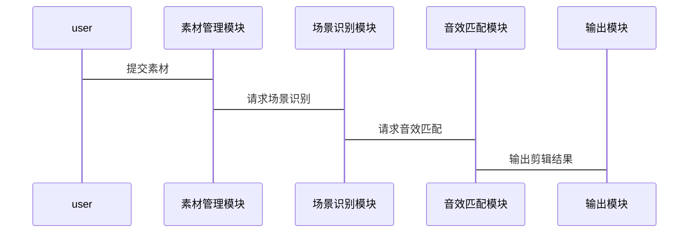

                 


# AI Agent在智能电影剪辑中的实践

> **关键词**：AI Agent, 智能电影剪辑, 强化学习, 系统架构设计, 项目实战

> **摘要**：本文深入探讨了AI Agent在智能电影剪辑中的应用，从背景介绍、核心概念到算法原理、系统架构设计，再到项目实战，全面解析了AI Agent如何助力电影剪辑的智能化。通过实际案例分析，展示了AI Agent在智能剪辑中的潜力和实现方法。

---

# 第一部分: AI Agent与智能电影剪辑的背景介绍

## 第1章: AI Agent的基本概念与技术原理

### 1.1 AI Agent的定义与特点

AI Agent（人工智能代理）是指在计算机系统中，能够感知环境并采取行动以实现目标的智能实体。AI Agent的核心特点包括：

- **自主性**：能够在没有外部干预的情况下自主运作。
- **反应性**：能够实时感知环境并做出反应。
- **学习能力**：通过数据和经验不断优化自身行为。
- **协作性**：能够与其他AI Agent或人类进行协作。

AI Agent与传统AI的区别在于其具备自主决策和行动的能力，能够主动解决问题，而不仅仅是被动地执行任务。

### 1.2 AI Agent的分类与应用场景

AI Agent可以分为以下几类：

- **基于规则的AI Agent**：通过预定义的规则进行决策，适用于任务简单、规则明确的场景。
- **基于机器学习的AI Agent**：通过机器学习算法从数据中学习规律，适用于复杂任务。
- **基于强化学习的AI Agent**：通过与环境互动，学习最优策略，适用于需要策略优化的任务。

在智能电影剪辑中，AI Agent主要应用于自动剪辑、场景识别、音效处理等领域。

## 第2章: 智能电影剪辑的背景与挑战

### 2.1 传统电影剪辑的工作流程

传统电影剪辑的工作流程包括以下几个步骤：

1. **素材收集**：收集拍摄的视频素材。
2. **剪辑处理**：根据导演的要求，将素材剪辑成连贯的片段。
3. **特效添加**：添加特效和过渡效果。
4. **配音与音效**：添加配音和音效，提升影片的听觉效果。

传统剪辑师需要具备丰富的经验和技术，剪辑过程耗时且依赖人工判断。

### 2.2 智能电影剪辑的定义与目标

智能电影剪辑是指利用AI技术，通过自动化或半自动化的方式完成电影剪辑的过程。其目标是提高剪辑效率、降低人工成本，并通过AI的创造力提升影片的质量。

智能电影剪辑的核心目标包括：

- **提高效率**：通过自动化处理减少人工操作时间。
- **降低成本**：减少对专业剪辑师的依赖，降低剪辑成本。
- **提升质量**：利用AI的创造力，优化影片的节奏和效果。

### 2.3 AI Agent在智能电影剪辑中的结合

AI Agent与智能电影剪辑的结合主要体现在以下几个方面：

- **自动剪辑功能**：AI Agent能够根据影片内容自动剪辑出连贯的片段。
- **智能场景识别**：AI Agent能够识别影片中的场景，并根据场景切换自动调整剪辑节奏。
- **自动配乐与音效**：AI Agent能够根据影片的情感和节奏自动选择合适的音乐和音效。

---

# 第二部分: AI Agent的核心概念与技术原理

## 第3章: AI Agent的核心概念与原理

### 3.1 AI Agent的决策机制

AI Agent的决策机制是其智能的核心。以下是几种常见的决策机制：

- **基于规则的决策**：通过预定义的规则进行决策，适用于任务简单、规则明确的场景。
- **基于机器学习的决策**：通过机器学习算法从数据中学习规律，适用于复杂任务。
- **基于强化学习的决策**：通过与环境互动，学习最优策略，适用于需要策略优化的任务。

表1：不同决策机制的对比

| 决策机制 | 优点 | 缺点 |
|----------|------|------|
| 基于规则 | 简单、易于实现 | 适用于简单场景 |
| 机器学习 | 复杂场景表现优异 | 需大量数据 |
| 强化学习 | 学习最优策略 | 需大量互动 |

### 3.2 AI Agent的学习与优化

AI Agent的学习与优化是其不断进化的重要手段。以下是几种常见的学习方法：

- **监督学习**：通过标注数据进行训练，适用于分类和回归任务。
- **无监督学习**：通过无标注数据进行训练，适用于聚类和降维任务。
- **强化学习**：通过与环境互动，学习最优策略，适用于需要策略优化的任务。

---

## 第4章: AI Agent与智能电影剪辑的核心概念

### 4.1 AI Agent在电影剪辑中的角色

AI Agent在电影剪辑中的角色主要包括以下几个方面：

- **作为剪辑助手**：辅助剪辑师完成素材整理、剪辑处理等工作。
- **作为创意辅助**：根据影片内容提供创意建议，优化影片节奏和效果。
- **作为质量控制工具**：自动检测影片质量，发现潜在问题。

### 4.2 智能电影剪辑的核心要素

智能电影剪辑的核心要素包括以下几个方面：

- **影片内容分析**：对影片内容进行深度分析，识别场景、人物、情感等关键要素。
- **剪辑逻辑优化**：根据影片内容和目标，优化剪辑逻辑和节奏。
- **音效与配乐匹配**：根据影片的情感和节奏，自动选择合适的音效和配乐。

---

# 第三部分: 算法原理

## 第5章: 强化学习在AI Agent中的应用

### 5.1 强化学习的基本原理

强化学习是一种通过与环境互动，学习最优策略的方法。其基本原理如下：

1. **状态空间**：环境中的所有可能状态。
2. **动作空间**：AI Agent在每个状态下可采取的动作。
3. **奖励函数**：根据动作和状态的变化，给出奖励或惩罚。
4. **策略**：AI Agent根据当前状态选择动作的策略。

### 5.2 强化学习的数学模型

强化学习的数学模型可以用以下公式表示：

$$ R = r_{t+1} \text{，其中} R \text{是累积奖励，} r_{t+1} \text{是第} t+1 \text{步的奖励} $$

策略网络的目标是最大化累积奖励：

$$ \max_{\theta} \mathbb{E}[R] $$

### 5.3 强化学习的Python实现

以下是强化学习的简单Python实现示例：

```python
import numpy as np
import gym

env = gym.make('CartPole-v0')
env.seed(1)

policy = np.array([0.5, 0.5])  # 动作选择概率

for episode in range(1000):
    state = env.reset()
    total_reward = 0
    while True:
        action = np.random.choice([0, 1], p=policy)
        next_state, reward, done, info = env.step(action)
        total_reward += reward
        if done:
            break
    print(f"Episode {episode}, Total Reward: {total_reward}")
```

---

## 第6章: 算法实现与优化

### 6.1 算法优化策略

为了提高AI Agent的性能，可以采取以下优化策略：

- **经验回放**：将历史经验存储在记忆库中，随机抽取进行训练，减少数据偏差。
- **目标网络**：使用目标网络来稳定训练过程，减少梯度爆炸的风险。
- **多任务学习**：同时学习多个任务，共享网络参数，提高学习效率。

---

# 第四部分: 系统分析与架构设计

## 第7章: 系统分析与架构设计

### 7.1 问题场景介绍

在智能电影剪辑系统中，AI Agent需要完成以下任务：

- **素材整理**：自动整理拍摄的素材，识别关键帧。
- **场景识别**：识别影片中的场景，自动切换镜头。
- **音效匹配**：根据影片情感，自动选择音效。

### 7.2 系统功能设计

系统功能设计包括以下几个模块：

- **素材管理模块**：管理影片素材，提供搜索和筛选功能。
- **场景识别模块**：识别影片中的场景，生成场景切换点。
- **音效匹配模块**：根据影片情感，匹配合适的音效。

### 7.3 系统架构设计

以下是系统架构设计的Mermaid图：



### 7.4 系统交互设计

以下是系统交互设计的Mermaid序列图：



---

# 第五部分: 项目实战

## 第8章: 项目实战

### 8.1 环境安装

以下是项目实战所需的环境安装命令：

```bash
pip install numpy gym matplotlib
```

### 8.2 核心代码实现

以下是核心代码实现：

```python
import numpy as np
import gym

env = gym.make('CartPole-v0')
env.seed(1)

policy = np.array([0.5, 0.5])

for episode in range(1000):
    state = env.reset()
    total_reward = 0
    while True:
        action = np.random.choice([0, 1], p=policy)
        next_state, reward, done, info = env.step(action)
        total_reward += reward
        if done:
            break
    print(f"Episode {episode}, Total Reward: {total_reward}")
```

### 8.3 案例分析

以下是案例分析：

假设我们有一部科幻电影，AI Agent可以根据影片的情感和节奏，自动剪辑出最佳的镜头组合，并匹配合适的音效，提升影片的整体效果。

---

# 第六部分: 最佳实践

## 第9章: 最佳实践

### 9.1 使用中的注意事项

在使用AI Agent进行智能电影剪辑时，需要注意以下几点：

- **数据质量**：确保训练数据的质量，避免偏差。
- **模型优化**：根据实际需求，不断优化模型参数。
- **人机协作**：AI Agent可以作为辅助工具，但不能完全替代人类的创造力。

### 9.2 项目小结

通过本文的分析与实践，我们可以看到AI Agent在智能电影剪辑中的巨大潜力。AI Agent不仅可以提高剪辑效率，还能通过学习和优化，不断提升影片的质量。未来，随着AI技术的不断发展，AI Agent在电影剪辑中的应用将更加广泛和深入。

---

# 总结

本文从背景介绍、核心概念、算法原理、系统架构设计到项目实战，全面解析了AI Agent在智能电影剪辑中的应用。通过本文的分析与实践，读者可以深入了解AI Agent的技术原理和实际应用，并能够将其应用到实际项目中。

