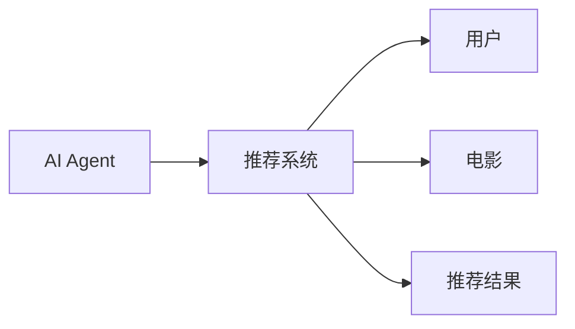
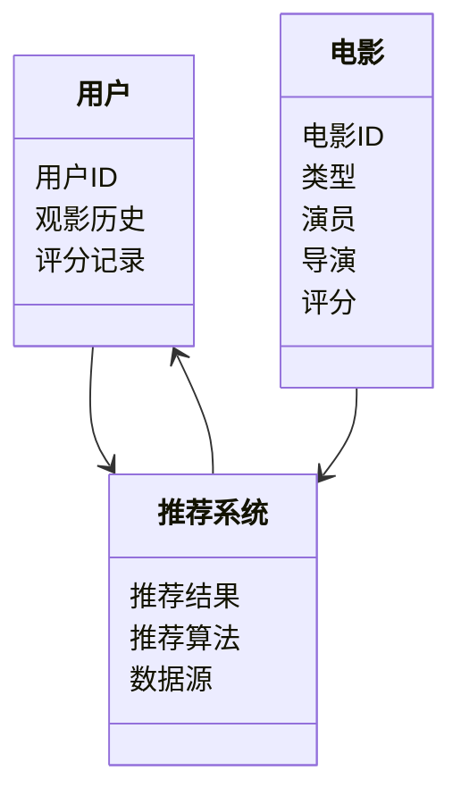
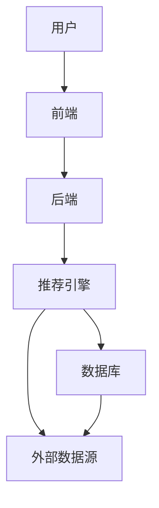
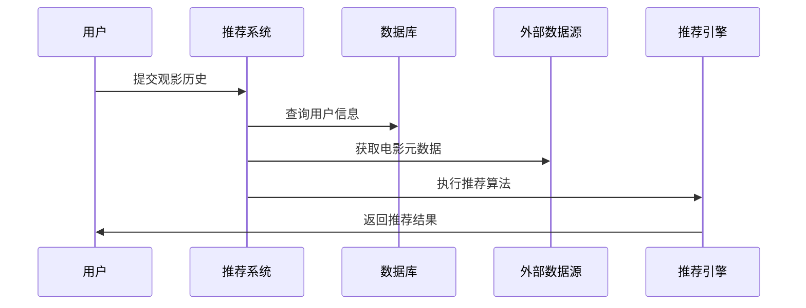

                 


# AI Agent在智能电影推荐中的应用

## 关键词：AI Agent, 智能推荐系统, 电影推荐, 机器学习, 推荐算法

## 摘要：
本文深入探讨了AI Agent在智能电影推荐中的应用，从背景、核心概念到算法实现、系统架构，再到项目实战和最佳实践，全面解析了AI Agent如何通过数据驱动的方法提升电影推荐的准确性和个性化。文章结合理论与实践，通过详细分析推荐系统的数学模型、算法实现和系统设计，为读者提供了从入门到进阶的完整指南。

---

## 第一部分: AI Agent与智能电影推荐概述

### 第1章: AI Agent与智能推荐系统概述

#### 1.1 AI Agent的基本概念

##### 1.1.1 AI Agent的定义与特点
AI Agent（人工智能代理）是一种能够感知环境、自主决策并执行任务的智能实体。它具备以下特点：
- **自主性**：能够在没有外部干预的情况下独立运行。
- **反应性**：能够实时感知环境并做出反应。
- **目标导向**：具备明确的目标，所有行为都围绕目标展开。
- **学习能力**：能够通过数据和经验不断优化自身的决策能力。

##### 1.1.2 AI Agent的核心功能与应用场景
AI Agent的核心功能包括：
- **感知环境**：通过传感器或数据源获取信息。
- **决策与推理**：基于感知的信息进行分析和推理。
- **执行操作**：根据决策结果执行相应的操作。

在电影推荐系统中，AI Agent的主要应用场景包括：
- **个性化推荐**：基于用户的观影历史和偏好，推荐符合其兴趣的电影。
- **实时反馈**：根据用户的实时行为调整推荐策略。
- **多模态数据处理**：整合电影的文本描述、用户评论、评分等多源信息，提升推荐的准确性。

##### 1.1.3 智能推荐系统的定义与分类
智能推荐系统是一种利用人工智能技术，基于用户行为和偏好，提供个性化推荐的系统。其分类包括：
- **基于协同过滤的推荐系统**：通过分析用户行为和相似性进行推荐。
- **基于内容的推荐系统**：基于物品本身的特征（如电影的 genres、actors 等）进行推荐。
- **基于深度学习的推荐系统**：利用神经网络模型学习用户和物品的隐含特征。
- **混合推荐系统**：结合多种推荐方法，提升推荐效果。

#### 1.2 电影推荐系统的发展历程

##### 1.2.1 传统电影推荐方法
传统电影推荐方法主要包括：
- **基于用户评分的协同过滤**：通过计算用户之间的相似性，推荐相似用户的评分高的电影。
- **基于内容的推荐**：分析电影的特征（如演员、导演、剧情等），推荐与用户偏好相似的电影。
- **基于规则的推荐**：根据预定义的规则（如用户喜欢喜剧，推荐最新的喜剧电影）进行推荐。

##### 1.2.2 基于机器学习的推荐系统
基于机器学习的推荐系统利用数据驱动的方法，通过训练模型来预测用户的偏好。常见的方法包括：
- **矩阵分解**：通过分解用户-物品的评分矩阵，学习用户的隐含特征。
- **深度学习模型**：利用神经网络模型（如神经网络协同过滤）学习用户和物品的隐含表示。

##### 1.2.3 基于AI Agent的智能推荐
基于AI Agent的智能推荐系统将AI Agent的概念引入推荐系统，通过代理的形式实现推荐的智能化。AI Agent不仅能够感知用户的行为和偏好，还能够动态调整推荐策略，提供更精准的推荐。

#### 1.3 AI Agent在电影推荐中的优势

##### 1.3.1 AI Agent的智能性与自适应性
AI Agent具备智能性和自适应性，能够根据用户的行为动态调整推荐策略。例如，当用户的行为表现出对某一类型的电影兴趣增加时，AI Agent可以实时调整推荐的权重，优先推荐相关电影。

##### 1.3.2 基于用户行为分析的推荐优化
AI Agent能够实时分析用户的观影行为（如点击、收藏、评分等），结合历史行为数据，预测用户的兴趣变化，优化推荐结果。

##### 1.3.3 多模态数据融合的推荐能力
AI Agent能够整合多源数据（如用户的观影历史、社交媒体评论、电影的元数据等），通过多模态数据融合，提升推荐的准确性和多样性。

---

### 第2章: 智能电影推荐的核心概念与背景

#### 2.1 问题背景与问题描述

##### 2.1.1 传统推荐系统的局限性
传统推荐系统主要依赖协同过滤和基于内容的推荐方法，存在以下问题：
- **数据稀疏性**：当用户数量较少或评分较少时，推荐效果较差。
- **冷启动问题**：新用户或新物品难以获得足够的数据支持推荐。
- **推荐结果的可解释性差**：用户难以理解推荐的原因，影响用户体验。

##### 2.1.2 用户需求的多样化与动态变化
用户的观影需求具有多样性和动态变化的特点。例如，用户可能在某个时期对动作片感兴趣，而在另一个时期则偏好浪漫喜剧片。传统推荐系统难以捕捉这种动态变化，导致推荐结果不够精准。

##### 2.1.3 AI Agent在推荐系统中的角色定位
AI Agent在推荐系统中扮演着关键角色，既是数据的感知者，又是推荐策略的执行者。它能够实时分析用户行为和环境变化，动态调整推荐策略，提升推荐效果。

#### 2.2 核心概念与联系

##### 2.2.1 AI Agent与推荐系统的实体关系图


##### 2.2.2 核心概念对比表格
| 概念 | 描述 |
|------|------|
| AI Agent | 能够感知环境、自主决策并执行任务的智能实体 |
| 推荐系统 | 基于用户行为和偏好，提供个性化推荐的系统 |
| 用户行为 | 用户在系统中的操作和反馈，如点击、评分、收藏等 |
| 电影特征 | 电影的属性，如 genres、actors、directors 等 |
| 推荐结果 | 系统输出的推荐列表，通常包括电影的ID和评分 |

#### 2.3 系统边界与外延

##### 2.3.1 系统输入与输出的定义
- **输入**：用户的观影历史、评分、点击行为、电影的元数据等。
- **输出**：推荐的电影列表，通常包括电影ID、评分和推荐理由。

##### 2.3.2 系统功能的边界划分
- **用户数据处理**：收集和分析用户的观影行为。
- **电影数据处理**：提取电影的特征信息。
- **推荐策略执行**：根据用户数据和电影数据，生成推荐结果。
- **推荐结果输出**：将推荐结果展示给用户。

##### 2.3.3 系统与外部环境的交互
- **用户交互**：用户通过系统界面进行操作，如搜索、评分、收藏等。
- **数据源交互**：系统从外部数据源获取电影的元数据和用户的观影历史。
- **推荐结果展示**：系统将推荐结果展示在用户界面上，供用户选择。

---

## 第3章: AI Agent推荐系统的算法原理

### 3.1 推荐算法的基本原理

#### 3.1.1 协同过滤算法

##### 3.1.1.1 基于用户的协同过滤
基于用户的协同过滤算法通过计算用户之间的相似性，将相似用户的评分数据用于推荐。具体步骤如下：
1. **计算用户相似性**：使用余弦相似性或皮尔逊相关系数计算用户之间的相似性。
2. **生成推荐列表**：根据相似用户的评分，加权生成推荐列表。

##### 3.1.1.2 基于物品的协同过滤
基于物品的协同过滤算法通过计算物品之间的相似性，将相似物品的评分数据用于推荐。具体步骤如下：
1. **计算物品相似性**：使用余弦相似性或皮尔逊相关系数计算物品之间的相似性。
2. **生成推荐列表**：根据相似物品的评分，加权生成推荐列表。

##### 3.1.1.3 矩阵分解
矩阵分解是一种常用的推荐算法，通过分解用户-物品的评分矩阵，学习用户的隐含特征和物品的隐含特征。常用的矩阵分解方法包括：
- **Singular Value Decomposition (SVD)**：使用奇异值分解方法对评分矩阵进行分解。
- **Non-negative Matrix Factorization (NMF)**：使用非负矩阵分解方法对评分矩阵进行分解。

#### 3.1.2 基于内容的推荐算法
基于内容的推荐算法通过分析物品的特征（如电影的 genres、actors 等），生成与用户偏好相似的推荐列表。具体步骤如下：
1. **提取物品特征**：对电影的元数据进行特征提取，如提取 genres、actors 等。
2. **计算相似度**：使用余弦相似性或TF-IDF计算用户偏好与物品特征的相似度。
3. **生成推荐列表**：根据相似度排序，生成推荐列表。

#### 3.1.3 基于深度学习的推荐算法
基于深度学习的推荐算法通过神经网络模型学习用户和物品的隐含特征，生成推荐列表。常用的深度学习模型包括：
- **Neural Collaborative Filtering (NCF)**：一种基于神经网络的协同过滤模型，通过深度网络学习用户和物品的隐含特征。
- **Deep Neural Networks for Recommendation (DNNR)**：一种基于深度神经网络的推荐模型，通过多层网络结构提升推荐效果。

#### 3.1.4 强化学习在推荐系统中的应用
强化学习是一种通过试错机制优化决策的机器学习方法，能够应用于推荐系统中。具体步骤如下：
1. **定义状态空间**：用户的观影历史、评分、偏好等。
2. **定义动作空间**：推荐的动作，如推荐某部电影。
3. **定义奖励函数**：用户对推荐结果的反馈，如点击、评分等。

---

## 第4章: 推荐系统的数学模型与算法实现

### 4.1 数学模型

#### 4.1.1 协同过滤的数学模型
协同过滤的数学模型可以通过矩阵分解的方法实现。假设我们有一个用户-物品的评分矩阵 $R$，其中 $R_{u,i}$ 表示用户 $u$ 对物品 $i$ 的评分。矩阵分解的目标是将矩阵 $R$ 分解为两个低维矩阵 $P$ 和 $Q$，其中 $P$ 表示用户的隐含特征，$Q$ 表示物品的隐含特征。评分预测公式为：
$$
\hat{R}_{u,i} = P_u \cdot Q_i
$$

#### 4.1.2 神经网络协同过滤的数学模型
神经网络协同过滤模型通过深度神经网络学习用户和物品的隐含特征。模型通常包含嵌入层、前馈层和输出层。评分预测公式为：
$$
\hat{R}_{u,i} = f(P_u, Q_i)
$$
其中，$f$ 是深度神经网络的非线性变换函数。

#### 4.1.3 基于强化学习的推荐模型
强化学习模型通过定义状态、动作和奖励函数，优化推荐策略。奖励函数通常定义为：
$$
R = r(s, a)
$$
其中，$s$ 是状态，$a$ 是动作。

### 4.2 算法实现

#### 4.2.1 协同过滤算法的实现
以下是基于矩阵分解的协同过滤算法的实现步骤：
1. **数据预处理**：收集用户-物品的评分数据，处理缺失值。
2. **模型训练**：使用矩阵分解方法（如SVD或NMF）训练模型，得到用户的隐含特征和物品的隐含特征。
3. **评分预测**：根据用户和物品的隐含特征，预测未评分的电影评分。
4. **生成推荐列表**：根据预测评分，生成推荐列表。

#### 4.2.2 神经网络协同过滤的实现
以下是神经网络协同过滤算法的实现步骤：
1. **数据预处理**：收集用户-物品的评分数据，处理缺失值。
2. **模型构建**：构建深度神经网络模型，包含嵌入层、前馈层和输出层。
3. **模型训练**：使用梯度下降等优化算法训练模型，优化预测误差。
4. **评分预测**：根据训练好的模型，预测未评分的电影评分。
5. **生成推荐列表**：根据预测评分，生成推荐列表。

#### 4.2.3 强化学习算法的实现
以下是基于强化学习的推荐算法的实现步骤：
1. **状态空间定义**：定义用户的状态，如观影历史、偏好等。
2. **动作空间定义**：定义推荐的动作，如推荐某部电影。
3. **奖励函数定义**：定义奖励函数，根据用户的反馈（如点击、评分）计算奖励。
4. **模型训练**：使用强化学习算法（如Q-Learning或Deep Q-Network）训练模型，优化推荐策略。
5. **推荐执行**：根据训练好的模型，执行推荐动作，获取奖励，不断优化推荐策略。

---

## 第5章: 系统分析与架构设计方案

### 5.1 问题场景介绍
假设我们正在开发一个智能电影推荐系统，目标是为用户提供个性化、精准的电影推荐。系统需要处理大量的用户数据和电影数据，具备实时推荐和动态调整的能力。

### 5.2 系统功能设计

#### 5.2.1 领域模型设计
以下是推荐系统的领域模型：


#### 5.2.2 系统架构设计
以下是推荐系统的系统架构设计：


#### 5.2.3 系统接口设计
以下是推荐系统的接口设计：
- **用户接口**：用户可以通过网页或移动应用提交观影历史、评分等信息。
- **电影接口**：系统可以通过API获取电影的元数据，如 genres、actors 等。
- **推荐接口**：推荐引擎通过API向用户提供推荐结果。

#### 5.2.4 系统交互流程
以下是推荐系统的交互流程：


---

## 第6章: 项目实战

### 6.1 环境安装

#### 6.1.1 安装Python
安装Python 3.x版本，建议使用Anaconda或Miniconda。

#### 6.1.2 安装依赖库
安装以下依赖库：
- `numpy`
- `pandas`
- `scikit-learn`
- `tensorflow`

#### 6.1.3 安装其他工具
安装以下工具：
- `jupyter`：用于数据探索和算法实现。
- `mermaid`：用于绘制系统架构图和交互图。

### 6.2 核心实现

#### 6.2.1 数据预处理
以下是数据预处理的代码示例：
```python
import pandas as pd
import numpy as np

# 加载数据
ratings = pd.read_csv('ratings.csv')
movies = pd.read_csv('movies.csv')

# 合并数据
merged_data = pd.merge(ratings, movies, on='movieId')

# 数据清洗
merged_data.dropna(inplace=True)
```

#### 6.2.2 推荐算法实现
以下是基于矩阵分解的协同过滤算法的实现示例：
```python
from sklearn.decomposition import NMF

# 初始化模型
model = NMF(n_components=50, random_state=42)

# 训练模型
model.fit(ratings_matrix.T)

# 预测评分
user_ids = ratings['userId'].unique()
movie_ids = ratings['movieId'].unique()

推荐列表 = {}
for user_id in user_ids:
    user_features = model.components_[..., user_id]
   推荐列表[user_id] = {movie_id: np.dot(user_features, model.components_[movie_id]) for movie_id in movie_ids}
```

#### 6.2.3 系统实现
以下是推荐系统实现的代码示例：
```python
from flask import Flask, request, jsonify

app = Flask(__name__)

@app.route('/recommend', methods=['POST'])
def recommend():
    user_id = request.json['user_id']
    # 获取用户特征
    user_features = model.components_[..., user_id]
    # 生成推荐列表
    recommendations = {}
    for movie_id in movie_ids:
        recommendations[movie_id] = np.dot(user_features, model.components_[movie_id])
    # 返回结果
    return jsonify({'recommendations': recommendations})

if __name__ == '__main__':
    app.run(debug=True)
```

### 6.3 项目总结

#### 6.3.1 项目小结
通过本项目，我们实现了基于矩阵分解的电影推荐系统，能够根据用户的观影历史和偏好，推荐符合其兴趣的电影。系统具备实时推荐和动态调整的能力，能够提升用户体验。

#### 6.3.2 项目亮点
- **数据驱动**：基于大量用户数据和电影数据，通过矩阵分解方法学习用户的隐含特征。
- **动态调整**：根据用户的实时行为动态调整推荐策略，提升推荐的准确性和个性化。
- **高效实现**：通过深度学习和神经网络模型，提升推荐效果和系统性能。

---

## 第7章: 最佳实践与总结

### 7.1 最佳实践

#### 7.1.1 系统设计
- **模块化设计**：将系统划分为数据处理、模型训练、推荐引擎等模块，便于维护和扩展。
- **高效数据处理**：使用分布式计算框架（如Spark）处理大规模数据，提升系统性能。
- **实时反馈机制**：通过实时用户反馈优化推荐策略，提升用户体验。

#### 7.1.2 算法优化
- **模型调优**：通过交叉验证和网格搜索优化模型参数，提升推荐效果。
- **多模态数据融合**：整合多源数据（如用户评论、社交媒体数据）提升推荐的准确性和多样性。
- **在线学习**：通过在线学习方法，动态更新模型，适应用户行为的变化。

### 7.2 小结

通过本文的介绍，我们深入探讨了AI Agent在智能电影推荐中的应用，从算法原理到系统设计，再到项目实战，全面解析了如何利用AI Agent提升推荐系统的智能化和个性化。AI Agent的引入不仅能够实时感知用户行为，还能够动态调整推荐策略，为用户提供更精准的推荐。

### 7.3 注意事项

在实际应用中，需要注意以下几点：
- **数据隐私**：保护用户数据隐私，遵守相关法律法规。
- **系统性能**：优化系统性能，确保推荐结果的实时性和准确性。
- **用户体验**：注重用户体验设计，提升用户满意度。

### 7.4 拓展阅读

- **《推荐系统实践》**：深入介绍推荐系统的实现方法和最佳实践。
- **《深度学习与推荐系统》**：探讨深度学习在推荐系统中的应用。
- **《强化学习入门》**：学习强化学习的基本概念和应用方法。

---

通过本文的系统讲解和实战演示，相信读者能够全面掌握AI Agent在智能电影推荐中的应用，为实际项目提供有力的技术支持。

