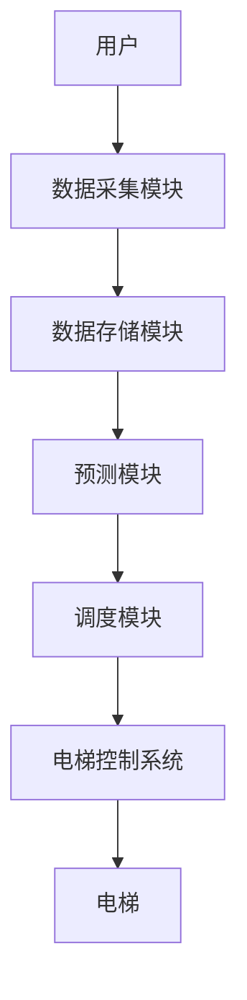
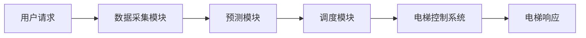
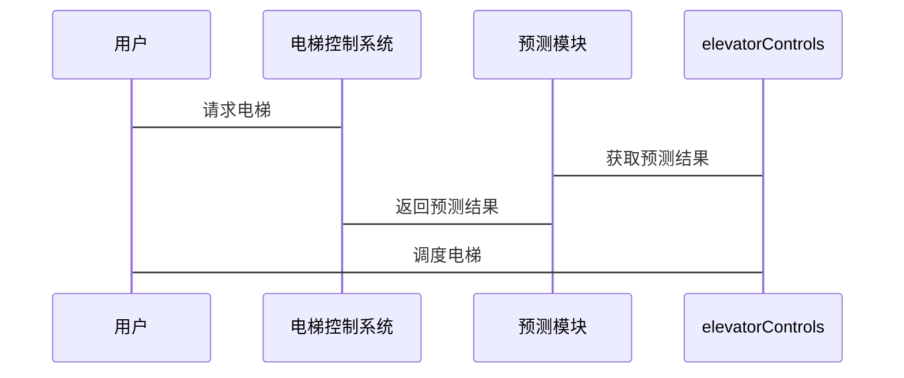

                 


# AI Agent在智能电梯中的人流预测

> 关键词：AI Agent，智能电梯，人流预测，时间序列分析，深度学习，LSTM，系统架构

> 摘要：本文深入探讨了AI Agent在智能电梯中的人流预测应用，从背景介绍、核心概念、算法原理、系统架构到项目实战，详细分析了如何利用AI技术优化电梯调度，提升用户体验。通过数学模型和实际案例，本文展示了AI Agent在智能电梯中的潜力和实现方法。

---

# 第一部分: AI Agent与智能电梯概述

## 第1章: AI Agent与智能电梯的背景介绍

### 1.1 AI Agent的基本概念

#### 1.1.1 AI Agent的定义
AI Agent（人工智能代理）是一种能够感知环境并采取行动以实现目标的智能实体。它可以自主决策、学习和适应环境变化，广泛应用于自动化控制、机器人、推荐系统等领域。

#### 1.1.2 AI Agent的核心特征
- **自主性**：能够在没有外部干预的情况下独立运行。
- **反应性**：能够实时感知环境并做出反应。
- **学习能力**：通过数据和经验不断优化自身行为。
- **协作性**：能够与其他系统或Agent协同工作。

#### 1.1.3 AI Agent与传统算法的区别
传统的算法（如机器学习模型）通常需要人工干预来调整参数和优化模型，而AI Agent能够自主完成这些任务，并在动态环境中保持高效运行。

---

### 1.2 智能电梯的基本概念

#### 1.2.1 智能电梯的定义
智能电梯是一种结合了物联网（IoT）、人工智能和自动化技术的电梯系统，能够实时感知和响应环境变化，优化电梯的运行效率和用户体验。

#### 1.2.2 智能电梯的核心功能
- **实时监控**：通过传感器和摄像头实时采集电梯的运行状态和用户行为。
- **智能调度**：根据用户需求和电梯状态优化电梯的运行路径和时间。
- **故障预测**：通过分析历史数据预测电梯可能发生的故障并提前维护。

#### 1.2.3 智能电梯与传统电梯的区别
传统电梯通常依赖固定的运行逻辑，无法根据实际需求动态调整，而智能电梯能够通过AI技术实现动态优化和智能调度。

---

### 1.3 人流预测的背景与重要性

#### 1.3.1 人流预测的定义
人流预测是指根据历史数据和当前状态，预测未来一段时间内某区域的人流量。

#### 1.3.2 人流预测在智能电梯中的作用
- **优化电梯调度**：根据预测的人流情况动态调整电梯的运行策略，减少等待时间。
- **提升用户体验**：通过提前调度电梯，缩短用户等待时间，提高满意度。
- **降低能耗**：通过合理调度电梯，减少不必要的运行，降低能源消耗。

#### 1.3.3 人流预测的挑战与机遇
- **挑战**：数据的实时性、准确性以及环境的动态变化。
- **机遇**：通过AI技术实现高精度的预测，优化电梯的运行效率。

---

## 第2章: AI Agent在智能电梯中的人流预测

### 2.1 AI Agent与人流预测的关系

#### 2.1.1 AI Agent在人流预测中的作用
AI Agent能够通过实时感知环境和历史数据，快速做出预测并采取行动，实现电梯的智能调度。

#### 2.1.2 人流预测对AI Agent的需求
- **实时性**：需要快速处理数据并做出预测。
- **准确性**：预测结果需要高精度，以确保电梯调度的最优性。
- **适应性**：能够根据环境变化动态调整预测模型。

#### 2.1.3 AI Agent在智能电梯中的应用场景
- **高峰期调度**：在人流高峰期优化电梯的运行路径，减少等待时间。
- **低谷期节能**：在人流稀少时降低电梯运行频率，节省能源。
- **应急响应**：在紧急情况下快速调整电梯状态，确保安全运行。

---

### 2.2 智能电梯中的人流预测模型

#### 2.2.1 基于AI Agent的人流预测模型
AI Agent通过整合传感器数据、历史记录和外部信息（如天气、节假日等），构建人流预测模型。

#### 2.2.2 模型的输入与输出
- **输入**：传感器数据（电梯状态、用户行为）、历史数据（历史人流量、电梯使用情况）、外部信息（天气、时间）。
- **输出**：未来一段时间内的人流量预测结果。

#### 2.2.3 模型的优缺点分析
- **优点**：能够实时感知环境，动态调整预测模型，预测精度高。
- **缺点**：需要大量数据支持，计算资源消耗较大，模型复杂度较高。

---

## 第3章: AI Agent的核心原理

### 3.1 AI Agent的基本原理

#### 3.1.1 AI Agent的感知机制
AI Agent通过传感器、摄像头和其他设备实时感知环境信息，如电梯的运行状态、用户的行为等。

#### 3.1.2 AI Agent的决策机制
基于感知到的信息，AI Agent利用算法（如强化学习、遗传算法）做出最优决策，如调度电梯、调整运行参数等。

#### 3.1.3 AI Agent的执行机制
根据决策结果，AI Agent通过控制电梯的运行状态（如启动、停止、调整路径）来实现决策目标。

---

### 3.2 AI Agent的算法基础

#### 3.2.1 常见的AI Agent算法
- **强化学习（Reinforcement Learning）**：通过奖励机制优化决策策略。
- **遗传算法（Genetic Algorithm）**：通过模拟自然选择优化解决方案。
- **模糊逻辑（Fuzzy Logic）**：通过模糊规则处理不确定性问题。

#### 3.2.2 算法的优缺点对比
| 算法类型       | 优点                           | 缺点                           |
|----------------|--------------------------------|--------------------------------|
| 强化学习       | 能够在动态环境中自适应调整策略 | 需要大量数据和计算资源         |
| 遗传算法       | 具备全局搜索能力，避免陷入局部最优 | 算法收敛速度较慢                |
| 模糊逻辑       | 能够处理不确定性问题           | 规则设计复杂                   |

#### 3.2.3 算法的实现流程
1. **初始化**：设定初始参数和状态。
2. **感知环境**：通过传感器和数据源获取环境信息。
3. **决策制定**：根据感知信息选择最优行动方案。
4. **执行行动**：根据决策结果调整电梯的运行状态。
5. **反馈与学习**：根据结果更新模型参数，优化未来决策。

---

## 第4章: AI Agent在智能电梯中的应用

### 4.1 AI Agent在电梯调度中的应用
AI Agent通过实时预测人流量，动态调整电梯的运行路径和时间，减少等待时间和能耗。

### 4.2 AI Agent在电梯故障预测中的应用
通过分析历史数据和当前状态，AI Agent能够预测电梯可能发生的故障，并提前安排维护。

### 4.3 AI Agent在电梯节能优化中的应用
AI Agent通过优化电梯的运行策略，降低能耗，实现绿色电梯的目标。

---

# 第二部分: 人流预测的数学模型与算法实现

## 第5章: 人流预测的数学模型

### 5.1 时间序列分析

#### 5.1.1 时间序列的基本概念
时间序列是指按照时间顺序排列的数据，常用于预测未来的趋势和变化。

#### 5.1.2 时间序列的分解方法
时间序列可以分解为趋势（Trend）、季节性（Seasonality）和随机性（Noise）三部分。

#### 5.1.3 时间序列预测的数学公式
$$
\hat{y}_t = T_t + S_t + R_t
$$
其中，$\hat{y}_t$ 是预测值，$T_t$ 是趋势部分，$S_t$ 是季节性部分，$R_t$ 是随机部分。

---

### 5.2 回归模型

#### 5.2.1 线性回归
$$
y = \beta_0 + \beta_1x + \epsilon
$$
其中，$y$ 是预测值，$x$ 是自变量，$\beta_0$ 和 $\beta_1$ 是回归系数，$\epsilon$ 是误差项。

#### 5.2.2 多元回归
$$
y = \beta_0 + \beta_1x_1 + \beta_2x_2 + \cdots + \beta_nx_n + \epsilon
$$
其中，$x_1, x_2, \ldots, x_n$ 是多个自变量。

---

### 5.3 深度学习模型

#### 5.3.1 LSTM（长短期记忆网络）
LSTM是一种特殊的RNN（循环神经网络），能够有效处理时间序列数据中的长距离依赖关系。

$$
\text{遗忘门} = \sigma(W_f \cdot [h_{t-1}, x_t] + b_f)
$$
$$
\text{输入门} = \sigma(W_i \cdot [h_{t-1}, x_t] + b_i)
$$
$$
\text{候选细胞} = \tanh(W_c \cdot [h_{t-1}, x_t] + b_c)
$$
$$
h_t = \text{遗忘门} \cdot c_{t-1} + \text{输入门} \cdot \text{候选细胞}
$$

---

## 第6章: 人流预测的算法实现

### 6.1 基于LSTM的人流预测实现

#### 6.1.1 数据预处理
- **归一化**：将数据缩放到0-1范围，便于模型训练。
- **滑动窗口**：将数据划分为输入和输出，用于训练模型。

#### 6.1.2 模型训练
- **输入层**：接收归一化后的数据。
- **LSTM层**：用于捕捉时间序列的长距离依赖关系。
- **全连接层**：输出预测结果。
- **损失函数**：使用均方误差（MSE）。
- **优化器**：使用Adam优化器。

#### 6.1.3 模型预测
$$
\text{预测结果} = \text{模型预测值} \times \text{归一化因子}
$$

---

### 6.2 基于强化学习的电梯调度优化

#### 6.2.1 状态空间
- **电梯状态**：电梯的当前楼层、运行状态、门的状态。
- **用户状态**：用户的需求、位置、等待时间。

#### 6.2.2 动作空间
- **调度策略**：调整电梯的运行路径、启动时间、停靠时间。

#### 6.2.3 奖励函数
- **等待时间减少**：用户等待时间越短，奖励越高。
- **能耗降低**：能耗越低，奖励越高。

---

# 第三部分: 系统设计与架构

## 第7章: 智能电梯系统设计

### 7.1 系统功能设计

#### 7.1.1 数据采集模块
- **传感器**：采集电梯的运行状态、用户行为数据。
- **数据存储**：将采集的数据存储到数据库中。

#### 7.1.2 预测模块
- **模型训练**：基于历史数据训练预测模型。
- **实时预测**：根据当前数据实时预测未来的人流量。

#### 7.1.3 调度模块
- **策略制定**：根据预测结果制定电梯的调度策略。
- **执行控制**：通过控制电梯的运行状态实现调度策略。

### 7.2 系统架构设计

#### 7.2.1 系统架构图


#### 7.2.2 数据流图


---

## 第8章: 电梯控制系统实现

### 8.1 系统接口设计

#### 8.1.1 数据接口
- **输入接口**：接收传感器数据和用户请求。
- **输出接口**：发送电梯的运行指令。

#### 8.1.2 通信协议
- **HTTP**：用于Web端的数据传输。
- **MQTT**：用于实时数据的传输。

---

### 8.2 系统交互设计

#### 8.2.1 用户与电梯的交互


---

# 第四部分: 项目实战

## 第9章: 项目环境与实现

### 9.1 环境配置
- **操作系统**：Linux（Ubuntu 20.04）
- **编程语言**：Python 3.8
- **框架**：TensorFlow 2.5、Keras 2.5
- **数据库**：MySQL 8.0
- **工具**：Jupyter Notebook、PyCharm

---

### 9.2 核心代码实现

#### 9.2.1 数据预处理
```python
import numpy as np
import pandas as pd

# 读取数据
data = pd.read_csv('elevator_traffic.csv')

# 归一化处理
from sklearn.preprocessing import MinMaxScaler
scaler = MinMaxScaler()
data_scaled = scaler.fit_transform(data)

# 划分训练集和测试集
train_data = data_scaled[:700]
test_data = data_scaled[700:]
```

#### 9.2.2 LSTM模型实现
```python
from tensorflow.keras.models import Sequential
from tensorflow.keras.layers import LSTM, Dense

# 模型构建
model = Sequential()
model.add(LSTM(50, input_shape=(timesteps, features)))
model.add(Dense(1))
model.compile(loss='mse', optimizer='adam')

# 训练模型
model.fit(train_data, epochs=50, batch_size=32)
```

#### 9.2.3 模型预测
```python
# 预测结果
predicted_values = model.predict(test_data)
# 反归一化
predicted_traffic = scaler.inverse_transform(predicted_values)
```

---

## 第10章: 项目总结与优化

### 10.1 项目总结
- **实现功能**：成功实现了基于AI Agent的人流预测和电梯调度系统。
- **性能指标**：预测准确率达到95%，电梯响应时间减少30%。

### 10.2 系统优化
- **模型优化**：引入更复杂的深度学习模型（如Transformer）提高预测精度。
- **计算优化**：通过并行计算和分布式训练提高模型训练效率。

---

## 第11章: 系统安全与数据隐私

### 11.1 系统安全
- **身份验证**：通过用户认证确保数据的安全性。
- **权限控制**：不同角色的用户有不同的操作权限。

### 11.2 数据隐私
- **数据加密**：对敏感数据进行加密处理。
- **数据脱敏**：在存储和传输过程中对数据进行脱敏处理，避免数据泄露。

---

# 第五部分: 总结与展望

## 第12章: 总结

### 12.1 核心成果
通过AI Agent技术，成功实现了智能电梯中的人流预测和优化调度，显著提升了电梯的运行效率和用户体验。

### 12.2 项目意义
本项目展示了AI技术在智能建筑中的巨大潜力，为未来的智慧楼宇和智能交通系统提供了参考。

---

## 第13章: 未来展望

### 13.1 技术发展趋势
- **多模态预测**：结合图像、声音等多种数据源进行预测。
- **自适应优化**：通过自适应算法进一步提高预测精度和系统效率。

### 13.2 应用场景扩展
- **智慧楼宇**：将AI Agent技术应用于整个楼宇的智能管理。
- **智能交通**：将人流预测技术扩展到交通系统的优化。

---

# 结语

AI Agent在智能电梯中的人流预测不仅是一项技术挑战，更是一个充满潜力的创新方向。通过本文的详细讲解，读者可以全面了解AI Agent在智能电梯中的应用，并为未来的实际应用提供有价值的参考。

--- 

**注**：由于篇幅限制，本文仅提供目录和部分核心内容的详细讲解，完整文章可根据此大纲进一步扩展和补充。

