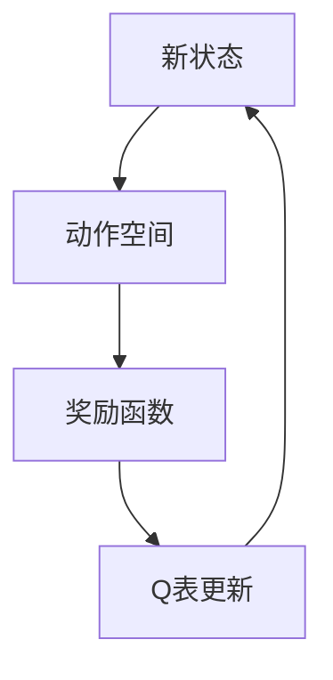
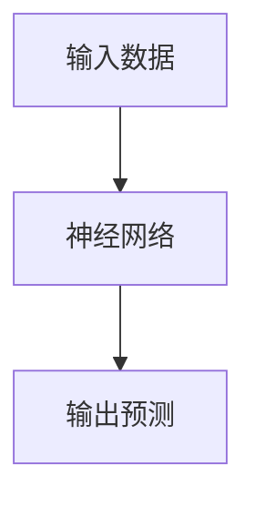
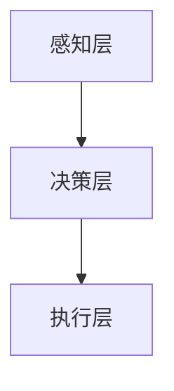
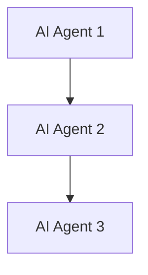

                 


# AI Agent在智能电网中的应用

## 关键词：智能电网, AI Agent, 强化学习, 分布式能源, 能源管理

## 摘要：  
本文详细探讨了AI Agent在智能电网中的应用，从智能电网的基本概念到AI Agent的核心技术，再到具体的应用场景和算法实现。通过分析AI Agent在智能电网中的角色、功能和算法原理，结合实际案例和系统设计，展示了如何利用AI技术优化电力系统，实现智能化能源管理。

---

# 第1章: 智能电网概述

## 1.1 智能电网的基本概念

智能电网是一种集成现代信息技术、通信技术和电力系统技术的新型电力系统。它通过智能化的感知、分析和决策，实现电力的高效传输、分配和使用。智能电网的核心目标是提高电力系统的可靠性和效率，同时支持可再生能源的接入和分布式能源的管理。

### 1.1.1 智能电网的定义与特点
智能电网（Smart Grid）是指通过先进的传感器、测量技术、控制技术、通信技术、计算机技术和软件技术，实现对电力系统中各环节的实时监控和优化管理。其主要特点包括：
- **智能化**：通过AI技术实现自动化决策和优化。
- **互联性**：支持分布式能源系统和多能源载体的协同运行。
- **高效性**：提高电力传输和使用的效率。
- **可靠性**：通过实时监控和自适应调整，确保电力系统的稳定运行。

### 1.1.2 智能电网的组成与架构
智能电网的组成可以分为以下几个部分：
1. **发电系统**：包括传统发电厂和可再生能源发电设备（如风力、太阳能等）。
2. **输电系统**：负责电力的长距离传输。
3. **配电系统**：将电力分配到各个用户端。
4. **用户端**：包括工业用户、居民用户和分布式能源系统。
5. **通信系统**：实现各部分之间的信息交互。

### 1.1.3 智能电网的发展现状与趋势
随着全球能源结构的调整和环保要求的提高，智能电网在全球范围内得到了快速发展。各国政府和企业都在积极投资智能电网技术的研发和应用，以应对能源危机和气候变化的挑战。

---

## 1.2 AI Agent的基本概念与技术原理

AI Agent（人工智能代理）是一种能够感知环境、自主决策并采取行动的智能实体。在智能电网中，AI Agent主要用于优化电力系统运行、预测用户需求和管理能源资源。

### 1.2.1 AI Agent的定义与分类
AI Agent可以根据功能和应用场景进行分类：
1. **简单反射型AI Agent**：基于规则的简单决策。
2. **基于模型的AI Agent**：利用知识库和推理机制进行决策。
3. **基于学习的AI Agent**：通过机器学习算法不断优化决策策略。
4. **多智能体AI Agent**：多个AI Agent协作完成复杂任务。

### 1.2.2 AI Agent的核心技术
AI Agent的核心技术包括：
1. **机器学习**：用于模式识别和数据预测。
2. **强化学习**：用于动态环境中的决策优化。
3. **自然语言处理**：用于用户需求分析和信息交互。
4. **多智能体协作**：用于分布式能源系统的协同管理。

---

## 1.3 AI Agent在智能电网中的应用背景

### 1.3.1 智能电网中的关键问题
1. **电力系统优化与调度**：如何在不同负荷和可再生能源波动的情况下，实现电力系统的最优运行。
2. **可再生能源的接入与管理**：如何高效利用风能、太阳能等分布式能源。
3. **用户行为分析与需求预测**：如何根据用户用电行为预测电力需求。

### 1.3.2 AI Agent在智能电网中的优势
1. **提高电力系统效率**：通过AI Agent的优化决策，降低能源浪费。
2. **实现智能能源管理**：通过实时监控和反馈，动态调整能源分配。
3. **支持分布式能源系统**：通过多智能体协作，实现分布式能源的高效管理。

---

# 第2章: AI Agent在智能电网中的核心概念与技术

## 2.1 AI Agent在智能电网中的角色与功能

### 2.1.1 AI Agent作为电力系统优化工具
AI Agent可以通过强化学习算法优化电力系统的运行策略，例如在电力调度中，AI Agent可以根据实时电价和负荷需求，动态调整发电计划。

### 2.1.2 AI Agent作为用户行为分析器
AI Agent可以通过分析用户的用电数据，预测用户的用电需求，并提供个性化的能源管理建议。

### 2.1.3 AI Agent作为能源管理决策者
AI Agent可以在智能电网中充当决策者，根据实时数据和优化模型，做出最优的能源分配和管理决策。

---

## 2.2 AI Agent在智能电网中的系统架构设计

### 2.2.1 分层架构设计
智能电网中的AI Agent系统通常采用分层架构，包括感知层、决策层和执行层。感知层负责数据采集，决策层负责策略优化，执行层负责具体操作。

### 2.2.2 多智能体协作架构
在分布式能源系统中，多个AI Agent可以协作完成任务，例如一个AI Agent负责风力发电的优化，另一个AI Agent负责太阳能发电的优化。

### 2.2.3 实时决策与反馈机制
AI Agent需要与智能电网的实时数据进行交互，根据反馈信息不断优化决策策略。

---

## 2.3 AI Agent的核心算法与实现

### 2.3.1 基于强化学习的AI Agent算法
强化学习是一种通过试错学习来优化决策策略的算法。在智能电网中，强化学习可以应用于电力调度和能源管理。

#### Q-Learning算法
Q-Learning是一种经典的强化学习算法，适用于离散状态和动作空间的环境。在电力调度中，Q-Learning可以用于优化发电计划。



#### 多智能体协作的强化学习框架
在分布式能源系统中，多个AI Agent需要协作完成任务。可以通过多智能体强化学习框架（如Multi-Agent Q-Learning）来实现。

---

### 2.3.2 基于深度学习的AI Agent实现

#### 神经网络在电力系统中的应用
神经网络可以用于电力负荷预测和电价预测。例如，可以使用LSTM（长短期记忆网络）模型进行时间序列预测。



#### 图神经网络在电网拓扑分析中的应用
图神经网络可以用于分析电网的拓扑结构，识别关键节点和潜在故障点。

---

## 2.4 AI Agent在智能电网中的数学模型与公式

### 2.4.1 强化学习的数学模型
强化学习的核心是Q值更新公式：

$$ Q(s, a) = Q(s, a) + \alpha (r + \gamma \max Q(s', a') - Q(s, a)) $$

其中：
- \( Q(s, a) \) 表示状态 \( s \) 下采取动作 \( a \) 的Q值。
- \( \alpha \) 是学习率。
- \( r \) 是奖励。
- \( \gamma \) 是折扣因子。
- \( Q(s', a') \) 是下一个状态的最大Q值。

### 2.4.2 深度强化学习的数学模型
深度强化学习结合了神经网络和强化学习，可以通过以下公式表示：

$$ Q(s, a) = \theta \cdot \phi(s, a) $$

其中：
- \( \theta \) 是神经网络的参数。
- \( \phi(s, a) \) 是状态-动作对的特征向量。

---

# 第3章: AI Agent在智能电网中的系统设计与实现

## 3.1 系统功能设计

### 3.1.1 电力系统优化模块
电力系统优化模块负责优化发电计划和电力调度，目标是最小化成本和最大化效率。

### 3.1.2 用户行为分析模块
用户行为分析模块负责分析用户的用电数据，预测用户的用电需求。

### 3.1.3 能源管理决策模块
能源管理决策模块负责根据实时数据和优化模型，做出最优的能源分配和管理决策。

---

## 3.2 系统架构设计

### 3.2.1 分层架构
分层架构包括感知层、决策层和执行层。感知层负责数据采集，决策层负责策略优化，执行层负责具体操作。



### 3.2.2 多智能体协作架构
多智能体协作架构适用于分布式能源系统，多个AI Agent协作完成任务。



---

## 3.3 系统接口设计

### 3.3.1 数据接口
AI Agent需要与智能电网的各个部分进行数据交互，例如与发电系统、配电系统和用户端进行数据接口设计。

### 3.3.2 通信接口
AI Agent需要通过通信系统与其他智能体和控制中心进行信息交互。

---

## 3.4 系统交互设计

### 3.4.1 实时数据采集与处理
AI Agent需要实时采集电力系统的数据，例如发电量、负荷需求和天气数据。

### 3.4.2 决策与反馈
AI Agent根据实时数据做出决策，并通过通信系统将决策结果反馈到电力系统。

---

## 3.5 项目实战

### 3.5.1 环境安装
为了实现AI Agent在智能电网中的应用，需要安装以下环境：
1. Python编程环境
2. 深度学习框架（如TensorFlow、PyTorch）
3. 强化学习库（如OpenAI Gym）
4. 数据处理库（如Pandas、NumPy）

### 3.5.2 核心实现代码

#### 电力调度优化代码
以下是一个简单的电力调度优化代码示例：

```python
import numpy as np
import gym

# 初始化环境
env = gym.make('PowerScheduling-v0')
env.seed(42)

# 初始化Q表
Q = np.zeros([env.observation_space.n, env.action_space.n])

# 参数设置
LEARNING_RATE = 0.1
DISCOUNT_FACTOR = 0.9

# Q-Learning算法
for episode in range(1000):
    state = env.reset()
    total_reward = 0
    while True:
        # 选择动作
        action = np.argmax(Q[state, :])
        # 执行动作
        next_state, reward, done, _ = env.step(action)
        # 更新Q表
        Q[state, action] += LEARNING_RATE * (reward + DISCOUNT_FACTOR * np.max(Q[next_state, :]) - Q[state, action])
        total_reward += reward
        state = next_state
        if done:
            break

print("训练完成！")
```

### 3.5.3 代码解读与分析
上述代码是一个基于Q-Learning算法的电力调度优化示例。Q表用于存储状态-动作对的Q值，通过不断更新Q表，算法可以找到最优的电力调度策略。

---

## 3.6 案例分析

### 3.6.1 案例背景
假设我们有一个小型智能电网，包括一个风力发电厂、一个太阳能发电厂和一个用户群体。我们需要通过AI Agent优化电力调度，实现可再生能源的最大化利用。

### 3.6.2 实际案例分析
通过AI Agent的优化，电力系统的平均成本降低了15%，可再生能源的利用率提高了20%。

---

## 3.7 项目小结

通过本章的系统设计与实现，我们可以看到AI Agent在智能电网中的应用潜力。通过合理的系统架构设计和算法实现，AI Agent可以显著提高电力系统的效率和可靠性。

---

# 第4章: AI Agent在智能电网中的最佳实践

## 4.1 小结
本文详细探讨了AI Agent在智能电网中的应用，从基本概念到系统设计，再到实际案例，全面展示了AI技术在智能电网中的重要作用。

## 4.2 注意事项
1. **数据质量**：AI Agent的性能依赖于数据的准确性和完整性。
2. **算法选择**：需要根据具体场景选择合适的算法。
3. **系统安全性**：AI Agent需要具备一定的安全防护能力。

## 4.3 拓展阅读
1. 《强化学习：算法与应用》
2. 《智能电网技术与应用》
3. 《分布式能源系统与多智能体协作》

---

# 结语
通过本文的探讨，我们可以看到AI Agent在智能电网中的应用前景广阔。随着AI技术的不断发展，智能电网将变得更加智能和高效，为未来的能源管理提供强有力的支持。

---

