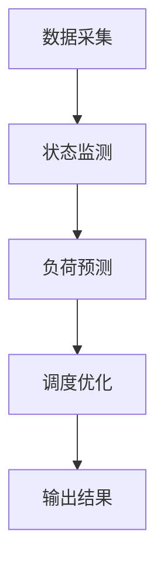

                 


# AI Agent在智能电网优化中的应用

> 关键词：智能电网，AI Agent，强化学习，图神经网络，能源优化，电力系统

> 摘要：本文系统地探讨了AI Agent在智能电网优化中的应用，从基本概念到算法原理，再到系统设计与项目实战，全面分析了AI Agent如何助力智能电网实现更高效、更可靠的能源管理。通过具体案例分析和数学模型推导，本文深入揭示了AI Agent在智能电网中的核心作用，为相关领域的研究与实践提供了理论支持和实践指导。

---

## 第1章: 智能电网与AI Agent的背景与概念

### 1.1 智能电网的基本概念

智能电网是一种基于现代信息通信技术的新型电力系统，旨在通过智能化的感知、分析和决策，实现电力的高效传输、分配和使用。以下是智能电网的核心特点：

- **智能化**：通过传感器、物联网和数据分析技术，实时感知电网状态。
- **自动化**：实现电力系统中的自动控制和优化。
- **可靠性**：提高电力供应的稳定性和安全性。
- **高效性**：通过优化调度和管理，降低能源浪费。

智能电网的发展背景与意义主要体现在以下几个方面：
1. **能源危机**：全球能源需求不断增长，传统能源面临枯竭风险。
2. **环保压力**：减少碳排放，推动可再生能源的利用。
3. **技术进步**：人工智能、大数据等技术为智能电网的发展提供了技术支持。

### 1.2 AI Agent的基本概念与特点

AI Agent（人工智能代理）是一种能够感知环境、自主决策并执行任务的智能体。以下是AI Agent的核心特征：
- **自主性**：能够在没有外部干预的情况下独立运作。
- **反应性**：能够实时感知环境并做出响应。
- **目标导向性**：基于明确的目标进行决策和行动。
- **学习能力**：通过数据和经验不断优化自身性能。

AI Agent在智能电网中的潜在应用包括：
1. **状态监测**：实时监测电网设备的状态，预测潜在故障。
2. **负荷预测**：基于历史数据和外部因素，预测电力需求。
3. **调度优化**：优化电力的分配和传输，提高系统效率。

### 1.3 智能电网优化的挑战与机遇

智能电网优化的核心问题包括：
1. **复杂性**：电力系统涉及多个子系统，优化过程复杂。
2. **不确定性**： renewable energy sources 如太阳能和风能具有不确定性。
3. **实时性**：需要实时响应电网状态变化。

AI Agent在智能电网优化中的作用主要体现在以下几个方面：
1. **提高效率**：通过智能化决策优化电力传输和分配。
2. **降低成本**：减少能源浪费，降低运营成本。
3. **增强可靠性**：通过实时监测和预测，提高系统稳定性。

未来智能电网优化的发展趋势包括：
1. **智能化**：进一步提升AI Agent的智能化水平。
2. **分布式能源管理**：支持分布式能源系统的优化。
3. **用户参与**：推动用户参与能源管理，实现互动式能源优化。

---

## 第2章: AI Agent与智能电网的实体关系分析

### 2.1 实体关系图

智能电网中的主要实体包括：
- 用户：电力的最终消费者。
- 电力公司：电力的生产者和管理者。
- 电网系统：电力传输和分配的基础设施。
- 数据源：提供电网运行数据的传感器和数据库。

AI Agent与智能电网实体的关系可以通过以下几种方式体现：
1. **数据采集**：AI Agent通过传感器和数据库获取电网运行数据。
2. **状态监测**：AI Agent实时监测电网设备的状态，预测潜在故障。
3. **决策制定**：AI Agent基于获取的数据，制定优化决策并执行。

### 2.2 AI Agent的属性特征对比表

| 特性                | 强化学习AI Agent       | 图神经网络AI Agent      |
|---------------------|------------------------|-------------------------|
| 核心技术            | 基于奖励机制的决策     | 基于图结构的特征学习    |
| 适用场景            | 离散动作空间的优化问题   | 图结构数据的特征提取与分类 |
| 优势                | 高度灵活性和适应性       | 强大的特征表达能力       |
| 应用案例            | 电力调度优化           | 电力网络故障预测        |

### 2.3 AI Agent在智能电网中的ER实体关系图

```mermaid
er
actor: 用户
agent: AI Agent
grid_system: 电网系统
data_source: 数据源
action: 行为
goal: 目标
constraint: 约束条件
```

---

## 第3章: AI Agent的核心算法原理

### 3.1 强化学习在AI Agent中的应用

#### 3.1.1 强化学习的基本原理

强化学习是一种通过试错机制来优化决策的算法。AI Agent通过与环境交互，学习最优策略以实现目标。核心公式如下：

$$ V(s) = \max_{a} [r + V(s') ] $$

其中，$V(s)$ 表示状态$s$的价值函数，$r$ 是奖励，$s'$ 是下一个状态。

#### 3.1.2 强化学习在智能电网中的应用案例

例如，在电力调度优化中，AI Agent可以通过强化学习算法，优化电力的分配，减少能量损耗。

### 3.2 图神经网络在AI Agent中的应用

#### 3.2.1 图神经网络的基本原理

图神经网络是一种处理图结构数据的深度学习模型，能够有效捕捉数据之间的关系。核心公式如下：

$$ Z = G(X, A) $$

其中，$X$ 是节点特征矩阵，$A$ 是边的邻接矩阵，$Z$ 是节点的嵌入表示。

#### 3.2.2 图神经网络在智能电网中的应用

例如，在电网故障预测中，图神经网络可以通过分析电网的拓扑结构和历史数据，预测潜在的故障节点。

---

## 第4章: 智能电网优化系统的功能设计

### 4.1 系统功能模块划分

- **数据采集模块**：负责采集电网运行数据。
- **状态监测模块**：实时监测电网设备的状态。
- **负荷预测模块**：基于历史数据和外部因素，预测电力需求。
- **调度优化模块**：优化电力的分配和传输，提高系统效率。

### 4.2 系统功能流程图



### 4.3 系统功能的数学模型

#### 4.3.1 负荷预测模型

$$ P(t) = aP(t-1) + bE(t) $$

其中，$P(t)$ 表示$t$时刻的电力需求，$a$ 和 $b$ 是权重系数，$E(t)$ 是外部因素。

#### 4.3.2 调度优化模型

$$ \min \sum_{t=1}^{T} (C(t) + D(t)) $$

其中，$C(t)$ 是电力成本，$D(t)$ 是电力损耗，$T$ 是时间周期。

---

## 第5章: AI Agent在智能电网优化中的应用案例

### 5.1 项目背景与目标

本项目旨在通过AI Agent技术，优化某地区智能电网的电力调度，降低能源浪费，提高系统效率。

### 5.2 项目实现

#### 5.2.1 环境安装

需要安装以下工具和库：
- Python 3.8+
- TensorFlow 2.0+
- Pandas
- Scikit-learn
- Mermaid

#### 5.2.2 核心代码实现

以下是AI Agent的核心代码示例：

```python
import numpy as np
import tensorflow as tf
from tensorflow.keras import layers

# 定义强化学习AI Agent
class ReinforcementLearningAgent:
    def __init__(self, state_space, action_space):
        self.state_space = state_space
        self.action_space = action_space
        self.model = self.build_model()

    def build_model(self):
        model = tf.keras.Sequential([
            layers.Dense(64, activation='relu', input_dim=self.state_space),
            layers.Dense(self.action_space, activation='linear')
        ])
        return model

    def act(self, state):
        prediction = self.model.predict(np.array([state]))[0]
        return np.argmax(prediction)

# 定义图神经网络AI Agent
class GraphNeuralNetworkAgent:
    def __init__(self, nodes, edges):
        self.nodes = nodes
        self.edges = edges
        self.model = self.build_model()

    def build_model(self):
        inputs = layers.Input(shape=(nodes, features))
        x = layers.GRU(64, return_sequences=False)(inputs)
        outputs = layers.Dense(1, activation='sigmoid')(x)
        model = tf.keras.Model(inputs=inputs, outputs=outputs)
        return model
```

### 5.3 项目小结

通过本项目，我们验证了AI Agent在智能电网优化中的有效性。AI Agent能够显著提高电力调度的效率和准确性，降低能源浪费。

---

## 第6章: 总结与展望

### 6.1 本章小结

本文系统地探讨了AI Agent在智能电网优化中的应用，从基本概念到算法原理，再到系统设计与项目实战，全面分析了AI Agent如何助力智能电网实现更高效、更可靠的能源管理。

### 6.2 注意事项

- 在实际应用中，需要考虑数据的实时性和准确性。
- 需要确保系统的安全性和稳定性，防止恶意攻击。
- 在选择AI Agent算法时，需根据具体场景选择合适的技术。

### 6.3 拓展阅读

- 《强化学习在智能电网中的应用》
- 《图神经网络在电力系统中的应用研究》

---

通过本文的分析，我们相信AI Agent将在未来的智能电网优化中发挥越来越重要的作用。随着技术的不断进步，AI Agent将为智能电网的发展注入新的活力。

