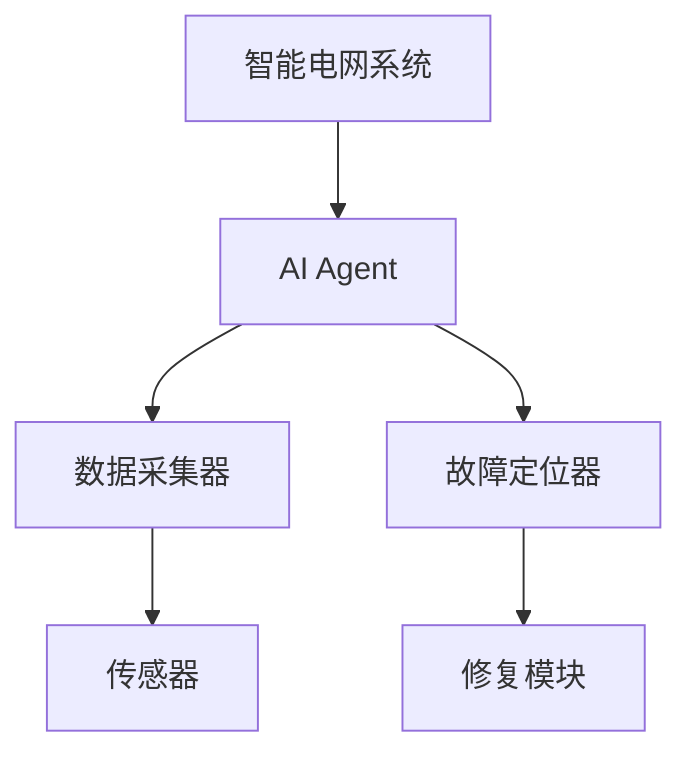
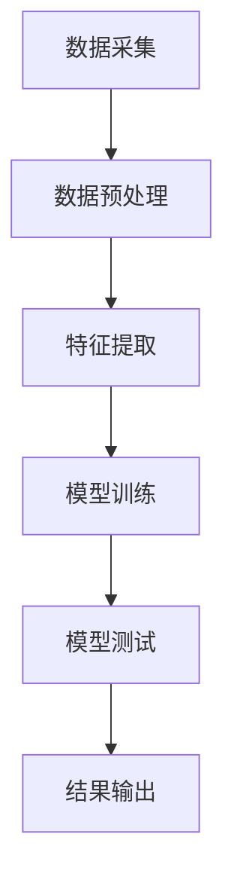
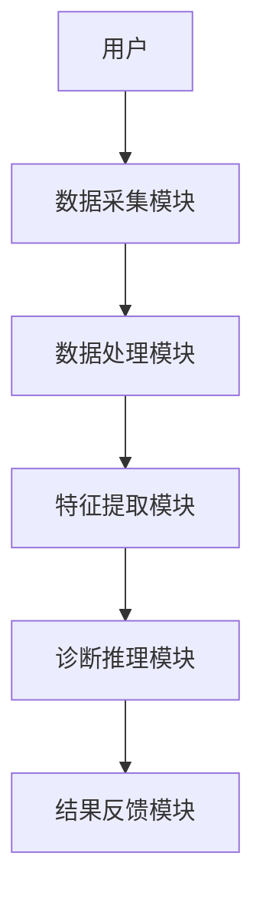
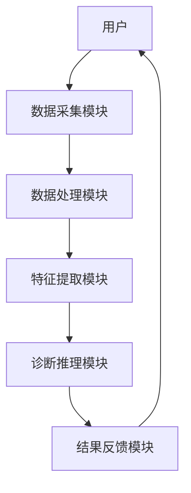

                 


---

# AI Agent在智能电网故障诊断中的角色

> 关键词：智能电网、AI Agent、故障诊断、机器学习、电力系统

> 摘要：本文探讨了AI Agent在智能电网故障诊断中的核心作用，分析了其在数据处理、决策支持和自适应优化中的优势，结合实际案例和系统设计，展示了AI Agent如何提升电力系统的可靠性与效率。

---

## 第一部分: 智能电网与AI Agent背景介绍

### 第1章: 智能电网概述

#### 1.1 智能电网的基本概念
智能电网是一种集成现代信息技术、通信技术和电力系统技术的新型电力系统。它通过智能化的感知、分析和决策，实现电力的高效传输和分配。智能电网的核心特征包括实时监测、自动控制、数据集成和智能分析。

智能电网的组成部分主要包括发电、输电、变电、配电和用电五个环节。每个环节都通过传感器和智能设备连接到一个统一的系统中，形成一个动态的、自适应的电力网络。

#### 1.2 电力系统故障诊断的重要性
电力系统故障诊断是保障电网安全运行的关键环节。常见类型的故障包括短路、断路、过载和电压波动等。故障诊断在电力系统中的作用包括快速定位故障点、减少停电时间、提高系统可靠性。

然而，智能电网故障诊断面临数据复杂性高、故障类型多样、诊断精度要求高等挑战。传统的基于规则的诊断方法难以应对复杂场景，而AI Agent的引入为解决这些问题提供了新的思路。

### 第2章: AI Agent的基本概念

#### 2.1 AI Agent的定义与特点
AI Agent是一种能够感知环境、自主决策并采取行动的智能实体。它具有以下特点：
1. **自主性**：能够独立运行，无需外部干预。
2. **反应性**：能够实时感知环境变化并做出响应。
3. **学习能力**：能够通过经验改进自身的决策能力。
4. **协作性**：能够与其他AI Agent或系统进行协作。

AI Agent与传统算法的主要区别在于其自主性和适应性。它不仅仅执行预定义的规则，而是能够在动态环境中自主学习和优化。

#### 2.2 AI Agent在智能电网中的应用
在智能电网中，AI Agent主要承担数据处理、故障诊断和优化控制的任务。其在故障诊断中的优势包括快速响应、高精度和自适应能力。AI Agent还能够与其他技术（如物联网、大数据分析）结合，形成更强大的诊断系统。

---

## 第二部分: AI Agent在智能电网故障诊断中的核心概念

### 第3章: 智能电网故障诊断的核心原理

#### 3.1 智能电网故障诊断的基本流程
故障诊断的基本流程包括数据采集、特征提取、诊断推理和结果反馈四个阶段。数据采集阶段通过传感器获取电网运行数据；特征提取阶段对数据进行分析，提取关键特征；诊断推理阶段基于特征进行故障定位和分类；结果反馈阶段输出诊断结果并采取修复措施。

#### 3.2 AI Agent在故障诊断中的作用
AI Agent在故障诊断中的作用主要体现在以下几个方面：
1. **数据处理**：AI Agent能够高效处理大量复杂数据，提取有用特征。
2. **决策能力**：通过机器学习算法，AI Agent能够快速做出诊断决策。
3. **自适应能力**：AI Agent能够根据环境变化优化诊断策略。

### 第4章: AI Agent与智能电网故障诊断的实体关系



---

## 第三部分: AI Agent在智能电网故障诊断中的算法原理

### 第5章: 基于AI Agent的故障诊断算法

#### 5.1 算法原理概述
基于AI Agent的故障诊断算法通常采用机器学习方法，如支持向量机（SVM）和随机森林（Random Forest）。这些算法通过训练数据学习故障特征，从而实现故障分类。

#### 5.2 支持向量机（SVM）算法
支持向量机是一种常用的分类算法，其核心思想是通过构建超平面将数据分成两类。在智能电网故障诊断中，SVM可以用于故障类型分类。

**数学模型**：
$$
\text{目标函数}：\min_{w,b,\xi} \frac{1}{2}||w||^2 + C\sum_{i=1}^n \xi_i
$$

**约束条件**：
$$
y_i(w \cdot x_i + b) \geq 1 - \xi_i
$$
$$
\xi_i \geq 0
$$

#### 5.3 随机森林算法
随机森林是一种基于决策树的集成学习算法，具有高精度和良好的鲁棒性。在故障诊断中，随机森林可以用于特征重要性分析和故障分类。

**Python代码示例**：
```python
from sklearn.ensemble import RandomForestClassifier

# 假设X为输入特征，y为故障标签
model = RandomForestClassifier(n_estimators=100)
model.fit(X, y)

# 预测故障类型
y_pred = model.predict(X_test)
print("预测结果：", y_pred)
```

### 第6章: 算法流程与实现

#### 6.1 算法流程
1. 数据预处理：清洗和标准化数据。
2. 特征选择：提取关键特征。
3. 模型训练：使用训练数据训练AI Agent。
4. 模型测试：在测试数据上验证模型性能。

#### 6.2 算法实现


---

## 第四部分: 系统分析与架构设计方案

### 第7章: 系统分析与架构设计

#### 7.1 系统功能设计
系统功能模块包括数据采集、特征提取、诊断推理和结果反馈。每个模块的具体功能如下：
1. 数据采集：通过传感器获取电网运行数据。
2. 特征提取：对数据进行分析，提取关键特征。
3. 诊断推理：基于特征进行故障分类和定位。
4. 结果反馈：输出诊断结果并采取修复措施。

#### 7.2 系统架构设计


#### 7.3 系统交互设计


---

## 第五部分: 项目实战

### 第8章: 项目实战

#### 8.1 环境安装
1. 安装Python和相关库（如scikit-learn、pandas、numpy）。
2. 安装Mermaid工具用于绘制图表。

#### 8.2 系统核心实现
```python
import pandas as pd
from sklearn.model_selection import train_test_split
from sklearn.metrics import accuracy_score

# 加载数据
data = pd.read_csv('grid_data.csv')
X = data.drop('label', axis=1)
y = data['label']

# 数据分割
X_train, X_test, y_train, y_test = train_test_split(X, y, test_size=0.2)

# 训练模型
model = RandomForestClassifier(n_estimators=100)
model.fit(X_train, y_train)

# 模型评估
y_pred = model.predict(X_test)
print("准确率：", accuracy_score(y_test, y_pred))
```

#### 8.3 案例分析
通过实际案例分析，验证AI Agent在智能电网故障诊断中的有效性。例如，分析输电线路的故障数据，展示模型的诊断结果和修复建议。

---

## 第六部分: 总结与展望

### 第9章: 总结与展望

#### 9.1 最佳实践
1. 数据质量是诊断精度的关键，需确保数据的完整性和准确性。
2. 模型的可解释性是实际应用的重要考量，需选择适合的算法。
3. 系统的实时性要求较高，需优化数据处理和诊断流程。

#### 9.2 未来展望
随着AI技术的不断发展，AI Agent在智能电网中的应用将更加广泛。未来的研究方向包括：
1. 开发更高效的算法，提升诊断精度。
2. 探索多Agent协作，实现更复杂的诊断任务。
3. 结合边缘计算，提升系统的实时性和响应速度。

---

通过本文的详细讲解，读者可以全面了解AI Agent在智能电网故障诊断中的角色及其应用价值。AI Agent不仅提升了电力系统的故障诊断能力，还为智能电网的高效运行提供了有力支持。

