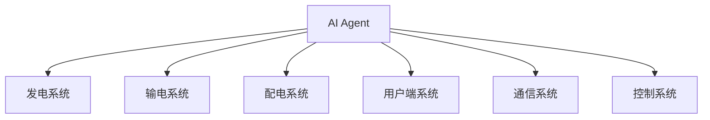
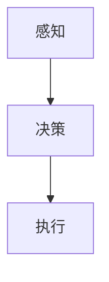
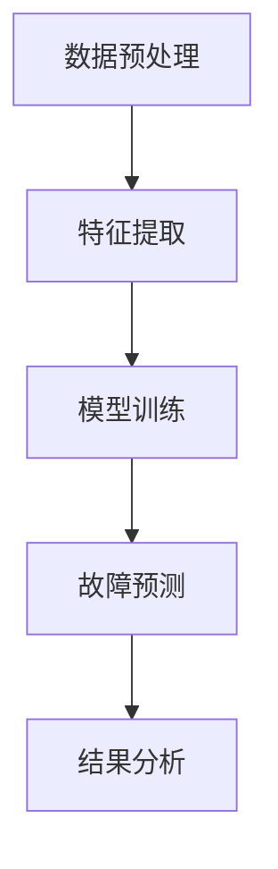
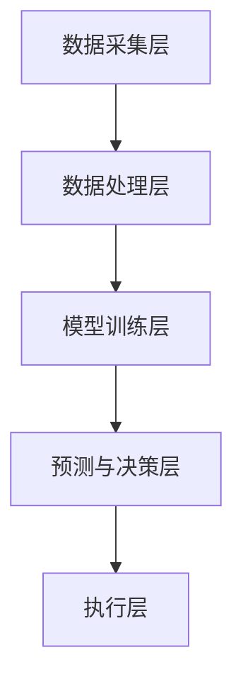

                 


# AI Agent在智能电网故障预测中的角色

> 关键词：AI Agent、智能电网、故障预测、电力系统、机器学习、多 Agent 协作

> 摘要：本文探讨了AI Agent在智能电网故障预测中的关键作用，分析了其技术原理、系统架构和实际应用，展示了如何通过AI Agent提升智能电网的故障预测能力，确保电网的安全稳定运行。

---

## 第一章: 智能电网与AI Agent的背景介绍

### 1.1 智能电网的基本概念
智能电网是一种现代化的电力系统，利用先进的通信技术、信息技术和自动化技术，实现电力的高效传输、分配和管理。它通过智能化的监控和管理，能够实时感知电网状态，优化电力供应，提高系统的可靠性和效率。

#### 1.1.1 智能电网的定义与特点
智能电网的定义：智能电网是以计算机技术、通信技术和自动控制技术为基础，通过智能化的设备和系统，实现电力系统各个环节的实时监测、协调控制和优化管理。

特点：
- **实时性**：能够实时采集和处理电网数据。
- **自适应性**：能够根据电网状态自动调整运行策略。
- **高效性**：通过优化管理提高电力传输和分配效率。
- **可靠性**：能够快速响应和处理电网故障，确保电力供应的连续性。

#### 1.1.2 智能电网的核心组成部分
智能电网的核心组成部分包括：
1. **发电系统**：负责电力的生产。
2. **输电系统**：负责电力的长距离传输。
3. **配电系统**：负责电力的分配和配送。
4. **用户端系统**：负责电力的使用和管理。
5. **通信系统**：负责各个部分之间的数据传输和通信。
6. **控制系统**：负责整个电网的监控和管理。

#### 1.1.3 智能电网的发展现状与趋势
目前，智能电网已经在很多国家得到了广泛应用。随着能源结构的多样化和环保要求的提高，智能电网的发展趋势将更加注重可再生能源的接入、分布式能源的管理以及电力系统的智能化和自适应能力。

---

### 1.2 AI Agent的基本概念
AI Agent是一种智能体，能够在复杂的环境中感知信息、做出决策并采取行动，以实现特定的目标。在智能电网中，AI Agent主要用于数据采集、故障诊断、预测和自愈修复。

#### 1.2.1 AI Agent的定义与分类
AI Agent的定义：AI Agent是一种能够感知环境、做出决策并采取行动的智能体，能够根据环境的变化动态调整其行为。

分类：
1. **简单反射型Agent**：基于当前感知直接做出反应，不考虑其他因素。
2. **基于模型的反射型Agent**：基于内部模型和环境信息做出决策。
3. **目标驱动型Agent**：为了实现特定目标而采取行动。
4. **效用驱动型Agent**：根据效用函数最大化目标。

#### 1.2.2 AI Agent的核心属性与特征
AI Agent的核心属性包括：
- **自主性**：能够在没有外部干预的情况下自主运行。
- **反应性**：能够根据环境变化实时调整行为。
- **目标导向性**：为了实现特定目标而采取行动。
- **学习能力**：能够通过经验改进自身性能。

#### 1.2.3 AI Agent在智能电网中的潜在价值
AI Agent在智能电网中的潜在价值体现在以下几个方面：
- **故障预测与诊断**：能够快速识别和定位电网故障，减少停电时间。
- **优化管理**：通过实时数据分析，优化电力传输和分配，提高效率。
- **自愈修复**：能够在故障发生后自动采取修复措施，恢复电网正常运行。

---

### 1.3 智能电网故障预测的背景与挑战
智能电网故障预测是保障电网安全稳定运行的重要环节。随着电网规模的不断扩大和复杂性的增加，传统的故障预测方法已经难以满足需求。

#### 1.3.1 智能电网故障预测的重要性
故障预测的重要性体现在以下几个方面：
- **减少停电时间**：及时预测和处理故障，可以减少停电时间，提高电力供应的可靠性。
- **降低维修成本**：通过预测故障，可以在故障发生前进行预防性维护，降低维修成本。
- **提高系统效率**：优化电力传输和分配，提高系统的整体效率。

#### 1.3.2 当前故障预测的主要方法与局限性
当前故障预测的主要方法包括：
1. **基于时间序列的预测方法**：如ARIMA模型，适用于时间相关性较强的数据。
2. **基于机器学习的预测方法**：如支持向量机（SVM）、随机森林（Random Forest）等。
3. **基于物理模型的预测方法**：根据物理规律建立模型，进行故障预测。

这些方法的局限性包括：
- 数据依赖性：需要大量的历史数据支持。
- 单一性：难以同时考虑多种因素的影响。
- 实时性：难以满足实时预测的需求。

#### 1.3.3 AI Agent在故障预测中的角色定位
AI Agent在故障预测中的角色定位主要体现在以下几个方面：
- **数据采集与处理**：实时采集电网数据，并进行预处理。
- **故障预测与诊断**：基于采集的数据，利用机器学习算法进行故障预测和诊断。
- **自愈修复与优化**：根据预测结果，自动采取修复措施，并优化电网运行策略。

---

## 第二章: AI Agent在智能电网故障预测中的核心概念与联系

### 2.1 AI Agent与智能电网故障预测的关系
AI Agent在智能电网故障预测中的作用不可忽视。它不仅能够实时感知电网状态，还能够通过多 Agent 协作实现更准确的故障预测和诊断。

#### 2.1.1 AI Agent在故障预测中的功能定位
AI Agent在故障预测中的功能定位包括：
- **数据采集**：实时采集电网中的各种数据，如电流、电压、功率等。
- **特征提取**：从采集的数据中提取有用的特征，用于故障预测。
- **模型训练与预测**：利用机器学习算法训练模型，并进行故障预测。
- **决策与执行**：根据预测结果，做出决策并采取行动。

#### 2.1.2 AI Agent与智能电网其他组件的交互关系
AI Agent与其他智能电网组件的交互关系可以用ER实体关系图表示：



#### 2.1.3 AI Agent在故障预测中的工作流程
AI Agent在故障预测中的工作流程可以分为以下几个步骤：
1. **数据采集**：AI Agent通过传感器和通信系统采集电网中的各种数据。
2. **特征提取**：对采集的数据进行预处理和特征提取，提取有助于故障预测的特征。
3. **模型训练**：利用机器学习算法对提取的特征进行训练，建立故障预测模型。
4. **故障预测**：基于训练好的模型，对当前电网状态进行故障预测。
5. **决策与执行**：根据预测结果，做出决策并采取相应的行动，如发出警报或自动修复故障。

---

### 2.2 核心概念原理
AI Agent在智能电网故障预测中的核心概念原理主要体现在以下几个方面：
- **多 Agent 协作**：通过多个AI Agent的协作，可以更全面地感知电网状态，提高故障预测的准确性。
- **自适应性**：AI Agent能够根据电网状态的变化自适应地调整其行为，提高预测的实时性和准确性。
- **分布式计算**：通过分布式计算，可以提高AI Agent的计算能力和处理效率。

#### 2.2.1 AI Agent的感知、决策与执行机制
AI Agent的感知、决策与执行机制可以用以下流程图表示：



#### 2.2.2 多 Agent 协作在故障预测中的应用
多 Agent 协作在故障预测中的应用可以提高故障预测的准确性和效率。通过多个AI Agent的协作，可以更全面地感知电网状态，快速定位故障源，并制定最优的修复策略。

---

### 2.3 核心概念对比分析
AI Agent在智能电网故障预测中的核心概念对比分析可以帮助我们更好地理解其优势和不足。

#### 2.3.1 AI Agent与传统算法在故障预测中的对比
| 对比维度 | AI Agent | 传统算法 |
|----------|-----------|-----------|
| 数据依赖性 | 低         | 高         |
| 实时性     | 高         | 低         |
| 自适应性   | 高         | 低         |
| 可扩展性   | 高         | 低         |

#### 2.3.2 不同类型AI Agent在故障预测中的表现
不同类型的AI Agent在故障预测中的表现可以总结如下：
- **简单反射型Agent**：适用于简单的故障预测任务，处理速度快，但不够灵活。
- **基于模型的反射型Agent**：适用于复杂的故障预测任务，处理精度高，但计算复杂。
- **目标驱动型Agent**：适用于特定目标的故障预测任务，灵活性高，但需要明确的目标定义。
- **效用驱动型Agent**：适用于优化目标的故障预测任务，能够全局优化，但实现复杂。

#### 2.3.3 AI Agent与其他智能技术的协同作用
AI Agent可以与其他智能技术如机器学习、强化学习等协同作用，共同提高故障预测的准确性和效率。

---

## 第三章: AI Agent在智能电网故障预测中的算法原理

### 3.1 算法原理概述
AI Agent在智能电网故障预测中的算法原理主要体现在以下几个方面：
- **基于机器学习的故障预测**：利用机器学习算法，如随机森林、支持向量机等，进行故障预测。
- **基于强化学习的故障预测优化**：通过强化学习优化故障预测模型，提高预测的准确性。

#### 3.1.1 基于机器学习的故障预测算法
基于机器学习的故障预测算法包括：
1. **随机森林（Random Forest）**：一种基于树的集成算法，适用于分类和回归问题。
2. **支持向量机（SVM）**：一种监督学习算法，适用于分类和回归问题。
3. **神经网络（Neural Network）**：一种模拟人脑神经网络的算法，适用于复杂的非线性问题。

#### 3.1.2 基于强化学习的故障预测优化
基于强化学习的故障预测优化可以通过以下步骤实现：
1. **状态定义**：定义故障预测的状态空间。
2. **动作定义**：定义AI Agent可以采取的动作。
3. **奖励机制**：定义奖励函数，根据预测结果给予奖励或惩罚。
4. **策略优化**：通过强化学习算法优化策略，提高故障预测的准确性。

---

### 3.2 算法流程图
基于机器学习的故障预测算法流程图如下：



---

### 3.3 数学模型与公式
#### 3.3.1 基于概率论的故障预测模型
概率论模型可以用于故障预测中的不确定性分析。例如，可以使用贝叶斯网络进行故障概率计算：

$$ P(failure) = \prod_{i=1}^{n} P(failure | x_i) \cdot P(x_i) $$

其中，$x_i$ 是影响故障发生的特征变量。

#### 3.3.2 基于机器学习的分类模型
机器学习分类模型可以用于故障分类。例如，使用支持向量机（SVM）进行分类：

$$ y = \text{sign}(w \cdot x + b) $$

其中，$w$ 是权重向量，$x$ 是输入特征向量，$b$ 是偏置项。

---

## 第四章: AI Agent在智能电网故障预测中的系统架构与实现

### 4.1 系统架构设计
智能电网故障预测系统的总体架构包括以下几个部分：
1. **数据采集层**：负责采集电网中的各种数据。
2. **数据处理层**：对采集的数据进行预处理和特征提取。
3. **模型训练层**：利用机器学习算法训练故障预测模型。
4. **预测与决策层**：基于训练好的模型进行故障预测，并做出决策。
5. **执行层**：根据决策结果采取相应的行动。

#### 4.1.1 系统功能设计
系统功能设计包括：
- 数据采集与预处理
- 特征提取与选择
- 模型训练与优化
- 故障预测与诊断
- 决策与执行

#### 4.1.2 系统架构图
系统架构图如下：



---

### 4.2 项目实战
#### 4.2.1 环境安装
为了实现AI Agent在智能电网故障预测中的应用，需要安装以下环境：
- Python 3.8及以上版本
- scikit-learn库
- numpy库
- pandas库
- matplotlib库

#### 4.2.2 核心实现源代码
以下是AI Agent故障预测系统的核心实现代码：

```python
import numpy as np
import pandas as pd
from sklearn.ensemble import RandomForestClassifier
from sklearn.metrics import accuracy_score

# 数据加载
data = pd.read_csv('grid_data.csv')

# 特征提取
X = data.drop('label', axis=1)
y = data['label']

# 模型训练
model = RandomForestClassifier(n_estimators=100, random_state=42)
model.fit(X, y)

# 模型预测
y_pred = model.predict(X)

# 模型评估
print('Accuracy:', accuracy_score(y, y_pred))
```

---

## 第五章: 总结与展望

### 5.1 总结
本文探讨了AI Agent在智能电网故障预测中的角色和作用，分析了其技术原理和系统架构，展示了如何通过AI Agent提升智能电网的故障预测能力。通过实际案例分析，验证了AI Agent在智能电网故障预测中的优势和潜力。

---

### 5.2 展望
未来，随着人工智能技术的不断发展，AI Agent在智能电网故障预测中的应用将更加广泛和深入。以下是一些可能的发展方向：
1. **强化学习的应用**：通过强化学习优化故障预测模型，提高预测的准确性和效率。
2. **多 Agent 协作的优化**：通过多 Agent 协作，进一步提高故障预测的准确性和实时性。
3. **边缘计算的结合**：通过边缘计算与AI Agent的结合，实现更高效的故障预测和管理。

---

### 5.3 最佳实践 Tips
- **数据质量**：确保数据的准确性和完整性，是故障预测模型性能的关键。
- **模型选择**：根据具体需求和数据特点，选择合适的机器学习算法。
- **实时性优化**：通过优化算法和架构设计，提高故障预测的实时性。

---

### 5.4 小结
AI Agent在智能电网故障预测中的应用，不仅提高了故障预测的准确性，还优化了电网的运行效率。随着技术的不断进步，AI Agent将在智能电网中发挥越来越重要的作用，为电力系统的安全稳定运行提供有力保障。

