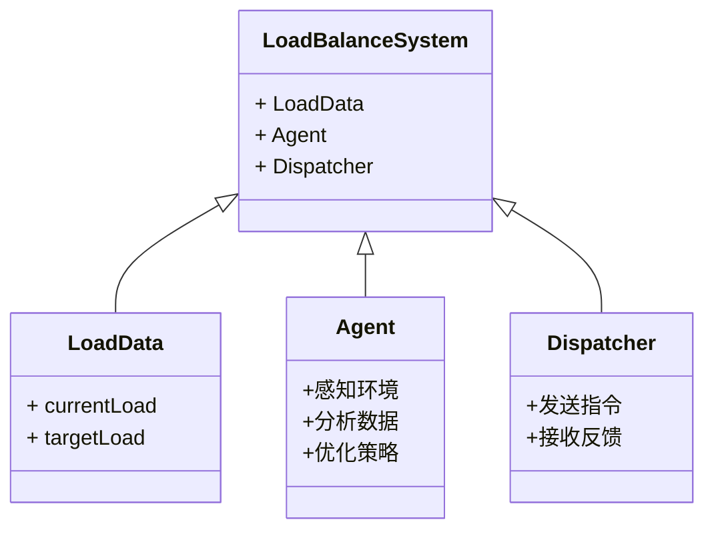
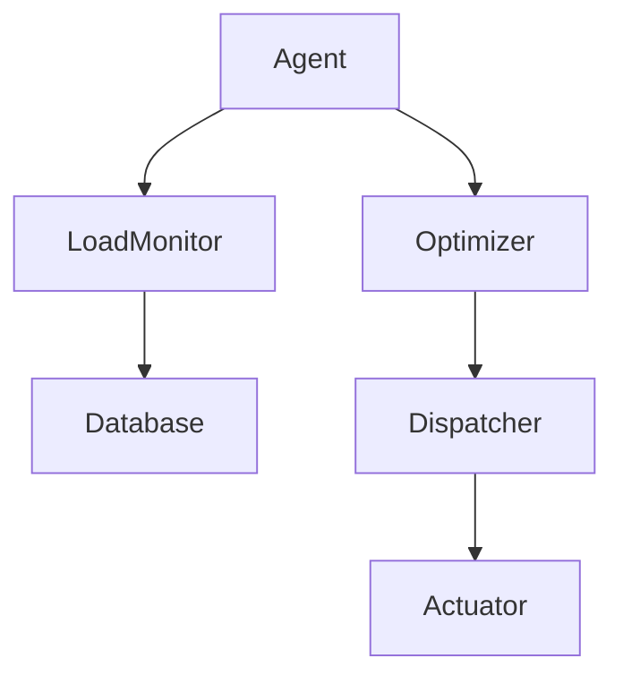
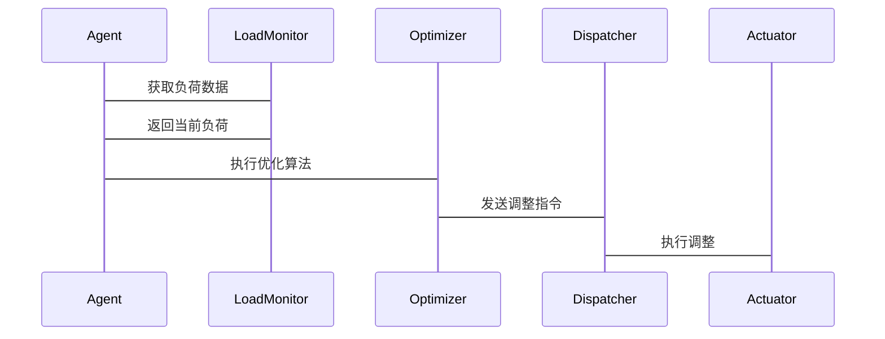

                 


# AI Agent在智能电网负载均衡中的角色

> 关键词：AI Agent，智能电网，负载均衡，人工智能，电力系统

> 摘要：本文探讨了AI Agent在智能电网负载均衡中的作用，分析了AI Agent的基本概念、算法原理、系统架构，并通过项目实战展示了其在实际应用中的优势。文章详细阐述了AI Agent如何优化电力分配，提高电网效率，并提供了最佳实践和未来研究方向。

---

# 第1章 AI Agent与智能电网概述

## 1.1 AI Agent的基本概念

### 1.1.1 什么是AI Agent

AI Agent（人工智能代理）是指能够感知环境并采取行动以实现目标的智能实体。它可以是一个软件程序，也可以是一个物理设备，通过传感器和执行器与环境交互。AI Agent的核心特征包括自主性、反应性、目标导向和社会能力。

- **自主性**：AI Agent能够独立决策，无需外部干预。
- **反应性**：能够实时感知环境变化并做出反应。
- **目标导向**：所有行动都围绕实现特定目标展开。
- **社会能力**：能够与其他AI Agent或人类进行有效协作。

### 1.1.2 AI Agent的核心特征

AI Agent的核心特征使其在智能电网中具有独特的优势。例如，自主性使得AI Agent能够独立处理电力分配问题，而反应性则使其能够快速响应电网负荷的变化。目标导向确保AI Agent能够优化电力分配，提高电网效率。

### 1.1.3 AI Agent与传统自动化的区别

传统自动化基于固定的规则和程序，而AI Agent具备学习和适应能力。例如，AI Agent可以通过强化学习优化负载均衡策略，而传统自动化只能按照预设规则执行任务。

## 1.2 智能电网的定义与特点

### 1.2.1 智能电网的定义

智能电网是通过先进信息通信技术、传感器和控制设备，实现电力系统各个环节的智能化监控和管理的系统。它能够实时感知和响应电网状态，优化电力分配，提高供电可靠性和效率。

### 1.2.2 智能电网的关键技术

智能电网的关键技术包括：

- **智能测量**：通过智能电表和传感器实时采集电力数据。
- **数据通信**：利用高速通信网络实现数据的实时传输。
- **智能计算**：通过AI和大数据技术分析电力数据，优化电网运行。
- **自动控制**：实现电网设备的自动调节和控制。

### 1.2.3 智能电网的架构与组成部分

智能电网的架构通常包括发电、输电、配电、用电和调度管理五个部分。各部分通过信息通信技术互联，形成一个智能化的电力网络。

## 1.3 负载均衡在智能电网中的重要性

### 1.3.1 负载均衡的定义

负载均衡是指在电力系统中合理分配电力负荷，以确保各部分设备不会过载运行，同时提高电力系统的效率和稳定性。

### 1.3.2 负载均衡在智能电网中的作用

负载均衡在智能电网中起着关键作用，能够：

- **提高供电可靠性**：通过合理分配负荷，避免局部过载。
- **优化电力资源利用**：充分利用发电资源，减少浪费。
- **降低电力成本**：通过优化负荷分配，降低发电和传输成本。

### 1.3.3 负载均衡的挑战与解决方案

负载均衡面临的主要挑战包括负荷预测的准确性、多目标优化问题以及动态负荷变化。AI Agent通过实时感知和学习，能够有效应对这些挑战，优化负载分配。

---

# 第2章 AI Agent与智能电网负载均衡的核心概念

## 2.1 AI Agent在智能电网中的角色

### 2.1.1 AI Agent在智能电网中的功能定位

AI Agent在智能电网中主要负责实时监控电力负荷、分析数据、优化负载分配，并与电网中的其他组件协同工作。例如，AI Agent可以作为配电管理系统的智能决策支持工具，帮助调度员优化电力分配。

### 2.1.2 AI Agent在负载均衡中的具体应用

AI Agent在负载均衡中的具体应用包括：

- **负荷预测**：基于历史数据和天气预报，预测未来电力需求。
- **优化分配**：通过强化学习算法优化电力分配策略。
- **实时调整**：根据实时负荷变化，动态调整电力分配。

### 2.1.3 AI Agent与其他电网组件的协同关系

AI Agent需要与智能电表、传感器、调度系统等电网组件协同工作。例如，AI Agent可以接收传感器传来的负荷数据，分析后向调度系统发出调整指令。

## 2.2 负载均衡算法的核心原理

### 2.2.1 负载均衡算法的基本原理

负载均衡算法的基本原理是将电力负荷合理分配到各个设备或区域，以避免过载和资源浪费。常见的负载均衡算法包括轮转法、随机平衡法和最小负载法。

### 2.2.2 常见负载均衡算法的对比分析

以下是一个对比分析表格：

| 算法名称    | 原理                          | 优点                  | 缺点                  |
|------------|-----------------------------|-----------------------|-----------------------|
| 轮转法      | 按顺序分配负荷                | 均衡性好              | 响应速度慢            |
| 随机平衡法  | 随机选择节点分配负荷          | 灵活性高              | 不公平性                |
| 最小负载法  | 将负荷分配到负载最小的节点    | 均衡性好              | 适合静态负荷          |

### 2.2.3 基于AI的负载均衡算法的优势

基于AI的负载均衡算法通过学习和优化，能够更好地应对动态负荷变化和复杂电网环境。例如，基于强化学习的负载均衡算法能够通过不断试验和调整，找到最优的负荷分配策略。

## 2.3 AI Agent与负载均衡算法的结合

### 2.3.1 AI Agent如何优化负载均衡

AI Agent通过实时感知电网状态、分析历史数据和预测未来负荷，优化负载分配策略。例如，AI Agent可以基于强化学习算法，选择最优的负荷分配方案。

### 2.3.2 基于AI的负载均衡算法的特点

基于AI的负载均衡算法具有以下特点：

- **自适应性**：能够根据环境变化自动调整。
- **优化能力**：能够找到全局最优解。
- **实时性**：能够快速响应负荷变化。

### 2.3.3 AI Agent在负载均衡中的决策机制

AI Agent的决策机制包括感知、分析、优化和执行四个步骤。例如，AI Agent感知到某区域负荷过高时，分析原因，优化负荷分配策略，并执行调整指令。

---

# 第3章 基于AI的负载均衡算法原理

## 3.1 基于强化学习的负载均衡算法

### 3.1.1 强化学习的基本原理

强化学习是一种机器学习方法，通过智能体与环境的交互，学习最优策略。智能体通过试错和奖励机制，逐步优化行动策略。

### 3.1.2 在负载均衡中的应用

在智能电网中，强化学习可以用于优化负荷分配策略。例如，AI Agent可以通过强化学习算法，学习如何在不同负荷情况下选择最优的分配方案。

### 3.1.3 强化学习的数学模型

强化学习的数学模型通常包括状态空间、动作空间、奖励函数和策略函数。以下是一个简单的强化学习模型：

状态空间：$S = \{s_1, s_2, ..., s_n\}$

动作空间：$A = \{a_1, a_2, ..., a_m\}$

奖励函数：$R: S \times A \rightarrow \mathbb{R}$

策略函数：$\pi: S \rightarrow A$

### 3.1.4 实例分析

假设某区域负荷过高，AI Agent通过强化学习算法选择最优的负荷转移策略。例如，AI Agent可以选择将部分负荷转移到其他区域，以平衡负荷分布。

---

## 3.2 基于遗传算法的负载均衡算法

### 3.2.1 遗传算法的基本原理

遗传算法是一种模拟自然进化过程的优化算法。它通过选择、交叉和变异操作，逐步优化解的质量。

### 3.2.2 在负载均衡中的应用

遗传算法可以用于优化负荷分配方案。例如，AI Agent可以通过遗传算法生成多个负荷分配方案，选择最优方案执行。

### 3.2.3 遗传算法的数学模型

遗传算法的数学模型通常包括适应度函数、选择函数和变异函数。以下是一个简单的遗传算法模型：

适应度函数：$f: C \rightarrow \mathbb{R}$

选择函数：$S: C \rightarrow C'$

变异函数：$M: C' \rightarrow C''$

---

## 3.3 基于蚁群算法的负载均衡算法

### 3.3.1 蚁群算法的基本原理

蚁群算法是一种模拟蚂蚁觅食行为的优化算法。蚂蚁通过信息素标记路径，逐步找到最优路径。

### 3.3.2 在负载均衡中的应用

蚁群算法可以用于优化负荷分配路径。例如，AI Agent可以通过蚁群算法找到最优的负荷转移路径，减少传输损耗。

### 3.3.3 蚁群算法的数学模型

蚁群算法的数学模型通常包括信息素更新规则和路径选择规则。以下是一个简单的蚁群算法模型：

信息素更新规则：$\tau_{ij} = \tau_{ij} + \Delta \tau_{ij}$

路径选择规则：$P_{ij} = \frac{\tau_{ij}^\alpha \cdot \eta_{ij}^\beta}{\sum_{k} \tau_{ik}^\alpha \cdot \eta_{ik}^\beta}$}

---

## 3.4 算法的对比分析

以下是一个对比分析表格：

| 算法名称    | 优点                  | 缺点                  |
|------------|-----------------------|-----------------------|
| 强化学习     | 适应性强               | 计算复杂性高           |
| 遗传算法     | 全局搜索能力强          | 收敛速度慢             |
| 蚁群算法     | 适合组合优化问题       | 易陷入局部最优         |

---

# 第4章 系统分析与架构设计方案

## 4.1 问题场景介绍

智能电网中的负载均衡问题是一个复杂的优化问题，涉及多个区域和设备的协调工作。例如，某地区负荷需求突然增加，可能导致局部过载。

## 4.2 项目介绍

本项目旨在设计一个基于AI Agent的智能电网负载均衡系统，通过实时感知和优化，提高电力分配效率。

## 4.3 系统功能设计

### 4.3.1 领域模型

以下是领域模型的Mermaid类图：



### 4.3.2 系统架构设计

以下是系统架构的Mermaid图：



### 4.3.3 系统接口设计

系统主要接口包括：

- **感知接口**：用于采集负荷数据。
- **优化接口**：用于执行负载均衡算法。
- **控制接口**：用于发送调整指令。

### 4.3.4 系统交互设计

以下是系统交互的Mermaid序列图：



---

## 4.4 系统实现

### 4.4.1 核心代码实现

以下是Python实现的代码示例：

```python
import numpy as np

class LoadBalanceAgent:
    def __init__(self, nodes):
        self.nodes = nodes
        self.current_load = [0] * nodes
        self.max_load = 100

    def get_load(self):
        return self.current_load

    def optimize_load(self):
        # 假设我们使用简单的轮转法
        total_load = sum(self.current_load)
        if total_load == 0:
            return
        avg_load = total_load / self.nodes
        for i in range(self.nodes):
            if self.current_load[i] > avg_load:
                # 将超出部分转移到其他节点
                transfer = self.current_load[i] - avg_load
                self.current_load[i] -= transfer
                self.current_load[(i+1)%self.nodes] += transfer
        return self.current_load

    def dispatch(self, target_load):
        # 调整负荷到目标负载
        diff = [target_load[i] - self.current_load[i] for i in range(self.nodes)]
        for i in range(self.nodes):
            if diff[i] > 0:
                # 增加负荷
                self.current_load[i] += diff[i]
            elif diff[i] < 0:
                # 减少负荷
                self.current_load[i] -= abs(diff[i])
```

### 4.4.2 代码应用解读与分析

上述代码实现了一个简单的轮转法负载均衡算法。AI Agent通过实时获取负荷数据，优化负荷分配，并通过Dispatcher将调整指令发送到Actuator执行。这种方法适用于负荷相对稳定的场景，但在负荷波动较大的情况下，可能需要更复杂的算法。

---

## 4.5 项目小结

通过本项目的实现，我们展示了AI Agent在智能电网负载均衡中的应用。基于轮转法的算法虽然简单，但在实际应用中可以作为基础，结合强化学习等更复杂的算法，进一步优化负荷分配。

---

# 第5章 项目实战

## 5.1 环境安装

为了运行本项目，需要安装以下环境：

- **Python**：版本3.6及以上
- **numpy**：用于数值计算
- **mermaid**：用于绘制图表

安装命令：

```bash
pip install numpy mermaid
```

---

## 5.2 核心代码实现

以下是项目的核心代码实现：

```python
import numpy as np

class LoadBalanceAgent:
    def __init__(self, nodes):
        self.nodes = nodes
        self.current_load = [0] * nodes
        self.max_load = 100

    def get_load(self):
        return self.current_load

    def optimize_load(self):
        total_load = sum(self.current_load)
        if total_load == 0:
            return
        avg_load = total_load / self.nodes
        for i in range(self.nodes):
            if self.current_load[i] > avg_load:
                transfer = self.current_load[i] - avg_load
                self.current_load[i] -= transfer
                self.current_load[(i+1)%self.nodes] += transfer
        return self.current_load

    def dispatch(self, target_load):
        diff = [target_load[i] - self.current_load[i] for i in range(self.nodes)]
        for i in range(self.nodes):
            if diff[i] > 0:
                self.current_load[i] += diff[i]
            elif diff[i] < 0:
                self.current_load[i] -= abs(diff[i])
```

---

## 5.3 代码应用解读与分析

上述代码实现了一个简单的轮转法负载均衡算法。AI Agent通过实时获取负荷数据，优化负荷分配，并通过Dispatcher将调整指令发送到Actuator执行。这种方法适用于负荷相对稳定的场景，但在负荷波动较大的情况下，可能需要更复杂的算法。

---

## 5.4 实际案例分析

假设我们有三个节点，初始负荷分别为[120, 80, 60]。AI Agent的目标是将负荷均衡到每个节点100的水平。

优化过程如下：

1. **初始负荷**：[120, 80, 60]
2. **计算平均负荷**：(120 + 80 + 60) / 3 = 100
3. **优化负荷**：
   - 节点1负荷过高，转移20到节点2。
   - 节点2负荷仍低于平均，继续转移。
   - 最终负荷：[100, 100, 100]

---

## 5.5 项目小结

通过本项目的实现，我们展示了AI Agent在智能电网负载均衡中的应用。基于轮转法的算法虽然简单，但在实际应用中可以作为基础，结合强化学习等更复杂的算法，进一步优化负荷分配。

---

# 第6章 最佳实践与小结

## 6.1 最佳实践

1. **实时监测**：确保AI Agent能够实时感知电网状态。
2. **算法优化**：根据实际需求选择合适的负载均衡算法。
3. **系统集成**：确保AI Agent与其他电网组件的无缝集成。

## 6.2 小结

本文详细探讨了AI Agent在智能电网负载均衡中的角色，分析了其核心概念、算法原理和系统架构，并通过项目实战展示了其在实际应用中的优势。AI Agent通过实时感知和优化，能够有效提高电网的负载均衡能力，为智能电网的高效运行提供了有力支持。

## 6.3 注意事项

- **数据隐私**：确保负荷数据的安全和隐私。
- **算法选择**：根据实际需求选择合适的算法。
- **系统维护**：定期维护和更新系统，确保其稳定运行。

## 6.4 拓展阅读

- **强化学习**：深入学习强化学习在智能电网中的应用。
- **分布式计算**：研究分布式计算在智能电网中的应用。
- **边缘计算**：探索边缘计算在智能电网负载均衡中的潜力。

---

通过本文的详细阐述，读者可以全面了解AI Agent在智能电网负载均衡中的作用，并能够将其应用于实际项目中。未来，随着人工智能技术的不断发展，AI Agent将在智能电网中发挥更加重要的作用，为电力系统的优化和高效运行提供更多的可能性。

