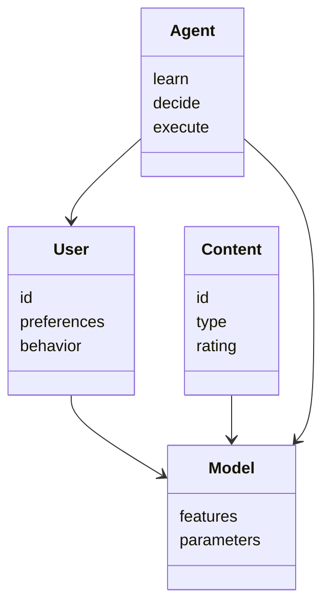
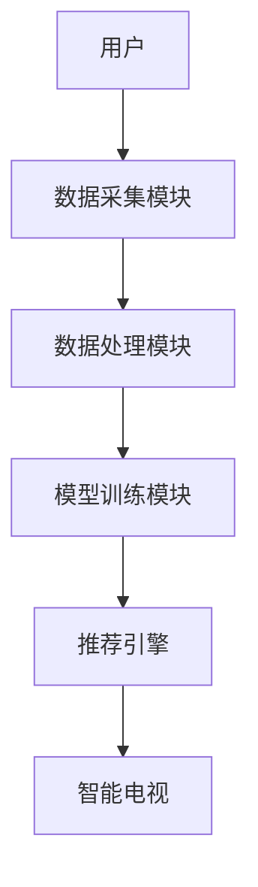
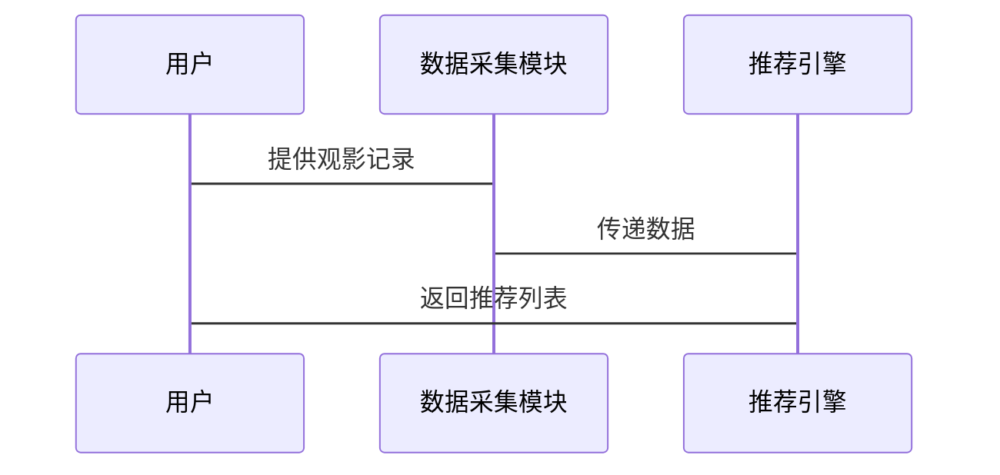

                 


# AI Agent在智能电视中的家庭观影喜好学习

## 关键词：AI Agent，智能电视，家庭观影，喜好学习，推荐算法

## 摘要：  
本文深入探讨了AI Agent在智能电视中的家庭观影喜好学习的应用。通过分析家庭观影需求的特点和动态变化，结合AI Agent的核心原理和推荐算法，提出了基于监督学习、无监督学习和强化学习的多种实现方案。文章详细阐述了系统的架构设计和实现流程，通过实际案例分析展示了AI Agent在家庭观影中的实际应用效果和优化方向。最后，总结了最佳实践和未来研究方向，为家庭观影体验的智能化提升提供了有价值的参考。

---

# 第一部分: AI Agent与智能电视的背景介绍

## 第1章: AI Agent与智能电视的背景介绍

### 1.1 什么是AI Agent

#### 1.1.1 AI Agent的定义
AI Agent（人工智能代理）是一种能够感知环境、自主决策并执行任务的智能实体。它可以基于历史数据和实时反馈，学习用户的偏好和行为模式，从而提供个性化的服务。

#### 1.1.2 AI Agent的核心特征
- **自主性**：无需外部干预，自主完成任务。
- **反应性**：能够实时感知环境并做出反应。
- **学习性**：通过数据学习和优化决策模型。
- **社交能力**：能够与用户和其他系统进行交互。

#### 1.1.3 AI Agent与智能电视的结合
AI Agent通过分析用户的观影行为、偏好和反馈，优化智能电视的内容推荐和用户体验。这种结合使得智能电视不再是单纯的娱乐工具，而是成为家庭用户的智能助手。

### 1.2 智能电视的发展历程

#### 1.2.1 智能电视的基本概念
智能电视是一种集成互联网、多媒体和人工智能技术的电视设备，能够提供丰富的在线内容和智能交互功能。

#### 1.2.2 智能电视的功能演变
- **早期阶段**：简单的网络连接和基本的在线内容播放。
- **发展阶段**：集成智能搜索、个性化推荐和语音交互功能。
- **当前阶段**：AI Agent驱动的智能推荐和家庭用户行为分析。

#### 1.2.3 智能电视的市场现状
当前，智能电视市场呈现多样化和高端化的趋势，AI Agent的应用逐渐成为各大厂商的竞争焦点。

### 1.3 家庭观影喜好的重要性

#### 1.3.1 家庭观影需求的特点
- **多样性**：不同家庭成员的观影偏好差异显著。
- **动态性**：观影偏好会随着时间和环境的变化而变化。
- **个性化**：需要根据用户的具体需求提供定制化推荐。

#### 1.3.2 家庭观影喜好的多样性
- **年龄因素**：不同年龄段的用户偏好不同类型的影视内容。
- **兴趣爱好**：家庭成员的兴趣点可能分散或集中。
- **观影场景**：不同场景（如家庭电影夜、儿童动画时间）需要不同的推荐策略。

#### 1.3.3 家庭观影喜好的动态变化
- **短期波动**：如节日、假期或特定事件的影响。
- **长期演变**：用户的兴趣可能会随着生活经历的变化而逐渐改变。

---

## 第2章: 家庭观影喜好的学习问题背景

### 2.1 问题背景分析

#### 2.1.1 当前家庭观影的痛点
- **信息过载**：用户面对海量内容，难以快速找到感兴趣的内容。
- **推荐不精准**：传统推荐算法难以捕捉家庭成员的多样化需求。
- **用户体验差**：推荐内容与用户实际需求存在较大差距。

#### 2.1.2 AI Agent在家庭观影中的应用潜力
- **精准推荐**：通过深度学习和用户行为分析，提供个性化的观影推荐。
- **动态调整**：根据实时反馈优化推荐策略。
- **多设备协同**：通过智能家居的协同工作，提升家庭观影体验。

#### 2.1.3 家庭观影喜好的学习目标
通过AI Agent的学习和优化，实现对家庭成员观影喜好的精准识别和推荐。

### 2.2 问题描述与边界

#### 2.2.1 家庭观影喜好的学习目标
- **识别用户偏好**：通过数据挖掘和机器学习，识别家庭成员的观影偏好。
- **实时反馈机制**：根据用户的反馈调整推荐策略。
- **动态优化**：根据用户行为的变化，持续优化推荐模型。

#### 2.2.2 问题的边界与限制
- **数据隐私**：用户数据的收集和使用需要符合隐私保护法规。
- **计算资源**：AI Agent的运行需要一定的计算资源支持。
- **用户接受度**：推荐结果需要得到家庭成员的认可和接受。

#### 2.2.3 相关概念的外延与内涵
- **外延**：家庭观影喜好的学习不仅仅局限于内容推荐，还包括用户体验优化和设备协同。
- **内涵**：通过AI技术实现对用户需求的深度理解和精准满足。

### 2.3 问题解决的思路

#### 2.3.1 数据采集与处理方案
- **数据来源**：用户观影记录、用户反馈、设备日志等。
- **数据预处理**：去噪、归一化、特征提取等。

#### 2.3.2 AI Agent的设计思路
- **模块化设计**：将AI Agent划分为数据采集、学习、决策和执行模块。
- **算法选择**：根据具体需求选择合适的机器学习算法。

#### 2.3.3 家庭观影喜好的反馈机制
- **实时反馈**：用户对推荐内容的即时反馈。
- **延迟反馈**：通过用户行为数据间接反映偏好变化。

---

## 第3章: AI Agent在家庭观影中的核心概念

### 3.1 AI Agent的核心原理

#### 3.1.1 AI Agent的基本工作流程
1. **数据采集**：收集用户行为数据和反馈信息。
2. **学习与建模**：通过机器学习算法构建用户偏好模型。
3. **决策与推荐**：基于模型生成推荐内容。
4. **反馈与优化**：根据用户反馈优化模型和推荐策略。

#### 3.1.2 AI Agent的学习机制
- **监督学习**：基于标注数据进行模型训练。
- **无监督学习**：通过数据挖掘发现隐含模式。
- **强化学习**：通过奖励机制优化决策策略。

#### 3.1.3 AI Agent的决策模型
- **基于规则的决策模型**：通过预定义规则进行决策。
- **基于模型的决策模型**：通过机器学习模型生成决策。

### 3.2 家庭观影喜好的数据模型

#### 3.2.1 数据模型的构建
- **用户特征**：包括年龄、性别、兴趣爱好等。
- **内容特征**：包括影视类型、演员、评分等。
- **行为特征**：包括用户的点击、播放、评分等行为数据。

#### 3.2.2 数据模型的特征提取
- **基于统计的方法**：如TF-IDF、词袋模型。
- **基于深度学习的方法**：如神经网络、卷积神经网络。

#### 3.2.3 数据模型的训练与优化
- **模型训练**：使用训练数据对模型进行参数优化。
- **模型评估**：通过测试数据评估模型的性能。
- **模型优化**：根据评估结果调整模型结构和参数。

### 3.3 AI Agent与家庭观影喜好的关系

#### 3.3.1 AI Agent如何影响家庭观影偏好
- **个性化推荐**：通过学习用户的观影历史和偏好，提供个性化的推荐内容。
- **动态调整**：根据用户反馈实时调整推荐策略。

#### 3.3.2 家庭观影偏好对AI Agent的反馈作用
- **用户反馈**：用户对推荐内容的评价和行为数据为AI Agent提供反馈。
- **模型优化**：通过反馈数据优化AI Agent的学习算法和推荐策略。

#### 3.3.3 两者结合的优化方向
- **提升推荐精准度**：通过深度学习和协同过滤算法优化推荐结果。
- **增强用户体验**：通过实时互动和多设备协同提升用户的观影体验。

---

## 第4章: AI Agent在家庭观影中的算法原理

### 4.1 算法原理概述

#### 4.1.1 基于监督学习的推荐算法
- **算法原理**：通过标注数据训练模型，预测用户的观影偏好。
- **应用场景**：适用于有明确标签的影视内容推荐。

#### 4.1.2 基于无监督学习的推荐算法
- **算法原理**：通过数据挖掘发现用户行为的隐含模式。
- **应用场景**：适用于无标签或弱标签的影视内容推荐。

#### 4.1.3 基于强化学习的推荐算法
- **算法原理**：通过奖励机制优化推荐策略。
- **应用场景**：适用于需要实时反馈和动态调整的推荐场景。

### 4.2 算法实现流程

#### 4.2.1 数据预处理
- **数据清洗**：去除噪声数据和异常值。
- **数据归一化**：将数据标准化，便于模型训练。

#### 4.2.2 模型训练
- **选择算法**：根据具体需求选择合适的机器学习算法。
- **参数调优**：通过交叉验证优化模型参数。

#### 4.2.3 模型评估与优化
- **评估指标**：如准确率、召回率、F1值等。
- **模型优化**：通过调整模型结构和参数提升性能。

### 4.3 算法实现的数学模型

#### 4.3.1 协同过滤算法
$$
\text{相似度} = \frac{\sum_{i=1}^n (x_i - \bar{x})(y_i - \bar{y})}{\sqrt{\sum_{i=1}^n (x_i - \bar{x})^2} \sqrt{\sum_{i=1}^n (y_i - \bar{y})^2}}
$$
其中，\( x \)和\( y \)分别为两个用户的评分向量，\( \bar{x} \)和\( \bar{y} \)分别为评分的平均值。

#### 4.3.2 神经网络模型
$$
f(x) = \sigma(Wx + b)
$$
其中，\( W \)是权重矩阵，\( b \)是偏置向量，\( \sigma \)是激活函数。

---

## 第5章: 系统架构设计与实现

### 5.1 问题场景介绍
家庭观影场景中，AI Agent需要实时分析用户的观影行为和偏好，优化推荐策略。

### 5.2 系统功能设计

#### 5.2.1 领域模型类图


#### 5.2.2 系统架构图


#### 5.2.3 系统交互序列图


### 5.3 系统实现与代码示例

#### 5.3.1 环境安装
- **Python**：安装Python 3.x
- **库的安装**：使用pip安装numpy、pandas、scikit-learn等库。

#### 5.3.2 核心代码实现
```python
import numpy as np
from sklearn.metrics.pairwise import cosine_similarity

# 示例数据：用户-内容评分矩阵
user_data = np.array([
    [4, 3, 0],
    [0, 1, 5],
    [3, 5, 2]
])

# 计算余弦相似度
similarity = cosine_similarity(user_data)
print(similarity)
```

---

## 第6章: 项目实战与案例分析

### 6.1 项目实战

#### 6.1.1 环境安装
- **Python**：安装Python 3.x
- **库的安装**：安装numpy、pandas、scikit-learn、xgboost等。

#### 6.1.2 核心代码实现
```python
import pandas as pd
from sklearn.model_selection import train_test_split
from sklearn.ensemble import RandomForestRegressor

# 加载数据
data = pd.read_csv('user_ratings.csv')

# 数据预处理
X = data.drop('rating', axis=1)
y = data['rating']

# 划分训练集和测试集
X_train, X_test, y_train, y_test = train_test_split(X, y, test_size=0.2)

# 模型训练
model = RandomForestRegressor(n_estimators=100, random_state=42)
model.fit(X_train, y_train)

# 模型预测
y_pred = model.predict(X_test)
print('预测结果:', y_pred)
```

#### 6.1.3 实际案例分析
通过实际数据集训练模型，并评估模型的推荐效果。分析模型的准确率、召回率等指标，优化模型参数。

### 6.2 项目小结
通过实际项目，验证了AI Agent在家庭观影喜好数学建模和推荐算法中的有效性，总结了项目实施中的经验和教训。

---

## 第7章: 最佳实践与未来展望

### 7.1 最佳实践

#### 7.1.1 数据隐私保护
- **数据加密**：确保用户数据的安全性。
- **匿名化处理**：在处理数据时进行匿名化处理。

#### 7.1.2 算法优化建议
- **模型融合**：结合多种算法提升推荐效果。
- **实时更新**：根据最新数据动态优化模型。

#### 7.1.3 系统性能优化
- **分布式计算**：利用分布式计算提升处理效率。
- **缓存机制**：通过缓存减少重复计算。

### 7.2 未来展望

#### 7.2.1 技术发展
- **多模态推荐**：结合文本、图像、语音等多种模态信息提升推荐效果。
- **强化学习优化**：通过强化学习进一步优化推荐策略。

#### 7.2.2 应用场景拓展
- **家庭娱乐系统**：进一步提升家庭观影体验。
- **智能家居协同**：与智能家居设备协同工作，提供更智能的家居娱乐解决方案。

### 7.3 总结与建议

#### 7.3.1 总结
本文详细探讨了AI Agent在智能电视中的家庭观影喜好学习的应用，提出了多种实现方案，并通过实际案例验证了方案的有效性。

#### 7.3.2 建议
未来的研究可以进一步探索多模态推荐和强化学习的应用，同时注重数据隐私和系统性能的优化。

---

通过以上内容，我们可以看到，AI Agent在家庭观影喜好学习中的应用具有广阔的发展前景。随着技术的不断进步，AI Agent将为家庭用户提供更加智能和个性化的观影体验。

