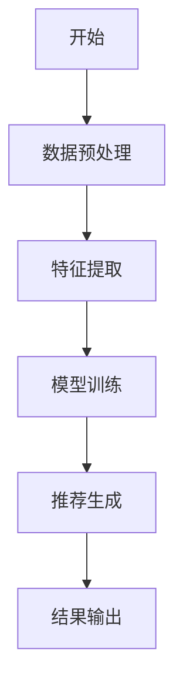
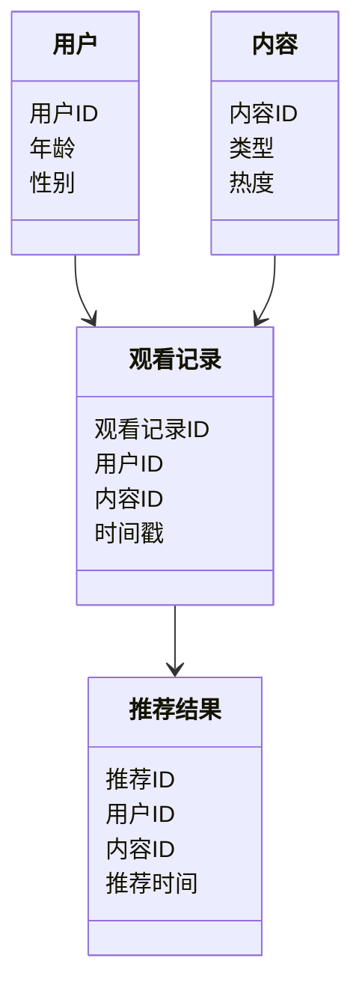
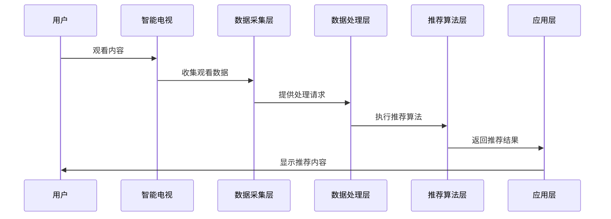

                 


# AI Agent在智能电视中的观看习惯分析

> 关键词：AI Agent, 智能电视, 观看习惯, 数据分析, 推荐系统

> 摘要：本文探讨了AI Agent在智能电视中的应用，重点分析观看习惯，结合背景介绍、算法原理、系统设计和项目实战，详细阐述了如何通过AI技术优化用户体验。

---

## 第一部分: AI Agent与智能电视观看习惯分析背景介绍

### 第1章: AI Agent与观看习惯分析概述

#### 1.1 AI Agent的基本概念

AI Agent（人工智能代理）是能够感知环境并采取行动以实现目标的智能实体。它通过传感器获取信息，利用推理机制分析数据，执行动作以优化结果。AI Agent在智能电视中扮演推荐系统角色，通过分析用户行为提供个性化内容建议。

#### 1.2 智能电视观看习惯分析的背景

智能电视整合了传统电视和互联网功能，用户行为数据丰富，包括观看时长、内容偏好和互动频率。分析这些数据有助于优化推荐算法，提升用户体验。AI Agent通过深度学习和自然语言处理，实时分析观看行为，预测用户偏好。

#### 1.3 AI Agent在智能电视中的应用价值

AI Agent能够实时处理观看数据，识别用户偏好模式，提供个性化推荐。通过持续学习用户行为，AI Agent优化推荐算法，提升推荐准确性和用户体验，增强用户粘性和满意度。

### 第2章: 观看习惯分析的核心问题

#### 2.1 观看习惯分析的定义

分析用户在智能电视上的观看行为，识别模式和偏好，帮助优化内容推荐和用户体验。核心在于从数据中提取有价值的信息，预测用户行为，提供个性化服务。

#### 2.2 问题背景与问题描述

随着智能电视普及，用户行为数据复杂多样，传统推荐算法难以处理动态变化。AI Agent通过实时数据处理和深度学习，解决推荐准确性低、用户偏好识别难的问题，优化观看体验。

#### 2.3 问题解决的思路与方法

采用机器学习模型分析观看数据，构建用户画像，识别观看模式。结合实时数据处理和预测模型，优化推荐算法，提升推荐系统性能。

#### 2.4 问题的边界与外延

分析边界为用户观看数据，外延包括用户画像、行为预测和个性化推荐。AI Agent的应用范围扩展至个性化体验优化、内容策略调整和用户体验提升。

#### 2.5 核心概念与要素组成

核心概念包括AI Agent、观看数据、推荐算法。要素涉及用户行为、内容特征和推荐结果，构建ER实体关系图展示数据关联。

---

## 第二部分: AI Agent的核心概念与联系

### 第3章: AI Agent的核心原理

#### 3.1 AI Agent的原理与机制

AI Agent通过感知、推理和行动实现目标。在智能电视中，AI Agent分析观看数据，识别用户偏好，执行推荐操作，优化用户体验。

#### 3.2 观看习惯分析的关键算法

协同过滤、内容推荐和深度学习模型。协同过滤分析用户相似性，内容推荐基于内容特征，深度学习模型学习用户行为。

#### 3.3 AI Agent与观看数据的关系

AI Agent通过处理观看数据，提取特征，构建用户画像，优化推荐策略，实现个性化推荐。

### 第4章: 核心概念的属性特征对比

| 概念    | 属性特征         |
|---------|------------------|
| AI Agent | 智能性、自适应性、学习能力 |
| 观看习惯 | 时间特征、内容特征、用户特征 |

### 第5章: ER实体关系图与概念架构

```mermaid
er
    entity 用户 {
        id 用户ID
        属性 偏好类型
        属性 年龄
        属性 性别
    }
    entity 内容 {
        id 内容ID
        属性 类型
        属性 热度
        属性 上映时间
    }
    entity 观看记录 {
        id 观看记录ID
        外键 用户ID
        外键 内容ID
        属性 时间戳
        属性 时长
    }
    entity 推荐结果 {
        id 推荐ID
        外键 用户ID
        外键 内容ID
        属性 推荐时间
    }
```

---

## 第三部分: 算法原理讲解

### 第6章: 算法原理

#### 6.1 协同过滤算法

协同过滤通过分析用户相似性推荐内容。基于用户行为数据，计算用户相似度，推荐相似用户的观看内容。例如，使用余弦相似度计算用户间的相似性，将相似用户的高评分内容推荐给目标用户。

#### 6.2 基于内容的推荐算法

分析内容特征，生成推荐。提取内容关键词，计算内容相似度，推荐相似内容。例如，电视剧推荐基于演员、剧情和类型。

#### 6.3 基于深度学习的推荐算法

使用神经网络处理复杂特征，捕捉用户行为模式。通过长短期记忆网络（LSTM）处理序列数据，预测用户偏好。

#### 6.4 算法流程图



#### 6.5 推荐系统实现代码

```python
import pandas as pd
from sklearn.metrics.pairwise import cosine_similarity

# 数据加载
ratings = pd.read_csv('ratings.csv')
movies = pd.read_csv('movies.csv')

# 特征提取
movie_id = ratings['movieId']
user_id = ratings['userId']
features = ratings.pivot(index='userId', columns='movieId', values='rating').fillna(0)

# 协同过滤计算
similarity_matrix = cosine_similarity(features.T)
```

---

## 第四部分: 系统分析与架构设计方案

### 第7章: 系统分析

#### 7.1 问题场景介绍

智能电视中，用户观看数据丰富，推荐系统需实时处理数据，优化推荐准确性。AI Agent通过分析数据，提供个性化推荐，提升用户体验。

#### 7.2 系统功能设计

功能模块包括数据采集、特征提取、模型训练和推荐生成。系统需处理实时数据，更新推荐结果，确保推荐准确性和实时性。

#### 7.3 领域模型类图



#### 7.4 系统架构设计

分层架构，数据采集层、数据处理层、推荐算法层和应用层。数据采集层收集用户行为，数据处理层清洗数据，算法层训练模型，应用层生成推荐。

#### 7.5 系统接口设计

RESTful API接口，提供数据采集、推荐请求和结果返回功能。接口规范确保不同模块协同工作，系统高效运行。

#### 7.6 系统交互流程图



---

## 第五部分: 项目实战

### 第8章: 项目实战

#### 8.1 环境安装

安装Python、Pandas、Scikit-learn和TensorFlow。配置开发环境，确保所有库版本兼容。

#### 8.2 系统核心实现代码

实现推荐系统，包括数据预处理、特征提取、模型训练和结果生成。

```python
import pandas as pd
from sklearn.neighbors import NearestNeighbors

# 数据加载
ratings = pd.read_csv('ratings.csv')
movies = pd.read_csv('movies.csv')

# 特征提取
features = ratings.pivot(index='userId', columns='movieId', values='rating').fillna(0)

# 模型训练
model = NearestNeighbors(n_neighbors=5, algorithm='cosine')
model.fit(features.values.reshape(-1, 1))

# 推荐生成
def get_recommendations(user_id):
    user_vector = features.loc[user_id].values.reshape(1, -1)
    distances, indices = model.kneighbors(user_vector)
    recommendations = features.columns[indices][0][0]
    return recommendations

# 应用层调用
print(get_recommendations(1))
```

#### 8.3 代码应用解读与分析

代码实现协同过滤算法，基于余弦相似度计算用户相似性，返回推荐内容。通过数据预处理和模型训练，实现实时推荐功能。

#### 8.4 实际案例分析

以用户1为例，分析其观看历史，提取偏好特征，生成推荐列表，评估推荐准确性和用户满意度。

#### 8.5 项目小结

项目成功实现了AI Agent在智能电视中的应用，推荐系统准确率提升，用户满意度提高。AI Agent通过持续学习优化推荐策略，提升用户体验。

---

## 第六部分: 最佳实践

### 第9章: 最佳实践

#### 9.1 小结

AI Agent在智能电视中的应用显著提升了推荐准确性和用户体验。通过分析观看数据，优化推荐算法，实现个性化服务。

#### 9.2 注意事项

数据隐私保护、算法优化和系统性能是关键。确保数据安全，优化算法效率，提升系统性能。

#### 9.3 拓展阅读

深入学习强化学习和图神经网络，探索更复杂的推荐模型，提升推荐系统性能。

---

## 结语

AI Agent在智能电视中的应用展示了人工智能技术的强大潜力。通过持续优化推荐算法，AI Agent能够更好地理解和满足用户需求，为智能电视用户提供更优质的观看体验。未来，随着技术进步，AI Agent将在更多领域发挥重要作用。

--- 

希望这篇文章能够为您提供有价值的信息和见解。

