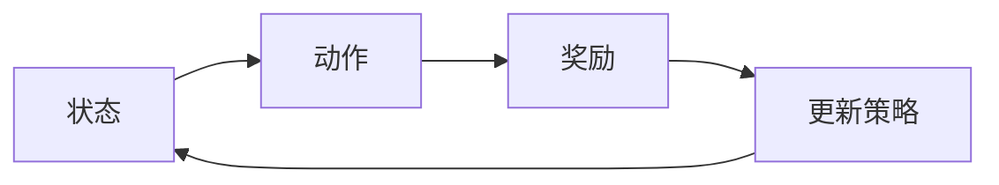
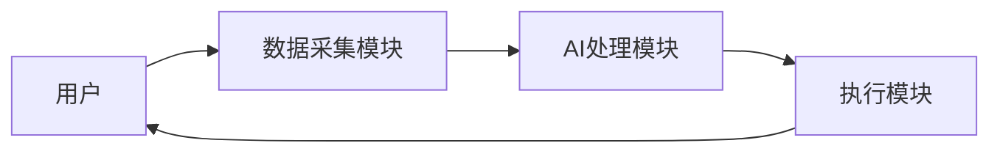
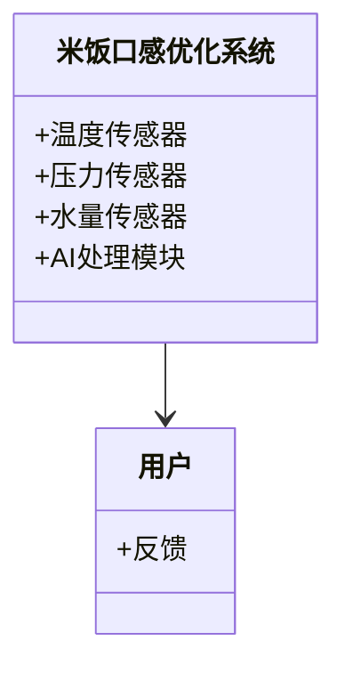

                 


# AI Agent在智能电饭煲中的米饭口感优化

## 关键词：AI Agent, 智能电饭煲, 米饭口感优化, 强化学习, 机器学习, 系统架构设计

## 摘要：本文探讨了AI Agent在智能电饭煲中的应用，重点分析了如何通过AI算法优化米饭口感。从数据采集、算法模型构建到系统架构设计，详细介绍了AI Agent在智能电饭煲中的实现过程，旨在提升用户体验和烹饪效率。

---

## 第1章：AI Agent的基本概念与应用

### 1.1 AI Agent的定义与特点
AI Agent是一种智能代理，能够感知环境并采取行动以优化目标。其特点包括自主性、反应性、目标导向和学习能力。

### 1.2 智能电饭煲的工作原理
智能电饭煲通过传感器和AI算法，实现对温度、压力和时间的智能控制，以优化烹饪过程。

---

## 第2章：米饭口感优化的背景与需求

### 2.1 米饭口感优化的重要性
米饭口感直接影响用户的满意度，不同米种的烹饪需求差异较大，市场对智能化优化的需求日益增长。

### 2.2 米饭口感优化的挑战
包括烹饪变量多、环境条件影响和用户口感偏好的多样性等。

### 2.3 AI Agent的作用
通过数据采集、分析和实时调整，AI Agent能够优化烹饪参数，提升米饭口感。

---

## 第3章：AI Agent的算法原理

### 3.1 基于强化学习的优化算法
通过状态、动作和奖励机制，AI Agent学习最优烹饪策略。

### 3.2 基于机器学习的预测模型
利用历史数据训练模型，预测最佳烹饪参数。

---

## 第4章：数学模型与算法实现

### 4.1 线性回归模型
$$ y = \beta_0 + \beta_1 x + \epsilon $$

### 4.2 强化学习流程图


---

## 第5章：系统架构设计

### 5.1 系统架构图


### 5.2 领域模型类图


---

## 第6章：项目实战

### 6.1 环境安装
安装Python、TensorFlow和相关库。

### 6.2 核心代码实现
```python
import numpy as np
import tensorflow as tf

# 数据预处理
data = np.array([...])
labels = np.array([...])

# 模型训练
model = tf.keras.Sequential([
    tf.keras.layers.Dense(64, activation='relu'),
    tf.keras.layers.Dense(1, activation='sigmoid')
])
model.compile(optimizer='adam', loss='binary_crossentropy')
model.fit(data, labels, epochs=10)
```

### 6.3 案例分析
通过实际数据训练模型，验证其优化效果。

### 6.4 项目总结
总结项目成果，分析优化效果。

---

## 第7章：总结与展望

### 7.1 系统总结
AI Agent显著提升了米饭口感，实现了智能化烹饪。

### 7.2 未来展望
未来可进一步优化算法，提升系统适应性和扩展性。

### 7.3 最佳实践
建议关注数据隐私和系统维护，确保用户体验和系统稳定性。

---

通过以上步骤，本文详细介绍了AI Agent在智能电饭煲中的应用，从理论到实践，全面展示了如何优化米饭口感，为智能家电的发展提供了新思路。

