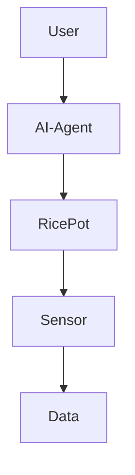
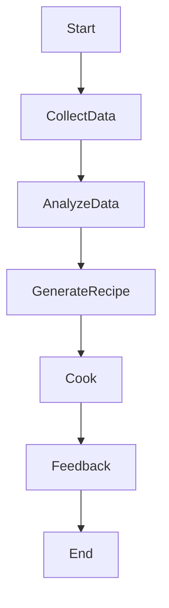
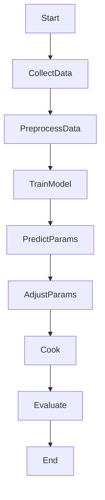
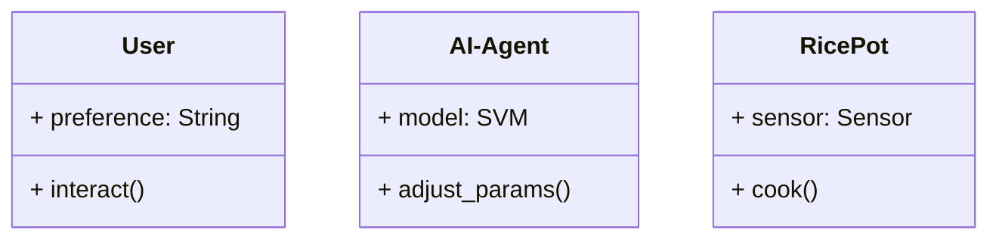
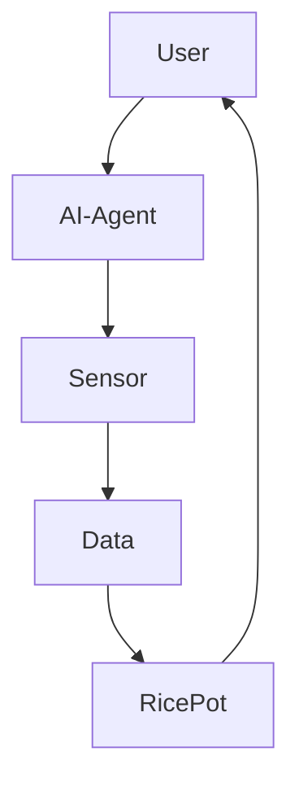

                 


# AI Agent在智能电饭煲中的米饭口感定制

## 关键词
AI Agent, 智能电饭煲, 米饭口感, 算法原理, 系统架构

## 摘要
本文深入探讨AI Agent在智能电饭煲中的应用，重点分析如何通过AI技术实现米饭口感的个性化定制。从背景介绍到系统架构设计，再到算法实现，详细解析AI Agent在智能电饭煲中的工作原理及实际应用。

---

# 第一部分: 背景与概念

# 第1章: AI Agent与智能电饭煲的背景介绍

## 1.1 问题背景与描述
### 1.1.1 米饭口感的重要性
米饭是全球主要的主食之一，口感直接影响消费者的用餐体验。不同地区的消费者对米饭的口感偏好差异显著，例如，有些人喜欢软糯的口感，而有些人则偏爱Q弹的口感。

### 1.1.2 智能电饭煲的发展现状
传统电饭煲的功能相对单一，主要基于固定的烹饪程序。随着人工智能技术的发展，智能电饭煲逐渐具备了学习用户习惯、优化烹饪方案的能力。

### 1.1.3 AI Agent在家电中的应用潜力
AI Agent（智能体）是一种能够感知环境并采取行动以实现目标的实体。将其应用于智能电饭煲，可以通过学习用户的偏好，动态调整烹饪参数，从而实现个性化的米饭口感定制。

## 1.2 问题解决与边界
### 1.2.1 米饭口感定制的核心问题
米饭口感受多种因素影响，包括米的种类、水量、烹饪时间、温度等。如何通过AI技术实现这些参数的智能调整，是米饭口感定制的核心问题。

### 1.2.2 AI Agent在智能电饭煲中的角色
AI Agent负责接收用户的口感偏好，结合实时的烹饪数据，动态调整烹饪参数，以实现目标口感。

### 1.2.3 系统边界与外延
系统的边界包括电饭煲的硬件设备、烹饪环境以及用户的口感偏好。外延则涉及与智能家居系统的联动、数据的安全性等问题。

## 1.3 核心概念与结构
### 1.3.1 AI Agent的定义与特征
AI Agent是一种能够感知环境、自主决策并采取行动的智能实体。其核心特征包括自主性、反应性、目标导向性和社交能力。

### 1.3.2 米饭口感定制的实现逻辑
通过AI Agent收集用户的口感偏好，结合实时的烹饪数据，动态调整烹饪参数，最终实现目标口感。

### 1.3.3 系统核心要素与组成
系统的核心要素包括AI Agent、智能电饭煲、烹饪传感器、用户接口和云端数据。

# 第2章: 核心概念与联系

## 2.1 AI Agent与智能电饭煲的关系
### 2.1.1 AI Agent的功能模块
AI Agent在智能电饭煲中的功能模块包括数据采集、用户偏好分析、烹饪参数优化和反馈机制。

### 2.1.2 智能电饭煲的硬件构成
智能电饭煲的硬件构成包括内胆、加热元件、传感器、微处理器和用户接口。

### 2.1.3 两者协同工作的机制
AI Agent通过传感器采集烹饪数据，分析用户偏好，动态调整烹饪参数，最终实现目标口感。

## 2.2 核心概念对比分析
### 2.2.1 AI Agent与传统程序的区别
AI Agent能够自主学习和优化，而传统程序仅基于固定的规则运行。

### 2.2.2 米饭口感与烹饪参数的关系
米饭口感与烹饪参数（如水量、温度、时间）密切相关，AI Agent通过优化这些参数实现目标口感。

### 2.2.3 用户需求与系统响应的关联
用户的口感偏好是AI Agent的目标，系统通过实时调整参数满足用户需求。

## 2.3 实体关系与流程图
### 2.3.1 ER实体关系图


### 2.3.2 核心流程图


---

# 第三部分: 算法原理与实现

# 第3章: 算法原理与实现

## 3.1 数据采集与处理
### 3.1.1 数据来源与采集方式
数据来源包括用户输入的口感偏好、传感器采集的烹饪数据和云端的历史数据。

### 3.1.2 数据预处理方法
数据预处理包括去噪、归一化和特征提取。

### 3.1.3 特征提取与选择
通过主成分分析（PCA）提取关键特征，如温度、时间、水量等。

## 3.2 算法原理与流程
### 3.2.1 支持向量机（SVM）模型
支持向量机是一种监督学习算法，适用于分类和回归问题。在米饭口感定制中，SVM可以用于预测最佳烹饪参数。

### 3.2.2 算法流程图


### 3.2.3 算法实现
以下是基于SVM的烹饪参数优化算法的Python实现示例：
```python
import numpy as np
from sklearn import svm

# 假设X为输入特征，y为目标口感评分
X = np.array([[temp, time, water]])
y = np.array([target_score])

# 训练SVM模型
model = svm.SVR(kernel='rbf')
model.fit(X, y)

# 预测最佳参数
predicted_params = model.predict(X)
```

### 3.2.4 数学模型与公式
支持向量回归（SVR）的数学模型如下：
$$ y = \omega \cdot x + b $$

其中，$$ \omega $$ 是权重向量，$$ b $$ 是偏置项。

---

# 第四部分: 系统分析与架构设计

# 第4章: 系统分析与架构设计

## 4.1 问题场景介绍
智能电饭煲需要在不同的烹饪环境中，根据用户的口感偏好，实时调整烹饪参数，以实现最佳口感。

## 4.2 系统功能设计
### 4.2.1 领域模型类图


### 4.2.2 系统架构图


### 4.2.3 系统接口设计
系统接口包括用户接口（UI）、传感器接口和云端接口。

### 4.2.4 系统交互流程图


---

# 第五部分: 项目实战

# 第5章: 项目实战与实现

## 5.1 环境安装
### 5.1.1 Python安装与库安装
安装Python和必要的库，如numpy、scikit-learn。

## 5.2 系统核心实现
### 5.2.1 核心代码实现
以下是AI Agent的核心代码实现：
```python
def collect_data():
    # 从传感器获取数据
    pass

def preprocess_data(data):
    # 数据预处理
    pass

def train_model(X, y):
    # 训练SVM模型
    pass

def adjust_params(model, X):
    # 调整烹饪参数
    pass
```

### 5.2.2 代码应用解读与分析
代码实现包括数据采集、预处理、模型训练和参数调整四个步骤。

### 5.2.3 实际案例分析
通过实际案例分析，验证系统的有效性。

## 5.3 项目小结
项目通过AI Agent实现了米饭口感的个性化定制，验证了AI技术在智能家电中的应用潜力。

---

# 第六部分: 最佳实践与总结

# 第6章: 最佳实践与总结

## 6.1 小结
AI Agent在智能电饭煲中的应用，通过学习用户的口感偏好，动态调整烹饪参数，实现了个性化的米饭口感定制。

## 6.2 注意事项
系统设计中需要注意数据的安全性、算法的实时性和系统的可扩展性。

## 6.3 拓展阅读
建议读者进一步学习AI在智能家居中的应用、支持向量机算法的优化以及边缘计算在家电中的应用。

---

通过以上内容，我们可以看到，AI Agent在智能电饭煲中的应用不仅提升了用户体验，还展示了人工智能技术在家电领域的巨大潜力。

