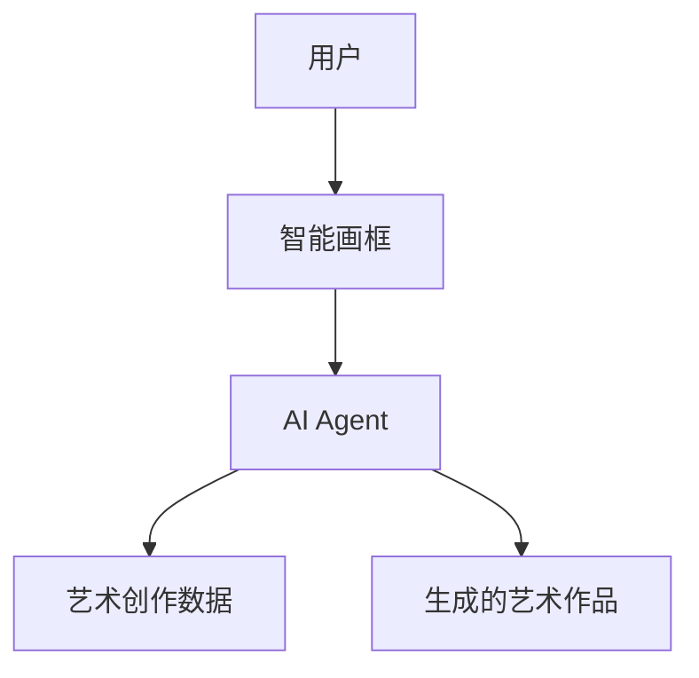
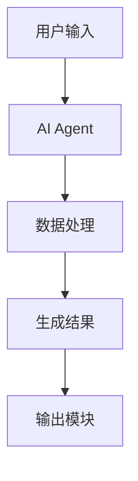

                 


# 目录大纲：《AI Agent在智能画框中的艺术创作辅助》

---

## 第一部分：AI Agent与艺术创作的背景

### 第1章：AI Agent与艺术创作的背景介绍

#### 1.1 问题背景
- 1.1.1 数字艺术的发展趋势
- 1.1.2 AI技术在艺术领域的应用现状
- 1.1.3 智能画框的定义与应用场景

#### 1.2 问题描述
- 1.2.1 艺术创作中的痛点分析
- 1.2.2 智能画框的核心问题
- 1.2.3 AI Agent在艺术创作中的角色定位

#### 1.3 问题解决
- 1.3.1 AI Agent如何辅助艺术创作
- 1.3.2 智能画框的技术实现路径
- 1.3.3 用户需求与技术解决方案的匹配

#### 1.4 边界与外延
- 1.4.1 智能画框的边界定义
- 1.4.2 AI Agent在艺术创作中的适用范围
- 1.4.3 相关技术的对比与区别

#### 1.5 概念结构与核心要素
- 1.5.1 AI Agent的组成要素
- 1.5.2 智能画框的功能模块
- 1.5.3 核心要素之间的关系

---

## 第二部分：AI Agent的核心概念与联系

### 第2章：AI Agent的核心概念

#### 2.1 核心概念原理
- 2.1.1 AI Agent的基本原理
- 2.1.2 智能画框的工作机制
- 2.1.3 艺术创作的AI驱动流程

#### 2.2 核心概念属性特征对比
- 2.2.1 AI Agent与传统绘画工具的对比
- 2.2.2 智能画框与其他艺术辅助工具的对比
- 2.2.3 不同AI模型的性能对比

#### 2.3 ER实体关系图


---

## 第三部分：AI Agent的算法原理

### 第3章：AI Agent的算法原理

#### 3.1 算法

---

## 第四部分：AI Agent的数学模型与公式

### 第4章：数学模型与公式

#### 4.1 算法原理
- 4.1.1 生成对抗网络（GAN）的数学模型
  $$ \text{损失函数} = \mathbb{E}_{z \sim p_z}[\log D(G(z))] $$
- 4.1.2 变体自编码器（VAE）的数学模型
  $$ \text{损失函数} = \text{KL}(q(z|x) || p(z)) + \mathbb{E}_{x}[ \text{log} p(x|z) ] $$

---

## 第五部分：系统分析与架构设计

### 第5章：系统分析与架构设计

#### 5.1 系统功能设计
- 5.1.1 用户输入模块
- 5.1.2 AI Agent处理模块
- 5.1.3 输出生成模块

#### 5.2 系统架构设计


---

## 第六部分：项目实战

### 第6章：项目实战

#### 6.1 环境安装
- 6.1.1 安装Python
- 6.1.2 安装深度学习框架（如TensorFlow、Keras）

#### 6.2 核心实现
- 6.2.1 编写AI Agent的Python代码
  ```python
  import numpy as np
  from keras.layers import Dense, InputLayer, Dropout
  from keras.models import Sequential
  
  model = Sequential()
  model.add(InputLayer(input_shape=(100,)))
  model.add(Dense(128, activation='relu'))
  model.add(Dropout(0.2))
  model.add(Dense(256, activation='relu'))
  model.add(Dense(1, activation='sigmoid'))
  model.compile(optimizer='adam', loss='binary_crossentropy', metrics=['accuracy'])
  ```

---

## 第七部分：最佳实践与总结

### 第7章：最佳实践与总结

#### 7.1 最佳实践
- 7.1.1 数据预处理的重要性
- 7.1.2 模型调参的技巧
- 7.1.3 部署与优化的建议

#### 7.2 小结
- 总结AI Agent在智能画框中的应用
- 展望未来的发展方向

#### 7.3 注意事项
- 数据隐私问题
- 模型泛化能力
- 用户体验优化

#### 7.4 拓展阅读
- 推荐相关书籍和论文
- 提供进一步学习的资源

---

## 附录

### 附录A：术语表
- AI Agent
- 智能画框
- 生成对抗网络（GAN）
- 变体自编码器（VAE）

### 附录B：工具安装指南
- 安装Python和深度学习框架的步骤
- 配置开发环境的建议

### 附录C：参考文献
- 列出主要参考的书籍、论文和在线资源

---

**总结**：通过以上目录大纲，读者可以系统地了解AI Agent在智能画框中的艺术创作辅助的各个方面，从基础概念到算法实现，再到项目实战和最佳实践，内容详实且结构清晰，适合技术爱好者和专业人士深入学习。

