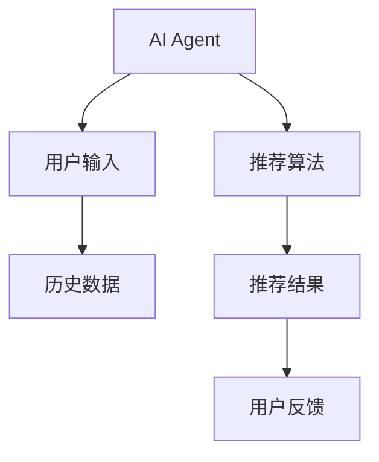
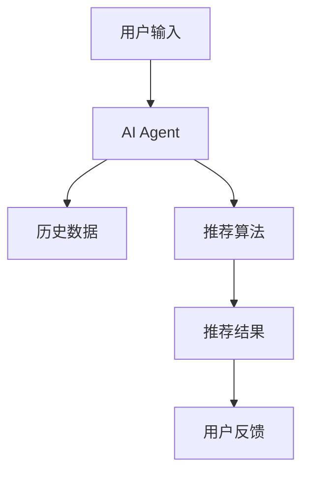
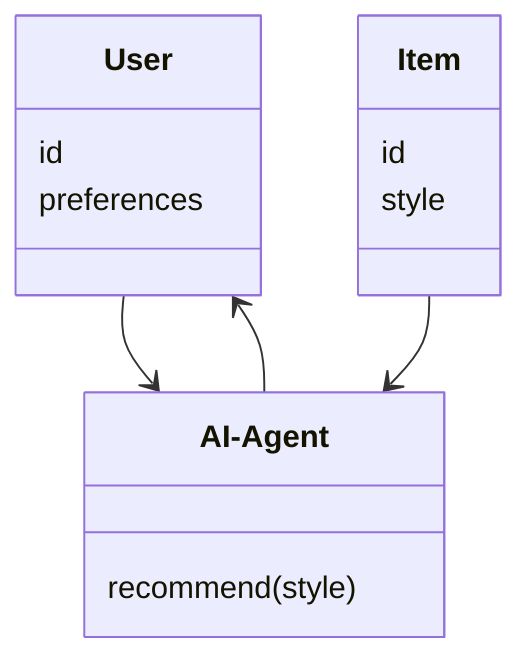
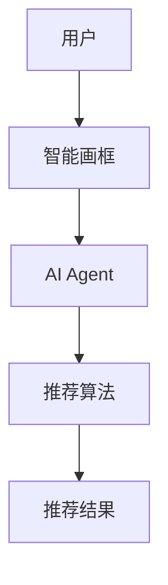
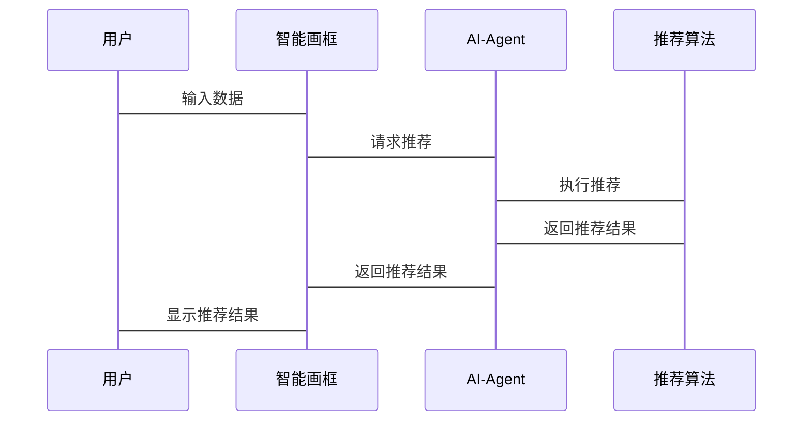

                 


# AI Agent在智能画框中的艺术风格推荐

## 关键词：AI Agent, 艺术风格推荐, 智能画框, 协同过滤, 深度学习, 系统架构, 项目实战

## 摘要：本文详细探讨了AI Agent在智能画框中的艺术风格推荐系统的实现。通过分析问题背景，阐述了AI Agent的核心原理，详细讲解了协同过滤算法的数学模型和Python实现。随后，设计了系统的架构和接口，并通过实际案例展示了项目的开发过程。最后，总结了最佳实践和未来发展方向。

---

## 第1章：背景介绍

### 1.1 问题背景

#### 1.1.1 当前艺术推荐的痛点
艺术风格推荐是智能画框的核心功能之一。传统的人工推荐方式耗时且效率低下，难以满足用户多样化的艺术风格需求。用户希望智能画框能够根据他们的偏好自动推荐合适的艺术风格，从而提升用户体验。

#### 1.1.2 AI Agent在艺术推荐中的作用
AI Agent作为一种智能代理，能够通过学习用户的偏好和行为模式，自动推荐合适的艺术风格。它能够实时分析用户输入的图像或文本信息，结合历史数据和实时数据，提供个性化的艺术风格推荐。

#### 1.1.3 智能画框的定义与应用场景
智能画框是一种结合了AI技术和艺术推荐的设备。它能够通过摄像头捕捉用户输入的图像或文本信息，结合AI算法分析用户偏好，推荐适合的艺术风格。应用场景包括家庭装饰、艺术展览、教育等领域。

### 1.2 问题描述

#### 1.2.1 艺术风格推荐的核心问题
艺术风格推荐的核心问题是如何根据用户的输入信息，准确地推荐出符合用户审美的艺术风格。这需要解决数据采集、特征提取、算法选择等多个技术问题。

#### 1.2.2 用户需求与系统目标的匹配
用户需求包括个性化推荐、实时性、多样性等。系统目标是通过AI Agent实现这些需求，提供高效、精准的艺术风格推荐服务。

#### 1.2.3 智能画框的边界与外延
智能画框的功能边界包括艺术风格推荐、用户偏好分析、数据采集等。其外延包括与其他智能设备的联动、数据共享等。

### 1.3 问题解决

#### 1.3.1 AI Agent在艺术风格推荐中的解决方案
AI Agent通过学习用户的偏好和行为模式，结合协同过滤和深度学习算法，实现艺术风格的推荐。

#### 1.3.2 智能画框的技术实现路径
技术实现路径包括数据采集、特征提取、算法设计、系统集成等。

#### 1.3.3 用户体验的提升策略
通过优化推荐算法、提升系统响应速度、增加用户反馈机制等，提升用户体验。

### 1.4 概念结构与核心要素

#### 1.4.1 核心概念的定义
- AI Agent：一种智能代理，能够根据用户输入和历史数据推荐艺术风格。
- 艺术风格推荐：基于用户偏好推荐合适的艺术风格。

#### 1.4.2 概念属性特征对比表
| 概念 | 属性 | 特征 |
|------|------|------|
| AI Agent | 输入 | 用户偏好、历史数据 |
| 艺术风格推荐 | 输出 | 推荐的艺术风格列表 |

#### 1.4.3 ER实体关系图（Mermaid流程图）


---

## 第2章：核心概念与联系

### 2.1 AI Agent的核心原理

#### 2.1.1 AI Agent的定义与分类
AI Agent可以分为基于规则的AI Agent和基于模型的AI Agent。基于规则的AI Agent通过预定义的规则进行推理和决策，而基于模型的AI Agent则通过学习模型进行推理和决策。

#### 2.1.2 基于规则的AI Agent
基于规则的AI Agent通过预定义的规则进行推理和决策。例如，如果用户喜欢抽象派艺术，AI Agent会推荐相似的艺术风格。

#### 2.1.3 基于模型的AI Agent
基于模型的AI Agent通过学习模型进行推理和决策。例如，深度学习模型可以自动提取用户的偏好特征，并推荐相应的艺术风格。

### 2.2 艺术风格推荐的原理

#### 2.2.1 基于协同过滤的推荐算法
协同过滤是一种常用的推荐算法。它通过分析用户的历史行为数据，找到与用户兴趣相似的用户或物品，进行推荐。

#### 2.2.2 基于内容的推荐算法
基于内容的推荐算法通过分析物品本身的特征，找到与用户兴趣相似的物品进行推荐。

#### 2.2.3 基于深度学习的推荐模型
基于深度学习的推荐模型通过学习用户和物品的特征表示，进行推荐。

### 2.3 AI Agent与艺术风格推荐的联系

#### 2.3.1 AI Agent在艺术风格推荐中的角色
AI Agent作为智能代理，负责收集用户数据、分析用户偏好，并通过推荐算法生成推荐结果。

#### 2.3.2 艺术风格推荐的流程图（Mermaid）


---

## 第3章：算法原理与数学模型

### 3.1 协同过滤算法

#### 3.1.1 协同过滤的基本原理
协同过滤通过分析用户的历史行为数据，找到与用户兴趣相似的用户或物品，进行推荐。

#### 3.1.2 协同过滤的数学模型
协同过滤的数学模型包括相似度计算和推荐评分计算。

#### 3.1.3 协同过滤的实现步骤
1. 数据预处理：收集用户行为数据，进行数据清洗和特征提取。
2. 相似度计算：计算用户之间的相似度，或物品之间的相似度。
3. 推荐评分计算：根据相似度计算推荐评分，生成推荐列表。

#### 3.1.4 协同过滤的Python代码实现
```python
import numpy as np
from sklearn.metrics.pairwise import cosine_similarity

# 示例数据：用户-物品评分矩阵
rating_matrix = np.array([[4, 3, 2], [5, 1, 4], [3, 5, 2]])

# 计算余弦相似度
similarity = cosine_similarity(rating_matrix)

print("相似度矩阵：")
print(similarity)
```

---

## 第4章：系统分析与架构设计

### 4.1 系统功能设计

#### 4.1.1 领域模型设计（Mermaid类图）


#### 4.1.2 系统架构设计（Mermaid架构图）


#### 4.1.3 接口设计
1. 用户输入接口：接收用户的输入数据。
2. 数据处理接口：对输入数据进行预处理和特征提取。
3. 推荐接口：根据处理后的数据，调用推荐算法，生成推荐结果。

#### 4.1.4 交互流程（Mermaid序列图）


---

## 第5章：项目实战

### 5.1 环境安装

#### 5.1.1 安装Python
```bash
python --version
```

#### 5.1.2 安装必要的库
```bash
pip install numpy scikit-learn
```

### 5.2 系统核心实现

#### 5.2.1 数据预处理
```python
import numpy as np
from sklearn.metrics.pairwise import cosine_similarity

# 示例数据：用户-物品评分矩阵
rating_matrix = np.array([[4, 3, 2], [5, 1, 4], [3, 5, 2]])

# 数据预处理：归一化
normalized_matrix = rating_matrix / rating_matrix.max()
```

#### 5.2.2 推荐算法实现
```python
similarity = cosine_similarity(normalized_matrix)
```

#### 5.2.3 推荐结果展示
```python
print("推荐结果：", similarity.argsort()[:, ::-1][:, 1])
```

### 5.3 实际案例分析

#### 5.3.1 案例背景
假设用户输入了一幅抽象派的画作，系统需要推荐相似的艺术风格。

#### 5.3.2 数据处理
用户输入的画作被转换为特征向量。

#### 5.3.3 算法执行
推荐算法根据用户特征向量，计算相似度，生成推荐结果。

#### 5.3.4 结果展示
推荐结果包括相似的艺术风格列表和推荐理由。

---

## 第6章：最佳实践

### 6.1 小结
AI Agent在智能画框中的艺术风格推荐是一个复杂的系统工程。本文详细探讨了其实现过程，包括算法选择、系统设计、项目实战等。

### 6.2 注意事项
1. 数据隐私：在处理用户数据时，需要注意数据隐私和安全。
2. 算法优化：协同过滤算法的计算复杂度较高，需要优化算法性能。

### 6.3 拓展阅读
1. 《推荐系统实践》
2. 《深度学习入门》
3. 《AI Agent原理与应用》

---

## 总结

本文详细探讨了AI Agent在智能画框中的艺术风格推荐系统的实现。通过分析问题背景，阐述了AI Agent的核心原理，详细讲解了协同过滤算法的数学模型和Python实现。随后，设计了系统的架构和接口，并通过实际案例展示了项目的开发过程。最后，总结了最佳实践和未来发展方向。希望本文能够为相关领域的研究和实践提供有价值的参考。

