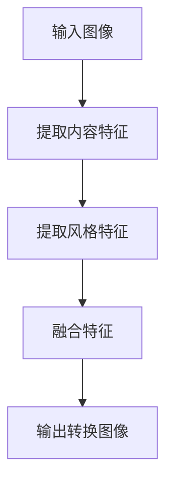
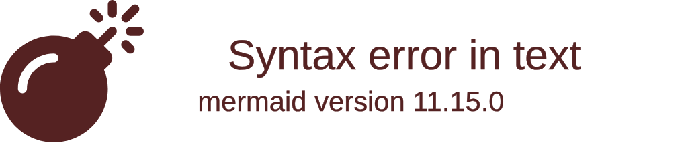
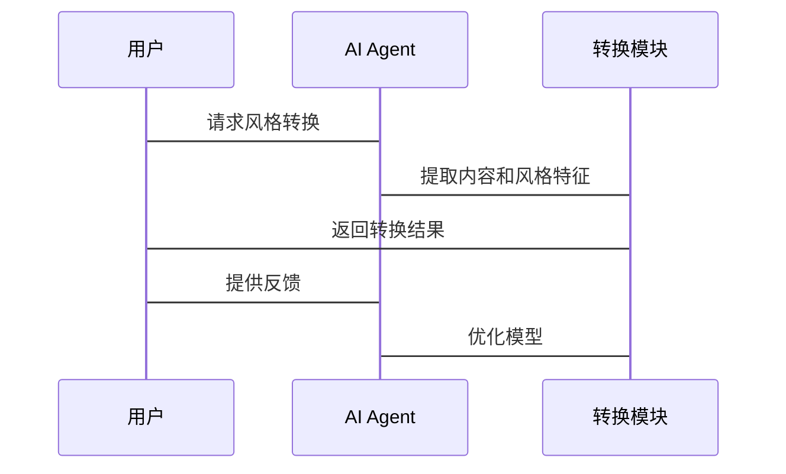

                 


# AI Agent在智能画框中的艺术风格转换

## 关键词：AI Agent, 艺术风格转换, 智能画框, 神经网络, 风格迁移, 用户交互

## 摘要：本文深入探讨AI Agent在智能画框中的艺术风格转换应用，分析其核心概念、算法原理、系统设计及项目实现，结合实际案例和最佳实践，揭示技术原理和未来发展方向。

---

## 第一部分: AI Agent与艺术风格转换的背景介绍

### 第1章: AI Agent的基本概念与应用

#### 1.1 AI Agent的定义与核心概念
- **AI Agent定义**：AI Agent是具备自主决策能力的智能体，通过感知环境并采取行动以实现目标。
- **核心要素**：感知能力、决策机制、执行能力、学习能力。
- **艺术领域应用**：辅助创作、风格转换、图像生成。

#### 1.2 AI Agent在艺术风格转换中的作用
- 通过学习不同艺术风格，生成符合用户需求的艺术作品。
- 实现内容与风格的分离，保持内容完整性的同时改变风格。

#### 1.3 智能画框的定义与功能
- 智能画框：结合AI技术的画框，支持艺术风格转换、用户交互等功能。
- 主要功能：实时风格转换、用户自定义风格、内容生成。

### 第2章: 艺术风格转换的背景与技术挑战

#### 2.1 背景
- 数字艺术兴起，艺术家和普通用户对风格转换的需求增加。
- 提供便捷工具，降低艺术创作门槛，提升创作效率。

#### 2.2 技术挑战
- **风格特征提取**：需捕捉艺术风格的关键特征。
- **内容与风格分离**：保持内容不变，仅改变风格的技术难度。
- **风格可迁移性**：某些风格难以迁移，影响转换效果。

### 第3章: AI Agent在智能画框中的应用

#### 3.1 作用与优势
- **智能化**：AI Agent实时响应用户需求。
- **个性化**：支持多种风格转换，满足不同用户需求。
- **交互性**：通过用户反馈优化风格转换效果。

#### 3.2 应用场景
- 艺术创作辅助：帮助艺术家快速尝试不同风格。
- 教育工具：用于艺术教学，展示不同风格特点。
- 商业应用：应用于广告设计、品牌视觉优化。

---

## 第二部分: AI Agent的艺术风格转换核心概念与联系

### 第4章: AI Agent的艺术风格转换原理

#### 4.1 风格转换的核心原理
- **风格特征提取**：使用预训练模型提取目标艺术风格的特征。
- **内容与风格分离**：通过算法分离内容和风格信息。
- **风格融合**：将目标风格信息重新应用到原始内容。

#### 4.2 神经网络模型
- **VGG网络**：用于提取图像特征。
- **GAN模型**：用于生成高质量的艺术图像。
- **StyleGAN**：用于生成多样化风格的艺术作品。

#### 4.3 内容与风格分离的数学模型
- **公式**：$C = f_c(I)$，$S = f_s(I)$，$O = C \oplus S$。
- **解释**：$C$为内容特征，$S$为风格特征，$\oplus$表示融合操作。

#### 4.4 实现步骤
1. 输入原始图像$I$。
2. 使用内容模型提取内容特征$C$。
3. 使用风格模型提取风格特征$S$。
4. 融合$C$和$S$生成风格转换后的图像$O$。

### 第5章: 核心概念与联系

#### 5.1 核心概念对比
| 概念 | 描述 |
|------|------|
| AI Agent | 智能体，处理输入并生成输出 |
| 风格转换 | 改变图像风格，保持内容 |
| 智能画框 | 结合AI的画框，支持实时转换 |

#### 5.2 ER实体关系图
```mermaid
er
actor: 用户
agent: AI Agent
picture: 原始图像
style: 风格信息
conversion: 转换结果
```

---

## 第三部分: 算法原理讲解

### 第6章: 基于神经网络的风格转换算法

#### 6.1 算法流程


#### 6.2 Python代码示例
```python
import tensorflow as tf
from tensorflow.keras import layers

def style_transfer_model(content_model, style_model):
    input_img = layers.Input(shape=(256, 256, 3))
    content_features = content_model(input_img)
    style_features = style_model(input_img)
    # 融合特征
    output = layers.Add()([content_features, style_features])
    return tf.keras.Model(inputs=input_img, outputs=output)

# 示例模型
content_model = VGG19(weights='imagenet', include_top=False)
style_model = VGG19(weights='imagenet', include_top=False)
model = style_transfer_model(content_model, style_model)
```

#### 6.3 数学模型
- **内容损失**：$$ L_c = ||f_c(I) - f_c(I')||^2 $$
- **风格损失**：$$ L_s = ||f_s(I) - f_s(I')||^2 $$
- **总损失**：$$ L = \alpha L_c + \beta L_s $$

---

## 第四部分: 系统分析与架构设计

### 第7章: 智能画框系统设计

#### 7.1 系统架构图


#### 7.2 接口设计
- 输入接口：接收用户输入的图像和风格选择。
- 输出接口：显示转换后的图像，并提供反馈机制。

#### 7.3 交互流程


---

## 第五部分: 项目实战

### 第8章: 项目实现与案例分析

#### 8.1 项目安装与环境配置
- 安装TensorFlow、Keras、OpenCV等库。
- 配置GPU加速。

#### 8.2 核心代码实现
```python
def load_image(image_path):
    img = cv.imread(image_path)
    img = cv.resize(img, (256, 256))
    return img

def save_image(img, output_path):
    cv.imwrite(output_path, img)

# 加载模型
model = style_transfer_model(content_model, style_model)
# 转换图像
input_image = load_image("input.jpg")
output_image = model.predict(input_image[np.newaxis, :, :, :])
save_image(output_image[0], "output.jpg")
```

#### 8.3 案例分析
- 输入：一张风景照片。
- 输出：风景照片以梵高风格呈现。
- 分析：模型成功提取风景内容和梵高风格，生成逼真作品。

#### 8.4 项目优化
- 参数调整：优化$\alpha$和$\beta$值，提升转换效果。
- 模型微调：针对特定风格进行微调，增强效果。

---

## 第六部分: 最佳实践与总结

### 第9章: 最佳实践与注意事项

#### 9.1 工具选择
- 使用预训练模型：VGG、ResNet等。
- 开源库：TensorFlow、Keras、PyTorch。

#### 9.2 性能优化
- 优化模型参数：调整学习率、批量大小。
- 使用迁移学习：减少训练时间，提升效果。

#### 9.3 注意事项
- 数据多样性：确保训练数据覆盖多种风格，避免过拟合。
- 用户反馈：根据用户反馈优化模型，提升用户体验。

### 第10章: 总结与未来展望

#### 10.1 总结
- AI Agent在智能画框中的应用潜力巨大。
- 风格转换技术不断进步，应用更加广泛。

#### 10.2 未来展望
- 更多风格迁移算法研究。
- 实时风格转换技术优化。
- 用户友好界面设计，提升用户体验。

---

## 结语

通过本文的详细讲解，读者可以全面了解AI Agent在智能画框中的艺术风格转换技术，从理论到实践，掌握核心概念和实现方法。未来，随着技术进步，AI Agent在艺术领域的应用将更加广泛，为艺术创作带来更多的可能性。

