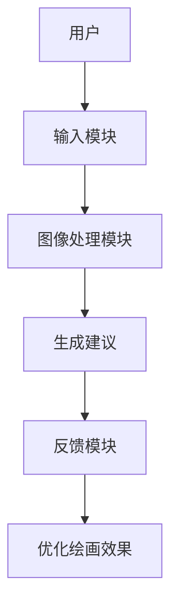
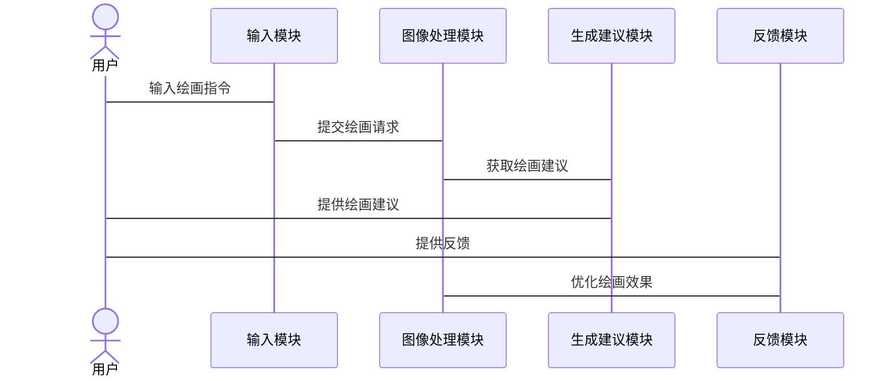

                 


# AI Agent在智能画笔中的绘画技巧指导

> 关键词：AI Agent, 智能画笔, 绘画技巧, 深度学习, 图像处理, 绘画工具, 人工智能

> 摘要：本文将详细探讨AI Agent在智能画笔中的应用，分析其如何通过感知、决策和执行能力提升绘画效率和创意。我们将从核心概念、算法原理、系统架构到实际项目实现，全面解析AI Agent在绘画领域的技术细节和应用技巧。

---

## 第一部分: AI Agent在智能画笔中的绘画技巧背景介绍

### 第1章: AI Agent与智能画笔概述

#### 1.1 AI Agent的基本概念
- **1.1.1 什么是AI Agent**
  - AI Agent是一种智能代理，能够感知环境、理解任务目标并采取行动以实现目标。
  - 在绘画领域，AI Agent可以辅助用户完成从构思到创作的全过程。

- **1.1.2 AI Agent的核心特点**
  - 自适应性：根据用户需求动态调整输出。
  - 学习能力：通过深度学习模型不断优化绘画效果。
  - 实时反馈：能够快速响应用户的操作并提供反馈。

- **1.1.3 AI Agent在绘画中的应用背景**
  - 随着深度学习技术的发展，AI Agent在绘画工具中的应用日益广泛。
  - 用户需求从简单的绘图工具转向智能化、个性化的创作辅助。

#### 1.2 智能画笔的发展趋势
- **1.2.1 传统绘画工具的局限性**
  - 手动绘画耗时且依赖用户技能。
  - 无法提供实时反馈或建议。

- **1.2.2 智能画笔的定义与特点**
  - 智能画笔结合了传统绘画工具与AI技术，能够提供智能建议和实时优化。
  - 支持多模态输入，如手写、语音指令等。

- **1.2.3 AI Agent在智能画笔中的作用**
  - 作为智能助手，AI Agent能够理解用户的绘画意图并提供个性化建议。
  - 通过深度学习模型生成高质量的绘画效果，提升创作效率。

#### 1.3 AI Agent与绘画工具的结合
- **1.3.1 AI Agent在绘画中的优势**
  - 提高绘画效率：AI Agent可以快速生成草图或完善细节。
  - 激发创作灵感：通过分析用户输入，AI Agent可以提供创新的绘画思路。
  - 支持多种绘画风格：用户可以根据需求选择不同的绘画风格，AI Agent能够实时调整输出。

- **1.3.2 AI Agent绘画工具的市场现状**
  - 市场上已经出现了许多结合AI的绘画工具，如MidJourney、Stable Diffusion等。
  - 这些工具通过AI Agent技术，为用户提供高效、个性化的绘画体验。

- **1.3.3 AI Agent绘画工具的未来发展方向**
  - 更加智能化：AI Agent将更加理解用户的意图，提供更精准的绘画建议。
  - 多模态交互：支持语音、手势等多种交互方式，提升用户体验。
  - 高度定制化：用户可以根据自己的需求定制AI Agent的行为和输出。

#### 1.4 本章小结
- 本章介绍了AI Agent的基本概念及其在智能画笔中的应用背景。
- 强调了AI Agent在提升绘画效率和创作灵感方面的重要作用。
- 展望了AI Agent绘画工具的未来发展。

---

## 第二部分: AI Agent的核心概念与联系

### 第2章: AI Agent的核心概念原理

#### 2.1 AI Agent的感知能力
- **2.1.1 图像识别与分析**
  - AI Agent通过图像识别技术理解用户的绘画内容。
  - 使用深度学习模型（如CNN）提取绘画中的特征。

- **2.1.2 基于深度学习的图像理解**
  - 深度学习模型能够识别图像中的物体、场景和情感。
  - 通过图像分割技术，AI Agent可以识别绘画中的不同区域。

- **2.1.3 图像特征提取的数学模型**
  - 使用卷积神经网络（CNN）提取图像特征。
  - 特征表示为高维向量，用于后续的图像生成或风格迁移。

#### 2.2 AI Agent的决策能力
- **2.2.1 基于概率的决策算法**
  - 使用概率模型（如马尔可夫链）进行决策。
  - 根据绘画内容和用户意图，生成可能的绘画建议。

- **2.2.2 基于强化学习的绘画决策**
  - 使用强化学习（如DQN）优化绘画决策。
  - AI Agent通过与用户的互动，不断优化绘画建议。

- **2.2.3 决策过程中的权衡与优化**
  - 在生成绘画建议时，AI Agent需要权衡绘画的美感、用户意图和计算效率。
  - 使用多目标优化算法平衡不同目标。

#### 2.3 AI Agent的执行能力
- **2.3.1 基于反馈的绘画调整**
  - AI Agent根据用户的反馈调整绘画内容。
  - 使用反馈机制优化生成的图像。

- **2.3.2 绘画效果的实时优化**
  - AI Agent实时调整绘画参数，如颜色、笔触等。
  - 使用实时渲染技术提升用户体验。

- **2.3.3 多目标优化的实现方法**
  - 在绘画过程中，AI Agent需要同时优化多个目标，如绘画风格、细节丰富度等。
  - 使用多目标优化算法（如多目标粒子群优化）实现。

#### 2.4 AI Agent核心概念的ER实体关系图

```mermaid
er
actor: 用户
agent: AI绘画助手
tool: 绘画工具
action: 绘画操作
feature: 绘画特征
```

---

## 第三部分: AI Agent的算法原理讲解

### 第3章: AI Agent的算法原理

#### 3.1 图像处理算法
- **3.1.1 图像分割算法**
  - 使用U-Net等模型进行图像分割。
  - 应用于绘画中的对象识别和区域划分。

- **3.1.2 图像生成算法**
  - 使用生成对抗网络（GAN）生成高质量的图像。
  - GAN包括生成器和判别器，分别负责生成图像和评估图像的真实性。

- **3.1.3 风格迁移算法**
  - 使用风格迁移技术将一种绘画风格应用到另一种图像上。
  - 基于深度学习的风格迁移算法（如Neural Style Transfer）实现。

#### 3.2 生成对抗网络（GAN）的实现
- **3.2.1 GAN的基本原理**
  - GAN由生成器和判别器组成，通过对抗训练生成高质量的图像。
  - 生成器的目标是生成逼真的图像，判别器的目标是区分生成图像和真实图像。

- **3.2.2 GAN的损失函数**
  - 生成器的损失函数：$$ L_G = -\mathbb{E}[\log(D(G(x))) ] $$
  - 判别器的损失函数：$$ L_D = -\mathbb{E}[\log(D(x)) + \log(1 - D(G(x)))] $$

- **3.2.3 GAN的训练流程**
  1. 初始化生成器和判别器的参数。
  2. 训练判别器，使其能够区分真实图像和生成图像。
  3. 训练生成器，使其生成的图像能够欺骗判别器。
  4. 重复训练步骤，直到生成器和判别器达到平衡。

#### 3.3 强化学习的绘画决策
- **3.3.1 强化学习的基本原理**
  - 强化学习通过奖励机制优化决策过程。
  - 在绘画中，AI Agent根据用户的反馈调整绘画策略。

- **3.3.2 基于强化学习的绘画决策算法**
  - 使用深度Q网络（DQN）进行决策。
  - 根据当前绘画状态，生成多种可能的绘画动作，并选择最优动作。

- **3.3.3 强化学习的数学模型**
  - 状态空间：$$ S = \{s_1, s_2, ..., s_n\} $$
  - 动作空间：$$ A = \{a_1, a_2, ..., a_m\} $$
  - 奖励函数：$$ R(s, a) $$

---

## 第四部分: AI Agent的系统分析与架构设计

### 第4章: AI Agent的系统架构设计

#### 4.1 系统功能设计
- **4.1.1 系统模块划分**
  - 用户输入模块：接收用户的绘画指令。
  - 图像处理模块：处理用户的绘画输入，生成绘画建议。
  - 反馈模块：根据用户反馈优化绘画效果。

- **4.1.2 系统功能设计**
  - 用户输入：支持手写、语音等多种输入方式。
  - 智能建议：生成绘画建议并实时反馈。
  - 绘画优化：根据用户反馈优化绘画效果。

- **4.1.3 系统交互流程**
  1. 用户输入绘画指令。
  2. AI Agent分析用户输入，生成绘画建议。
  3. 用户根据建议调整绘画内容。
  4. AI Agent根据用户反馈优化绘画效果。

#### 4.2 系统架构设计



#### 4.3 系统交互设计



---

## 第五部分: AI Agent的项目实战

### 第5章: AI Agent的项目实现

#### 5.1 环境安装
- 安装Python和必要的深度学习库（如TensorFlow、Keras）。
- 安装绘画工具（如Python的matplotlib库）。

#### 5.2 核心代码实现

```python
import tensorflow as tf
from tensorflow.keras import layers

# 定义生成器模型
def build_generator():
    model = tf.keras.Sequential()
    model.add(layers.Dense(256, activation='relu', input_dim=100))
    model.add(layers.Reshape((16, 16, 1)))
    model.add(layers.Conv2DTranspose(16, (2,2), strides=(2,2), activation='relu'))
    model.add(layers.Conv2DTranspose(8, (2,2), strides=(2,2), activation='relu'))
    model.add(layers.Conv2D(1, (1,1), activation='sigmoid'))
    return model

# 定义判别器模型
def build_discriminator():
    model = tf.keras.Sequential()
    model.add(layers.Conv2D(8, (2,2), strides=(2,2), activation='relu', input_shape=(32,32,1)))
    model.add(layers.Conv2D(16, (2,2), strides=(2,2), activation='relu'))
    model.add(layers.Flatten())
    model.add(layers.Dense(1, activation='sigmoid'))
    return model
```

#### 5.3 代码应用解读与分析
- 生成器模型用于生成图像，判别器模型用于判别图像的真实性。
- 使用GAN算法训练模型，生成高质量的绘画图像。

#### 5.4 实际案例分析
- 使用上述模型生成一幅风景画。
- 分析生成图像的质量和绘画风格。

#### 5.5 项目小结
- 本章通过实际项目实现，展示了AI Agent在绘画中的具体应用。
- 通过代码实现和案例分析，验证了AI Agent在提升绘画效率和质量方面的有效性。

---

## 第六部分: 总结与展望

### 第6章: 总结与展望

#### 6.1 最佳实践 tips
- 使用高质量的深度学习模型提升绘画效果。
- 结合多模态输入优化用户体验。

#### 6.2 本章小结
- 本文详细探讨了AI Agent在智能画笔中的应用，从核心概念到算法原理，再到系统设计和项目实现，全面解析了AI Agent在绘画领域的技术细节。

#### 6.3 注意事项
- 在实际应用中，注意保护用户隐私和数据安全。
- 确保AI Agent的绘画建议符合用户的创作意图。

#### 6.4 拓展阅读
- 深度学习在图像处理中的应用。
- 强化学习在绘画中的创新应用。

---

通过本文的详细讲解，读者可以全面理解AI Agent在智能画笔中的绘画技巧指导，掌握其在实际应用中的技术细节和实现方法。

