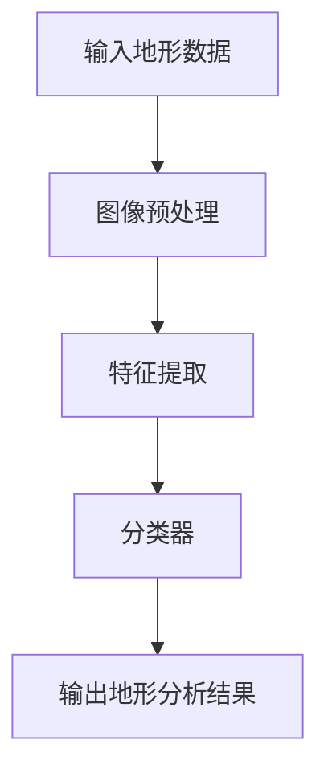
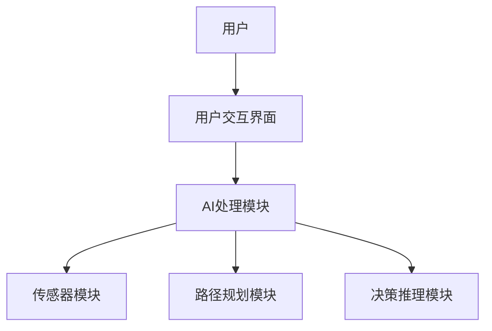
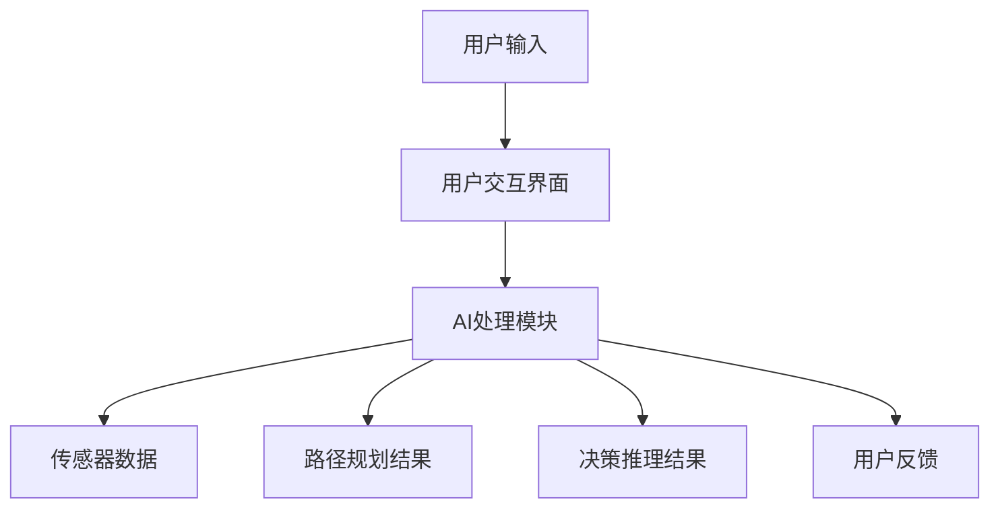

                 


# AI Agent在智能登山杖中的地形分析

**关键词**：AI Agent，智能登山杖，地形分析，路径规划，环境感知，决策推理

**摘要**：本文详细探讨了AI Agent在智能登山杖中的应用，重点分析了地形分析的核心算法、系统架构设计以及实际应用场景。通过结合深度学习、路径规划和环境感知技术，AI Agent能够显著提升智能登山杖的智能化水平，为登山者提供更安全、更高效的导航支持。本文从理论到实践，全面解析了AI Agent在智能登山杖中的技术实现与应用价值。

---

## 第1章 AI Agent与智能登山杖概述

### 1.1 AI Agent的基本概念
AI Agent（人工智能代理）是指能够感知环境、自主决策并执行任务的智能实体。它具备以下核心特点：
- **自主性**：无需外部干预，能够独立完成任务。
- **反应性**：能够实时感知环境变化并做出反应。
- **目标导向性**：基于目标驱动行为。
- **学习能力**：通过数据不断优化自身性能。

### 1.2 智能登山杖的技术背景
智能登山杖是一种结合了传感器、物联网和AI技术的高端登山装备。它通过集成多种传感器（如GPS、IMU、摄像头）收集地形数据，并利用AI算法进行分析，为用户提供实时导航建议。

### 1.3 AI Agent在智能登山杖中的价值
AI Agent的应用使得智能登山杖具备以下优势：
- **提高安全性**：通过实时地形分析，避免危险区域。
- **增强导航能力**：提供最优路径规划，提升登山效率。
- **提升用户体验**：通过语音或震动反馈，为用户提供直观指导。

---

## 第2章 AI Agent的核心概念与技术原理

### 2.1 AI Agent的核心概念解析
AI Agent在智能登山杖中的核心任务包括：
- **环境感知**：通过传感器收集地形数据。
- **路径规划**：基于地形数据计算最优路径。
- **决策推理**：根据环境变化动态调整导航策略。

### 2.2 AI Agent的技术原理
AI Agent的主要技术包括：
- **环境感知**：利用深度学习模型对地形图像进行分类。
- **路径规划**：基于A*算法计算最优路径。
- **决策推理**：结合实时数据动态优化导航策略。

### 2.3 算法流程图
以下是AI Agent的核心算法流程图：



---

## 第3章 AI Agent的算法原理与数学模型

### 3.1 环境感知算法
环境感知是AI Agent的关键任务之一。以下是基于深度学习的地形识别算法流程：

1. **图像预处理**：
   - 图像去噪：$$ noise\_reduction = f\_smooth(image) $$
   - 图像增强：$$ enhanced\_image = f\_enhance(image) $$

2. **特征提取**：
   - 使用卷积神经网络（CNN）提取地形特征。

3. **分类器训练**：
   - 使用随机森林或支持向量机（SVM）进行地形分类。

### 3.2 路径规划算法
路径规划是AI Agent的另一项核心任务。以下是基于A*算法的路径规划流程：

1. **初始化**：
   - 设置起点（start）和终点（end）。
   - 初始化优先队列（priority queue）。

2. **路径计算**：
   - 计算每个节点的f(n)、g(n)和h(n)：
     $$ f(n) = g(n) + h(n) $$
     $$ g(n) = \text{当前路径长度} $$
     $$ h(n) = \text{启发函数，如曼哈顿距离} $$

3. **路径优化**：
   - 根据地形风险等级调整权重。

### 3.3 决策推理算法
决策推理算法用于动态调整导航策略。以下是基于模糊逻辑的决策推理流程：

1. **输入环境数据**：
   - 地形风险等级：$$ risk\_level = f\_risk(terrain\_data) $$
   - 天气状况：$$ weather\_condition = f\_weather(sensor\_data) $$

2. **决策逻辑**：
   - 如果风险等级 > 0.7且天气恶劣：
     $$ decision = \text{绕行} $$
   - 否则：
     $$ decision = \text{继续前进} $$

---

## 第4章 系统分析与架构设计

### 4.1 系统功能设计
智能登山杖的系统功能模块包括：
- **传感器模块**：收集地形数据。
- **AI处理模块**：执行环境感知、路径规划和决策推理。
- **用户交互模块**：提供反馈和操作界面。

### 4.2 系统架构设计
以下是系统的架构图：



### 4.3 系统接口设计
系统主要接口包括：
- **传感器接口**：与GPS、IMU等传感器通信。
- **用户交互接口**：提供语音或震动反馈。
- **算法接口**：与其他模块交互数据。

### 4.4 交互流程图
以下是系统交互流程图：



---

## 第5章 项目实战

### 5.1 环境搭建
- **开发环境**：Python 3.8+，TensorFlow 2.0+，OpenCV 4.0+。
- **硬件需求**：摄像头、IMU传感器、GPS模块。

### 5.2 核心代码实现
以下是关键代码片段：
```python
import numpy as np
from sklearn.ensemble import RandomForestClassifier

# 环境感知算法
def terrain_classification(image):
    # 图像预处理
    preprocessed_image = preprocess(image)
    # 特征提取
    features = extract_features(preprocessed_image)
    # 分类预测
    model = RandomForestClassifier()
    model.fit(features_train, labels_train)
    prediction = model.predict(features)
    return prediction

# 路径规划算法
def a_star(start, end, grid):
    open_queue = []
    heapq.heappush(open_queue, (0, start))
    g_score = {start: 0}
    f_score = {start: heuristic(start, end)}
    while open_queue:
        current = heapq.heappop(open_queue)
        if current[1] == end:
            return reconstruct_path(current)
        for neighbor in neighbors(current[1]):
            tentative_g = g_score[current[1]] + distance(current[1], neighbor)
            if neighbor not in g_score or tentative_g < g_score[neighbor]:
                g_score[neighbor] = tentative_g
                f_score[neighbor] = tentative_g + heuristic(neighbor, end)
                heapq.heappush(open_queue, (f_score[neighbor], neighbor))
    return None

# 决策推理算法
def decision_making(risk_level, weather):
    if risk_level > 0.7 or weather == '恶劣':
        return '绕行'
    else:
        return '继续前进'
```

### 5.3 测试与优化
- **测试数据集**：使用真实地形数据进行测试。
- **优化方向**：提升模型的准确率和运行效率。

### 5.4 实际案例分析
通过实际案例分析，验证AI Agent在智能登山杖中的有效性。例如，在复杂地形中，AI Agent能够快速计算出最优路径，避免危险区域。

---

## 第6章 最佳实践与展望

### 6.1 最佳实践
- **数据质量**：确保传感器数据的准确性。
- **算法优化**：定期更新模型以适应新环境。
- **用户体验**：提供简洁直观的反馈方式。

### 6.2 小结
AI Agent在智能登山杖中的应用显著提升了登山的安全性和效率。通过深度学习、路径规划和环境感知技术的结合，AI Agent为登山者提供了智能化的导航支持。

### 6.3 展望
未来，随着AI技术的不断发展，智能登山杖将具备更强大的功能，例如：
- **多目标优化**：综合考虑天气、地形和用户健康状况。
- **自适应学习**：根据用户习惯动态调整导航策略。

### 6.4 注意事项
- **数据隐私**：确保用户数据的安全性。
- **环境适应性**：针对不同地形进行模型调优。

---

**总结**：本文全面解析了AI Agent在智能登山杖中的技术实现与应用价值。从算法原理到系统设计，再到实际案例分析，为读者提供了深入的技术洞察。希望本文能为相关领域的研究者和开发者提供有价值的参考。

