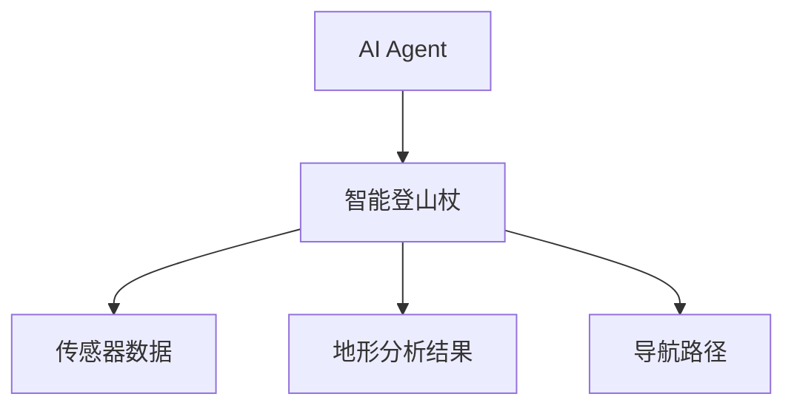
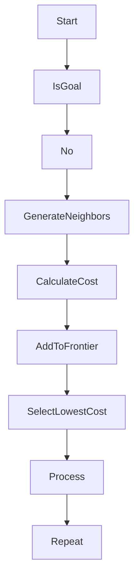
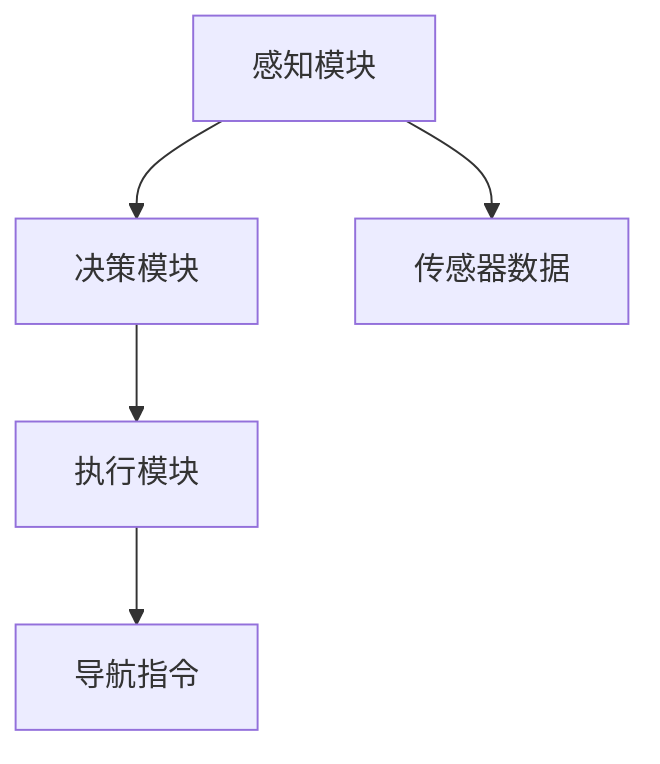
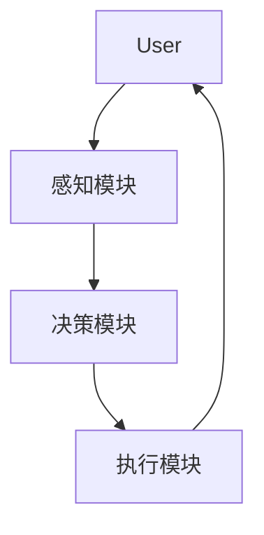

                 


# AI Agent在智能登山杖中的地形分析与导航

---

## 关键词：
AI Agent, 智能登山杖, 地形分析, 路径规划, 传感器融合, 深度学习, 强化学习

---

## 摘要：
本文深入探讨AI Agent在智能登山杖中的应用，重点分析其地形分析与导航技术。通过结合多传感器数据融合、深度学习和强化学习，AI Agent能够实时感知地形并规划最优路径。文章详细介绍了算法原理、系统架构设计及项目实战，为智能登山杖的开发提供理论与实践指导。

---

## 第1章：背景介绍

### 1.1 问题背景
在复杂地形中，传统导航设备依赖固定地图，无法实时处理动态障碍。登山杖需在崎岖地形中导航，这对实时感知和决策提出更高要求。

### 1.2 问题描述
智能登山杖需实时分析地形，规划避障路径，确保用户安全。核心挑战在于处理复杂地形数据，动态调整导航策略。

### 1.3 解决方法
引入AI Agent，结合多传感器数据和深度学习模型，实现地形分析与实时路径规划。

### 1.4 边界与外延
仅限于地形分析与路径规划，不涉及设备的物理控制。

### 1.5 概念结构
AI Agent与智能登山杖的关系通过ER图展示：



---

## 第2章：核心概念

### 2.1 AI Agent
| 属性 | 描述 |
|------|------|
| 感知 | 多传感器数据融合 |
| 决策 | 基于强化学习的策略 |
| 执行 | 动作规划 |

### 2.2 智能登山杖
| 功能 | 描述 |
|------|------|
| 地形分析 | 传感器数据处理 |
| 路径规划 | 实时路径生成 |
| 导航控制 | 执行避障动作 |

### 2.3 核心要素对比
通过表格展示AI Agent与智能登山杖的对比：

| 要素 | AI Agent | 智能登山杖 |
|------|----------|------------|
| 感知 | 多传感器 | GPS、IMU |
| 决策 | 强化学习 | 路径规划 |
| 执行 | 动作规划 | 执行机构 |

---

## 第3章：算法原理

### 3.1 地形分析
使用深度学习模型处理传感器数据，特征提取步骤如下：

1. 数据预处理：归一化和降维。
2. 模型训练：卷积神经网络提取地形特征。
3. 分类输出：预测地形类型。

公式：$$ P(y|x) = \frac{P(x|y)P(y)}{P(x)} $$

### 3.2 路径规划
采用A*算法，步骤如下：

1. 状态空间建模：节点表示位置，边表示移动。
2. 成本函数计算：$$ g(n) = \text{移动成本} $$
3. 启发式函数：$$ h(n) = \text{估计到目标成本} $$
4. 节点扩展：优先队列选择最低成本节点。

流程图：



---

## 第4章：系统架构设计

### 4.1 模块划分
系统模块包括：
- 感知模块：处理传感器数据。
- 决策模块：执行路径规划。
- 执行模块：控制运动。

### 4.2 架构图


### 4.3 接口设计
- 感知模块：接收传感器数据，输出地形特征。
- 决策模块：接收地形特征，输出路径规划结果。
- 执行模块：接收路径规划结果，输出执行反馈。

### 4.4 交互流程


---

## 第5章：项目实战

### 5.1 环境搭建
安装Python、TensorFlow、ROS，配置传感器。

### 5.2 代码实现
实现地形分析模块的Python代码：

```python
import numpy as np
from tensorflow import keras

class TerrainAnalyzer:
    def __init__(self):
        self.model = keras.models.load_model('terrain_model.h5')

    def analyze(self, data):
        prediction = self.model.predict(data)
        return np.argmax(prediction, axis=1)
```

### 5.3 案例分析
分析复杂地形，展示AI Agent如何实时调整路径。

---

## 第6章：最佳实践

### 6.1 使用建议
确保传感器校准，定期更新模型。

### 6.2 注意事项
避免复杂地形中的信号干扰。

### 6.3 性能优化
优化传感器融合算法，提升模型训练效率。

### 6.4 未来方向
探索更高效的学习算法，如Transformer。

---

## 小结：
本文详细探讨了AI Agent在智能登山杖中的应用，从理论到实践，展示了其在地形分析与导航中的潜力。通过系统架构设计和项目实战，为智能登山杖的开发提供了指导。

---

