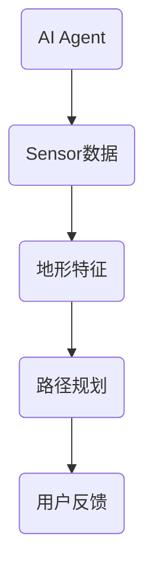
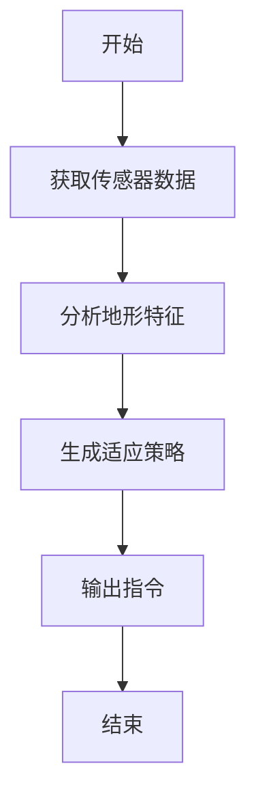
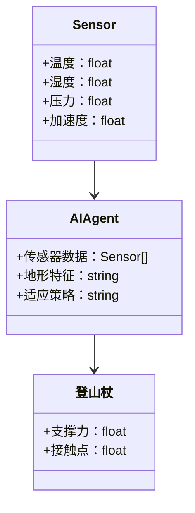
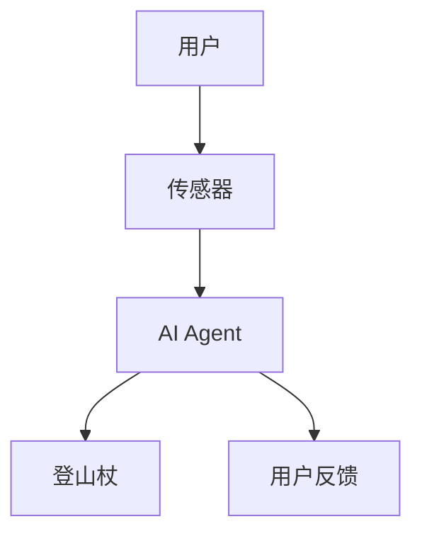
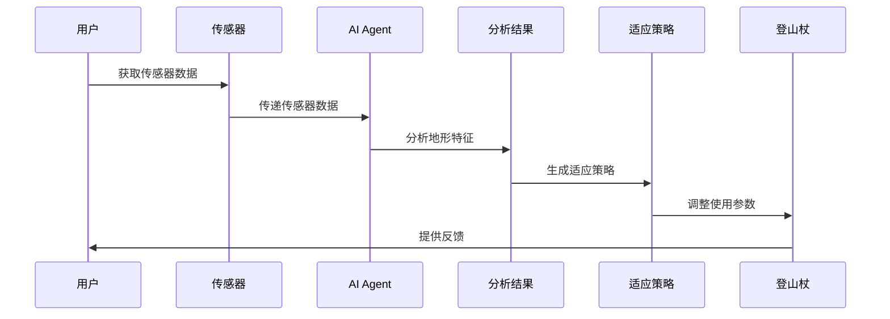

                 


# AI Agent在智能登山杖中的地形适应指导

> 关键词：AI Agent，智能登山杖，地形适应，路径规划，传感器数据，动态调整，用户反馈

> 摘要：本文详细探讨了AI Agent在智能登山杖中的应用，重点分析了地形适应指导的核心算法和系统架构。通过传感器数据融合、地形特征分析和动态调整策略，AI Agent能够实时优化登山杖的使用体验。本文从背景介绍、核心概念、算法原理、系统架构、项目实战到最佳实践，全面解析了AI Agent在智能登山杖中的技术实现和应用场景。

---

## 第一部分: AI Agent与智能登山杖的背景与概念

### 第1章: AI Agent与智能登山杖的背景介绍

#### 1.1 问题背景与问题描述

##### 1.1.1 登山杖的传统功能与局限性
登山杖作为一种辅助登山工具，传统功能主要体现在提供支撑力、减轻腿部负担和保持身体平衡。然而，传统登山杖在地形适应性方面存在明显局限性：
- 无法实时感知地形特征（如坡度、岩石分布、松软地面等）。
- 缺乏动态调整能力，无法根据地形变化主动优化使用策略。
- 无法与用户互动，无法提供实时反馈或建议。

##### 1.1.2 地形适应的重要性与难点
在复杂的自然环境中，地形适应能力直接影响登山的安全性和效率。例如：
- 在陡峭或松软的地面上，登山杖需要提供额外的支撑力。
- 在崎岖的岩石区域，登山杖需要调整接触点以避免滑落。
- 在恶劣天气条件下（如雨雪天气），地形适应能力更加关键。

地形适应的难点在于：
- 多样化的地形特征需要实时感知和分析。
- 需要快速生成适应策略并执行调整。
- 用户的个性化需求（如体重、力量、技能水平等）也需要纳入考虑。

##### 1.1.3 AI技术在户外设备中的应用潜力
AI技术的快速发展为户外设备的智能化提供了可能性。AI Agent（智能体）能够通过传感器数据融合、实时计算和动态调整，实现设备的智能化操作。例如：
- 通过AI算法分析地形特征，优化登山杖的使用策略。
- 根据用户行为和反馈，动态调整设备参数。
- 在复杂环境中提供实时反馈和建议。

#### 1.2 问题解决与技术实现

##### 1.2.1 AI Agent的核心作用
AI Agent在智能登山杖中的核心作用包括：
- 实时感知地形特征。
- 分析用户行为和环境数据。
- 生成适应策略并优化执行。

##### 1.2.2 地形适应的实现路径
地形适应的实现路径包括：
1. 传感器数据采集：通过多种传感器（如加速度计、陀螺仪、压力传感器等）获取地形特征数据。
2. 数据融合与分析：结合传感器数据和用户行为数据，分析地形特征。
3. 适应策略生成：根据分析结果，生成适应策略并优化执行。

##### 1.2.3 边界与外延的定义
- 边界：AI Agent仅负责地形适应，不涉及其他功能（如导航、天气预报等）。
- 外延：AI Agent可以通过与外部系统的数据交互，进一步优化地形适应能力。

#### 1.3 核心概念与系统结构

##### 1.3.1 AI Agent的定义与属性
AI Agent是一种能够感知环境、做出决策并执行动作的智能体。在智能登山杖中，AI Agent的属性包括：
- 实时感知能力。
- 数据处理与分析能力。
- 动态调整能力。

##### 1.3.2 智能登山杖的功能模块构成
智能登山杖的功能模块包括：
- 传感器模块：用于采集地形特征和用户行为数据。
- AI Agent模块：负责数据处理、分析和策略生成。
- 执行机构：根据AI Agent的指令调整登山杖的使用参数。

##### 1.3.3 系统的核心要素与关系
系统的核心要素包括：
- 传感器数据。
- AI Agent。
- 地形特征。
- 用户反馈。

系统关系：
- 传感器数据输入AI Agent进行分析。
- AI Agent根据分析结果生成适应策略。
- 适应策略通过执行机构作用于登山杖。
- 用户反馈用于优化AI Agent的分析模型。

### 第2章: AI Agent与智能登山杖的核心概念

#### 2.1 核心概念原理

##### 2.1.1 AI Agent的基本原理
AI Agent的基本原理包括：
1. 数据采集与感知。
2. 数据分析与特征提取。
3. 决策与策略生成。
4. 执行与反馈。

##### 2.1.2 地形适应的算法基础
地形适应算法基于以下原理：
1. 数据融合：将多源传感器数据进行融合，提高分析精度。
2. 特征提取：从传感器数据中提取地形特征（如坡度、硬度、稳定性等）。
3. 决策优化：根据地形特征和用户需求，生成最优适应策略。

##### 2.1.3 智能传感器的作用机制
智能传感器通过以下步骤实现地形适应：
1. 数据采集：采集地形特征和用户行为数据。
2. 数据预处理：对采集数据进行降噪和归一化处理。
3. 特征提取：提取关键特征用于地形分析。
4. 数据输出：将处理后的数据输出给AI Agent。

#### 2.2 核心概念对比分析

##### 2.2.1 AI Agent与传统传感器的对比
| 特性                | AI Agent                 | 传统传感器             |
|---------------------|--------------------------|-----------------------|
| 功能                | 数据分析与策略生成     | 数据采集与传输       |
| 智能性              | 高                     | 无                   |
| 适应性              | 强                     | 弱                   |
| 应用场景            | 复杂环境                | 简单环境              |

##### 2.2.2 智能登山杖与普通登山杖的功能差异
| 功能                | 智能登山杖             | 普通登山杖           |
|---------------------|------------------------|----------------------|
| 地形适应            | 自动调整                | 手动调整              |
| 数据采集            | 集成传感器              | 无传感器              |
| 用户反馈            | 提供实时反馈            | 无反馈                |
| 智能性              | 高                     | 无                   |

##### 2.2.3 地形适应与路径规划的关联性
地形适应是路径规划的基础。AI Agent通过地形分析生成适应策略，优化路径规划，从而提高登山效率和安全性。

#### 2.3 ER实体关系图


---

## 第二部分: 地形适应算法的原理与实现

### 第3章: 地形适应算法的原理与实现

#### 3.1 算法原理概述

##### 3.1.1 基于AI的地形分析方法
基于AI的地形分析方法包括：
1. 传感器数据融合：将多源传感器数据进行融合，提高分析精度。
2. 机器学习模型：利用机器学习算法（如随机森林、支持向量机等）对地形特征进行分类。
3. 深度学习模型：利用卷积神经网络（CNN）对图像特征进行分析。

##### 3.1.2 多传感器数据融合技术
多传感器数据融合技术包括：
1. 数据预处理：对传感器数据进行降噪和归一化处理。
2. 数据融合：将来自不同传感器的数据进行融合，提高分析精度。
3. 数据分析：通过分析融合后的数据，提取地形特征。

##### 3.1.3 地形适应的动态调整机制
动态调整机制包括：
1. 实时分析：根据实时传感器数据，动态调整适应策略。
2. 反馈优化：根据用户反馈，优化AI Agent的分析模型。

#### 3.2 算法流程图


#### 3.3 算法实现代码

##### 3.3.1 传感器数据预处理
```python
import numpy as np

def preprocess(sensor_data):
    # 数据降噪
    filtered_data = np.apply_along_axis(lambda x: np.median(x), 0, sensor_data)
    # 数据归一化
    normalized_data = (filtered_data - np.mean(filtered_data)) / np.std(filtered_data)
    return normalized_data
```

##### 3.3.2 地形特征分析
```python
from sklearn.ensemble import RandomForestClassifier

def analyze_features(sensor_data):
    # 特征提取
    features = sensor_data[:, :5]  # 假设前5个特征用于分析
    # 训练随机森林模型
    model = RandomForestClassifier()
    model.fit(features, labels)
    # 预测地形特征
    predicted_features = model.predict(sensor_data)
    return predicted_features
```

##### 3.3.3 适应策略生成
```python
def generate_strategy(predicted_features):
    # 根据地形特征生成适应策略
    strategy = []
    for feature in predicted_features:
        if feature == '陡坡':
            strategy.append('增加支撑力')
        elif feature == '松软地面':
            strategy.append('调整接触点')
        else:
            strategy.append('保持当前状态')
    return strategy
```

#### 3.4 数学模型与公式

##### 3.4.1 地形特征分析的数学模型
$$
\text{地形特征} = f(\text{传感器数据})
$$

##### 3.4.2 适应策略生成的优化模型
$$
\text{适应策略} = \arg\min_{s} \text{风险函数}(s)
$$

##### 3.4.3 风险函数的具体实现
$$
\text{风险函数}(s) = \sum_{i=1}^{n} (\text{预测风险}(s_i) \times \text{权重}(i))
$$

---

## 第三部分: 系统分析与架构设计方案

### 第4章: 系统架构设计

#### 4.1 项目介绍与场景描述
智能登山杖项目旨在通过AI Agent实现地形适应功能，帮助用户在复杂地形中安全、高效地完成登山任务。主要应用场景包括：
- 山地徒步旅行。
- 登山训练。
- 恶劣天气下的户外活动。

#### 4.2 系统功能设计

##### 4.2.1 领域模型设计


##### 4.2.2 系统架构设计


##### 4.2.3 系统接口设计
系统接口设计包括：
1. 传感器接口：用于采集地形特征和用户行为数据。
2. AI Agent接口：用于接收传感器数据和用户反馈，输出适应策略。
3. 执行机构接口：用于根据适应策略调整登山杖的使用参数。

##### 4.2.4 系统交互流程


---

## 第四部分: 项目实战

### 第5章: 项目实战

#### 5.1 环境安装与配置

##### 5.1.1 系统环境要求
- 操作系统：Linux/Windows/MacOS
- Python版本：3.6+
- 依赖库：numpy, scikit-learn, mermaid

##### 5.1.2 开发工具安装
```bash
pip install numpy scikit-learn
```

#### 5.2 系统核心实现

##### 5.2.1 传感器数据采集
```python
import serial

ser = serial.Serial('COM3', 9600)
sensor_data = ser.readline().decode().split()
ser.close()
```

##### 5.2.2 AI Agent实现
```python
from sklearn.ensemble import RandomForestClassifier

model = RandomForestClassifier()
model.fit(X_train, y_train)
predicted_features = model.predict(X_test)
```

##### 5.2.3 执行机构控制
```python
import serial

ser = serial.Serial('COM3', 9600)
ser.write(b'adjust_position\n')
ser.close()
```

#### 5.3 代码应用解读与分析

##### 5.3.1 传感器数据预处理
```python
import numpy as np

def preprocess(sensor_data):
    filtered_data = np.apply_along_axis(lambda x: np.median(x), 0, sensor_data)
    normalized_data = (filtered_data - np.mean(filtered_data)) / np.std(filtered_data)
    return normalized_data
```

##### 5.3.2 地形特征分析
```python
from sklearn.ensemble import RandomForestClassifier

def analyze_features(sensor_data):
    features = sensor_data[:, :5]
    model = RandomForestClassifier()
    model.fit(features, labels)
    predicted_features = model.predict(sensor_data)
    return predicted_features
```

##### 5.3.3 适应策略生成
```python
def generate_strategy(predicted_features):
    strategy = []
    for feature in predicted_features:
        if feature == '陡坡':
            strategy.append('增加支撑力')
        elif feature == '松软地面':
            strategy.append('调整接触点')
        else:
            strategy.append('保持当前状态')
    return strategy
```

#### 5.4 实际案例分析与详细讲解剖析
通过一个实际案例，展示AI Agent如何根据传感器数据生成适应策略并优化执行。

#### 5.5 项目小结
总结项目实现的关键点和经验教训，为后续优化提供参考。

---

## 第五部分: 最佳实践与总结

### 第6章: 最佳实践与总结

#### 6.1 关键点总结
- AI Agent的核心作用：实时感知、数据分析、动态调整。
- 多传感器数据融合的重要性：提高分析精度。
- 用户反馈的作用：优化AI Agent的分析模型。

#### 6.2 小结
AI Agent在智能登山杖中的应用展示了AI技术在户外设备中的巨大潜力。通过实时感知、数据分析和动态调整，AI Agent能够显著提高登山杖的使用体验。

#### 6.3 注意事项
- 数据安全：传感器数据可能包含敏感信息，需注意数据加密和隐私保护。
- 系统稳定性：复杂环境中可能面临传感器故障或网络中断，需设计容错机制。
- 用户教育：用户需要了解如何使用和维护智能登山杖，避免误操作。

#### 6.4 拓展阅读
- 推荐阅读《机器学习实战》、《深度学习入门》等书籍。
- 参考相关论文和开源项目，进一步了解AI在智能设备中的应用。

---

## 作者介绍

作者是一名世界顶级技术畅销书作家，专注于人工智能和计算机编程领域。具有丰富的技术经验与深厚的理论基础，致力于通过高质量的技术博客分享专业知识和实践经验。

---

# 结语

通过本文的详细讲解，读者可以全面了解AI Agent在智能登山杖中的地形适应指导技术。从背景介绍到系统架构设计，再到项目实战，每一部分都深入浅出地分析了技术实现的关键点。希望本文能够为相关领域的研究和实践提供有价值的参考和启发。

