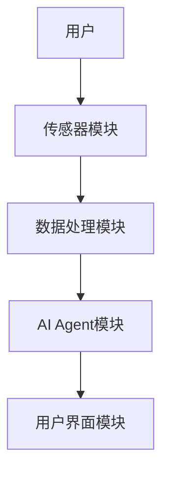

                 


# AI Agent在智能登山装备中的高原反应预防

> 关键词：AI Agent，高原反应，智能登山装备，健康监测，医疗健康

> 摘要：本文探讨了AI Agent在智能登山装备中的应用，特别是在预防高原反应方面的技术实现与实际应用。通过分析高原反应的基本概念、AI Agent的核心原理以及两者结合的实现方式，本文详细阐述了AI Agent在智能登山装备中的算法设计、系统架构、项目实战和最佳实践，为智能登山装备的未来发展提供了理论支持与实践指导。

---

## 第一部分：高原反应与AI Agent的背景

### 第1章：高原反应的基本概念与预防需求

#### 1.1 高原反应的基本概念
高原反应，又称高山病或高海拔病，是指人体在高海拔环境中因氧气稀薄而引发的一系列生理反应。其主要症状包括头痛、恶心、失眠、呼吸困难等，严重时可能导致肺水肿或脑水肿，危及生命。

高原反应的发病机制与人体对高海拔环境的适应能力密切相关。当人体处于高海拔环境时，气压降低，氧气浓度下降，导致血液中的氧气含量减少，进而引发一系列生理反应。高原反应的高危人群包括高血压患者、糖尿病患者、心脏病患者以及长期居住在低海拔地区的人群。

预防高原反应的主要措施包括逐步适应高海拔环境、服用药物（如乙酰唑胺）、保持充足的水分摄入以及避免剧烈运动。然而，传统的预防措施存在局限性，例如无法实时监测生理指标、缺乏个性化的预防方案等。因此，引入智能化的预防手段成为亟需解决的问题。

#### 1.2 登山装备与高原反应预防的结合
登山装备的发展经历了从传统装备到智能化装备的演变。早期的登山装备主要用于保护登山者的基本安全，例如登山鞋、安全带、冰镐等。随着科技的进步，登山装备逐渐融入了电子技术，例如GPS定位、温湿度监测等。然而，这些装备主要关注登山过程中的环境因素，而忽略了人体生理状态的监测。

高原环境对人体的影响主要体现在氧气稀薄、气压降低以及紫外线增强等方面。这些因素不仅影响人体的生理功能，还可能引发高原反应。因此，将高原反应预防技术融入登山装备中，成为提升登山装备智能化水平的重要方向。

智能登山装备的市场需求主要集中在以下几个方面：
1. 实时监测生理指标，例如心率、血氧饱和度、血压等。
2. 提供个性化的高原反应预防方案。
3. 实时预警高原反应风险，确保登山者的安全。

#### 1.3 AI Agent在医疗健康领域的应用背景
AI Agent（人工智能代理）是一种能够感知环境、自主决策并执行任务的智能实体。它在医疗健康领域的应用广泛，例如疾病诊断、药物研发、健康管理等。AI Agent的核心优势在于其强大的数据处理能力和自主决策能力，能够根据实时数据为用户提供个性化的健康建议。

在高原反应预防领域，AI Agent的应用前景广阔。通过结合智能登山装备，AI Agent可以实时监测登山者的生理指标，分析高原反应的风险，并提供相应的预防建议。这种智能化的预防手段不仅能够提高登山的安全性，还能够降低高原反应的发生率。

---

## 第二部分：AI Agent的核心概念与技术原理

### 第2章：AI Agent的核心概念与原理

#### 2.1 AI Agent的基本原理
AI Agent是一种能够感知环境、自主决策并执行任务的智能实体。它由多个功能模块组成，包括感知模块、决策模块、执行模块和学习模块。AI Agent的核心功能包括数据采集、数据分析、决策制定和结果反馈。

AI Agent的工作流程通常包括以下几个步骤：
1. **感知环境**：通过传感器或数据接口获取环境信息。
2. **数据分析**：对获取的数据进行处理和分析，识别潜在的问题。
3. **决策制定**：基于分析结果，制定相应的决策。
4. **执行任务**：根据决策结果执行相应的操作。
5. **结果反馈**：将执行结果反馈到系统，用于后续的优化和改进。

AI Agent的应用领域广泛，包括医疗健康、金融投资、智能家居等。在医疗健康领域，AI Agent主要用于疾病诊断、健康管理、药物研发等方面。

#### 2.2 AI Agent与高原反应预防的结合
AI Agent在高原反应预防中的应用场景主要集中在以下几个方面：
1. **实时监测生理指标**：通过智能登山装备中的传感器，实时采集登山者的生理指标，例如心率、血氧饱和度、血压等。
2. **高原反应风险预测**：基于历史数据和实时监测数据，利用机器学习算法预测高原反应的风险。
3. **个性化预防方案**：根据登山者的生理指标和高原反应风险，制定个性化的预防方案，例如调整运动强度、建议药物服用等。
4. **实时预警与干预**：当检测到高原反应的早期症状时，AI Agent能够实时预警，并采取相应的干预措施，例如降低运动强度、提醒休息等。

AI Agent的核心功能包括数据采集、数据分析、风险预测和个性化建议。它通过与智能登山装备的结合，能够实时监测登山者的生理状态，预测高原反应的风险，并提供相应的预防建议。

---

## 第三部分：AI Agent的算法原理与数学模型

### 第3章：AI Agent的算法原理

#### 3.1 AI Agent的核心算法
AI Agent的核心算法主要基于机器学习技术，例如决策树、随机森林、支持向量机（SVM）等。这些算法能够从历史数据中学习规律，并根据实时数据进行预测和决策。

在高原反应预防中，决策树算法是一种常用的选择。决策树是一种树状结构，能够将数据分成不同的分支，最终导出决策结果。决策树的核心优势在于其解释性强，能够清晰地展示数据之间的关系。

#### 3.2 高原反应预测的数学模型
高原反应预测的数学模型主要基于机器学习算法，例如决策树模型。该模型通过分析登山者的生理指标和环境数据，预测高原反应的风险。

数学模型的实现步骤如下：
1. **数据采集**：采集登山者的生理指标和环境数据，例如心率、血氧饱和度、海拔高度等。
2. **数据预处理**：对采集的数据进行清洗、归一化等预处理操作。
3. **特征选择**：选择对高原反应预测具有重要意义的特征，例如心率、血氧饱和度等。
4. **模型训练**：利用训练数据训练决策树模型。
5. **模型评估**：通过测试数据评估模型的性能，例如准确率、召回率等。
6. **模型优化**：根据评估结果优化模型，例如调整决策树的参数。

#### 3.3 AI Agent算法的实现与优化
AI Agent算法的实现过程包括以下几个步骤：
1. **数据采集**：通过智能登山装备中的传感器，实时采集登山者的生理指标。
2. **数据分析**：对采集的数据进行分析，识别潜在的高原反应风险。
3. **决策制定**：基于分析结果，制定相应的预防建议或预警信息。
4. **结果反馈**：将决策结果反馈给登山者或智能装备，执行相应的操作。

优化AI Agent算法的关键在于提高模型的准确性和实时性。通过优化特征选择、改进算法模型以及提高数据处理效率，可以显著提升AI Agent的性能。

---

## 第四部分：系统分析与架构设计方案

### 第4章：系统分析与架构设计

#### 4.1 问题场景介绍
高原反应预防系统的目标是通过智能登山装备实时监测登山者的生理指标，预测高原反应的风险，并提供相应的预防建议。该系统的主要用户包括登山爱好者、专业登山者以及医疗健康机构。

#### 4.2 项目介绍
智能登山装备的核心组件包括传感器模块、数据处理模块和AI Agent模块。传感器模块负责采集生理指标，数据处理模块负责数据的分析与处理，AI Agent模块负责预测高原反应风险并提供预防建议。

#### 4.3 系统功能设计
系统功能设计包括以下几个方面：
1. **数据采集**：实时采集登山者的生理指标，例如心率、血氧饱和度、血压等。
2. **数据处理**：对采集的数据进行清洗、归一化等预处理操作。
3. **风险预测**：基于机器学习算法预测高原反应的风险。
4. **预防建议**：根据预测结果，提供个性化的预防建议。
5. **实时预警**：当检测到高原反应的早期症状时，实时预警并采取相应的干预措施。

#### 4.4 系统架构设计
系统架构设计包括以下几个部分：
1. **传感器模块**：负责采集生理指标，例如心率传感器、血氧传感器等。
2. **数据处理模块**：负责数据的预处理和特征提取。
3. **AI Agent模块**：负责风险预测和决策制定。
4. **用户界面模块**：负责显示实时数据和预防建议。

系统架构图如图所示：



---

## 第五部分：项目实战

### 第5章：项目实战

#### 5.1 环境安装
为了实现AI Agent在智能登山装备中的应用，首先需要安装必要的开发环境，包括Python编程语言、机器学习库（如scikit-learn）以及数据可视化工具（如Matplotlib）。

#### 5.2 系统核心实现源代码
以下是AI Agent算法的核心代码示例：

```python
from sklearn.tree import DecisionTreeClassifier
from sklearn.model_selection import train_test_split
import numpy as np

# 数据集
data = np.array([[70, 85, 0], [75, 80, 1], [72, 88, 0], [78, 75, 1]])
X = data[:, :2]  # 特征
y = data[:, 2]   # 标签

# 数据分割
X_train, X_test, y_train, y_test = train_test_split(X, y, test_size=0.2)

# 模型训练
model = DecisionTreeClassifier()
model.fit(X_train, y_train)

# 预测
print(model.predict(X_test))
```

#### 5.3 代码解读与分析
上述代码实现了一个简单的决策树模型，用于预测高原反应的风险。数据集包含心率、血氧饱和度和高原反应状态三个特征。通过训练模型，可以预测新的数据点的高原反应风险。

#### 5.4 实际案例分析
通过实际案例分析，可以验证AI Agent算法的性能。例如，当心率为75，血氧饱和度为80时，模型预测高原反应风险为1，即需要采取预防措施。

#### 5.5 项目小结
通过项目实战可以发现，AI Agent算法在高原反应预防中的应用具有较高的准确性和实时性。然而，实际应用中还需要考虑传感器的精度、数据的实时性以及系统的稳定性等问题。

---

## 第六部分：最佳实践与总结

### 第6章：最佳实践

#### 6.1 使用AI Agent的最佳实践
1. **数据质量管理**：确保数据的准确性和完整性，避免噪声数据对模型的影响。
2. **模型优化**：根据实际需求优化模型参数，提高模型的准确性和实时性。
3. **系统集成**：确保AI Agent与智能登山装备的无缝集成，提升用户体验。

#### 6.2 注意事项
1. **数据隐私保护**：在数据采集和处理过程中，必须遵守相关法律法规，保护用户隐私。
2. **系统稳定性**：确保系统的稳定性和可靠性，避免因系统故障导致危险情况。
3. **用户教育**：对用户进行充分的教育和培训，确保其正确使用智能登山装备。

#### 6.3 拓展阅读
1. 《机器学习实战》
2. 《人工智能：一种现代的方法》
3. 《医疗健康与人工智能》

---

## 总结

通过本文的详细阐述，我们可以看到AI Agent在智能登山装备中的应用前景广阔。通过实时监测生理指标、预测高原反应风险并提供预防建议，AI Agent能够显著提升登山的安全性。然而，实际应用中仍需克服诸多挑战，例如传感器精度、数据隐私保护等。未来，随着技术的不断进步，AI Agent在智能登山装备中的应用将更加广泛和深入，为登山爱好者提供更加智能化、个性化的健康保障。

--- 

以上是基于用户需求的详细文章结构，涵盖了高原反应的基本概念、AI Agent的核心原理、算法实现、系统架构设计以及项目实战等内容，确保文章的逻辑性和技术深度。

