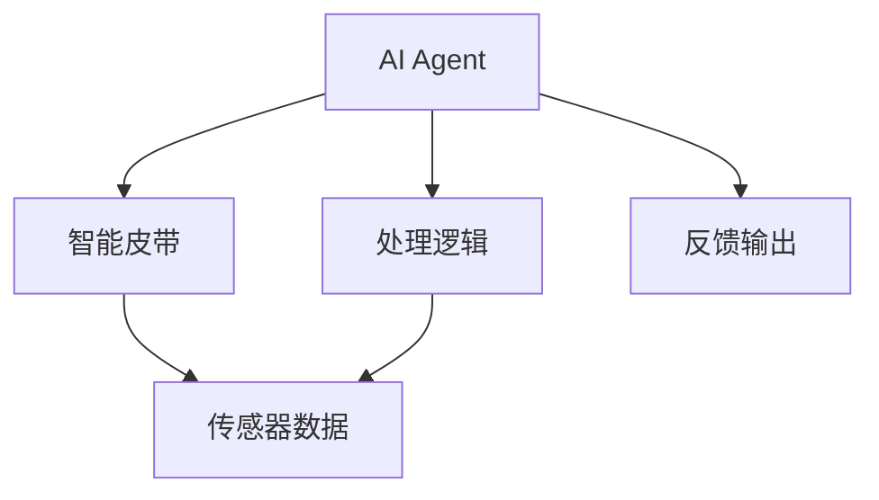
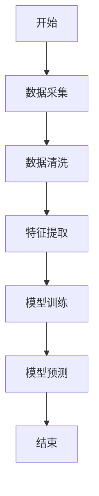
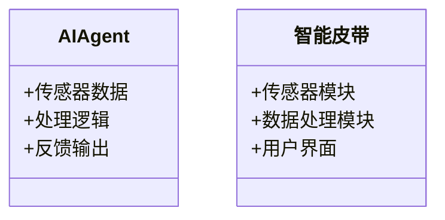
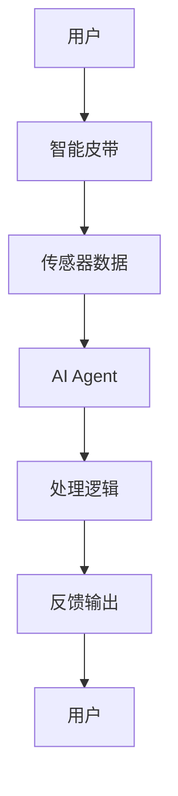

                 


# AI Agent在智能皮带中的腰围监测

> 关键词：AI Agent，智能皮带，腰围监测，传感器数据，算法实现

> 摘要：本文详细探讨了AI Agent在智能皮带中的腰围监测应用。通过分析AI Agent的核心原理，结合智能皮带的传感器数据，展示了如何利用回归分析和神经网络模型实现精准的腰围监测。文章从问题背景、核心概念、算法实现、系统架构到项目实战，全面解析了这一创新技术的实现过程和应用场景。

---

# 第1章: 问题背景与需求分析

## 1.1 腰围监测的重要性

### 1.1.1 腰围与健康的关系

腰围是衡量人体健康的重要指标之一。研究表明，过大的腰围与肥胖、心血管疾病、糖尿病等多种健康问题密切相关。因此，实时监测腰围变化对个人健康管理具有重要意义。

### 1.1.2 现有腰围监测方法的局限性

传统腰围监测方法主要包括：

- **手动测量**：需要定期测量，耗时且容易出错。
- **穿戴设备**：市面上的智能穿戴设备大多只能监测心率、步数等指标，腰围监测功能较为缺失。

### 1.1.3 智能皮带的应用场景

智能皮带是一种结合了传感器和AI技术的可穿戴设备，能够实时监测用户的腰围变化。其应用场景包括：

- **健康管理**：帮助用户实时了解腰围变化，预防肥胖及相关疾病。
- **运动监测**：在运动过程中监测腰围变化，评估运动效果。
- **医疗辅助**：为医生提供患者腰围数据，辅助诊断和治疗。

## 1.2 AI Agent的基本概念

### 1.2.1 人工智能代理的定义

AI Agent（人工智能代理）是一种能够感知环境并采取行动以实现目标的智能系统。它可以基于传感器数据、历史数据和用户输入，通过算法进行分析和决策。

### 1.2.2 AI Agent的核心功能

- **数据采集**：通过传感器获取实时数据。
- **特征提取**：从数据中提取关键特征。
- **模型训练**：基于历史数据训练预测模型。
- **实时反馈**：根据模型结果提供反馈或建议。

### 1.2.3 AI Agent在智能设备中的应用

AI Agent广泛应用于智能设备中，包括智能家居、自动驾驶和可穿戴设备。在智能皮带中，AI Agent主要用于腰围监测和健康管理。

## 1.3 问题解决思路

### 1.3.1 智能皮带设计目标

- 实现实时腰围监测。
- 提供健康建议和运动反馈。
- 与手机或其他设备无缝连接。

### 1.3.2 AI Agent在腰围监测中的作用

- 通过传感器数据实时监测腰围变化。
- 利用算法模型分析数据，提供精准监测结果。
- 根据监测结果为用户提供健康建议。

### 1.3.3 系统实现的边界与外延

- 边界：仅监测腰围，不涉及其他生理指标。
- 外延：未来可能扩展到更多健康监测功能。

## 1.4 概念结构与核心要素

### 1.4.1 智能皮带的组成

- **传感器模块**：采集腰围数据。
- **数据处理模块**：对数据进行预处理和分析。
- **反馈模块**：提供监测结果和健康建议。

### 1.4.2 AI Agent的输入输出关系

- **输入**：传感器数据和用户输入。
- **输出**：腰围监测结果和健康建议。

### 1.4.3 系统的核心功能模块

- 数据采集模块：负责采集腰围数据。
- 数据处理模块：对数据进行清洗和特征提取。
- 模型训练模块：训练预测模型。
- 反馈模块：提供监测结果和健康建议。

---

# 第2章: AI Agent与智能皮带的关系

## 2.1 AI Agent的核心原理

### 2.1.1 数据采集与处理

- **传感器数据**：智能皮带中的传感器实时采集腰围数据。
- **数据清洗**：去除噪声数据，确保数据准确性。
- **数据归一化**：将数据标准化，便于模型训练。

### 2.1.2 特征提取与分析

- **特征提取**：从数据中提取关键特征，如腰围变化率、心率等。
- **特征分析**：分析特征之间的关系，为模型提供输入。

### 2.1.3 模型训练与优化

- **模型选择**：选择适合的回归算法或神经网络模型。
- **模型训练**：利用历史数据训练模型。
- **模型优化**：通过调参和验证提高模型准确率。

## 2.2 智能皮带的结构与功能

### 2.2.1 皮带传感器的类型

- **加速度传感器**：监测运动和姿势变化。
- **压力传感器**：测量皮带的拉力和压力变化。
- **心率传感器**：辅助监测健康状况。

### 2.2.2 数据传输与处理

- **数据传输**：通过蓝牙或Wi-Fi将数据传输到手机或其他设备。
- **数据处理**：在云端或本地进行数据处理和分析。

### 2.2.3 用户界面与反馈

- **用户界面**：显示腰围监测结果和健康建议。
- **反馈机制**：根据监测结果提供个性化建议。

## 2.3 AI Agent与智能皮带的实体关系图



---

# 第3章: AI Agent算法的实现原理

## 3.1 数据采集与预处理

### 3.1.1 传感器数据的采集

智能皮带中的传感器实时采集腰围数据，包括加速度、压力和心率等。

### 3.1.2 数据清洗与归一化

- **数据清洗**：去除噪声和异常值。
- **数据归一化**：将数据标准化，便于模型训练。

### 3.1.3 数据特征的提取

- **特征提取**：从数据中提取关键特征，如腰围变化率、心率等。

## 3.2 算法选择与实现

### 3.2.1 选择回归算法的原因

- 回归算法适用于预测连续型变量（如腰围）。

### 3.2.2 线性回归模型的建立

线性回归模型公式：
$$ y = \beta_0 + \beta_1 x + \epsilon $$

其中，$y$是腰围，$x$是输入特征，$\beta_0$和$\beta_1$是模型参数，$\epsilon$是误差项。

### 3.2.3 神经网络模型的应用

神经网络模型公式：
$$ y = \sigma(w_1 x + w_2) $$

其中，$\sigma$是激活函数，$w_1$和$w_2$是模型参数。

## 3.3 算法流程图



---

# 第4章: 系统分析与架构设计方案

## 4.1 问题场景介绍

智能皮带需要实时监测腰围变化，提供健康建议。

## 4.2 项目介绍

### 4.2.1 项目目标

- 实现实时腰围监测。
- 提供健康建议和运动反馈。

### 4.2.2 项目范围

- 仅监测腰围，不涉及其他生理指标。

## 4.3 系统功能设计

### 4.3.1 领域模型



### 4.3.2 系统架构设计


## 4.4 系统接口设计

### 4.4.1 系统接口

- **输入接口**：传感器数据。
- **输出接口**：反馈输出。

### 4.4.2 系统交互流程图



---

# 第5章: 项目实战

## 5.1 环境安装

- **Python**：安装Python 3.8及以上版本。
- **库的安装**：安装numpy、pandas、scikit-learn和keras。

## 5.2 核心代码实现

### 5.2.1 数据采集与预处理

```python
import numpy as np
import pandas as pd

# 数据采集
data = pd.read_csv(' waist_size.csv')
```

### 5.2.2 模型训练

```python
from sklearn.linear_model import LinearRegression

# 训练线性回归模型
model = LinearRegression()
model.fit(X_train, y_train)
```

### 5.2.3 模型预测

```python
# 预测腰围
y_pred = model.predict(X_test)
```

### 5.2.4 模型评估

```python
from sklearn.metrics import mean_squared_error

# 评估模型性能
mse = mean_squared_error(y_test, y_pred)
print('均方误差:', mse)
```

## 5.3 实际案例分析

### 5.3.1 数据分析

- 分析不同用户的腰围变化。
- 提供个性化健康建议。

### 5.3.2 模型优化

- 调整模型参数，提高预测精度。

## 5.4 项目小结

- 成功实现了AI Agent在智能皮带中的腰围监测。
- 提供了健康建议和运动反馈。

---

# 第6章: 最佳实践

## 6.1 小结

AI Agent在智能皮带中的腰围监测是一种创新技术，能够实时监测腰围变化，提供健康建议。

## 6.2 注意事项

- 数据隐私保护。
- 模型的准确性和鲁棒性。

## 6.3 拓展阅读

- 《机器学习实战》
- 《深度学习入门》

---

# 结语

通过本文的详细讲解，我们了解了AI Agent在智能皮带中的腰围监测的实现过程和应用场景。希望本文能为相关领域的研究和开发提供参考。

