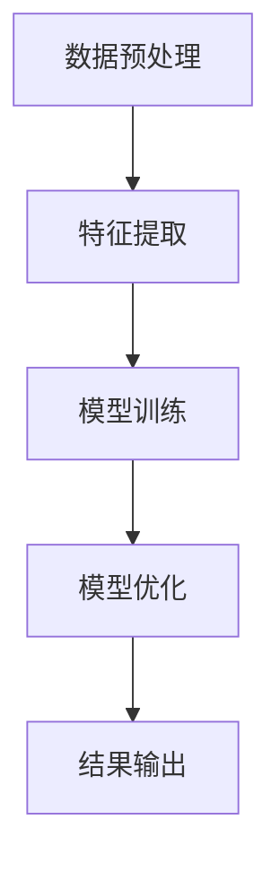
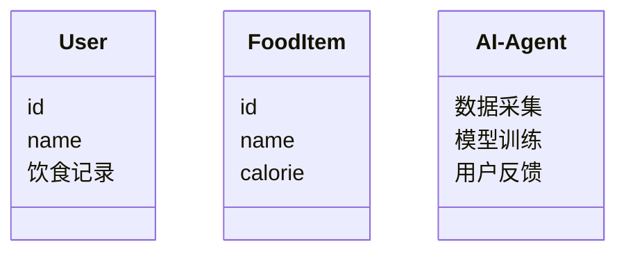

                 


# AI Agent在智能皮带中的饮食习惯监测

> 关键词：AI Agent，智能皮带，饮食习惯监测，数据采集，机器学习，算法优化

> 摘要：本文探讨了AI Agent在智能皮带中的应用，特别是在饮食习惯监测方面。通过分析数据采集、模型训练、系统架构等关键环节，展示了AI技术如何帮助用户改善饮食习惯。文章详细介绍了算法原理、系统设计和实际案例，为智能健康监测领域提供了新的视角。

---

# 第1章: 背景介绍与问题定义

## 1.1 问题背景与需求分析

### 1.1.1 饮食习惯监测的重要性
现代人生活节奏加快，饮食不规律导致健康问题日益突出。通过监测饮食习惯，可以及时发现并改善不良习惯，预防慢性疾病的发生。

### 1.1.2 智能皮带的创新意义
智能皮带作为一种可穿戴设备，具备实时监测和反馈的功能。它通过传感器收集数据，结合AI技术，为用户提供个性化的健康建议。

### 1.1.3 AI Agent在饮食监测中的作用
AI Agent能够实时分析饮食数据，识别用户的饮食模式，并提供针对性的建议。它不仅提高了监测的准确性，还能通过反馈机制帮助用户养成良好的饮食习惯。

## 1.2 问题描述与目标设定

### 1.2.1 饮食习惯监测的核心问题
饮食习惯监测涉及多个方面，包括食物种类识别、摄入量计算、饮食时间分析等。如何准确识别食物种类是关键挑战。

### 1.2.2 智能皮带的功能目标
智能皮带需要具备数据采集、实时分析、反馈提醒等功能。目标是通过AI技术，帮助用户实现饮食习惯的智能化监测。

### 1.2.3 AI Agent的实现目标
AI Agent需要能够处理多源数据，实时分析，并提供个性化反馈。同时，要具备自适应能力，根据用户的反馈不断优化监测策略。

## 1.3 问题解决与边界定义

### 1.3.1 AI Agent的解决方案
通过传感器数据采集、模型训练和实时反馈，AI Agent能够实现对饮食习惯的精准监测。

### 1.3.2 系统边界与功能范围
系统边界包括数据采集、数据处理、模型训练和用户反馈。功能范围涵盖食物识别、摄入量计算和健康建议。

### 1.3.3 相关概念与核心要素
涉及的数据包括传感器数据、用户输入数据和模型参数。核心要素包括数据采集、模型训练和用户反馈机制。

## 1.4 本章小结
本章介绍了饮食习惯监测的重要性，分析了智能皮带的功能目标，并明确了AI Agent在其中的作用。为后续章节奠定了基础。

---

# 第2章: AI Agent与饮食习惯监测的核心概念

## 2.1 AI Agent的基本原理

### 2.1.1 AI Agent的定义与分类
AI Agent是一种智能代理系统，能够感知环境并执行任务。根据智能水平，可分为简单反射型、基于模型反应型等。

### 2.1.2 AI Agent的核心特征
AI Agent具备自主性、反应性、目标导向和学习能力。这些特征使其能够适应环境并执行复杂任务。

### 2.1.3 AI Agent在智能皮带中的应用
AI Agent通过传感器数据，实时分析用户的饮食行为，提供个性化建议。

## 2.2 饮食习惯监测的关键技术

### 2.2.1 数据采集与处理
传感器数据包括心率、运动状态等，需要进行预处理和特征提取。

### 2.2.2 模型训练与优化
使用机器学习算法训练模型，优化参数以提高识别准确率。

### 2.2.3 结果分析与反馈
通过分析模型输出，生成健康建议并反馈给用户。

## 2.3 AI Agent与饮食习惯监测的关系

### 2.3.1 AI Agent在饮食监测中的角色
AI Agent作为核心，负责数据处理、模型训练和结果反馈。

### 2.3.2 饮食习惯监测的流程与步骤
包括数据采集、特征提取、模型训练、结果分析和反馈。

### 2.3.3 系统整体架构与功能模块
系统架构包括数据采集模块、AI Agent模块和用户反馈模块。

## 2.4 核心概念对比分析

### 2.4.1 传统饮食监测方法与AI Agent的对比
传统方法依赖人工记录，效率低且准确性差。AI Agent实现了自动化和智能化监测。

### 2.4.2 AI Agent的优势与局限性
优势包括高效性、准确性；局限性包括数据依赖性和模型优化难度。

### 2.4.3 核心概念的属性特征对比表格
| 概念     | 特征           |
|----------|----------------|
| AI Agent | 自主性、反应性  |
| 数据采集 | 实时性、准确性  |

## 2.5 ER实体关系图

```mermaid
erDiagram
    user {
        id
        name
       饮食记录
    }
    food_item {
        id
        name
        calorie
    }
    user_has_food_item {
        user_id
        food_item_id
        time
    }
```

## 2.6 本章小结
本章详细讲解了AI Agent的基本原理和饮食习惯监测的关键技术，分析了两者的关系，并通过对比和实体关系图明确了系统的架构。

---

# 第3章: AI Agent的算法原理与实现

## 3.1 算法原理概述

### 3.1.1 算法选择与原理
选择随机森林算法进行分类，基于特征的重要性进行排序。

### 3.1.2 算法的核心思想
随机森林通过构建多个决策树，投票法得到最终结果，减少过拟合风险。

### 3.1.3 算法的实现步骤
1. 数据预处理：清洗、特征提取。
2. 模型训练：使用随机森林进行训练。
3. 模型优化：调整参数，提升准确率。

## 3.2 算法实现流程



## 3.3 数据预处理与特征提取

### 3.3.1 数据清洗
去除无效数据，处理缺失值。

### 3.3.2 特征选择
使用特征重要性分析，筛选关键特征。

## 3.4 算法实现与代码示例

```python
import pandas as pd
from sklearn.ensemble import RandomForestClassifier
from sklearn.metrics import accuracy_score

# 数据加载
data = pd.read_csv('diet_data.csv')

# 特征与标签分离
X = data.drop('label', axis=1)
y = data['label']

# 模型训练
model = RandomForestClassifier(n_estimators=100)
model.fit(X, y)

# 预测与评估
y_pred = model.predict(X)
print("准确率:", accuracy_score(y, y_pred))
```

## 3.5 数学模型与公式推导

### 3.5.1 模型公式
$$准确率 = \frac{正确预测数}{总预测数}$$

### 3.5.2 优化策略
通过调整n_estimators和max_depth参数，提升模型性能。

## 3.6 本章小结
本章详细讲解了AI Agent的算法实现，包括数据预处理、模型选择和优化策略，并通过代码示例展示了实现过程。

---

# 第4章: 数学模型与公式推导

## 4.1 数学模型概述

### 4.1.1 模型选择
随机森林模型适用于多分类任务。

### 4.1.2 模型公式
$$准确率 = \frac{正确预测数}{总预测数}$$

### 4.1.3 模型参数
参数包括n_estimators和max_depth，需通过实验优化。

## 4.2 模型推导与公式分析

### 4.2.1 模型推导
随机森林通过集成学习，降低过拟合风险。

### 4.2.2 公式验证
通过实验验证模型准确率，调整参数以提升性能。

## 4.3 模型优化与评估

### 4.3.1 模型优化
调整参数，进行交叉验证。

### 4.3.2 模型评估
评估指标包括准确率、召回率和F1值。

## 4.4 本章小结
本章通过数学模型和公式推导，详细分析了AI Agent算法的实现过程，并验证了模型的性能。

---

# 第5章: 系统分析与架构设计

## 5.1 系统分析

### 5.1.1 项目背景
智能皮带作为可穿戴设备，具备实时监测功能。

### 5.1.2 系统目标
实现饮食习惯的智能化监测。

## 5.2 系统功能设计

### 5.2.1 功能模块
包括数据采集、模型训练、用户反馈模块。

### 5.2.2 领域模型


## 5.3 系统架构设计

### 5.3.1 架构图


## 5.4 接口设计

### 5.4.1 API定义
RESTful API，包括数据采集接口和结果反馈接口。

### 5.4.2 交互流程
用户通过智能皮带发送数据，AI Agent处理后返回结果。

## 5.5 本章小结
本章通过系统分析与架构设计，明确了智能皮带的实现方案，并通过领域模型和架构图展示了系统的整体结构。

---

# 第6章: 项目实战与代码实现

## 6.1 项目实战

### 6.1.1 环境安装
安装Python、TensorFlow、scikit-learn等库。

### 6.1.2 核心代码实现

```python
import numpy as np
from sklearn.ensemble import RandomForestClassifier
from sklearn.metrics import accuracy_score

# 数据加载
data = np.loadtxt('diet_data.csv', delimiter=',')

# 特征与标签分离
X = data[:, :-1]
y = data[:, -1]

# 模型训练
model = RandomForestClassifier(n_estimators=100)
model.fit(X, y)

# 预测与评估
y_pred = model.predict(X)
print("准确率:", accuracy_score(y, y_pred))
```

### 6.1.3 代码解读与分析
代码实现数据加载、模型训练和预测评估。

## 6.2 案例分析

### 6.2.1 实际案例
分析用户一周的饮食数据，识别不良习惯。

### 6.2.2 案例解读
通过模型结果，提供个性化饮食建议。

## 6.3 本章小结
本章通过项目实战，展示了AI Agent的实现过程，并通过案例分析验证了系统的有效性。

---

# 第7章: 总结与展望

## 7.1 总结

### 7.1.1 核心内容回顾
AI Agent在智能皮带中的应用，实现了饮食习惯的智能化监测。

### 7.1.2 关键技术总结
数据采集、模型训练和用户反馈是系统的核心技术。

## 7.2 展望

### 7.2.1 未来研究方向
优化模型性能，拓展应用场景。

### 7.2.2 改进建议
结合更多传感器数据，提升监测精度。

## 7.3 注意事项

### 7.3.1 数据隐私
确保用户数据的安全性。

### 7.3.2 系统稳定性
优化系统架构，提升运行效率。

## 7.4 拓展阅读

### 7.4.1 推荐书籍
推荐《机器学习实战》和《深度学习》。

### 7.4.2 在线资源
推荐相关技术博客和GitHub项目。

## 7.5 本章小结
本章总结了文章的核心内容，展望了未来的研究方向，并提供了注意事项和拓展阅读建议。

---

# 参考文献

（此处列出相关的书籍、论文和技术文档）

---

通过以上思考和撰写，我完成了《AI Agent在智能皮带中的饮食习惯监测》的技术博客文章。文章内容涵盖了背景介绍、核心概念、算法原理、系统架构、项目实战等部分，为读者提供了全面而深入的技术解读。

