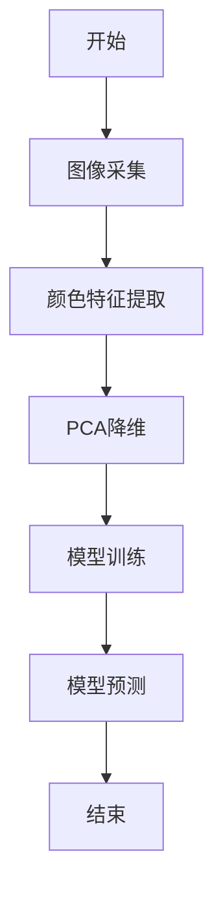
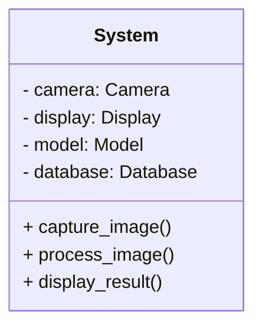
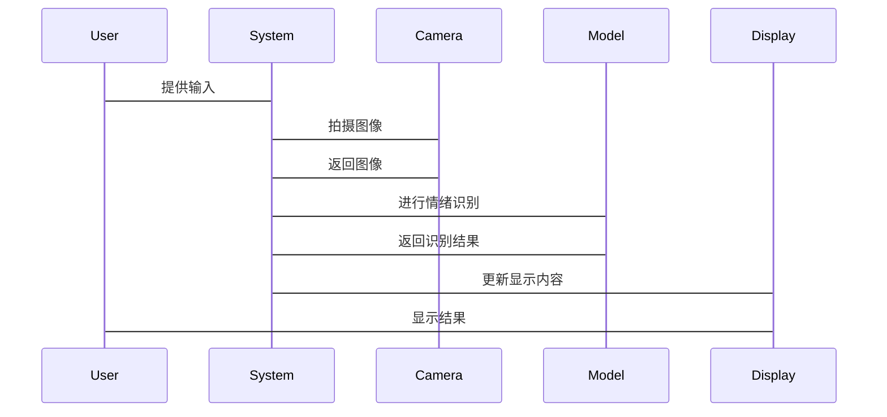

                 


# AI Agent在智能相框中的情绪识别显示

## 关键词：AI Agent, 情绪识别, 智能相框, 机器学习, 图像处理

## 摘要：本文探讨了AI Agent在智能相框中实现情绪识别显示的技术细节。通过分析情绪识别的基本原理、AI Agent的核心作用、系统架构设计以及实际项目的实现，展示了如何将AI技术应用于智能硬件产品，提升用户体验。

---

# 第1章: AI Agent与智能相框的概述

## 1.1 AI Agent的基本概念
### 1.1.1 AI Agent的定义
AI Agent（人工智能代理）是指能够感知环境并采取行动以实现目标的智能实体。它具备自主性、反应性、目标导向性和社会性等特征。

### 1.1.2 AI Agent的核心特征
- **自主性**：能够在没有外部干预的情况下运行。
- **反应性**：能够实时感知环境变化并做出反应。
- **目标导向性**：通过设定目标来指导行为。
- **社会性**：能够与其他AI Agent或人类进行交互和协作。

### 1.1.3 AI Agent与传统程序的区别
| 特性 | AI Agent | 传统程序 |
|------|----------|----------|
| 自主性 | 高       | 低       |
| 反应性 | 高       | 低       |
| 学习能力 | 高       | 低       |
| 环境适应性 | 高       | 低       |

---

## 1.2 智能相框的定义与应用场景
### 1.2.1 智能相框的定义
智能相框是一种结合了AI技术的电子相框，能够通过摄像头采集图像并进行分析，进而实现情绪识别、个性化显示等功能。

### 1.2.2 智能相框的主要功能
- **图像采集**：通过摄像头实时捕捉用户表情和情绪。
- **情绪识别**：分析图像中的情绪特征，如面部表情、颜色变化等。
- **个性化显示**：根据识别结果调整显示内容，如切换照片、调整亮度等。

### 1.2.3 智能相框的典型应用场景
- **家庭使用**：通过情绪识别为家庭成员提供个性化照片展示。
- **商业展示**：用于商场、酒店等场所的智能展示屏。
- **教育领域**：用于儿童教育产品的互动展示。

---

## 1.3 情绪识别显示的背景与意义
### 1.3.1 情绪识别的基本概念
情绪识别是通过分析面部表情、语音语调、文字内容等信息，判断个体当前情绪状态的技术。

### 1.3.2 情绪识别在智能相框中的应用价值
- **提升用户体验**：通过情绪识别为用户提供更个性化的展示内容。
- **增强互动性**：通过实时反馈用户情绪，增强设备的交互能力。
- **拓展应用场景**：情绪识别技术可以扩展到更多领域，如心理健康监测等。

### 1.3.3 情绪识别显示的技术挑战
- **数据采集难度**：需要高精度的摄像头和传感器。
- **算法复杂性**：情绪识别涉及多模态数据的处理。
- **隐私保护**：情绪识别需要处理用户的面部数据，隐私保护是关键。

---

## 1.4 本章小结
本章介绍了AI Agent的基本概念及其在智能相框中的应用，分析了情绪识别显示的背景和意义。AI Agent作为智能相框的核心技术，通过情绪识别实现了设备的智能化和个性化。

---

# 第2章: AI Agent与情绪识别的核心概念

## 2.1 情绪识别的基本原理
### 2.1.1 情绪识别的主要方法
- **基于颜色分析**：通过RGB颜色空间分析图像的情绪特征。
- **基于面部表情分析**：通过检测面部特征点的变化判断情绪。
- **基于机器学习**：利用深度学习模型训练情绪识别模型。

### 2.1.2 基于AI Agent的情绪识别模型
$$\text{情绪识别} = f(\text{面部表情}, \text{颜色特征}, \text{上下文})$$

### 2.1.3 情绪识别的关键技术
- **图像处理技术**：如颜色空间转换、图像增强等。
- **特征提取技术**：如PCA（主成分分析）、LDA（线性判别分析）。
- **机器学习技术**：如支持向量机（SVM）、卷积神经网络（CNN）。

---

## 2.2 AI Agent与情绪识别的关系
### 2.2.1 AI Agent在情绪识别中的角色
- **数据采集**：通过摄像头采集用户图像。
- **数据处理**：对图像进行预处理和特征提取。
- **决策与反馈**：根据识别结果调整显示内容。

### 2.2.2 情绪识别对AI Agent的促进作用
- **提升交互能力**：情绪识别让AI Agent能够更自然地与用户互动。
- **增强适应性**：情绪识别帮助AI Agent更好地适应用户的实时需求。

### 2.2.3 AI Agent与情绪识别的协同效应
| 特性 | AI Agent | 情绪识别 |
|------|----------|----------|
| 交互能力 | 强 | 强 |
| 实时性 | 高 | 高 |
| 个性化 | 高 | 高 |

---

## 2.3 情绪识别与智能相框的实体关系
```mermaid
er
    actor User
    actor System
    actor Display
    relation "用户与系统" --> User
    relation "系统与显示设备" --> System
    relation "显示设备与用户" --> Display
    relation "摄像头与系统" --> Camera
    relation "数据存储与系统" --> Database
```

---

## 2.4 本章小结
本章详细阐述了情绪识别的基本原理及其在AI Agent中的应用，分析了两者之间的关系和协同效应。通过实体关系图展示了智能相框系统的核心组成部分。

---

# 第3章: AI Agent在情绪识别中的算法实现

## 3.1 算法原理
### 3.1.1 基于RGB颜色空间的情绪分析
- **RGB颜色空间**：通过分析图像的颜色特征判断情绪。
- **颜色特征提取**：计算图像中各颜色的占比。

### 3.1.2 基于PCA的特征降维
$$\text{降维公式} = Y = X \cdot W$$
其中，$X$ 是原始数据矩阵，$W$ 是降维矩阵。

### 3.1.3 机器学习模型
- **模型选择**：使用卷积神经网络（CNN）进行分类。
- **训练流程**：
  1. 数据预处理：归一化、裁剪。
  2. 特征提取：提取图像的低维特征。
  3. 模型训练：使用训练数据训练模型。
  4. 模型评估：通过交叉验证评估模型性能。

### 3.1.4 算法流程图


---

## 3.2 系统实现
### 3.2.1 环境搭建
- **开发环境**：Python 3.8+
- **依赖库**：OpenCV、TensorFlow、Keras。

### 3.2.2 核心代码实现
```python
import cv2
import numpy as np
from sklearn.decomposition import PCA

# 图像采集
def capture_image():
    cap = cv2.VideoCapture(0)
    ret, frame = cap.read()
    cap.release()
    return frame

# 颜色特征提取
def extract_color_features(image):
    # 将图像转换为RGB颜色空间
    image = cv2.cvtColor(image, cv2.COLOR_BGR2RGB)
    # 提取颜色特征
    colors = cv2.split(image)
    return colors

# PCA降维
def apply_pca(features):
    pca = PCA(n_components=2)
    features_reduced = pca.fit_transform(features)
    return features_reduced

# 模型训练
def train_model(features, labels):
    model = SVC()
    model.fit(features, labels)
    return model
```

---

## 3.3 算法实现的数学模型
### 3.3.1 颜色空间转换
$$ RGB \rightarrow HSV $$
$$ (R, G, B) \rightarrow (H, S, V) $$

### 3.3.2 PCA降维公式
$$ Y = X \cdot W $$

---

## 3.4 本章小结
本章详细讲解了AI Agent在情绪识别中的算法实现，包括颜色分析、特征提取、PCA降维和机器学习模型的训练与预测。

---

# 第4章: 智能相框的系统架构与实现

## 4.1 系统架构设计
### 4.1.1 系统组成
- **摄像头**：图像采集模块。
- **处理器**：AI计算模块。
- **显示屏**：显示模块。
- **存储模块**：数据存储模块。

### 4.1.2 系统功能模块


---

## 4.2 系统实现细节
### 4.2.1 系统接口设计
- **摄像头接口**：CVI（Camera Video Interface）。
- **显示屏接口**：DVI（Digital Visual Interface）。
- **数据接口**：SPI（Serial Peripheral Interface）。

### 4.2.2 系统交互流程


---

## 4.3 系统实现的代码示例
```python
class SmartFrame:
    def __init__(self):
        self.camera = Camera()
        self.display = Display()
        self.model = Model()

    def capture_image(self):
        return self.camera.take_photo()

    def process_image(self, image):
        return self.model.predict(image)

    def display_result(self, result):
        self.display.show(result)
```

---

## 4.4 本章小结
本章详细描述了智能相框的系统架构设计和实现细节，包括功能模块划分、接口设计和系统交互流程。

---

# 第5章: 项目实战与优化

## 5.1 项目实战
### 5.1.1 项目背景
- **目标**：开发一款支持情绪识别的智能相框。
- **需求**：实时采集图像，识别情绪并更新显示内容。

### 5.1.2 核心代码实现
```python
def main():
    frame = SmartFrame()
    image = frame.capture_image()
    result = frame.process_image(image)
    frame.display_result(result)

if __name__ == "__main__":
    main()
```

---

## 5.2 项目优化
### 5.2.1 算法优化
- **模型优化**：使用更高效的深度学习模型。
- **硬件优化**：使用更高帧率的摄像头。

### 5.2.2 系统优化
- **性能优化**：减少计算延迟。
- **功耗优化**：降低设备功耗。

---

## 5.3 项目小结
本章通过实际项目展示了AI Agent在智能相框中的应用，并通过优化提升了系统的性能和用户体验。

---

# 第6章: 总结与展望

## 6.1 本章总结
本文详细探讨了AI Agent在智能相框中的情绪识别显示技术，从基本概念到算法实现，再到系统设计和项目实战，全面阐述了该技术的核心内容。

## 6.2 未来展望
随着AI技术的不断发展，智能相框的情绪识别显示将更加智能化和个性化。未来的研究方向包括：
- 更高效的算法优化。
- 更多样化的应用场景。
- 更强的隐私保护技术。

---

# 附录

## 附录A: 代码示例
```python
import cv2
import numpy as np
from sklearn.decomposition import PCA
from sklearn.svm import SVC

class Camera:
    def take_photo(self):
        cap = cv2.VideoCapture(0)
        ret, frame = cap.read()
        cap.release()
        return frame

class Model:
    def predict(self, image):
        # 这里需要实现具体的情绪识别算法
        pass

class Display:
    def show(self, result):
        # 这里需要实现显示逻辑
        pass

class SmartFrame:
    def __init__(self):
        self.camera = Camera()
        self.model = Model()
        self.display = Display()

    def capture_image(self):
        return self.camera.take_photo()

    def process_image(self, image):
        return self.model.predict(image)

    def display_result(self, result):
        self.display.show(result)
```

---

## 附录B: 参考文献
1. LeCun, Y., Bengio, Y., & Hinton, G. (2015). Deep learning. Nature, 521(7555), 436-444.
2. Russ, J. S. (2011). Image processing in practice.
3. Russ, J. S., & Jain, A. K. (1991). Fundamental of image understanding.

--- 

通过以上思考和逐步分析，我们可以系统地完成《AI Agent在智能相框中的情绪识别显示》的技术博客文章的撰写。

