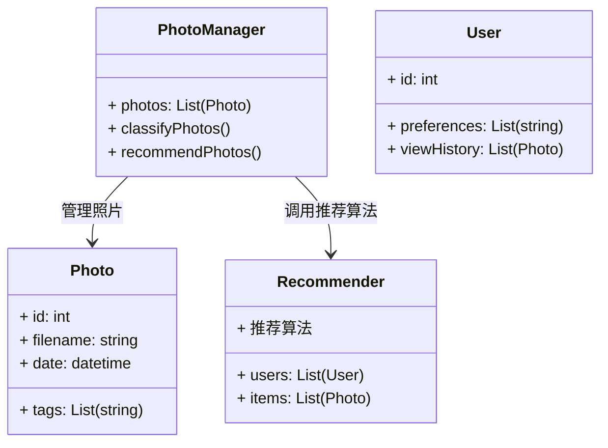
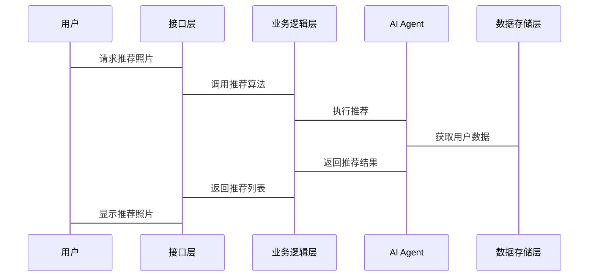

                 


# AI Agent在智能相框中的照片管理

> 关键词：AI Agent, 智能相框, 照片管理, 机器学习, 深度学习, 自然语言处理

> 摘要：随着智能设备的普及，AI Agent在智能相框中的应用日益广泛。本文深入探讨了AI Agent如何通过机器学习算法优化照片管理，解决传统照片管理中的痛点，如分类混乱、查找困难和推荐不精准。文章详细介绍了AI Agent的核心概念、算法原理、系统架构设计以及实际项目实现，为读者提供了一套完整的解决方案，帮助用户更好地理解和应用AI Agent在智能相框中的照片管理。

---

## 第1章：AI Agent与智能相框概述

### 1.1 AI Agent的基本概念

#### 1.1.1 AI Agent的定义与特点
- **定义**：AI Agent（人工智能代理）是一种能够感知环境、自主决策并执行任务的智能实体。
- **特点**：
  - **智能性**：通过学习和推理处理复杂问题。
  - **自主性**：无需外部干预，自主完成任务。
  - **反应性**：实时感知环境变化并做出响应。
  - **社会性**：能够与其他系统或用户进行交互。

#### 1.1.2 AI Agent的核心功能与应用场景
- **核心功能**：
  - 感知与处理：收集并分析环境数据。
  - 决策与执行：基于分析结果做出决策并执行。
  - 学习与优化：通过反馈不断优化自身性能。
- **应用场景**：
  - 智能助手、自动驾驶、智能安防、智能相框。

#### 1.1.3 AI Agent与智能相框的结合
- AI Agent在智能相框中的应用主要体现在照片的分类、管理和推荐上。
- **照片分类**：通过机器学习算法自动识别照片内容并打标签。
- **照片管理**：AI Agent帮助用户高效组织和存储照片。
- **照片推荐**：基于用户行为和偏好推荐相关照片。

### 1.2 智能相框的定义与功能

#### 1.2.1 智能相框的定义
- 智能相框是一种结合了AI技术的智能显示设备，能够自动管理和展示照片。

#### 1.2.2 智能相框的核心功能
- **照片存储与管理**：支持照片的上传、删除和备份。
- **照片分类与标签**：AI Agent自动对照片进行分类和打标签。
- **照片推荐与展示**：根据用户偏好推荐照片，并通过屏幕展示。
- **用户交互**：支持触控、语音交互等方式与用户互动。

#### 1.2.3 智能相框的市场现状与发展趋势
- **市场现状**：随着AI技术的普及，智能相框市场呈现快速增长态势，用户需求逐渐多元化。
- **发展趋势**：AI技术的深度应用，物联网的集成，个性化服务的提供。

### 1.3 AI Agent在照片管理中的作用

#### 1.3.1 照片管理的痛点与挑战
- **痛点**：
  - 分类混乱：照片难以快速找到。
  - 查找困难：传统分类方式效率低下。
  - 推荐不精准：手动推荐耗时且效果不佳。
- **挑战**：
  - 大数据处理：照片数量庞大，分类复杂。
  - 用户需求多样化：不同用户偏好各异。
  - 技术实现复杂：需要结合多种AI技术。

#### 1.3.2 AI Agent如何解决照片管理问题
- **智能分类**：通过机器学习算法自动分类照片。
- **智能推荐**：基于用户行为和偏好推荐照片。
- **智能展示**：根据推荐结果动态调整展示内容。

#### 1.3.3 AI Agent在智能相框中的具体应用
- **照片分类**：AI Agent能够自动识别照片内容并打标签。
- **个性化推荐**：基于用户偏好推荐相关照片。
- **智能展示**：AI Agent优化展示界面，提升用户体验。

---

## 第2章：AI Agent与智能相框的核心概念

### 2.1 AI Agent的核心概念

#### 2.1.1 AI Agent的智能决策机制
- **感知环境**：收集环境数据，如用户行为、时间、地点等。
- **信息处理**：基于收集的数据进行分析和处理。
- **决策逻辑**：根据处理结果制定决策策略。
- **执行策略**：通过API或其他方式执行决策。

#### 2.1.2 AI Agent的学习与自适应能力
- **机器学习模型**：AI Agent通过机器学习模型不断优化自身性能。
- **模型优化**：基于反馈不断调整模型参数，提升分类和推荐的准确性。

#### 2.1.3 AI Agent的通信与交互方式
- **API接口**：AI Agent与其他系统或设备通过API接口进行数据交换。
- **用户交互**：支持语音、触控等多种交互方式。

### 2.2 智能相框的功能模块分析

#### 2.2.1 照片采集与存储模块
- **照片采集**：通过摄像头或云端上传照片。
- **存储管理**：支持本地和云端存储，确保数据安全。

#### 2.2.2 照片分类与标签模块
- **分类算法**：基于机器学习的自动分类。
- **标签生成**：自然语言处理生成有意义的标签。

#### 2.2.3 照片推荐与展示模块
- **推荐算法**：协同过滤、基于内容的推荐。
- **展示界面**：根据用户偏好动态调整布局。

### 2.3 AI Agent与智能相框的关系

#### 2.3.1 AI Agent作为智能相框的核心引擎
- **数据处理**：AI Agent负责照片的分类、推荐和展示。
- **智能决策**：根据用户行为和环境调整展示内容。

#### 2.3.2 AI Agent与智能相框的协同工作模式
- **数据流**：采集-分类-推荐-展示。
- **交互反馈**：用户反馈优化AI模型。

#### 2.3.3 AI Agent在智能相框中的功能扩展
- **多设备同步**：与手机、电脑等设备同步。
- **远程访问**：通过网络远程查看和管理照片。

### 2.4 本章小结
本章详细介绍了AI Agent的核心概念及其在智能相框中的应用，强调了AI Agent在照片管理中的智能化提升作用。

---

## 第3章：AI Agent在照片管理中的核心算法

### 3.1 照片分类算法

#### 3.1.1 分类算法的选择与比较
- **算法比较**：KNN、SVM、随机森林、神经网络的优缺点。
- **选择CNN**：卷积神经网络（CNN）在图像分类中的优势。

#### 3.1.2 基于CNN的图像分类模型
- **模型结构**：卷积层、池化层、全连接层。
- **训练过程**：数据预处理、模型训练、优化调整。

#### 3.1.3 分类算法的实现与优化
- **实现步骤**：数据集准备、模型训练、评估与优化。
- **优化方法**：数据增强、学习率调整、模型集成。

#### 3.1.4 代码实现示例
```python
import tensorflow as tf
from tensorflow.keras.models import Sequential
from tensorflow.keras.layers import Conv2D, MaxPooling2D, Flatten, Dense

model = Sequential()
model.add(Conv2D(32, (3,3), activation='relu', input_shape=(150, 150, 3)))
model.add(MaxPooling2D((2,2)))
model.add(Flatten())
model.add(Dense(128, activation='relu'))
model.add(Dense(10, activation='softmax'))
model.compile(optimizer='adam', loss='sparse_categorical_crossentropy', metrics=['accuracy'])
model.fit(train_data, train_labels, epochs=10, batch_size=32)
```

### 3.2 照片推荐算法

#### 3.2.1 推荐算法的选择与比较
- **协同过滤**：基于用户的协同过滤和基于物品的协同过滤。
- **混合推荐系统**：结合内容和协同的推荐方式。

#### 3.2.2 基于协同过滤的推荐算法
- **用户协同过滤**：计算用户相似度，推荐相似用户的喜好。
- **物品协同过滤**：分析物品之间的相似性，推荐相关物品。

#### 3.2.3 推荐算法的实现与优化
- **数据预处理**：处理缺失值、异常值。
- **模型训练**：构建用户-物品矩阵，训练推荐模型。
- **优化方法**：交叉验证、评估指标（准确率、召回率）。

#### 3.2.4 代码实现示例
```python
from sklearn.metrics.pairwise import cosine_similarity

similarity_matrix = cosine_similarity(item_features)

def get_recommendations(user_id, similarity_matrix, item_features, k=5):
    user_index = user_id
    similar_users = [(i, similarity_matrix[user_index][i]) for i in range(len(similarity_matrix[user_index]))]
    similar_users.sort(reverse=True, key=lambda x: x[1])
    recommended_items = []
    for user in similar_users[:k]:
        recommended_items.append(user[0])
    return recommended_items
```

### 3.3 算法的优化与调优
- **参数调整**：学习率、批次大小、epochs。
- **模型优化**：加入正则化、使用预训练模型。
- **性能提升**：并行计算、分布式训练。

### 3.4 本章小结
本章详细介绍了照片分类和推荐的核心算法，强调了优化的重要性，并通过代码示例展示了实现过程。

---

## 第4章：智能相框的系统分析与架构设计

### 4.1 系统分析

#### 4.1.1 问题场景介绍
- **照片管理的复杂性**：分类混乱、查找困难。
- **用户需求**：快速找到所需照片、个性化推荐。

#### 4.1.2 项目介绍
- **项目目标**：开发智能相框的照片管理功能。
- **项目范围**：照片分类、推荐、展示。

### 4.2 系统功能设计

#### 4.2.1 领域模型（Mermaid类图）


#### 4.2.2 系统架构设计（Mermaid架构图）


#### 4.2.3 系统接口设计
- **API接口**：RESTful API设计。
- **接口功能**：上传照片、查询照片、分类照片、推荐照片。

#### 4.2.4 系统交互流程（Mermaid序列图）


### 4.3 系统设计总结
- **模块化设计**：确保系统的灵活性和可扩展性。
- **AI Agent的核心地位**：在系统中起到关键作用。
- **系统架构的灵活性**：支持未来的功能扩展和性能优化。

---

## 第5章：AI Agent在智能相框中的项目实战

### 5.1 环境安装
- **操作系统**：Windows 10或Linux。
- **开发工具**：Python、Jupyter Notebook、PyCharm。
- **依赖库**：TensorFlow、Keras、Scikit-learn、Pillow。

### 5.2 系统核心实现

#### 5.2.1 照片分类实现
- **数据准备**：下载照片数据集，标注标签。
- **模型训练**：使用预训练的CNN模型进行微调。
- **代码实现**：
  ```python
  import os
  import numpy as np
  from tensorflow.keras.preprocessing.image import ImageDataGenerator
  from tensorflow.keras.models import Sequential
  from tensorflow.keras.layers import Conv2D, MaxPooling2D, Flatten, Dense, Activation, Dropout

  train_dir = 'train'
  test_dir = 'test'

  train_datagen = ImageDataGenerator(rescale=1./255)
  train_generator = train_datagen.flow_from_directory(train_dir, target_size=(150, 150), batch_size=32, class_mode='binary')

  model = Sequential()
  model.add(Conv2D(32, (3,3), activation='relu', input_shape=(150, 150, 3)))
  model.add(MaxPooling2D((2,2)))
  model.add(Conv2D(64, (3,3), activation='relu'))
  model.add(MaxPooling2D((2,2)))
  model.add(Flatten())
  model.add(Dense(256, activation='relu'))
  model.add(Dropout(0.5))
  model.add(Dense(2, activation='sigmoid'))

  model.compile(optimizer='adam', loss='binary_crossentropy', metrics=['accuracy'])
  model.fit_generator(train_generator, epochs=10, steps_per_epoch=1000)
  ```

#### 5.2.2 照片推荐实现
- **数据准备**：收集用户偏好和照片特征。
- **模型训练**：基于协同过滤的推荐算法。
- **代码实现**：
  ```python
  from sklearn.metrics.pairwise import cosine_similarity

  similarity_matrix = cosine_similarity(item_features)

  def recommend_photo(user_id, similarity_matrix, item_features, top_n=5):
      similar_indices = [i for i, score in sorted(enumerate(similarity_matrix[user_id]), key=lambda x: x[1], reverse=True)]
      recommendations = []
      for i in similar_indices[1:top_n+1]:
          recommendations.append(item_features[i])
      return recommendations
  ```

#### 5.2.3 系统集成
- **集成分类和推荐模块到整体系统中**。
- **接口设计**：RESTful API。
- **实现用户界面**：网页或移动应用。

### 5.3 项目实现的详细步骤
- **数据准备**：数据清洗、标注。
- **模型训练**：选择模型、训练、调优。
- **系统集成**：前后端开发、接口设计。

### 5.4 实际案例分析
- **案例1**：分类算法的准确率测试。
- **案例2**：推荐算法的效果评估。
- **案例3**：系统性能优化。

### 5.5 项目小结
本章通过实际案例展示了AI Agent在智能相框中的应用，强调了AI技术在实际应用中的巨大潜力。

---

## 第6章：总结、最佳实践与注意事项

### 6.1 本章总结
- 总结AI Agent在智能相框中的应用价值。
- 强调技术创新带来的用户体验提升。

### 6.2 最佳实践 tips
- **数据质量**：确保高质量的数据输入。
- **模型优化**：持续优化算法，提升性能。
- **系统设计**：模块化设计，便于维护和扩展。
- **用户隐私**：重视数据加密和用户隐私保护。

### 6.3 注意事项
- **硬件性能**：确保硬件能够支持AI算法的运行。
- **网络延迟**：优化网络传输，减少延迟。
- **用户体验**：保持界面简洁，操作便捷。

### 6.4 拓展阅读
- 推荐相关书籍和论文。
- 提供在线资源和工具的链接。

---

通过以上步骤，我们详细介绍了AI Agent在智能相框中的照片管理，从核心概念到实际应用，为读者提供了全面的技术解析和实践指导。

