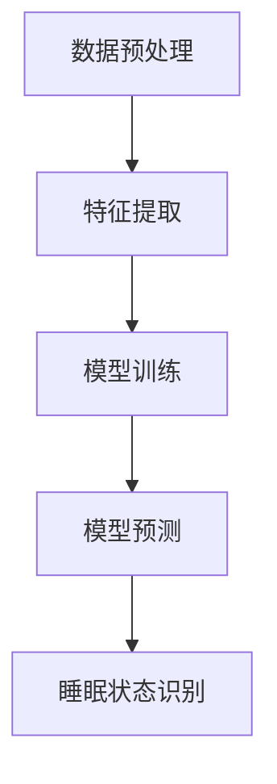
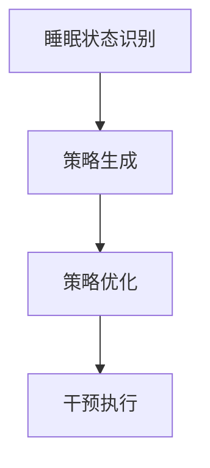
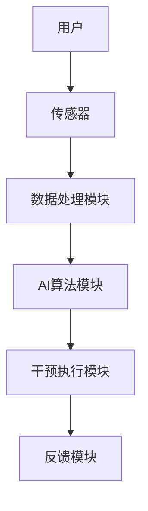

                 


# AI Agent在智能眼罩中的深度睡眠诱导

## 关键词：AI Agent, 智能眼罩, 深度睡眠, 睡眠诱导, 睡眠监测, 人工智能算法

## 摘要：  
随着人工智能技术的快速发展，AI Agent在智能健康设备中的应用越来越广泛。本文探讨了AI Agent在智能眼罩中的深度睡眠诱导应用，分析了其核心原理、算法实现、系统架构及实际应用场景。通过详细的技术分析和案例解读，本文揭示了AI Agent如何通过智能眼罩帮助用户改善睡眠质量，为智能健康设备的研发提供了新的思路和方向。

---

## 第一部分: AI Agent与深度睡眠诱导的背景介绍

### 第1章: AI Agent的基本概念与技术背景

#### 1.1 AI Agent的定义与核心原理  
AI Agent（人工智能代理）是一种能够感知环境、自主决策并执行任务的智能实体。它具有以下核心特征：  
1. **自主性**：能够在没有外部干预的情况下独立运作。  
2. **反应性**：能够实时感知环境变化并做出响应。  
3. **目标导向**：具有明确的目标，并通过行为规划实现目标。  
4. **学习能力**：能够通过数据反馈不断优化自身的决策算法。  

AI Agent的应用领域广泛，包括自动驾驶、智能助手、机器人控制等。在智能眼罩中，AI Agent的主要功能是通过实时监测用户的睡眠状态并提供相应的干预策略，以改善用户的深度睡眠质量。

#### 1.2 深度睡眠的生理机制  
深度睡眠是睡眠周期中的一个重要阶段，通常出现在睡眠周期的后半部分（非快速眼动睡眠，NREM）。在深度睡眠阶段，大脑活动减弱，身体修复和恢复能力最强。然而，现代生活的压力、电子设备的普及以及不规律的作息时间，导致许多人难以进入深度睡眠状态。AI Agent通过监测用户的生理数据（如心率、脑电波、眼动数据等），能够精准识别睡眠阶段，并提供个性化的干预策略。

#### 1.3 智能眼罩的工作原理  
智能眼罩是一种结合了传感器技术和人工智能算法的可穿戴设备。它通过内置的传感器（如心率传感器、温度传感器、脑电传感器等）实时采集用户的生理数据，并通过AI算法分析这些数据，判断用户的睡眠状态。当检测到用户未能进入深度睡眠状态时，AI Agent会启动干预机制，例如调整光照强度、播放助眠音乐或发出微弱的振动提醒，帮助用户重新进入深度睡眠状态。

---

### 第2章: AI Agent在智能眼罩中的应用背景  

#### 2.1 智能健康设备的发展趋势  
随着物联网技术的发展，智能健康设备逐渐普及。AI Agent作为智能设备的核心技术，正在被广泛应用于睡眠监测、健康管理和疾病预防等领域。智能眼罩作为一种新兴的智能健康设备，结合了AI技术与光学技术，为用户提供个性化的睡眠改善方案。

#### 2.2 深度睡眠诱导的市场需求  
现代人普遍存在睡眠质量差的问题，尤其是深度睡眠时间不足。深度睡眠对身体和大脑的恢复至关重要，能够帮助用户在第二天保持精力充沛。因此，市场对能够改善深度睡眠质量的智能设备需求日益增长。AI Agent通过个性化干预策略，能够有效提升用户的深度睡眠时间，满足市场需求。

#### 2.3 AI Agent在智能眼罩中的应用前景  
AI Agent在智能眼罩中的应用前景广阔。通过实时监测和干预，AI Agent能够帮助用户优化睡眠质量，提升健康水平。随着AI技术的不断进步，未来的智能眼罩将更加智能化，能够根据用户的个体差异提供更加个性化的睡眠改善方案。

---

## 第二部分: AI Agent与深度睡眠诱导的核心概念与联系  

### 第3章: AI Agent的核心原理与实现机制  

#### 3.1 AI Agent的基本原理  
AI Agent的核心原理包括感知、决策和执行三个主要环节：  
1. **感知**：通过传感器或数据接口获取环境信息。  
2. **决策**：基于感知数据和预设算法，生成决策方案。  
3. **执行**：根据决策方案，执行相应的操作或反馈。  

在智能眼罩中，AI Agent通过采集用户的生理数据（如心率、眼动数据、脑电波等）来判断用户的睡眠状态，并根据判断结果调整干预策略。

#### 3.2 AI Agent在智能眼罩中的具体实现  
AI Agent在智能眼罩中的实现包括以下步骤：  
1. **数据采集**：通过传感器采集用户的生理数据。  
2. **睡眠状态识别**：基于机器学习算法，判断用户的睡眠阶段。  
3. **干预策略生成**：根据睡眠状态生成相应的干预策略（如调整光照、播放音乐等）。  
4. **反馈优化**：根据用户的反馈不断优化干预策略。  

#### 3.3 AI Agent与深度睡眠诱导的关联  
AI Agent通过实时监测用户的睡眠状态，能够精准识别深度睡眠阶段。当用户未能进入深度睡眠时，AI Agent会启动干预机制，帮助用户重新进入深度睡眠状态。这种实时监测和干预的结合，使得AI Agent在智能眼罩中的应用具有重要意义。

---

### 第4章: AI Agent与深度睡眠诱导的核心概念对比  

#### 4.1 AI Agent的核心概念属性  
| **属性**       | **描述**                                                                 |
|----------------|--------------------------------------------------------------------------|
| 数据驱动性      | AI Agent依赖大量数据进行训练和推理。                                       |
| 自适应性        | 能够根据环境变化和用户反馈不断优化自身算法。                             |
| 实时性          | 能够实时感知环境并做出快速响应。                                         |
| 个性化          | 可以根据用户的个体差异提供个性化的服务。                                   |

#### 4.2 AI Agent与深度睡眠诱导的对比  
| **对比维度**    | **AI Agent**                       | **深度睡眠诱导**                        |
|----------------|------------------------------------|-----------------------------------------|
| 核心目标        | 提供智能化服务                     | 改善用户的睡眠质量                       |
| 实现方式        | 通过算法和传感器实现               | 通过AI Agent实现个性化干预             |
| 应用场景        | 智能设备、健康监测                 | 智能眼罩、睡眠改善设备                   |

---

## 第三部分: AI Agent在智能眼罩中的算法原理与实现  

### 第5章: 算法原理讲解  

#### 5.1 睡眠状态识别算法  
睡眠状态识别算法是AI Agent的核心算法之一。常用的算法包括基于机器学习的分类算法（如支持向量机、随机森林）和深度学习算法（如LSTM、CNN）。以下是基于机器学习的睡眠状态分类算法流程图：



#### 5.2 睡眠改善策略生成算法  
睡眠改善策略生成算法是AI Agent的另一个重要组成部分。以下是其算法流程图：



---

## 第四部分: 系统分析与架构设计方案  

### 第6章: 系统架构设计  

#### 6.1 系统功能设计  
智能眼罩系统的主要功能包括：  
1. **数据采集**：采集用户的生理数据（如心率、眼动数据、脑电波）。  
2. **睡眠监测**：实时监测用户的睡眠状态。  
3. **干预执行**：根据睡眠状态生成干预策略并执行。  
4. **反馈优化**：根据用户的反馈优化干预策略。  

#### 6.2 系统架构图  
以下是智能眼罩系统的架构图：



---

## 第五部分: 项目实战  

### 第7章: 项目实战  

#### 7.1 环境安装  
以下是项目所需的环境配置：  
- **Python**：3.8及以上版本  
- **TensorFlow**：2.0及以上版本  
- **传感器模块**：心率传感器、脑电传感器等  

#### 7.2 核心代码实现  
以下是睡眠状态识别的核心代码实现：  

```python
import numpy as np
import tensorflow as tf

# 数据预处理
def preprocess(data):
    # 数据标准化
    mean = np.mean(data)
    std = np.std(data)
    normalized_data = (data - mean) / std
    return normalized_data

# 模型训练
def train_model(x_train, y_train):
    model = tf.keras.Sequential([
        tf.keras.layers.Dense(64, activation='relu'),
        tf.keras.layers.Dense(32, activation='relu'),
        tf.keras.layers.Dense(1, activation='sigmoid')
    ])
    model.compile(optimizer='adam', loss='binary_crossentropy', metrics=['accuracy'])
    model.fit(x_train, y_train, epochs=10, batch_size=32)
    return model

# 模型预测
def predict_sleep_state(model, data):
    normalized_data = preprocess(data)
    prediction = model.predict(normalized_data)
    return prediction
```

---

### 第8章: 总结与展望  

#### 8.1 总结  
本文详细介绍了AI Agent在智能眼罩中的深度睡眠诱导应用，从背景介绍、核心概念、算法原理到系统架构，全面分析了其技术实现和实际应用。AI Agent通过实时监测和干预，能够有效提升用户的深度睡眠质量。

#### 8.2 展望  
随着AI技术的不断进步，未来的智能眼罩将更加智能化，能够提供更加个性化的睡眠改善方案。AI Agent在智能眼罩中的应用前景广阔，将为智能健康设备的发展注入新的活力。

---

通过本文的分析，我们可以看到AI Agent在智能眼罩中的深度睡眠诱导应用不仅具有重要的技术意义，也具有广阔的市场前景。未来，随着技术的不断发展，AI Agent在智能健康设备中的应用将更加广泛，为人们的生活带来更多的便利和健康保障。

