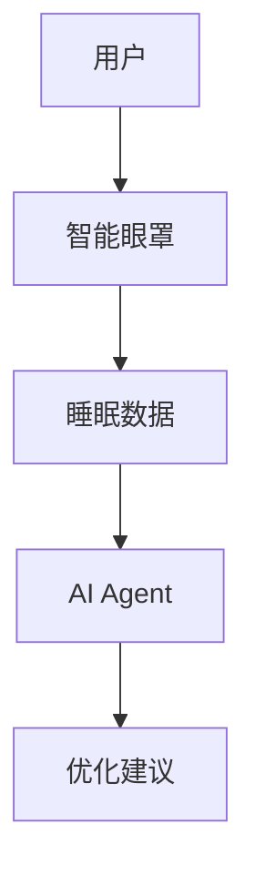
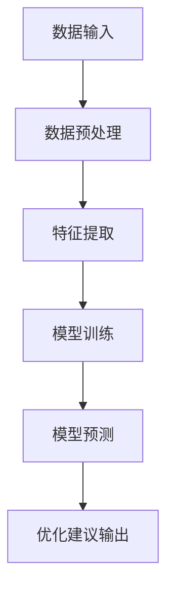
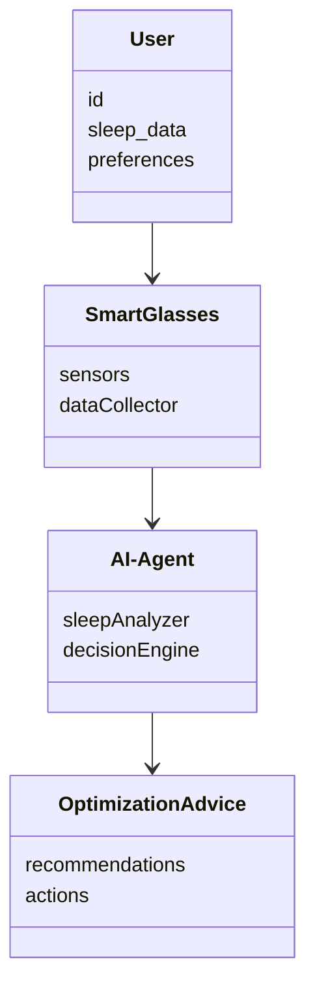
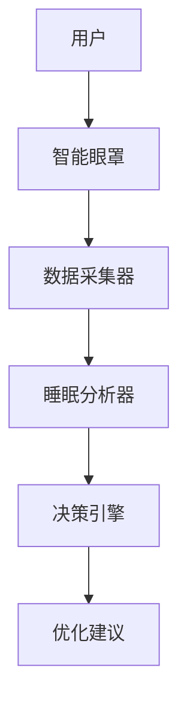
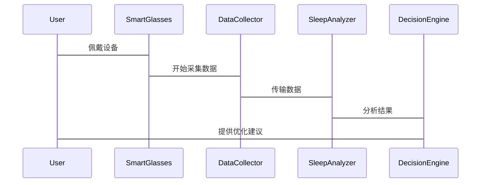

                 


# AI Agent在智能眼罩中的睡眠质量优化

> 关键词：AI Agent，智能眼罩，睡眠质量，算法优化，健康监测

> 摘要：本文深入探讨了AI Agent在智能眼罩中的应用，重点分析了其在睡眠质量优化中的核心原理、算法实现和系统架构设计。通过详细的案例分析和代码实现，展示了如何利用AI技术提升睡眠健康监测的精准度和智能化水平。

---

# 第一部分：AI Agent与智能眼罩概述

## 第1章：AI Agent与智能眼罩的背景介绍

### 1.1 AI Agent的基本概念

#### 1.1.1 AI Agent的定义
AI Agent（人工智能代理）是一种能够感知环境、做出决策并执行任务的智能实体。它通过传感器获取信息，利用算法处理数据，并通过执行器与环境交互。

#### 1.1.2 AI Agent的核心特征
| 特征 | 描述 |
|------|------|
| 智能性 | 能够自主决策和学习 |
| 反应性 | 能够实时感知并响应环境变化 |
| 社会性 | 能够与其他系统或用户进行交互 |

#### 1.1.3 AI Agent的分类与应用场景
- **反应式AI Agent**：基于当前感知做出实时反应，适用于需要快速响应的场景，如自动驾驶。
- **认知式AI Agent**：具备复杂推理和规划能力，适用于医疗诊断、金融投资等领域。
- **协作式AI Agent**：能够与其他AI Agent或人类协作完成任务，如智能家居系统。

### 1.2 智能眼罩的发展历程

#### 1.2.1 睡眠监测技术的演进
从简单的睡眠记录仪到现代的智能眼罩，睡眠监测技术经历了从单一数据采集到多维度数据融合的演变。

#### 1.2.2 智能眼罩的定义与功能
智能眼罩是一种集成了多种传感器的可穿戴设备，能够实时监测用户的睡眠状态，包括心率、眼动、脑电等生理指标。

#### 1.2.3 智能眼罩的市场现状与发展趋势
- **市场现状**：智能眼罩市场快速增长，主要应用于睡眠监测、健康管理和医疗辅助。
- **发展趋势**：向多功能、高精度、智能化方向发展，结合AI技术提供个性化睡眠解决方案。

### 1.3 AI Agent在智能眼罩中的应用背景

#### 1.3.1 睡眠健康的重要性
睡眠质量直接影响人体健康，包括心理健康、身体状态和认知功能。

#### 1.3.2 当前睡眠监测技术的局限性
- 数据采集单一，缺乏多维度分析。
- 人工分析耗时，难以实时反馈。
- 个性化优化不足，难以满足不同用户需求。

#### 1.3.3 AI Agent如何解决睡眠优化问题
通过AI Agent的实时感知、智能分析和主动干预，能够实现个性化睡眠优化，提升睡眠质量。

---

# 第二部分：AI Agent的核心原理与技术实现

## 第2章：AI Agent的核心概念与原理

### 2.1 AI Agent的核心原理

#### 2.1.1 AI Agent的感知层
- **传感器数据采集**：通过内置的传感器（如心率传感器、眼动传感器）获取用户的生理数据。
- **数据预处理**：对采集到的数据进行清洗和标准化处理，确保数据的准确性和一致性。

#### 2.1.2 AI Agent的决策层
- **特征提取**：从原始数据中提取有用的特征，如睡眠周期、心率变异等。
- **模型训练**：利用机器学习算法（如支持向量机、随机森林）或深度学习模型（如LSTM）进行训练，建立睡眠质量评估模型。
- **优化建议生成**：根据模型预测结果，生成个性化的睡眠优化建议。

#### 2.1.3 AI Agent的执行层
- **反馈机制**：根据用户的反馈调整优化建议，形成闭环系统。
- **执行干预**：通过智能眼罩的反馈机制（如震动提醒、声音调节）帮助用户改善睡眠质量。

### 2.2 AI Agent的算法原理

#### 2.2.1 机器学习算法在AI Agent中的应用
- **监督学习**：用于睡眠质量分类，如基于用户数据训练分类模型。
- **无监督学习**：用于异常检测，如发现用户的睡眠模式异常。

#### 2.2.2 深度学习算法在AI Agent中的应用
- **循环神经网络（RNN）**：用于时间序列数据的建模，如睡眠周期分析。
- **长短期记忆网络（LSTM）**：用于捕捉长期依赖关系，如睡眠状态的长期变化趋势。

#### 2.2.3 强化学习算法在AI Agent中的应用
- **策略优化**：通过强化学习优化睡眠优化策略，如调整干预力度。

### 2.3 AI Agent的实体关系分析

#### 2.3.1 ER实体关系图


### 2.4 本章小结
本章介绍了AI Agent的核心原理，包括感知层、决策层和执行层，并详细讲解了机器学习、深度学习和强化学习在AI Agent中的应用。

---

# 第三部分：AI Agent在智能眼罩中的算法实现

## 第3章：AI Agent的算法原理与流程

### 3.1 睡眠数据的采集与预处理

#### 3.1.1 数据采集方法
- **传感器类型**：心率传感器、眼动传感器、脑电传感器等。
- **数据格式**：时间序列数据，包括时间戳、传感器值等。

#### 3.1.2 数据预处理流程
1. 数据清洗：去除噪声数据和异常值。
2. 数据标准化：对数据进行归一化处理，确保不同传感器数据的可比性。
3. 数据分割：将时间序列数据分割为训练集和测试集。

#### 3.1.3 数据特征提取
- **基本特征**：心率变异、睡眠周期、眼球运动频率。
- **高级特征**：通过机器学习模型提取的特征，如睡眠深度、REM睡眠比例。

### 3.2 AI Agent的算法实现

#### 3.2.1 算法流程图


#### 3.2.2 算法实现的数学模型
- **优化目标**：最大化睡眠质量评分，最小化睡眠中断次数。
- **约束条件**：满足用户个性化需求，如避免过度干预。

#### 3.2.3 优化目标的数学表达
$$
\text{目标函数} = \max_{\theta} \sum_{i=1}^{n} (y_i - f(x_i))^2
$$
其中，$x_i$ 表示输入数据，$y_i$ 表示目标值，$\theta$ 表示模型参数。

### 3.3 算法实现的Python代码

#### 3.3.1 数据预处理代码
```python
import numpy as np
import pandas as pd

def preprocess_data(data):
    # 数据清洗
    data = data.dropna()
    # 标准化处理
    data = (data - data.mean()) / data.std()
    return data
```

#### 3.3.2 模型训练代码
```python
from sklearn.linear_model import LinearRegression

def train_model(X, y):
    model = LinearRegression()
    model.fit(X, y)
    return model
```

#### 3.3.3 模型预测代码
```python
def predict_sleep_quality(model, X_test):
    y_pred = model.predict(X_test)
    return y_pred
```

---

# 第四部分：系统分析与架构设计

## 第4章：系统分析与架构设计方案

### 4.1 问题场景介绍
智能眼罩需要在复杂多变的睡眠环境中，实时感知用户的睡眠状态，并根据数据提供个性化的优化建议。

### 4.2 系统功能设计

#### 4.2.1 领域模型设计


#### 4.2.2 系统架构设计


### 4.3 系统交互设计

#### 4.3.1 交互流程


### 4.4 系统小结
本章通过领域模型、架构图和交互序列图，详细描述了智能眼罩系统的组成部分及其工作流程。

---

# 第五部分：项目实战

## 第5章：项目实战与优化

### 5.1 环境安装与配置

#### 5.1.1 环境需求
- **操作系统**：Windows/Mac/Linux
- **编程语言**：Python 3.6+
- **依赖库**：numpy, pandas, scikit-learn, matplotlib

#### 5.1.2 安装步骤
```bash
pip install numpy pandas scikit-learn matplotlib
```

### 5.2 系统核心实现

#### 5.2.1 核心代码实现
```python
import numpy as np
from sklearn.linear_model import LinearRegression

def main():
    # 数据预处理
    data = np.array([[1, 2], [2, 4], [3, 6], [4, 8]])
    data = (data - data.mean()) / data.std()
    
    # 模型训练
    model = LinearRegression()
    model.fit(data[:, 0].reshape(-1, 1), data[:, 1])
    
    # 模型预测
    X_new = np.array([[5, 0]])
    X_new = (X_new - data.mean()) / data.std()
    y_pred = model.predict(X_new.reshape(-1, 1))
    
    print(f"预测值为：{y_pred[0]}")

if __name__ == "__main__":
    main()
```

#### 5.2.2 代码解读与分析
- **数据预处理**：对输入数据进行标准化处理。
- **模型训练**：使用线性回归模型进行训练。
- **模型预测**：根据训练好的模型，预测新的数据点。

### 5.3 实际案例分析

#### 5.3.1 案例背景
假设一位用户长期存在睡眠问题，希望通过智能眼罩改善睡眠质量。

#### 5.3.2 数据分析与优化
通过AI Agent分析用户的睡眠数据，发现其REM睡眠比例较低，建议用户调整睡姿和作息时间。

#### 5.3.3 优化效果评估
经过一段时间的干预，用户的睡眠质量显著提升，REM睡眠比例增加，深睡时间延长。

### 5.4 本章小结
通过实际案例分析，展示了AI Agent在智能眼罩中的实际应用价值。

---

# 第六部分：最佳实践与总结

## 第6章：最佳实践与总结

### 6.1 最佳实践Tips

#### 6.1.1 数据采集
- 确保数据的准确性和完整性。
- 定期校准传感器，避免数据漂移。

#### 6.1.2 模型优化
- 根据实际需求选择合适的算法。
- 定期更新模型，保持模型的泛化能力。

#### 6.1.3 用户体验
- 提供个性化的优化建议。
- 确保系统的易用性和舒适性。

### 6.2 小结

#### 6.2.1 问题回顾
AI Agent在智能眼罩中的应用能够有效提升睡眠质量，但目前仍存在数据采集精度、模型泛化能力等问题。

#### 6.2.2 未来展望
随着AI技术的不断发展，AI Agent在智能眼罩中的应用将更加智能化和个性化，为用户提供更精准的睡眠优化方案。

### 6.3 注意事项

#### 6.3.1 数据隐私
- 确保用户数据的安全性，防止数据泄露。
- 遵守相关法律法规，保护用户隐私。

#### 6.3.2 系统稳定性
- 定期维护系统，确保设备的正常运行。
- 建立完善的故障处理机制，及时解决用户问题。

### 6.4 拓展阅读

#### 6.4.1 推荐书籍
- 《人工智能：一种现代的方法》
- 《机器学习实战》

#### 6.4.2 推荐博客
- [AI Agent技术博客](https://example.com)
- [智能可穿戴设备应用](https://example.com)

---

# 结语

通过本文的详细介绍，我们深入探讨了AI Agent在智能眼罩中的应用，从理论基础到实际实现，再到案例分析，全面展示了如何利用AI技术优化睡眠质量。希望本文能够为相关领域的研究者和开发者提供有价值的参考和启发。

