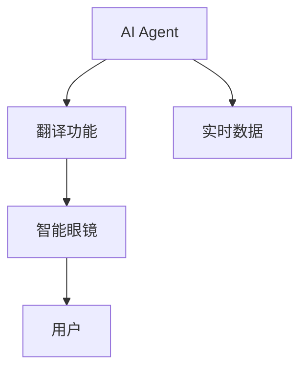
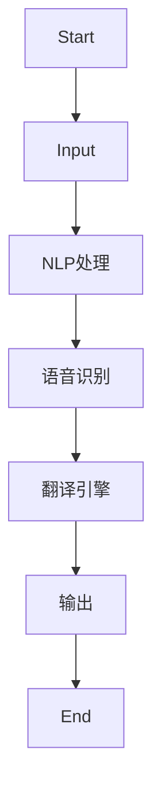
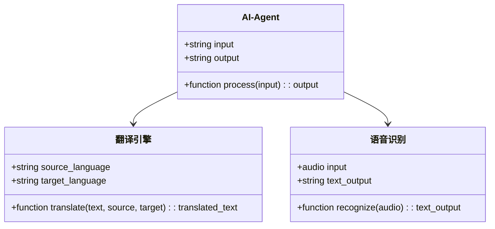
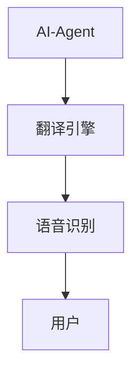
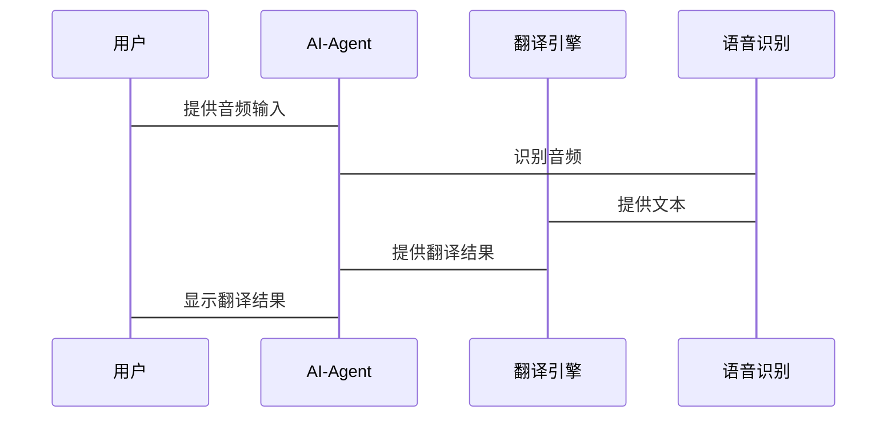

                 


```markdown
# AI Agent在智能眼镜中的实时翻译功能

## 关键词
- AI Agent
- 智能眼镜
- 实时翻译
- 自然语言处理
- 语音识别

## 摘要
本文深入探讨AI Agent在智能眼镜中的实时翻译功能，从技术原理到系统架构，再到项目实战，详细解析其核心概念、算法实现和应用场景。通过背景介绍、核心概念分析、技术实现、系统架构设计、项目实战以及最佳实践，全面展示AI Agent在智能眼镜中的应用潜力和实际价值。

---

# 第一部分: AI Agent在智能眼镜中的实时翻译功能概述

## 第1章: 背景介绍

### 1.1 问题背景
#### 1.1.1 智能眼镜的发展现状
- 智能眼镜的普及及其在生活中的应用
- 当前翻译技术的发展趋势
- 智能眼镜与翻译技术的结合

#### 1.1.2 翻译技术在智能眼镜中的应用需求
- 用户对实时翻译功能的实际需求
- 智能眼镜在翻译功能中的独特优势
- 翻译功能在智能眼镜中的具体应用场景

#### 1.1.3 AI Agent在实时翻译中的优势
- AI Agent的核心作用
- 实时翻译的高效性与准确性
- AI Agent在多语言支持中的优势

### 1.2 问题描述
#### 1.2.1 实时翻译的核心问题
- 翻译的实时性要求
- 上下文的理解与处理
- 多语言支持的挑战

#### 1.2.2 智能眼镜翻译功能的挑战
- 硬件性能限制
- 低功耗与高性能的平衡
- 用户交互的便捷性

#### 1.2.3 AI Agent在实时翻译中的角色
- AI Agent作为翻译功能的核心驱动力
- AI Agent与其他组件的协同工作
- AI Agent在实时翻译中的具体实现

### 1.3 问题解决
#### 1.3.1 AI Agent的核心作用
- AI Agent在实时翻译中的关键任务
- AI Agent与其他翻译工具的对比
- AI Agent的智能性和适应性

#### 1.3.2 实时翻译的实现路径
- 翻译功能的实现流程
- AI Agent在翻译过程中的具体应用
- 实时翻译的性能优化

#### 1.3.3 技术实现的关键点
- 翻译算法的选择与优化
- 语音识别技术的准确性
- 系统的实时性和稳定性

### 1.4 边界与外延
#### 1.4.1 翻译功能的边界
- 翻译功能的适用范围
- 翻译功能的性能限制
- 翻译功能的用户界面设计

#### 1.4.2 AI Agent的适用范围
- AI Agent在智能眼镜中的具体应用
- AI Agent与其他智能设备的协同工作
- AI Agent的未来发展

#### 1.4.3 实时翻译的性能限制
- 系统的响应时间
- 翻译的准确率
- 多语言支持的限制

### 1.5 概念结构与核心要素
#### 1.5.1 核心概念组成
- AI Agent的核心组成
- 实时翻译的主要模块
- 智能眼镜的硬件与软件结合

#### 1.5.2 功能模块划分
- 翻译功能模块
- 语音识别模块
- 用户交互模块

#### 1.5.3 系统架构特点
- 分层架构
- 模块化设计
- 高效性与稳定性并重

---

## 第2章: AI Agent的核心概念与联系

### 2.1 核心概念原理
#### 2.1.1 AI Agent的基本原理
- AI Agent的定义与功能
- AI Agent的核心算法
- AI Agent在实时翻译中的具体应用

#### 2.1.2 实时翻译的实现机制
- 实时翻译的基本流程
- AI Agent在翻译过程中的作用
- 实时翻译的优化策略

#### 2.1.3 智能眼镜的交互方式
- 用户与智能眼镜的交互界面
- 语音识别与翻译的结合
- 实时翻译的反馈机制

### 2.2 核心概念属性特征对比
#### 2.2.1 AI Agent与传统翻译工具的对比
- 翻译速度
- 翻译准确性
- 功能丰富性

#### 2.2.2 实时翻译的性能指标
- 响应时间
- 翻译准确率
- 多语言支持能力

#### 2.2.3 智能眼镜的硬件要求
- 处理器性能
- 存储容量
- 电池寿命

### 2.3 ER实体关系图


---

## 第3章: AI Agent的算法原理讲解

### 3.1 算法流程图


### 3.2 算法实现代码
```python
def translate_request(request):
    # 语音识别
    audio_input = process_audio(request.audio)
    # NLP处理
    text_output = process_nlp(audio_input)
    # 翻译
    translated_text = translate(text_output)
    return translated_text
```

### 3.3 数学公式与模型
#### 3.3.1 翻译模型的训练
- 翻译模型的训练目标：
  $$ \text{最小化} \sum_{i=1}^{n} \text{loss}(x_i, y_i) $$
- 翻译模型的损失函数：
  $$ \text{loss}(x, y) = -\sum_{i=1}^{m} y_i \log p(x_i|y) $$

#### 3.3.2 语音识别的优化
- 语音识别的准确率：
  $$ \text{Accuracy} = \frac{\text{正确识别的次数}}{\text{总识别次数}} $$

---

## 第4章: 系统分析与架构设计方案

### 4.1 系统功能设计
#### 4.1.1 领域模型


### 4.2 系统架构设计


### 4.3 系统接口设计
- AI-Agent接口：
  - 输入：audio
  - 输出：translated_text
- 语音识别接口：
  - 输入：audio
  - 输出：text
- 翻译引擎接口：
  - 输入：text, source, target
  - 输出：translated_text

### 4.4 系统交互流程


---

## 第5章: 项目实战

### 5.1 环境搭建
- 开发环境：Python 3.8+
- 依赖库：TensorFlow, Keras, SpeechRecognition

### 5.2 核心代码实现
```python
import speech_recognition as sr
from translate import Translator

def main():
    r = sr.Recognizer()
    translator = Translator(to_lang="zh")

    with sr.Microphone() as source:
        print("请开始说话:")
        audio = r.listen(source)
        try:
            text = r.recognize(audio)
            print(f"识别到的文本: {text}")
            translated = translator.translate(text)
            print(f"翻译结果: {translated}")
        except sr.UnknownValueError:
            print("无法识别音频")
```

### 5.3 功能测试与优化
- 功能测试：
  - 翻译准确率测试
  - 语音识别的稳定性测试
  - 系统响应时间测试
- 优化建议：
  - 提高语音识别的准确率
  - 优化翻译引擎的速度
  - 减少系统的延迟

### 5.4 案例分析
- 实际应用场景：
  - 用户在旅途中使用智能眼镜实时翻译
  - 用户在会议中使用智能眼镜进行实时翻译

---

## 第6章: 最佳实践与小结

### 6.1 最佳实践
- 系统设计中的注意事项：
  - 优化算法的性能
  - 提高系统的稳定性
  - 加强用户体验的设计

### 6.2 小结
- AI Agent在智能眼镜中的实时翻译功能是一个复杂而有趣的技术挑战
- 通过本文的分析，读者可以深入了解实时翻译的技术细节和实现过程
- 未来，AI Agent在智能眼镜中的应用将更加广泛，实时翻译的功能也将更加智能化和高效化

### 6.3 注意事项
- 翻译功能的实时性需要优化
- 系统的稳定性需要加强
- 用户的隐私保护需要重视

### 6.4 拓展阅读
- 推荐的书籍和资源：
  - 《自然语言处理实战》
  - 《人工智能系统设计》
  - 相关技术博客和论文

---

通过本文的系统分析和详细讲解，读者可以全面了解AI Agent在智能眼镜中的实时翻译功能，掌握其实现原理和系统架构设计，同时能够通过项目实战提升自己的技术能力。
```

