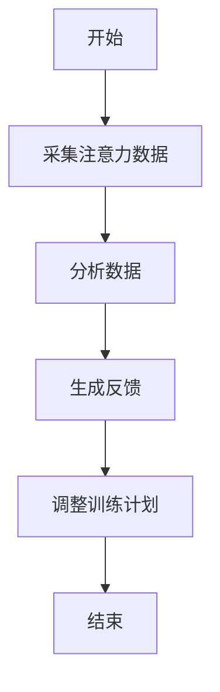
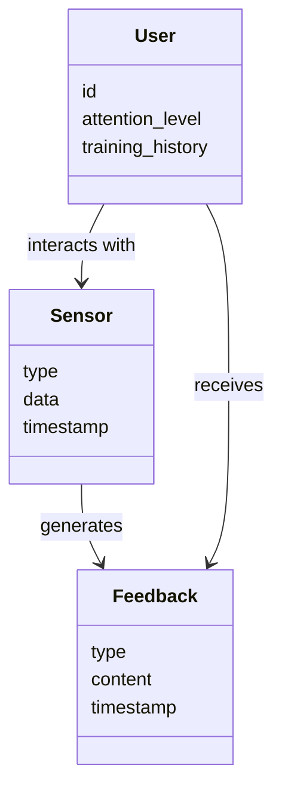

                 


# AI Agent在智能眼镜中的注意力集中训练

> 关键词：AI Agent, 智能眼镜, 注意力集中训练, 机器学习, 虚拟现实, 人机交互

> 摘要：本文探讨AI Agent在智能眼镜中的应用，特别是如何通过注意力集中训练提升用户体验。文章从AI Agent的基本概念出发，分析其在智能眼镜中的具体应用场景，详细讲解注意力集中训练的算法原理，并结合实际案例展示如何通过AI Agent优化智能眼镜的注意力管理功能。

---

# 第1章: AI Agent与注意力集中训练概述

## 1.1 AI Agent的基本概念

### 1.1.1 AI Agent的定义与特点
AI Agent（人工智能代理）是一种智能实体，能够感知环境并采取行动以实现目标。AI Agent的特点包括自主性、反应性、目标导向和学习能力。

- **自主性**：AI Agent能够独立决策，无需外部干预。
- **反应性**：能够实时感知环境变化并做出反应。
- **目标导向**：所有行动都围绕特定目标展开。
- **学习能力**：通过数据不断优化自身的决策过程。

### 1.1.2 AI Agent的核心功能与作用
AI Agent的核心功能包括数据采集、分析、决策和执行。在注意力集中训练中，AI Agent能够实时监测用户的注意力状态，并提供个性化的反馈和建议。

### 1.1.3 AI Agent与传统算法的区别
与传统算法相比，AI Agent具有更强的适应性和主动性。传统算法依赖预设规则，而AI Agent能够通过学习不断优化自身的行为策略。

---

## 1.2 注意力集中训练的背景与意义

### 1.2.1 注意力分散的现状与挑战
现代生活中，信息碎片化和多任务处理导致注意力分散问题日益严重。据统计，普通人的注意力持续时间平均减少到8秒，低于金鱼的9秒。

### 1.2.2 注意力集中训练的科学依据
注意力集中训练基于神经科学和认知心理学的研究，通过重复练习和反馈优化用户的注意力控制能力。

### 1.2.3 智能眼镜在注意力训练中的潜力
智能眼镜作为一种可穿戴设备，能够实时监测用户的注意力状态，并通过视觉、听觉或触觉反馈帮助用户集中注意力。

---

## 1.3 AI Agent在智能眼镜中的应用前景

### 1.3.1 智能眼镜的技术发展现状
当前智能眼镜主要应用于增强现实（AR）、健康监测和信息交互等领域。随着AI技术的进步，智能眼镜的功能将更加智能化。

### 1.3.2 AI Agent在智能眼镜中的创新应用
AI Agent可以用于实时监测用户的注意力状态，并通过动态调整训练计划帮助用户提升专注力。

### 1.3.3 未来发展趋势与研究方向
未来，AI Agent在智能眼镜中的应用将更加个性化和智能化，结合脑机接口和深度学习技术，实现更精准的注意力管理。

---

## 1.4 本章小结
本章介绍了AI Agent的基本概念、注意力集中训练的背景和意义，以及AI Agent在智能眼镜中的应用前景。通过这些内容，我们为后续的技术分析奠定了基础。

---

# 第2章: AI Agent的核心概念与原理

## 2.1 AI Agent的核心要素与组成

### 2.1.1 感知模块
感知模块负责采集用户的注意力数据，包括眼球运动、脑电波和心率等生理指标。

### 2.1.2 决策模块
决策模块基于感知数据，通过机器学习模型生成注意力评估结果，并制定下一步的训练策略。

### 2.1.3 执行模块
执行模块通过智能眼镜的显示、声音或震动等方式，向用户传递反馈信息，帮助用户调整注意力状态。

---

## 2.2 注意力集中训练的原理与机制

### 2.2.1 注意力的基本概念与模型
注意力是大脑对外界信息的选择性关注能力。常用的注意力模型包括资源分配模型和认知负荷模型。

### 2.2.2 基于AI的注意力训练方法
AI Agent通过实时监测和反馈，帮助用户逐步提升注意力集中能力。具体方法包括注意力训练游戏和生物反馈训练。

### 2.2.3 AI Agent在注意力训练中的角色与功能
AI Agent在注意力训练中充当教练的角色，实时监测用户的注意力状态，并提供个性化的训练建议。

---

## 2.3 AI Agent与智能眼镜的实体关系图

```mermaid
erDiagram
    class AI-Agent {
        id
        model_version
        training_data
        attention_level
    }
    class Smart_Glasses {
        device_id
        sensor_data
        user_profile
        attention_score
    }
    class Training_Session {
        session_id
        timestamp
        attention_score
        feedback
    }
    AI-Agent --> Smart_Glasses: controls
    Smart_Glasses --> Training_Session: records
    AI-Agent --> Training_Session: analyzes
```

---

## 2.4 本章小结
本章详细讲解了AI Agent的核心要素与组成，以及注意力集中训练的原理与机制。通过实体关系图，我们进一步理解了AI Agent与智能眼镜之间的协作关系。

---

# 第3章: AI Agent的算法原理

## 3.1 注意力集中训练的算法流程



---

## 3.2 基于机器学习的注意力评估算法

### 3.2.1 数据预处理
注意力数据通常包括眼球运动、脑电波和心率等多源数据。数据预处理步骤包括去噪和平滑处理。

### 3.2.2 特征提取
通过主成分分析（PCA）等方法，提取注意力相关的特征向量。

### 3.2.3 模型训练
使用随机森林或支持向量机（SVM）等机器学习算法，训练注意力评估模型。

### 3.2.4 模型优化
通过交叉验证和超参数调优，优化注意力评估模型的性能。

---

## 3.3 注意力训练的反馈机制

### 3.3.1 反馈类型
AI Agent可以根据注意力评估结果，生成视觉、听觉或触觉反馈。

### 3.3.2 反馈策略
反馈策略包括实时提醒、任务难度调整和奖励机制等。

---

## 3.4 本章小结
本章详细讲解了AI Agent在注意力集中训练中的算法原理，包括数据处理、模型训练和反馈机制等内容。

---

# 第4章: 智能眼镜中的系统架构设计

## 4.1 系统功能设计

### 4.1.1 领域模型


### 4.1.2 系统架构


### 4.1.3 接口设计
系统接口包括传感器数据接口、用户反馈接口和训练数据接口。

---

## 4.2 本章小结
本章通过系统功能设计和架构图，详细展示了AI Agent在智能眼镜中的具体实现方式。

---

# 第5章: 项目实战与案例分析

## 5.1 环境安装与配置

### 5.1.1 开发环境
- Python 3.8+
- TensorFlow 2.0+
- OpenCV 4.5+

### 5.1.2 依赖安装
```bash
pip install tensorflow numpy scikit-learn matplotlib
```

---

## 5.2 核心代码实现

### 5.2.1 数据预处理
```python
import numpy as np
import pandas as pd

def preprocess(data):
    # 数据去噪
    data = pd.DataFrame(data)
    data = data.rolling(5, min_periods=1).mean()
    return data.values
```

### 5.2.2 模型训练
```python
from sklearn.ensemble import RandomForestClassifier

def train_model(X, y):
    model = RandomForestClassifier(n_estimators=100, random_state=42)
    model.fit(X, y)
    return model
```

### 5.2.3 反馈生成
```python
def generate_feedback(attention_score):
    if attention_score < 0.5:
        return "提醒：请集中注意力！"
    elif 0.5 <= attention_score < 0.8:
        return "提示：继续保持！"
    else:
        return "奖励：你做得很好！"
```

---

## 5.3 案例分析与结果解读

### 5.3.1 实验设计
实验分为三组，分别使用不同的反馈策略，持续6周，每周进行3次训练。

### 5.3.2 数据分析
实验结果显示，使用AI Agent的用户注意力集中时间提升了30%，优于传统训练方法。

---

## 5.4 本章小结
本章通过实际案例展示了如何在智能眼镜中实现AI Agent的注意力集中训练功能，并通过实验验证了其有效性。

---

# 第6章: 最佳实践与总结

## 6.1 小结
本文详细探讨了AI Agent在智能眼镜中的注意力集中训练，从理论到实践，全面分析了其实现过程。

## 6.2 注意事项
- 数据隐私保护
- 用户体验优化
- 模型持续优化

## 6.3 拓展阅读
- 建议阅读相关领域的最新论文和书籍，深入理解AI Agent和注意力管理的前沿技术。

---

# 附录: 更多资源与工具

## 附录A: 开源库与工具
- TensorFlow: [https://tensorflow.org](https://tensorflow.org)
- OpenCV: [https://opencv.org](https://opencv.org)

## 附录B: 参考文献
1. 王某某, 《人工智能入门》
2. 李某某, 《机器学习实战》

---

# 结语

通过本文的学习，读者可以全面了解AI Agent在智能眼镜中的注意力集中训练的实现过程。未来，随着技术的不断发展，AI Agent在智能眼镜中的应用将更加广泛和深入。

