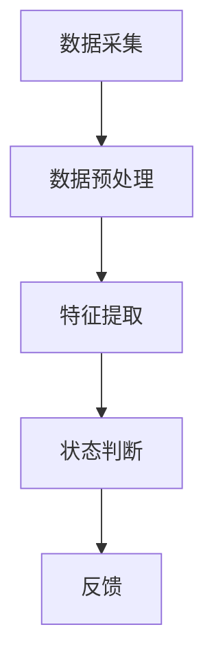
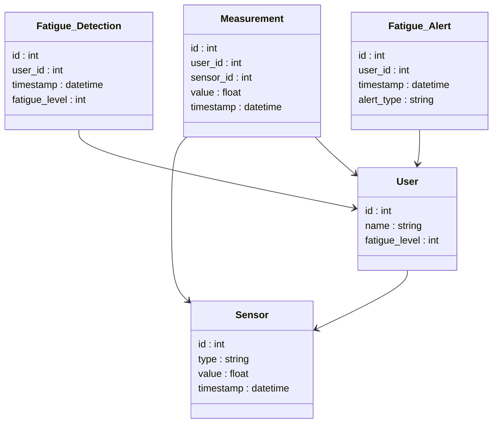
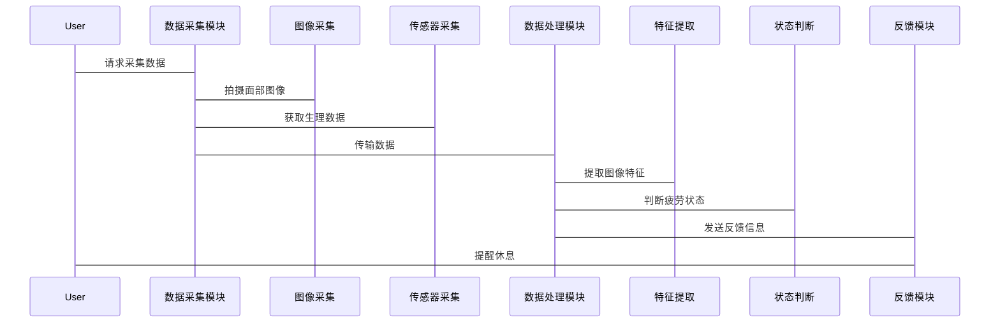

                 


# AI Agent在智能眼镜中的疲劳度检测

## 关键词：
AI Agent, 智能眼镜, 疲劳度检测, 计算机视觉, 机器学习, 健康监测

## 摘要：
本文将深入探讨AI Agent在智能眼镜中的疲劳度检测技术。首先，我们将介绍疲劳度检测的背景、问题及其在智能眼镜中的重要性。接着，我们将分析AI Agent的核心原理及其在疲劳度检测中的应用模式。随后，我们将详细讲解疲劳度检测的算法原理，包括数据采集、特征提取和模型训练等关键步骤。通过构建ER实体关系图和领域模型类图，我们将展示疲劳度检测系统的架构设计。最后，我们将通过实际项目案例，展示如何在智能眼镜中实现疲劳度检测，并总结相关的最佳实践和未来研究方向。

---

# 第一部分: AI Agent与疲劳度检测的背景与概念

# 第1章: 背景介绍

## 1.1 问题背景
### 1.1.1 智能眼镜的发展现状
智能眼镜作为一种融合了计算机视觉和人工智能技术的可穿戴设备，近年来得到了快速发展。其核心功能包括实时翻译、导航、健康监测等，而疲劳度检测是其中的重要应用之一。

### 1.1.2 疲劳度检测的必要性
在长时间使用电子设备的现代社会中，疲劳现象普遍存在。疲劳不仅影响工作效率，还可能引发安全事故。因此，及时检测并提醒用户休息具有重要意义。

### 1.1.3 AI Agent在智能眼镜中的作用
AI Agent（人工智能代理）能够实时分析用户的生理和行为数据，帮助智能眼镜实现疲劳度检测。通过多模态数据融合，AI Agent可以提供更精准的疲劳状态评估。

## 1.2 问题描述
### 1.2.1 疲劳度的定义与分类
疲劳可以分为生理疲劳和心理疲劳。生理疲劳主要表现为眼睛疲劳、肌肉酸痛等，而心理疲劳则与注意力下降、情绪波动有关。

### 1.2.2 疲劳度检测的指标与方法
疲劳度检测的指标包括眨眼频率、头部姿势、瞳孔变化、心率波动等。常用的方法包括基于图像的分析和生理数据的统计分析。

### 1.2.3 智能眼镜中的疲劳度检测场景
在智能眼镜中，疲劳度检测通常在用户长时间使用设备时触发。例如，用户在阅读、编程或驾驶时，系统可以实时监测其疲劳状态。

## 1.3 问题解决思路
### 1.3.1 疲劳度检测的多模态数据采集
通过摄像头采集用户的面部表情和眼部特征，同时结合心率监测等生理传感器数据，实现多模态数据融合。

### 1.3.2 AI Agent的实时分析能力
AI Agent能够实时处理多模态数据，通过机器学习模型预测用户的疲劳状态，并提供相应的反馈。

### 1.3.3 疲劳度检测的反馈机制
当检测到用户疲劳时，智能眼镜可以通过震动、提示音或调整屏幕亮度等方式提醒用户休息。

## 1.4 疲劳度检测的边界与外延
### 1.4.1 疲劳度检测的适用范围
疲劳度检测主要适用于长时间使用电子设备的场景，如办公、学习和驾驶。

### 1.4.2 疲劳度检测的局限性
目前的疲劳度检测技术可能受到环境光线、用户个体差异等因素的影响，存在一定的局限性。

### 1.4.3 疲劳度检测与其他健康监测功能的关联
疲劳度检测可以与其他健康监测功能（如心率监测、睡眠分析）结合，提供更全面的健康评估。

## 1.5 疲劳度检测的概念结构与核心要素
### 1.5.1 疲劳度检测的核心要素分析
- 数据采集：包括图像采集和生理数据采集。
- 数据处理：通过AI算法分析数据，提取疲劳相关特征。
- 状态判断：基于特征判断疲劳程度，并提供反馈。

### 1.5.2 AI Agent在疲劳度检测中的角色
AI Agent作为智能眼镜的核心，负责数据的实时处理和状态判断。

### 1.5.3 疲劳度检测系统的整体架构
疲劳度检测系统包括数据采集模块、数据处理模块和反馈模块，三者协同工作以实现疲劳检测。

# 第2章: 核心概念与联系

## 2.1 AI Agent的核心原理
### 2.1.1 AI Agent的基本概念
AI Agent是一种能够感知环境、执行任务的智能实体，能够在动态环境中做出决策。

### 2.1.2 AI Agent的分类与特点
AI Agent可以分为基于规则的代理和基于机器学习的代理。基于机器学习的代理能够通过数据训练不断提升性能。

### 2.1.3 AI Agent在智能眼镜中的应用模式
在智能眼镜中，AI Agent主要负责数据处理和状态判断，为用户提供实时反馈。

## 2.2 疲劳度检测的核心原理
### 2.2.1 疲劳度检测的生理指标
- 眨眼频率：疲劳时眨眼频率通常会增加。
- 瞳孔变化：疲劳可能导致瞳孔直径的变化。

### 2.2.2 疲劳度检测的心理指标
- 注意力下降：疲劳时注意力难以集中。
- 情绪波动：疲劳可能导致情绪不稳定。

### 2.2.3 疲劳度检测的多模态数据融合
通过结合图像数据和生理数据，可以更准确地判断疲劳状态。

## 2.3 核心概念的属性特征对比
### 2.3.1 不同疲劳度检测方法的对比分析
| 方法 | 优点 | 缺点 |
|------|------|------|
| 基于图像的检测 | 实时性强 | 易受光线影响 |
| 基于生理数据的检测 | 精度高 | 数据采集复杂 |

### 2.3.2 不同AI Agent算法的性能对比
| 算法 | 优点 | 缺点 |
|------|------|------|
| 基于规则的代理 | 实现简单 | 灵活性低 |
| 基于机器学习的代理 | 精度高 | 需要大量数据训练 |

### 2.3.3 疲劳度检测与其它健康监测功能的对比
疲劳度检测与心率监测、睡眠分析等健康监测功能在数据采集和分析上有一定的关联性。

## 2.4 ER实体关系图架构
```mermaid
erDiagram
    user {
        id
        name
        fatigue_level
    }
    sensor {
        id
        type
        timestamp
        value
    }
    measurement {
        id
        user_id
        sensor_id
        timestamp
        value
    }
    fatigue_detection {
        id
        user_id
        timestamp
        fatigue_level
    }
    fatigue_alert {
        id
        user_id
        timestamp
        alert_type
    }
```

# 第3章: 算法原理

## 3.1 算法流程
### 3.1.1 数据采集
通过摄像头采集用户的面部图像，同时采集心率等生理数据。

### 3.1.2 数据预处理
对图像数据进行去噪处理，提取关键特征（如眼周区域）。

### 3.1.3 特征提取
使用CNN模型提取图像特征，同时提取心率变化特征。

### 3.1.4 状态判断
基于提取的特征，通过机器学习模型预测疲劳状态。

## 3.2 算法实现
### 3.2.1 数据流图


### 3.2.2 算法代码
```python
import tensorflow as tf
from tensorflow.keras import layers

# 数据预处理
def preprocess(image):
    # 对图像进行归一化处理
    image = image / 255.0
    return image

# 特征提取模型
model = tf.keras.Sequential([
    layers.Conv2D(32, (3,3), activation='relu', input_shape=(64, 64, 3)),
    layers.MaxPooling2D((2,2)),
    layers.Conv2D(64, (3,3), activation='relu'),
    layers.MaxPooling2D((2,2)),
    layers.Flatten(),
    layers.Dense(128, activation='relu'),
    layers.Dense(2, activation='softmax')
])

# 编译模型
model.compile(optimizer='adam', loss='sparse_categorical_crossentropy', metrics=['accuracy'])

# 训练模型
model.fit(train_images, train_labels, epochs=10, validation_data=(test_images, test_labels))
```

### 3.2.3 数学模型
疲劳状态判断的数学模型如下：
$$ \text{fatigue\_level} = \text{max}(0, 1 - \frac{\text{attention\_score}}{1.5}) $$

其中，attention\_score是注意力分数，通过机器学习模型计算得出。

## 3.3 算法优化
### 3.3.1 参数调整
通过调整CNN模型的层数和节点数，优化模型性能。

### 3.3.2 数据增强
使用数据增强技术（如旋转、翻转）增加训练数据量，提升模型泛化能力。

### 3.3.3 模型评估
通过混淆矩阵和准确率评估模型性能，不断优化模型结构。

# 第4章: 系统分析与架构设计

## 4.1 项目场景介绍
本项目旨在设计一个基于AI Agent的智能眼镜疲劳度检测系统，实现对用户疲劳状态的实时监测和反馈。

## 4.2 系统功能设计
### 4.2.1 领域模型类图


### 4.2.2 系统架构图
```mermaid
container 智能眼镜 {
    component 数据采集模块 {
        -- 图像采集
        -- 传感器数据采集
    }
    component 数据处理模块 {
        -- 数据预处理
        -- 特征提取
        -- 状态判断
    }
    component 反馈模块 {
        -- 提醒用户休息
        -- 调整设备设置
    }
}
```

### 4.2.3 系统接口设计
- 数据采集接口：通过API采集用户的图像和生理数据。
- 状态判断接口：通过API返回用户的疲劳状态。
- 反馈接口：通过API发送提醒信息。

### 4.2.4 系统交互流程


# 第5章: 项目实战

## 5.1 环境安装
- 安装Python和必要的库（如TensorFlow、OpenCV）。
- 安装智能眼镜开发平台（如Google Glass API）。

## 5.2 系统核心实现
### 5.2.1 数据采集模块
```python
import cv2

def capture_image():
    cap = cv2.VideoCapture(0)
    ret, frame = cap.read()
    cv2.imwrite("face.jpg", frame)
    cap.release()
```

### 5.2.2 数据处理模块
```python
import tensorflow as tf
import cv2

def preprocess_image(image_path):
    image = cv2.imread(image_path)
    image = cv2.resize(image, (64, 64))
    image = image / 255.0
    return image

model = tf.keras.models.load_model("fatigue_model.h5")

def detect_fatigue(image):
    preprocessed = preprocess_image(image)
    prediction = model.predict(preprocessed.reshape(1, 64, 64, 3))
    return prediction[0][1]  # 0表示不疲劳，1表示疲劳
```

### 5.2.3 反馈模块
```python
import time

def send_alert(user_id):
    print(f"用户{user_id}疲劳，提醒休息！")
    time.sleep(5)
```

## 5.3 代码实现与解读
- 数据采集模块：通过摄像头捕获用户面部图像。
- 数据处理模块：对图像进行预处理，使用预训练模型判断疲劳状态。
- 反馈模块：当检测到疲劳时，发送提醒信息。

## 5.4 实际案例分析
### 5.4.1 案例背景
某用户在长时间阅读时，系统检测到其疲劳状态，发送提醒信息。

### 5.4.2 案例实现
```python
user_id = 1
capture_image()
fatigue_level = detect_fatigue("face.jpg")
if fatigue_level > 0.5:
    send_alert(user_id)
```

## 5.5 项目总结
通过实际案例分析，验证了系统的有效性。系统能够在用户疲劳时及时提醒，具有较高的实用价值。

# 第6章: 总结与展望

## 6.1 全文总结
本文详细介绍了AI Agent在智能眼镜中的疲劳度检测技术，从背景、原理到系统实现，全面探讨了相关问题。

## 6.2 最佳实践 tips
- 数据采集时，注意光线条件的控制。
- 模型训练时，增加多样化的数据集以提高泛化能力。
- 系统设计时，考虑用户体验，确保反馈机制的有效性。

## 6.3 注意事项
- 疲劳度检测结果仅供参考，不能完全替代专业医疗诊断。
- 系统运行时，确保数据安全和用户隐私保护。

## 6.4 拓展阅读
建议读者进一步学习计算机视觉和机器学习的相关知识，深入了解AI Agent在健康监测中的其他应用。

---

通过以上目录结构，我们可以看到，整本书从理论到实践，系统地介绍了AI Agent在智能眼镜中的疲劳度检测技术。每一章都详细展开，确保读者能够全面理解和掌握相关知识。

