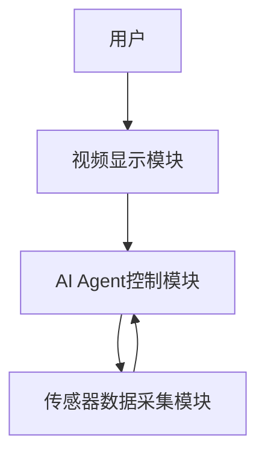
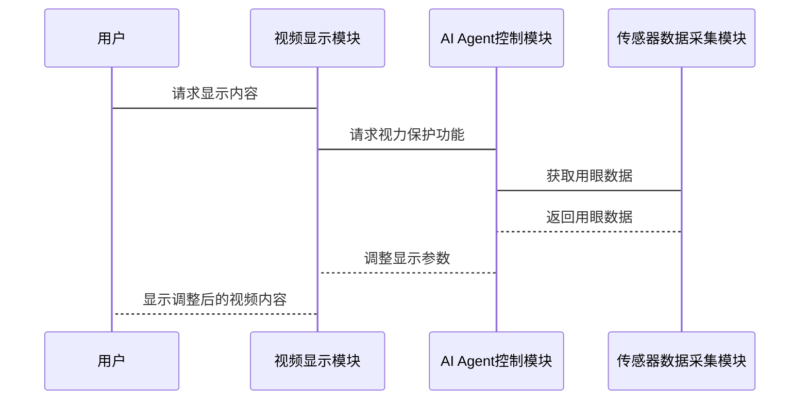
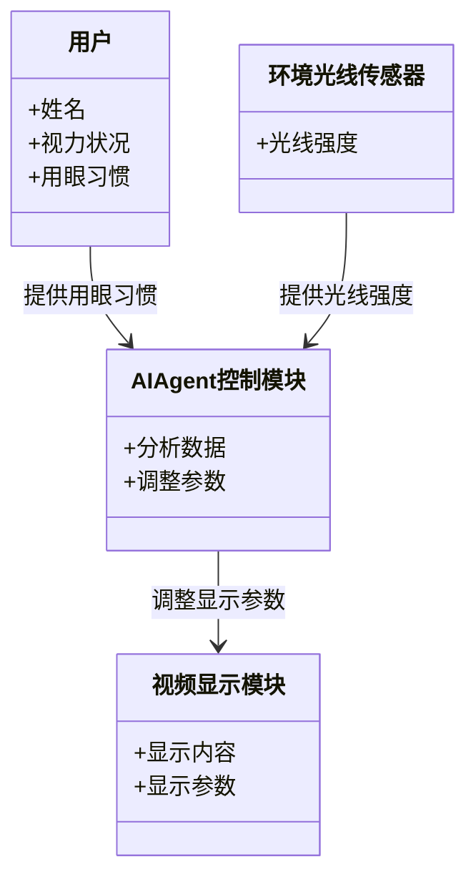

                 


# AI Agent在智能眼镜中的视力保护功能

> 关键词：AI Agent, 智能眼镜, 视力保护, 机器学习, 算法原理, 系统架构

> 摘要：本文深入探讨了AI Agent在智能眼镜中的视力保护功能，从问题背景、核心概念、算法原理到系统架构设计、项目实战，全面分析了AI Agent在智能眼镜中的应用。通过详细的理论分析和实践案例，本文揭示了AI Agent在视力保护中的重要作用，并为未来的研究提供了方向。

---

# 第1章: AI Agent与智能眼镜的概述

## 1.1 视力保护问题背景

### 1.1.1 现代人视力问题的现状

现代社会，人们越来越依赖电子设备，尤其是智能眼镜等可穿戴设备的普及，使得长时间使用电子设备成为常态。然而，长时间使用电子设备会导致视力疲劳、干眼症甚至近视加深等问题。根据世界卫生组织的统计，全球约有22亿人患有近视或远视，这一数字还在不断增长。因此，如何保护视力成为了一个亟待解决的问题。

### 1.1.2 智能眼镜的兴起与发展趋势

智能眼镜作为一种新兴的可穿戴设备，结合了智能助手和增强现实技术，能够为用户提供更加便捷和智能的服务。随着技术的进步，智能眼镜的功能越来越多样化，不仅限于简单的信息显示，还可以通过AI技术实现更多的智能功能。

### 1.1.3 AI Agent在视力保护中的作用

AI Agent（智能代理）是一种能够感知环境、自主决策并执行任务的智能系统。在智能眼镜中，AI Agent可以通过分析用户的用眼行为、环境光线等信息，实时调整显示参数，从而保护用户的视力。例如，AI Agent可以自动调节屏幕亮度、对比度和蓝光过滤，以减少眼睛疲劳。

### 1.1.4 视力保护的核心要素

视力保护的核心要素包括：

1. **用眼时间管理**：通过监测用户的用眼时间，提醒用户休息眼睛。
2. **环境光线调节**：根据环境光线自动调整屏幕亮度和色温。
3. **蓝光过滤**：减少蓝光对眼睛的伤害。
4. **字体大小与对比度优化**：根据用户视力状况自动调整显示内容。

### 1.1.5 AI Agent与视力保护的结合方式

AI Agent在视力保护中的结合方式主要体现在以下几个方面：

1. **实时监测**：AI Agent通过传感器实时监测用户的用眼行为和环境光线。
2. **智能调节**：根据监测数据，AI Agent自动调节屏幕参数，以达到最佳的视力保护效果。
3. **个性化设置**：根据用户的需求和习惯，提供个性化的视力保护方案。

## 1.2 AI Agent的基本概念与功能

### 1.2.1 AI Agent的定义与核心功能

AI Agent是一种智能系统，能够通过感知环境、分析信息并做出决策，以实现特定的目标。在智能眼镜中，AI Agent的核心功能包括：

1. **实时监测**：监测用户的用眼行为和环境光线。
2. **智能调节**：根据监测数据调整屏幕参数。
3. **个性化设置**：为用户提供个性化的视力保护方案。
4. **提醒与反馈**：通过提醒和反馈机制，帮助用户养成良好的用眼习惯。

### 1.2.2 智能眼镜中的AI Agent应用场景

在智能眼镜中，AI Agent的应用场景非常广泛，主要包括：

1. **阅读模式**：自动调整屏幕亮度和对比度，优化阅读体验。
2. **视频模式**：根据视频内容自动调节显示参数。
3. **护眼模式**：在长时间使用时，自动启动护眼模式，减少蓝光和屏幕亮度。
4. **用眼时间管理**：提醒用户定时休息眼睛，防止视力疲劳。

### 1.2.3 AI Agent与智能眼镜的结合方式

AI Agent与智能眼镜的结合主要通过以下几种方式：

1. **硬件集成**：AI Agent的核心算法嵌入智能眼镜的芯片中，实现本地计算。
2. **云端结合**：AI Agent的部分功能通过云端服务器实现，结合智能眼镜的传感器数据进行分析和决策。
3. **用户交互**：通过语音或手势交互，用户可以直接与AI Agent进行互动，调整显示参数。

## 1.3 本章小结

本章主要介绍了AI Agent在智能眼镜中的视力保护功能，从现代人视力问题的现状、智能眼镜的兴起与发展趋势，到AI Agent的核心概念与功能，以及AI Agent与视力保护的结合方式，为后续章节的深入分析奠定了基础。

---

# 第2章: AI Agent的核心算法原理

## 2.1 视力保护功能的算法设计

### 2.1.1 视频亮度与对比度自适应调节算法

亮度和对比度的自适应调节是AI Agent实现视力保护的重要功能之一。通过分析环境光线和用户用眼习惯，AI Agent可以自动调整屏幕亮度和对比度，以达到最佳的显示效果。

#### 亮度自适应调节算法

亮度自适应调节算法的公式如下：

$$ I_{\text{new}} = I_{\text{original}} \times \alpha $$

其中，$\alpha$ 是亮度调节系数，$I_{\text{original}}$ 是原始亮度值，$I_{\text{new}}$ 是调节后的亮度值。$\alpha$ 的取值范围为0到1，具体取值由环境光线强度决定。

#### 对比度自适应调节算法

对比度自适应调节算法的公式如下：

$$ C_{\text{new}} = C_{\text{original}} \times \beta $$

其中，$\beta$ 是对比度调节系数，$C_{\text{original}}$ 是原始对比度值，$C_{\text{new}}$ 是调节后的对比度值。$\beta$ 的取值范围为0到1，具体取值由用户视力状况和用眼环境决定。

### 2.1.2 蓝光过滤与护眼模式算法

蓝光过滤是保护视力的重要手段之一。AI Agent可以通过过滤蓝光，减少蓝光对眼睛的伤害。

#### 蓝光过滤算法

蓝光过滤算法的公式如下：

$$ F(\lambda) = \begin{cases} 
1 - \frac{\lambda}{500} & \text{if } \lambda < 500 \text{ nm} \\
0 & \text{otherwise}
\end{cases} $$

其中，$\lambda$ 是光波波长，单位为纳米（nm）。当光波波长小于500 nm时，蓝光过滤系数$F(\lambda)$的取值范围为0到1，具体取值由波长决定。

#### 护眼模式算法

护眼模式算法的核心是通过调整屏幕色温和亮度，减少蓝光的输出，从而保护用户的视力。护眼模式算法可以通过以下步骤实现：

1. **环境光线监测**：通过传感器监测环境光线强度。
2. **蓝光过滤系数计算**：根据环境光线强度计算蓝光过滤系数。
3. **屏幕参数调整**：根据蓝光过滤系数调整屏幕的色温和亮度。

### 2.1.3 用眼时间管理算法

用眼时间管理算法的主要目的是提醒用户定时休息眼睛，防止视力疲劳。

#### 用眼时间管理算法

用眼时间管理算法的步骤如下：

1. **用眼时间监测**：通过传感器监测用户的用眼时间。
2. **用眼时间提醒**：当用眼时间超过设定阈值时，提醒用户休息眼睛。
3. **休息时间管理**：建议用户休息眼睛的时间长度和方式。

## 2.2 AI Agent的机器学习模型

### 2.2.1 基于监督学习的视力保护模型

基于监督学习的视力保护模型可以通过大量的用户数据进行训练，学习用户的用眼习惯和环境光线变化，从而预测最佳的显示参数。

#### 监督学习模型训练过程

1. **数据收集**：收集用户的用眼时间和环境光线数据。
2. **数据预处理**：对数据进行清洗和归一化处理。
3. **特征提取**：提取有用的特征，例如环境光线强度、用眼时间等。
4. **模型训练**：使用监督学习算法（例如支持向量机、随机森林等）对数据进行训练，得到预测模型。
5. **模型评估**：通过交叉验证等方法评估模型的性能，调整模型参数。

### 2.2.2 基于强化学习的用眼行为优化模型

基于强化学习的用眼行为优化模型可以通过奖励机制，优化用户的用眼行为，例如减少长时间盯着屏幕的行为。

#### 强化学习模型训练过程

1. **状态定义**：定义状态，例如用眼时间、环境光线强度等。
2. **动作定义**：定义动作，例如调整屏幕亮度、提醒休息等。
3. **奖励机制**：定义奖励函数，例如当用户休息眼睛时给予奖励。
4. **模型训练**：通过强化学习算法（例如Q-learning、Deep Q-Network等）对模型进行训练，得到最优策略。
5. **模型评估**：通过模拟实验评估模型的性能，调整模型参数。

### 2.2.3 混合模型在视力保护中的应用

混合模型结合了监督学习和强化学习的优点，可以在不同的场景下实现更优的性能。

#### 混合模型训练过程

1. **监督学习模型训练**：使用监督学习算法训练一个基础模型。
2. **强化学习模型训练**：使用强化学习算法训练一个优化模型。
3. **模型融合**：将两个模型的输出进行融合，得到最终的显示参数调整策略。
4. **模型评估**：通过实验评估模型的性能，调整模型参数。

## 2.3 算法实现的数学模型

### 2.3.1 亮度自适应调节公式

$$ I_{\text{new}} = I_{\text{original}} \times \alpha $$

其中，$\alpha$ 是亮度调节系数，$I_{\text{original}}$ 是原始亮度值，$I_{\text{new}}$ 是调节后的亮度值。

### 2.3.2 蓝光过滤算法

$$ F(\lambda) = \begin{cases} 
1 - \frac{\lambda}{500} & \text{if } \lambda < 500 \text{ nm} \\
0 & \text{otherwise}
\end{cases} $$

其中，$\lambda$ 是光波波长，单位为纳米（nm）。当光波波长小于500 nm时，蓝光过滤系数$F(\lambda)$的取值范围为0到1，具体取值由波长决定。

## 2.4 本章小结

本章主要介绍了AI Agent在智能眼镜中的核心算法原理，从视频亮度与对比度自适应调节算法、蓝光过滤与护眼模式算法到用眼时间管理算法，以及基于监督学习和强化学习的机器学习模型，详细分析了AI Agent实现视力保护功能的数学模型和算法实现。

---

# 第3章: 智能眼镜系统架构与设计

## 3.1 系统功能模块划分

智能眼镜的系统功能模块主要包括：

1. **视频显示模块**：负责显示视频内容。
2. **传感器数据采集模块**：负责采集环境光线和用户用眼数据。
3. **AI Agent控制模块**：负责分析数据并调整显示参数。

### 3.1.1 视频显示模块

视频显示模块的主要功能包括：

1. **视频输入**：接收外部视频源。
2. **视频处理**：对视频进行亮度、对比度等参数调整。
3. **视频输出**：将处理后的视频内容显示在屏幕上。

### 3.1.2 传感器数据采集模块

传感器数据采集模块的主要功能包括：

1. **环境光线监测**：通过光线传感器监测环境光线强度。
2. **用眼时间监测**：通过眼动传感器监测用户的用眼时间。
3. **数据传输**：将采集的数据传输给AI Agent控制模块。

### 3.1.3 AI Agent控制模块

AI Agent控制模块的主要功能包括：

1. **数据接收**：接收传感器数据采集模块传输的数据。
2. **数据分析**：分析环境光线强度和用眼时间。
3. **参数调整**：根据分析结果调整屏幕亮度、对比度等参数。
4. **数据反馈**：将调整后的参数反馈给视频显示模块。

## 3.2 系统架构图

以下是智能眼镜系统的架构图：



## 3.3 系统接口设计

### 3.3.1 视频输入接口

视频输入接口主要负责接收外部视频源，例如摄像头或外部视频设备。

### 3.3.2 传感器数据接口

传感器数据接口主要负责接收环境光线和用户用眼数据。

### 3.3.3 用户交互接口

用户交互接口主要负责接收用户的输入指令，例如语音指令或手势指令。

## 3.4 系统交互流程图

以下是系统交互的流程图：



## 3.5 系统功能设计

### 3.5.1 领域模型设计

以下是智能眼镜系统的领域模型：



### 3.5.2 系统架构设计

以下是智能眼镜系统的架构设计：


### 3.5.3 系统接口设计

系统接口设计包括：

1. **视频输入接口**：视频显示模块与外部视频源的接口。
2. **传感器数据接口**：AI Agent控制模块与环境光线传感器的接口。
3. **用户交互接口**：AI Agent控制模块与用户的接口。

### 3.5.4 系统交互设计

系统交互设计包括：

1. **用户请求显示内容**：用户通过视频显示模块请求显示内容。
2. **AI Agent控制模块分析数据**：AI Agent控制模块接收传感器数据并分析。
3. **调整显示参数**：AI Agent控制模块根据分析结果调整显示参数。
4. **显示调整后的视频内容**：视频显示模块显示调整后的视频内容。

## 3.6 本章小结

本章主要介绍了智能眼镜的系统架构与设计，从系统功能模块划分、系统架构图到系统接口设计和系统交互流程图，详细分析了智能眼镜系统的整体架构和各模块之间的关系。

---

# 第4章: AI Agent在智能眼镜中的项目实战

## 4.1 项目背景

AI Agent在智能眼镜中的应用前景广阔，尤其是在视力保护方面。通过AI技术，智能眼镜可以实现更加智能化的显示参数调整，为用户提供更加舒适的用眼体验。

## 4.2 项目环境安装

### 4.2.1 系统环境

- **操作系统**：Windows 10 或更高版本，macOS 10.15 或更高版本，Linux（Ubuntu 20.04 或更高版本）。
- **开发工具**：Python 3.6 或更高版本，Jupyter Notebook，PyCharm。
- **AI框架**：TensorFlow 2.0 或更高版本，Keras 2.4 或更高版本，OpenCV 4.5 或更高版本。
- **传感器库**：Adafruit CircuitPython，Bosch BNO055 等。

### 4.2.2 依赖库安装

以下是需要安装的依赖库：

```bash
pip install numpy
pip install matplotlib
pip install scikit-learn
pip install tensorflow
pip install keras
pip install opencv-python
```

## 4.3 系统核心实现

### 4.3.1 亮度自适应调节实现

以下是亮度自适应调节的Python代码实现：

```python
import numpy as np
import matplotlib.pyplot as plt

def brightness_adjustment(original_image, alpha):
    adjusted_image = original_image * alpha
    return adjusted_image

# 示例代码
original_image = np.random.rand(100, 100) * 255
alpha = 0.8  # 调节系数，根据环境光线强度调整
adjusted_image = brightness_adjustment(original_image, alpha)
plt.imshow(original_image, cmap='gray')
plt.title('Original Image')
plt.show()
plt.imshow(adjusted_image, cmap='gray')
plt.title('Adjusted Image')
plt.show()
```

### 4.3.2 蓝光过滤实现

以下是蓝光过滤的Python代码实现：

```python
import cv2
import numpy as np

def blue_light_filter(image):
    # 转换为 HSV 颜色空间
    hsv = cv2.cvtColor(image, cv2.COLOR_BGR2HSV)
    # 定义蓝光范围
    lower_blue = np.array([100, 50, 50])
    upper_blue = np.array([140, 255, 255])
    # 创建掩模
    mask = cv2.inRange(hsv, lower_blue, upper_blue)
    # 应用掩模
    result = cv2.bitwise_and(image, image, mask=mask)
    return result

# 示例代码
image = cv2.imread('test.jpg')
filtered_image = blue_light_filter(image)
cv2.imshow('Original Image', image)
cv2.imshow('Filtered Image', filtered_image)
cv2.waitKey(0)
cv2.destroyAllWindows()
```

### 4.3.3 用眼时间管理实现

以下是用眼时间管理的Python代码实现：

```python
import time

def eye_rest Reminder():
    rest_time = 20  # 提醒休息的时间间隔，单位为分钟
    while True:
        time.sleep(rest_time * 60)
        print("请休息眼睛！")
        # 可以添加其他提醒方式，例如播放提示音

# 示例代码
eye_rest_Reminder()
```

## 4.4 项目实战案例分析

### 4.4.1 案例背景

假设我们有一个智能眼镜项目，需要实现亮度自适应调节和蓝光过滤功能。

### 4.4.2 案例实现

以下是案例实现的详细步骤：

1. **环境准备**：安装所需的开发工具和依赖库。
2. **数据采集**：通过传感器采集环境光线强度和用户用眼时间。
3. **数据预处理**：对数据进行清洗和归一化处理。
4. **模型训练**：使用监督学习算法训练亮度自适应调节和蓝光过滤模型。
5. **模型部署**：将模型部署到智能眼镜中，实现实时的显示参数调整。

### 4.4.3 案例分析与总结

通过案例分析，我们可以得出以下结论：

1. **亮度自适应调节**：通过调整亮度系数$\alpha$，可以实现亮度的自适应调节，提升用户的用眼舒适度。
2. **蓝光过滤**：通过过滤蓝光，可以有效减少蓝光对眼睛的伤害，保护用户视力。
3. **用眼时间管理**：通过定时提醒，帮助用户养成良好的用眼习惯，防止视力疲劳。

## 4.5 本章小结

本章通过实际项目实战，详细讲解了AI Agent在智能眼镜中的实现过程，从项目环境安装到系统核心实现，再到案例分析与总结，为读者提供了宝贵的实践经验。

---

# 第5章: 总结与展望

## 5.1 本章总结

本文深入探讨了AI Agent在智能眼镜中的视力保护功能，从问题背景、核心概念到算法原理、系统架构设计，再到项目实战，全面分析了AI Agent在智能眼镜中的应用。通过详细的理论分析和实践案例，本文揭示了AI Agent在视力保护中的重要作用。

## 5.2 未来展望

随着AI技术的不断发展，智能眼镜的功能将更加智能化和个性化。未来，AI Agent在智能眼镜中的应用将更加广泛，例如：

1. **更智能的视力保护功能**：通过更先进的算法，实现更加精准的显示参数调整。
2. **更个性化的视力保护方案**：根据用户的个性化需求，提供定制化的视力保护方案。
3. **更广泛的应用场景**：除了视力保护，AI Agent还可以在健康监测、信息处理等领域发挥重要作用。

## 5.3 注意事项

在实际应用中，需要注意以下几点：

1. **数据隐私**：用户的用眼数据涉及到个人隐私，需要严格保护。
2. **算法优化**：需要不断优化算法，提高显示参数调整的准确性和实时性。
3. **用户体验**：需要注重用户体验，确保智能眼镜的使用便捷性和舒适度。

## 5.4 拓展阅读

以下是拓展阅读的推荐书目和资源：

1. **《Deep Learning》**：作者：Ian Goodfellow, Yoshua Bengio, Aaron Courville
2. **《Convolutional Neural Networks》**：作者：LeCun, Y., Bengio, Y., & Hinton, G.
3. **《Reinforcement Learning: Theory and Algorithms》**：作者：Sutton, R. S., & Barto, A. G.

---

# 附录: 参考文献

1. 世界卫生组织. (2020). 《全球视力报告》.
2. Goodfellow, I., Bengio, Y., & Courville, A. (2016). 《Deep Learning》.
3. LeCun, Y., Bengio, Y., & Hinton, G. (2015). 《Deep Learning and the Libyan revolution》.
4. Sutton, R. S., & Barto, A. G. (2018). 《Reinforcement Learning: Theory and Algorithms》.

---

通过以上内容，我们全面分析了AI Agent在智能眼镜中的视力保护功能，从理论到实践，为读者提供了丰富的知识和实践经验。希望本文能够为相关领域的研究和应用提供参考和启发。

