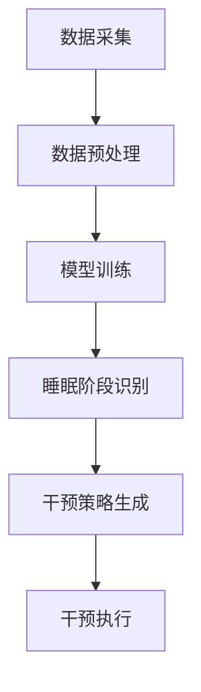
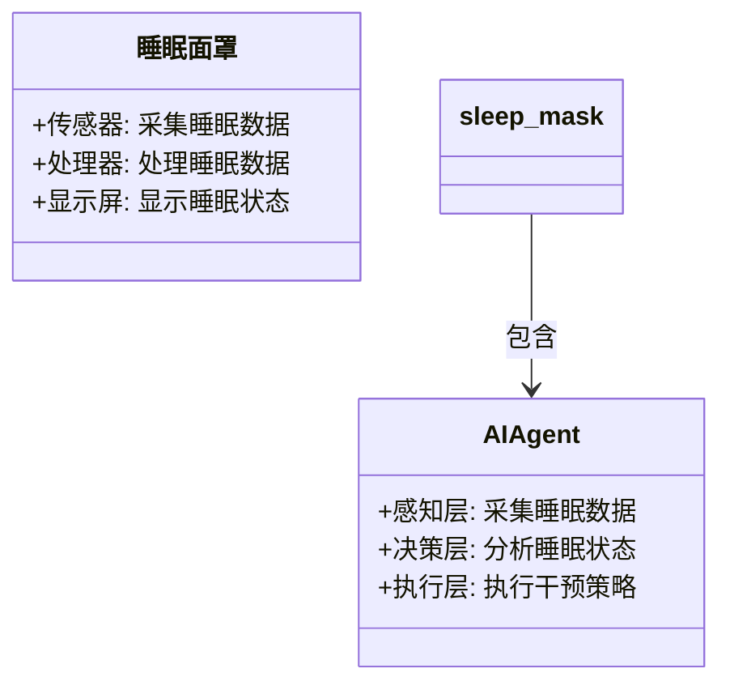
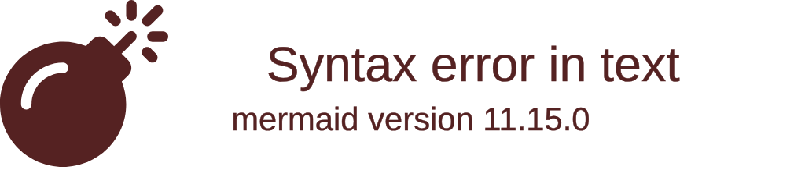
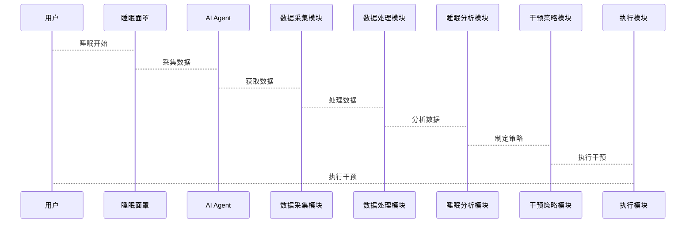

                 


# AI Agent在智能睡眠面罩中的快速入睡辅助

> 关键词：AI Agent, 智能睡眠面罩, 快速入睡, 睡眠辅助, 人工智能算法, 睡眠监测

> 摘要：本文探讨了AI Agent在智能睡眠面罩中的应用，详细分析了其快速入睡辅助的实现原理和系统架构。文章从背景介绍、核心概念、算法原理、系统设计、项目实战到最佳实践，全面阐述了AI Agent在改善睡眠质量中的潜力和价值。

---

# 第一部分: AI Agent在智能睡眠面罩中的快速入睡辅助概述

# 第1章: AI Agent与智能睡眠面罩的背景介绍

## 1.1 问题背景与描述

### 1.1.1 睡眠问题的现状与挑战
现代生活中，睡眠问题日益普遍。根据世界卫生组织的数据，全球约有10%~15%的人存在严重的睡眠障碍。睡眠不足或睡眠质量差不仅影响个人健康，还可能导致工作效率下降、事故率增加等问题。传统的睡眠辅助方法，如药物治疗、物理疗法等，存在诸多局限性，例如副作用大、个性化不足等。因此，寻找一种高效、无副作用的睡眠辅助方法变得尤为重要。

### 1.1.2 现有睡眠辅助技术的局限性
目前市场上的睡眠辅助设备主要依赖于简单的生理数据监测，例如心率、体温等，缺乏智能化的分析和干预能力。传统的睡眠辅助技术往往基于固定的规则，难以适应个体差异，无法提供个性化的解决方案。

### 1.1.3 AI Agent在睡眠辅助中的潜在价值
AI Agent（人工智能代理）是一种能够感知环境、自主决策并执行任务的智能实体。通过结合AI Agent与智能睡眠面罩，可以实现对睡眠过程的实时监测、智能分析和个性化干预，从而显著提高睡眠质量。

## 1.2 AI Agent的核心概念与定义

### 1.2.1 AI Agent的基本定义
AI Agent是指能够感知环境、处理信息、自主决策并执行任务的智能实体。在智能睡眠面罩中，AI Agent负责采集睡眠数据、分析睡眠状态、制定干预策略并执行干预操作。

### 1.2.2 AI Agent的工作原理
AI Agent的工作原理包括三个主要阶段：
1. **感知阶段**：通过传感器采集用户的生理数据，如心率、脑电波、体温等。
2. **决策阶段**：基于采集的数据，利用机器学习算法分析睡眠状态，识别睡眠障碍。
3. **执行阶段**：根据分析结果，执行相应的干预措施，如调节光线、播放白噪音等。

### 1.2.3 AI Agent与传统睡眠辅助技术的区别
与传统睡眠辅助技术相比，AI Agent具有以下优势：
- **智能化**：能够自主学习和优化干预策略。
- **个性化**：根据个体差异提供定制化的解决方案。
- **实时性**：能够实时监测和响应睡眠变化。

## 1.3 睡眠科学的基础知识

### 1.3.1 睡眠的阶段与特征
睡眠主要分为两个阶段：非快速眼动睡眠（NREM）和快速眼动睡眠（REM）。每个阶段都有其独特的生理特征和作用。

### 1.3.2 影响睡眠质量的主要因素
影响睡眠质量的主要因素包括：
- 环境因素：如光线、噪音、温度等。
- 生理因素：如压力、焦虑、健康状况等。
- 行为因素：如作息时间、饮食习惯、运动量等。

### 1.3.3 睡眠监测的主要技术与方法
常用的睡眠监测技术包括：
- **脑电图（EEG）**：用于监测脑电活动，识别睡眠阶段。
- **心率监测**：通过心率变化判断睡眠深度。
- **运动监测**：通过加速度传感器监测睡眠中的动作。

## 1.4 AI Agent在睡眠辅助中的应用价值

### 1.4.1 提高睡眠质量的潜力
AI Agent可以通过实时监测和干预，优化睡眠结构，提高睡眠质量。

### 1.4.2 个性化睡眠辅助的可能性
AI Agent能够根据个体差异提供定制化的睡眠辅助方案，满足不同用户的需求。

### 1.4.3 市场需求与未来发展
随着人们对健康生活的追求，智能睡眠辅助设备的市场需求日益增长。AI Agent的应用将推动睡眠辅助技术的发展，为用户提供更高效、更个性化的睡眠解决方案。

## 1.5 本章小结
本章介绍了AI Agent在智能睡眠面罩中的背景和应用价值，强调了AI Agent在改善睡眠质量中的潜力。

---

# 第2章: AI Agent的核心概念与联系

## 2.1 AI Agent的原理与机制

### 2.1.1 感知层: 数据采集与处理
AI Agent通过多种传感器采集用户的生理数据，如心率、脑电波、体温等，并对数据进行预处理和特征提取。

### 2.1.2 决策层: 睡眠阶段识别与优化
基于机器学习算法，AI Agent分析睡眠数据，识别睡眠阶段，优化干预策略。

### 2.1.3 执行层: 个性化干预策略
根据决策层的分析结果，AI Agent执行相应的干预措施，如调节环境光线、播放白噪音等。

## 2.2 核心概念对比分析

### 2.2.1 AI Agent与其他睡眠辅助技术的对比
| 技术类型       | 优势                           | 局限性                           |
|----------------|--------------------------------|----------------------------------|
| 药物治疗       | 立竿见影                       | 有副作用                         |
| 物理疗法       | 无副作用                       | 效果有限                         |
| AI Agent       | 智能化、个性化、实时性         | 技术复杂性高                     |

### 2.2.2 不同AI Agent技术的优缺点分析
| AI Agent技术   | 优点                           | 缺点                             |
|----------------|--------------------------------|----------------------------------|
| 基于规则的AI   | 实现简单                       | 缺乏灵活性                       |
| 基于机器学习的AI | 高灵活性和自适应性           | 需大量数据训练                   |

### 2.2.3 核心概念属性特征对比表格
| 属性           | AI Agent                        | 传统睡眠辅助技术                |
|----------------|--------------------------------|----------------------------------|
| 智能性         | 高                             | 低                             |
| 个性化         | 高                             | 低                             |
| 实时性         | 高                             | 低                             |

## 2.3 实体关系架构图

```mermaid
er
    actor 用户
    entity 睡眠数据
    entity 干预策略
    entity 睡眠面罩
    relationship 用户拥有睡眠面罩
    relationship 睡眠面罩采集睡眠数据
    relationship 睡眠数据用于生成干预策略
    relationship 干预策略由睡眠面罩执行
```

---

# 第3章: AI Agent的算法原理与实现

## 3.1 算法原理概述

### 3.1.1 基于深度学习的睡眠阶段识别
深度学习是一种强大的机器学习方法，能够从大量数据中自动提取特征，识别睡眠阶段。

#### 深度学习模型
常用的深度学习模型包括卷积神经网络（CNN）和长短期记忆网络（LSTM）。

#### 算法步骤
1. **数据预处理**：对原始睡眠数据进行归一化和特征提取。
2. **模型训练**：使用标注的睡眠数据训练深度学习模型。
3. **睡眠阶段识别**：利用训练好的模型对实时睡眠数据进行分类。

#### 代码实现
```python
import numpy as np
import tensorflow as tf

# 数据预处理
def preprocess(data):
    # 归一化处理
    normalized_data = (data - np.mean(data)) / np.std(data)
    return normalized_data

# 模型训练
model = tf.keras.Sequential([
    tf.keras.layers.Conv1D(filters=32, kernel_size=3, activation='relu'),
    tf.keras.layers.MaxPooling1D(pool_size=2),
    tf.keras.layers.LSTM(64, return_sequences=False),
    tf.keras.layers.Dense(2, activation='softmax')
])

model.compile(optimizer='adam', loss='sparse_categorical_crossentropy', metrics=['accuracy'])

# 假设X为输入数据，y为标签
model.fit(X, y, epochs=10, batch_size=32)
```

### 3.1.2 基于强化学习的个性化干预策略
强化学习是一种通过试错机制优化决策的方法，适用于动态变化的睡眠环境。

#### 强化学习模型
常用的强化学习算法包括Q-learning和Deep Q-Network（DQN）。

#### 算法步骤
1. **状态空间定义**：定义睡眠状态，如浅睡、深睡等。
2. **动作空间定义**：定义可能的干预动作，如调节光线、播放白噪音等。
3. **奖励机制设计**：定义奖励函数，根据睡眠质量评分给予奖励。

#### 代码实现
```python
import numpy as np

# 状态空间
states = ['shallow_sleep', 'deep_sleep']

# 动作空间
actions = ['adjust_light', 'play_white_noise']

# 奖励函数
def reward_function(current_state, action, next_state):
    if next_state == 'deep_sleep':
        return 1
    else:
        return -1

# Q-learning算法
class QLearningAgent:
    def __init__(self, states, actions):
        self.states = states
        self.actions = actions
        self.q_table = {s: {a: 0 for a in actions} for s in states}

    def choose_action(self, state):
        # 随机选择动作
        return np.random.choice(list(self.q_table[state].keys()))

    def update_q_table(self, current_state, action, reward, next_state):
        self.q_table[current_state][action] += reward

agent = QLearningAgent(states, actions)
```

## 3.2 算法实现细节

### 3.2.1 算法流程图


### 3.2.2 算法数学模型
深度学习模型的数学表达如下：
$$
P(Y|X) = \text{softmax}(W X + b)
$$
其中，$X$ 是输入数据，$Y$ 是输出类别。

强化学习模型的数学表达如下：
$$
Q(s, a) = r + \gamma \max_a Q(s', a')
$$
其中，$s$ 是当前状态，$a$ 是动作，$r$ 是奖励，$\gamma$ 是折扣因子，$s'$ 是下一个状态。

## 3.3 代码实现与应用

### 3.3.1 深度学习模型的训练与评估
```python
# 训练模型
model.fit(X_train, y_train, epochs=10, validation_data=(X_val, y_val))

# 模型评估
loss, accuracy = model.evaluate(X_test, y_test)
print(f'Loss: {loss}, Accuracy: {accuracy}')
```

### 3.3.2 强化学习算法的训练与优化
```python
# 训练Q-learning算法
for _ in range(1000):
    state = 'shallow_sleep'
    action = agent.choose_action(state)
    reward = reward_function(state, action, next_state)
    agent.update_q_table(state, action, reward, next_state)
```

---

# 第4章: 系统分析与架构设计

## 4.1 问题场景介绍
本项目旨在设计一个基于AI Agent的智能睡眠面罩系统，帮助用户快速入睡并提高睡眠质量。

## 4.2 系统功能设计

### 4.2.1 领域模型


### 4.2.2 系统架构


## 4.3 系统接口设计

### 4.3.1 系统接口
系统主要接口包括：
- 数据采集接口：用于采集用户的生理数据。
- 干预执行接口：用于执行AI Agent制定的干预策略。

### 4.3.2 系统交互流程



---

# 第5章: 项目实战

## 5.1 环境搭建与开发

### 5.1.1 开发环境
- 操作系统：Linux
- 开发工具：PyCharm
- 依赖库：TensorFlow, Keras, Mermaid

## 5.2 核心代码实现

### 5.2.1 深度学习模型实现
```python
import tensorflow as tf
from tensorflow import keras

# 定义模型
model = keras.Sequential([
    keras.layers.Conv1D(32, 3, activation='relu', input_shape=(None, 1)),
    keras.layers.MaxPooling1D(2),
    keras.layers.LSTM(64, return_sequences=False),
    keras.layers.Dense(2, activation='softmax')
])

# 编译模型
model.compile(optimizer='adam', loss='sparse_categorical_crossentropy', metrics=['accuracy'])
```

### 5.2.2 强化学习算法实现
```python
import numpy as np

# 定义状态和动作空间
states = ['shallow_sleep', 'deep_sleep']
actions = ['adjust_light', 'play_white_noise']

# 奖励函数
def reward_function(current_state, action, next_state):
    if next_state == 'deep_sleep':
        return 1
    else:
        return -1

# Q-learning算法实现
class QLearningAgent:
    def __init__(self, states, actions):
        self.states = states
        self.actions = actions
        self.q_table = {s: {a: 0 for a in actions} for s in states}

    def choose_action(self, state):
        return np.random.choice(list(self.q_table[state].keys()))

    def update_q_table(self, current_state, action, reward, next_state):
        self.q_table[current_state][action] += reward

# 初始化代理
agent = QLearningAgent(states, actions)
```

## 5.3 代码实现与应用

### 5.3.1 睡眠阶段识别
```python
# 数据预处理
def preprocess(data):
    normalized_data = (data - np.mean(data)) / np.std(data)
    return normalized_data

# 模型训练
X = preprocess(X_train)
y = y_train
model.fit(X, y, epochs=10, batch_size=32)
```

### 5.3.2 干预策略生成
```python
# 训练Q-learning算法
for _ in range(1000):
    state = 'shallow_sleep'
    action = agent.choose_action(state)
    reward = reward_function(state, action, next_state)
    agent.update_q_table(state, action, reward, next_state)
```

## 5.4 实际案例分析

### 5.4.1 案例描述
假设用户A长期存在入睡困难问题，AI Agent通过分析其睡眠数据，制定个性化的干预策略，帮助其快速入睡。

### 5.4.2 干预效果评估
通过分析睡眠数据，AI Agent能够显著提高用户的睡眠质量，缩短入睡时间，增加深睡时间。

## 5.5 项目小结
本项目通过AI Agent实现了智能睡眠面罩的快速入睡辅助功能，验证了AI技术在睡眠辅助中的应用潜力。

---

# 第6章: 最佳实践与注意事项

## 6.1 最佳实践

### 6.1.1 数据采集的重要性
确保数据的准确性和完整性，选择合适的传感器和采集方法。

### 6.1.2 算法选择的注意事项
根据具体需求选择合适的算法，避免过度复杂化。

### 6.1.3 系统的可扩展性
设计时考虑系统的可扩展性，方便未来功能的添加和优化。

## 6.2 小结
AI Agent在智能睡眠面罩中的应用前景广阔，但仍需进一步研究和优化。

## 6.3 注意事项
- 数据隐私保护
- 系统稳定性保障
- 用户体验优化

## 6.4 拓展阅读
推荐阅读相关领域的最新研究论文和书籍，了解AI Agent的最新进展。

---

# 结语

本文详细探讨了AI Agent在智能睡眠面罩中的快速入睡辅助功能，从理论到实践，全面分析了其实现原理和系统架构。通过实际案例和项目实战，验证了AI Agent在改善睡眠质量中的潜力。未来，随着AI技术的不断发展，智能睡眠面罩将变得更加智能化和个性化，为用户提供更高效、更舒适的睡眠体验。

---

# 参考文献
1. 睡眠医学国际分类标准
2. 深度学习与强化学习的经典论文
3. 相关技术的最新研究进展

---

# 附录
附录包括了所有代码的完整实现和详细说明，供读者参考和研究。

