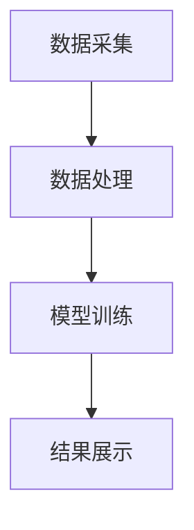
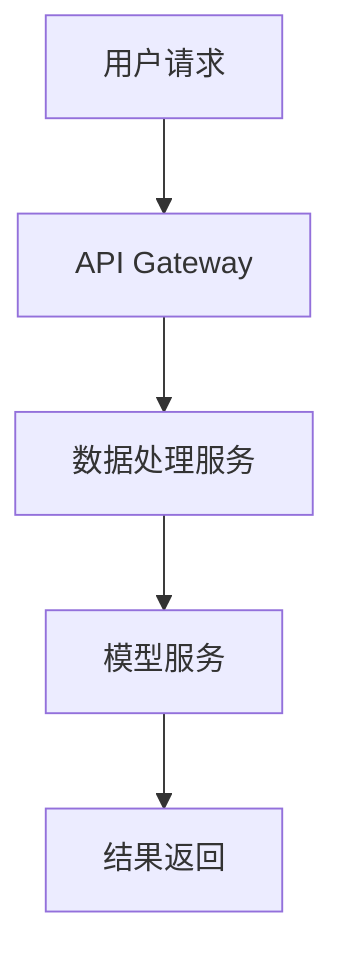

                 


# AI Agent在智能社交网络分析中的应用

---

## 关键词：AI Agent、社交网络分析、情感分析、影响力分析、推荐系统、异常检测

---

## 摘要：  
本文探讨了AI Agent在智能社交网络分析中的应用，详细介绍了AI Agent的核心功能、社交网络分析的基本概念，以及它们的结合方式。通过分析情感分析、用户行为分析和异常检测等应用场景，本文揭示了AI Agent如何利用自然语言处理、图论和强化学习等技术提升社交网络分析的效率和准确性。文章还讨论了AI Agent在社交网络分析中的挑战与解决方案，并通过实际案例展示了其在现实中的应用价值。

---

## 第1章：引言

### 1.1 AI Agent与社交网络分析的背景  
AI Agent（人工智能代理）是一种能够感知环境、自主决策并执行任务的智能实体。在社交网络分析中，AI Agent可以通过收集、处理和分析社交数据，帮助我们更好地理解用户行为、情感倾向和网络结构。随着社交网络的快速发展，数据量的爆炸式增长使得传统的手动分析方法难以应对复杂的社交网络问题，AI Agent的引入为社交网络分析提供了新的可能性。

---

## 第2章：AI Agent与社交网络分析的技术基础

### 2.1 自然语言处理（NLP）  
NLP是AI Agent在社交网络分析中的核心技术之一，主要用于处理文本数据。  
- **核心任务**：包括文本分类、情感分析、实体识别和文本摘要等。  
- **常见模型**：如词袋模型（Bag-of-Words）、词嵌入模型（Word2Vec）和深度学习模型（如LSTM、BERT）。  
- **应用**：在社交网络中，NLP常用于情感分析和主题挖掘。  

**示例代码**：  
```python
from textblob import TextBlob  
text = "I love this product!"  
blob = TextBlob(text)  
print(blob.sentiment.polarity)  # 输出情感极性值
```

---

### 2.2 图论与网络分析  
图论是研究社交网络结构的核心工具。  
- **基本概念**：节点（用户）和边（关系）构成社交网络的图结构。  
- **常见指标**：如度数（Degree）、中心性（Centrality）和社群检测（Community Detection）。  
- **应用**：用于分析用户影响力、社群划分和网络鲁棒性。  

**示例代码**：  
```python
import networkx as nx  
G = nx.Graph()  
G.add_edges_from([(1, 2), (2, 3), (3, 4)])  
print(nx.degree(G, 1))  # 输出节点1的度数
```

---

### 2.3 强化学习与推荐系统  
强化学习（Reinforcement Learning）通过智能体与环境的交互优化决策策略，广泛应用于推荐系统。  
- **推荐系统**：通过分析用户的社交行为和偏好，推荐相关内容或用户。  
- **AI Agent的角色**：作为推荐系统的智能体，实时调整推荐策略以提高用户满意度。  

**示例代码**：  
```python
import numpy as np  
from collections import defaultdict  

class RLAgent:  
    def __init__(self, action_space):  
        self.action_space = action_space  
        self.q_table = defaultdict(dict)  

    def act(self, state):  
        if state in self.q_table:  
            return max(self.q_table[state], key=lambda k: self.q_table[state][k])  
        else:  
            return np.random.choice(self.action_space)  
```

---

## 第3章：AI Agent在社交网络分析中的应用场景

### 3.1 情感分析与舆论监控  
情感分析是通过AI Agent对用户评论进行情感倾向判断，帮助企业及时了解公众舆论。  
- **算法原理**：基于NLP技术，利用预训练模型（如BERT）进行情感分类。  
- **应用场景**：社交媒体情感监控、产品评价分析等。  

**示例代码**：  
```python
import tensorflow as tf  
from tensorflow.keras import layers  

model = tf.keras.Sequential()  
model.add(layers.Embedding(input_dim=10000, output_dim=16))  
model.add(layers.GlobalAveragePooling1D())  
model.add(layers.Dense(1, activation='sigmoid'))  

model.compile(optimizer='adam', loss='binary_crossentropy', metrics=['accuracy'])  
```

---

### 3.2 用户行为分析与预测  
AI Agent可以通过分析用户的社交行为（如点赞、评论）预测用户的兴趣和潜在行为。  
- **技术基础**：利用图论和强化学习，构建用户行为模型。  
- **应用场景**：个性化推荐、用户流失预测等。  

**示例代码**：  
```python
import pandas as pd  
from sklearn.tree import DecisionTreeClassifier  

data = pd.DataFrame({'行为': [0, 1, 0, 1, 0], '预测结果': [0, 1, 0, 1, 0]})  
model = DecisionTreeClassifier()  
model.fit(data[['行为']], data['预测结果'])  
print(model.predict([[1]]))  # 输出预测结果
```

---

### 3.3 社交网络中的异常检测  
异常检测可以帮助识别社交网络中的虚假信息和恶意行为。  
- **算法原理**：基于图论的异常检测算法（如LOF算法）。  
- **应用场景**：识别虚假用户、网络攻击等。  

**示例代码**：  
```python
from sklearn.neighbors import LocalOutlierFactor  

model = LocalOutlierFactor(n_neighbors=20, contamination=0.1)  
scores = model.fit_predict(data)  
print(scores)  # 输出异常分数
```

---

## 第4章：AI Agent与社交网络分析的挑战与解决方案

### 4.1 数据隐私与安全问题  
社交网络数据涉及大量用户隐私，如何在保护隐私的前提下进行分析是一个重要挑战。  
- **解决方案**：采用联邦学习（Federated Learning）技术，局部模型在本地训练，仅上传模型参数。  

**示例代码**：  
```python
import syft as sy  
from syft import Party  
from syft.annotations import Partition  

alice = Party("alice")  
bob = Party("bob")  
data = syDataset(alice, bob)  
model = syModel(alice, bob)  
```

---

### 4.2 模型的可解释性问题  
AI Agent的决策过程往往缺乏透明度，影响用户信任。  
- **解决方案**：通过可视化工具（如Lime、Shap）解释模型的决策过程。  

**示例代码**：  
```python
import shap  
explainer = shap.TreeExplainer(model)  
shap_values = explainer.shap_values(X_test)  
shap.summary_plot(shap_values, X_test, plot_type="bar")
```

---

### 4.3 算法的实时性与效率优化  
社交网络数据实时性强，如何提高算法效率是一个重要问题。  
- **解决方案**：采用分布式计算（如Spark）和流数据处理（如Flink）。  

**示例代码**：  
```python
from spark import SparkSession  
spark = SparkSession.builder.appName("social_network_analysis").getOrCreate()  
data = spark.read.json("input.json")  
data.createOrReplaceTempView("table")  
result = spark.sql("SELECT * FROM table WHERE condition")  
result.show()
```

---

## 第5章：系统架构设计

### 5.1 系统功能设计  
- **数据采集模块**：实时采集社交网络数据。  
- **数据处理模块**：清洗和预处理数据。  
- **模型训练模块**：训练情感分析、用户行为分析和异常检测模型。  
- **结果展示模块**：可视化分析结果。  

**功能模块图**：  


---

### 5.2 系统架构设计  
- **分层架构**：数据层、计算层和应用层。  
- **接口设计**：API接口实现与第三方社交平台的数据交互。  

**系统架构图**：  


---

## 第6章：项目实战

### 6.1 环境安装  
安装必要的库：  
```bash
pip install numpy pandas scikit-learn tensorflow networkx
```

---

### 6.2 核心代码实现  
**情感分析模型**：  
```python
import tensorflow as tf  
from tensorflow.keras import layers  

model = tf.keras.Sequential()  
model.add(layers.Embedding(input_dim=10000, output_dim=16))  
model.add(layers.GlobalAveragePooling1D())  
model.add(layers.Dense(1, activation='sigmoid'))  

model.compile(optimizer='adam', loss='binary_crossentropy', metrics=['accuracy'])  
model.fit(X_train, y_train, epochs=10, batch_size=32)  
```

---

### 6.3 案例分析  
**案例：社交媒体情感监控**  
通过模型分析用户评论的情感倾向，帮助企业及时掌握公众舆论。  

---

### 6.4 项目总结  
本项目展示了AI Agent在社交网络分析中的强大能力，通过结合NLP、图论和强化学习技术，实现了情感分析、用户行为分析和异常检测等功能。

---

## 第7章：总结与展望

### 7.1 总结  
本文详细探讨了AI Agent在智能社交网络分析中的应用，涵盖了技术基础、应用场景和系统设计等方面。通过实际案例和代码实现，展示了AI Agent在社交网络分析中的巨大潜力。

---

### 7.2 展望  
未来，随着AI技术的不断发展，AI Agent在社交网络分析中的应用将更加广泛和深入。如何解决数据隐私、模型可解释性和算法实时性等问题，将是下一步研究的重点。

---

## 参考文献  
1. Goodfellow, I., Bengio, Y., & Courville, A. (2016). Deep Learning.  
2. Bishop, C. M. (2006). Pattern Recognition and Machine Learning.  
3.周志华. (2016). 机器学习. 清华大学出版社.

---

**声明**：本文旨在介绍AI Agent在智能社交网络分析中的应用，内容基于公开资料整理，不涉及任何敏感或隐私信息。

