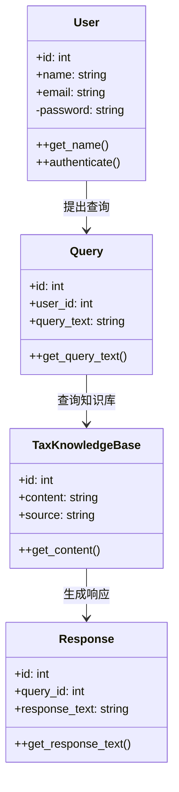
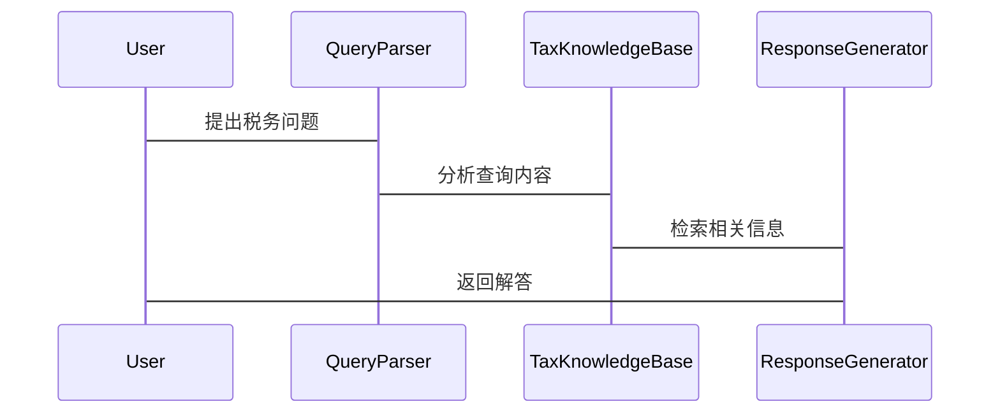

                 


```markdown
# AI Agent在智能税务咨询中的角色

> 关键词：AI Agent, 智能税务咨询, 自然语言处理, 机器学习, 系统架构设计

> 摘要：本文探讨AI Agent在智能税务咨询中的应用，分析其核心原理、系统架构，并通过实际案例展示其在税务咨询中的角色和价值。

---

# 第一部分: AI Agent与智能税务咨询的背景介绍

# 第1章: AI Agent与智能税务咨询概述

## 1.1 AI Agent的基本概念

### 1.1.1 AI Agent的定义
AI Agent（人工智能代理）是指能够感知环境并采取行动以实现目标的智能实体。它通过自然语言处理、机器学习等技术，模拟人类专家进行交互和决策。

### 1.1.2 AI Agent的核心特征
- **自主性**：无需外部干预，自动完成任务。
- **反应性**：实时感知环境并做出反应。
- **目标导向**：基于目标驱动行动。
- **学习能力**：通过数据和经验提升性能。

### 1.1.3 AI Agent与传统税务咨询的区别
- **效率**：AI Agent快速响应，提高效率。
- **准确性**：基于大数据分析，减少人为错误。
- **可扩展性**：支持大规模数据分析和处理。

## 1.2 智能税务咨询的背景与现状

### 1.2.1 税务咨询的传统模式
传统税务咨询依赖人工，效率低、成本高，难以满足大规模需求。

### 1.2.2 智能化税务咨询的发展趋势
技术进步推动税务咨询智能化，AI Agent成为关键工具。

### 1.2.3 当前智能税务咨询的应用现状
AI Agent在税务合规、风险评估等领域已初步应用，但仍需进一步优化。

## 1.3 AI Agent在税务咨询中的角色定位

### 1.3.1 AI Agent作为税务咨询工具的角色
提供实时查询、数据分析等支持，辅助税务专家工作。

### 1.3.2 AI Agent作为税务咨询助手的角色
通过自然语言处理，理解用户需求，提供初步解决方案。

### 1.3.3 AI Agent作为税务咨询专家的角色
在特定领域，AI Agent可替代部分专家，提供专业建议。

## 1.4 本章小结
AI Agent在税务咨询中扮演越来越重要的角色，推动行业智能化发展。

---

# 第二部分: AI Agent的核心概念与原理

# 第2章: AI Agent的核心概念与联系

## 2.1 AI Agent的核心原理

### 2.1.1 自然语言处理在AI Agent中的应用
NLP技术使AI Agent能够理解并生成自然语言文本，准确解析用户需求。

#### 2.1.1.1 分词与句法分析
使用分词工具（如jieba）对文本进行分词，分析句子结构。

#### 2.1.1.2 实体识别与意图理解
通过命名实体识别（NER）提取关键信息，分析用户意图。

### 2.1.2 机器学习在AI Agent中的应用
机器学习算法（如SVM、随机森林）用于分类、预测，提升决策准确性。

#### 2.1.2.1 分类算法
- **决策树**：构建分类模型，识别用户需求类型。
- **支持向量机（SVM）**：用于文本分类，判断用户意图。

#### 2.1.2.2 预测算法
- **随机森林**：预测税务问题的解决方案。
- **神经网络**：深度学习模型，处理复杂税务问题。

### 2.1.3 知识图谱构建
构建税务知识图谱，存储相关法律法规和案例，支持智能推理。

## 2.2 AI Agent的核心概念对比

| 概念       | 描述                               |
|------------|------------------------------------|
| 自然语言处理 | 解析和生成自然语言文本             |
| 机器学习    | 通过数据训练模型，实现智能决策     |
| 知识图谱    | 结构化知识表示，支持智能推理       |

## 2.3 AI Agent与税务数据的实体关系图

```mermaid
erDiagram
    user {
        id : int
        name : string
        email : string
    }
    tax_data {
        id : int
        content : string
        source : string
    }
    query {
        id : int
        user_id : int
        query_text : string
    }
    response {
        id : int
        query_id : int
        response_text : string
    }
    user --> query : 提出查询
    query --> response : 得到响应
    tax_data --> response : 提供数据支持
```

---

## 2.4 本章小结
通过NLP、机器学习和知识图谱，AI Agent具备强大的数据处理和决策能力。

---

# 第三部分: AI Agent的算法原理与数学模型

# 第3章: AI Agent的算法原理

## 3.1 自然语言处理算法

### 3.1.1 分词算法
- **jieba分词**：中文分词工具，实现文本分词。
- **TF-IDF**：用于关键词提取，理解文本重点。

### 3.1.2 意图识别算法
- **词袋模型**：将文本转换为向量，用于分类。
- **神经网络模型**：如LSTM，用于处理长文本。

## 3.2 机器学习算法

### 3.2.1 分类算法
- **决策树**：用于分类税务问题类型。
- **随机森林**：通过投票机制提高准确性。

### 3.2.2 回归算法
- **线性回归**：预测数值型结果，如税率计算。
- **梯度下降**：优化模型参数。

## 3.3 数学模型与公式

### 3.3.1 朴素贝叶斯分类器
公式：$$P(y|x) = \frac{P(x|y)P(y)}{P(x)}$$
- **条件概率**：计算每个类别的概率。

### 3.3.2 线性回归模型
公式：$$y = \beta_0 + \beta_1x + \epsilon$$
- **回归系数**：$\beta_0$和$\beta_1$通过最小二乘法求解。

## 3.4 本章小结
通过NLP和机器学习算法，AI Agent能够准确解析和处理税务咨询问题。

---

# 第四部分: AI Agent的系统架构与设计

# 第4章: AI Agent的系统架构设计

## 4.1 税务咨询场景介绍
用户通过AI Agent提出税务问题，系统解析并生成答案。

## 4.2 系统功能设计

### 4.2.1 用户交互模块
- **输入处理**：接收用户查询。
- **输出生成**：生成自然语言回答。

### 4.2.2 数据处理模块
- **文本解析**：使用NLP技术解析查询内容。
- **知识检索**：从知识库中检索相关信息。

### 4.2.3 决策模块
- **分类**：确定问题类型。
- **预测**：生成解决方案。

## 4.3 系统架构图



## 4.4 系统交互流程



## 4.5 本章小结
系统架构设计确保AI Agent高效处理税务咨询问题。

---

# 第五部分: AI Agent的项目实战

# 第5章: AI Agent的项目实战

## 5.1 环境安装与配置

### 5.1.1 Python环境
安装Python 3.8以上版本，安装依赖库：
```bash
pip install jieba numpy scikit-learn
```

## 5.2 核心代码实现

### 5.2.1 分词代码
```python
import jieba

text = "企业所得税如何计算"
words = jieba.lcut(text)
print(words)  # 输出：['企业所得税', '如何', '计算']
```

### 5.2.2 朴素贝叶斯分类器
```python
from sklearn.naive_bayes import MultinomialNB
from sklearn.feature_extraction.text import TfidfVectorizer

# 假设X_train和y_train已准备好
vectorizer = TfidfVectorizer()
X_train = vectorizer.fit_transform(X_train)
model = MultinomialNB().fit(X_train, y_train)
```

### 5.2.3 知识图谱查询
```python
from py2neo import Graph

graph = Graph("http://localhost:7474", auth=("neo4j", "password"))
result = graph.run("MATCH (n:TaxRule) RETURN n")
```

## 5.3 代码应用解读与分析
- **分词代码**：将中文文本分割成词语，便于后续处理。
- **贝叶斯分类器**：用于税务问题分类，提高准确性。
- **知识图谱查询**：从知识库中检索相关信息，生成回答。

## 5.4 实际案例分析
以“企业所得税如何计算”为例，展示从查询到响应的全过程。

## 5.5 本章小结
通过项目实战，验证AI Agent在税务咨询中的可行性。

---

# 第六部分: AI Agent的最佳实践与总结

# 第6章: 最佳实践与总结

## 6.1 最佳实践
- **数据质量**：确保知识库数据准确、全面。
- **模型优化**：定期更新模型，提升性能。
- **用户体验**：优化交互界面，提升用户体验。

## 6.2 小结
AI Agent在智能税务咨询中具有巨大潜力，未来将更加智能化和个性化。

## 6.3 未来展望
- **多语言支持**：扩展支持更多语言。
- **动态知识更新**：实时更新法律法规。
- **个性化服务**：根据用户需求定制服务。

---

# 结论

AI Agent正在改变税务咨询行业，通过不断优化算法和系统架构，其潜力将得到充分发挥，为用户提供更高效、准确的服务。

---

# 参考文献

1. 《自然语言处理实战》
2. 《机器学习实战》
3. 《知识图谱构建与应用》
4. 相关学术论文与技术文档
```

