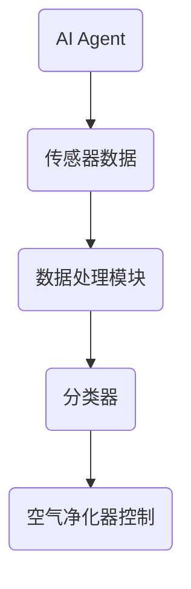
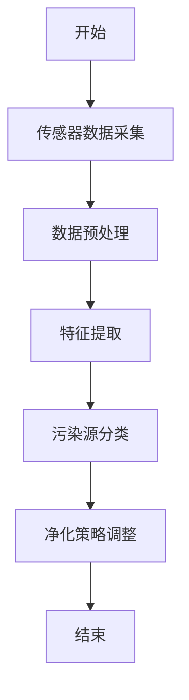
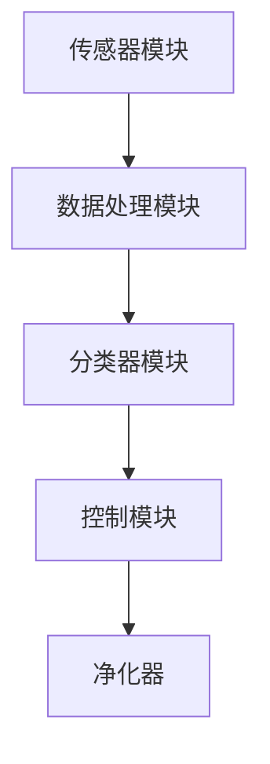
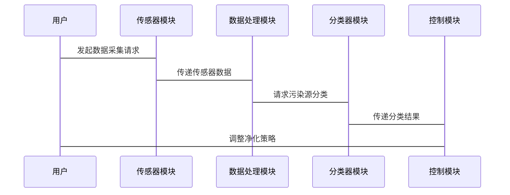

                 


# AI Agent在智能空气净化器中的污染源识别

## 关键词：AI Agent，智能空气净化器，污染源识别，传感器数据融合，机器学习算法，智能系统架构

## 摘要：本文详细探讨了AI Agent在智能空气净化器中的污染源识别应用。通过分析AI Agent的核心功能，传感器数据融合技术，机器学习算法，以及系统架构设计，本文为智能空气净化器的设计和优化提供了理论依据和实践指导。文章从背景介绍、核心概念、算法原理、系统架构、项目实战到总结展望，全面阐述了AI Agent在污染源识别中的应用及其对智能空气净化器发展的推动作用。

---

# 第一部分: AI Agent与智能空气净化器背景介绍

## 第1章: AI Agent与智能空气净化器背景介绍

### 1.1 问题背景

#### 1.1.1 空气污染问题的现状
空气污染是全球性的环境问题，主要来源于工业排放、交通尾气、建筑粉尘等。根据世界卫生组织的数据，每年因空气污染导致的死亡人数高达700万。因此，空气净化器作为一种重要的环保设备，市场需求日益增长。

#### 1.1.2 智能空气净化器的发展趋势
传统的空气净化器主要依赖固定的滤网和风机，无法根据环境变化实时调整净化策略。随着人工智能技术的发展，智能空气净化器逐渐成为趋势，通过AI Agent实现智能感知和自主决策。

#### 1.1.3 AI Agent在空气净化器中的应用价值
AI Agent（智能代理）能够通过传感器数据实时感知环境，分析污染源，并自主调整净化策略。其在空气净化器中的应用可以显著提升净化效率，降低能耗，同时为用户提供更健康的空气环境。

### 1.2 问题描述

#### 1.2.1 空气污染源的多样性
空气污染源包括PM2.5、PM10、甲醛、TVOC等多种污染物，且来源复杂，包括工业排放、交通尾气、建筑施工等。不同污染源的特性差异较大，增加了识别的难度。

#### 1.2.2 现有空气净化器的局限性
传统空气净化器主要依赖固定滤网，无法区分不同污染源，净化效率有限。此外，现有设备缺乏智能感知和自主决策能力，无法根据环境变化实时调整净化策略。

#### 1.2.3 AI Agent在污染源识别中的作用
AI Agent可以通过传感器数据实时感知环境，结合机器学习算法，实现污染源的精准识别和分类。同时，AI Agent可以根据识别结果自主调整净化策略，提升净化效率。

### 1.3 问题解决

#### 1.3.1 AI Agent的核心功能
AI Agent在智能空气净化器中的核心功能包括：
1. **环境感知**：通过传感器实时采集空气质量数据。
2. **污染源识别**：基于传感器数据，识别污染源的种类和浓度。
3. **自主决策**：根据识别结果，调整净化策略。

#### 1.3.2 污染源识别的关键技术
污染源识别的关键技术包括：
1. **传感器数据融合**：将多种传感器数据（如PM2.5、甲醛、TVOC等）进行融合，提升识别精度。
2. **机器学习算法**：利用分类算法（如支持向量机、随机森林等）对污染源进行分类。
3. **实时反馈机制**：根据环境变化实时调整识别模型。

#### 1.3.3 AI Agent与智能空气净化器的结合
AI Agent通过与智能空气净化器的硬件和软件模块深度结合，实现对污染源的实时识别和净化策略的自主调整。这种结合使得智能空气净化器能够更加智能化、高效化地运行。

### 1.4 边界与外延

#### 1.4.1 AI Agent的功能边界
AI Agent的主要功能是污染源识别和净化策略调整，不包括硬件设备的物理控制（如风机调节）。

#### 1.4.2 智能空气净化器的使用场景
智能空气净化器主要适用于家庭、办公室、公共场所等室内环境，其功能受限于传感器的部署和网络连接能力。

#### 1.4.3 污染源识别的适用范围
污染源识别主要针对可吸入颗粒物（PM2.5、PM10）、甲醛、TVOC等常见污染物，对未知污染物的识别能力有限。

### 1.5 概念结构与核心要素

#### 1.5.1 AI Agent的核心要素
1. **传感器数据**：空气质量数据的来源。
2. **数据处理模块**：对传感器数据进行预处理和特征提取。
3. **分类器**：基于特征数据进行污染源分类。
4. **决策模块**：根据分类结果调整净化策略。

#### 1.5.2 污染源识别的要素
1. **传感器类型**：PM2.5传感器、甲醛传感器、TVOC传感器等。
2. **数据融合技术**：将多种传感器数据进行融合，提升识别精度。
3. **分类算法**：支持向量机、随机森林等机器学习算法。

#### 1.5.3 智能空气净化器的系统架构
智能空气净化器的系统架构包括传感器模块、数据处理模块、分类器模块和控制模块。各模块通过AI Agent实现高效协同，完成污染源识别和净化策略调整。

---

## 第2章: AI Agent的核心概念与联系

### 2.1 AI Agent的原理

#### 2.1.1 AI Agent的定义
AI Agent是一种智能代理，能够通过传感器数据感知环境，利用算法进行分析和决策，并根据决策结果执行相应的操作。

#### 2.1.2 AI Agent的核心功能模块
1. **感知模块**：通过传感器获取环境数据。
2. **分析模块**：对传感器数据进行预处理和特征提取。
3. **决策模块**：基于特征数据进行污染源分类，并制定净化策略。
4. **执行模块**：根据决策结果调整净化器的运行参数。

#### 2.1.3 AI Agent与智能空气净化器的交互机制
AI Agent通过与智能空气净化器的传感器、数据处理模块和控制模块进行交互，实现污染源识别和净化策略调整。

### 2.2 核心概念对比表

| 比较维度 | 传感器类型 | 数据融合技术 | 分类算法 |
|----------|------------|--------------|----------|
| 精度     | 高          | 高            | 高        |
| 成本     | 低          | 中            | 高        |
| 适用性   | 专用        | 通用          | 专用      |

### 2.3 ER实体关系图


### 2.4 Mermaid流程图


---

### 2.5 传感器数据融合

#### 2.5.1 数据融合的必要性
单一传感器的识别精度有限，通过多种传感器数据的融合可以显著提升识别精度。

#### 2.5.2 数据融合的方法
1. **加权平均法**：根据传感器的精度和可靠性，对数据进行加权平均。
2. **融合算法**：利用机器学习算法（如支持向量机）对多源数据进行融合。

#### 2.5.3 数据融合的数学模型
传感器数据融合的数学模型如下：
$$
y = \sum_{i=1}^{n} w_i x_i
$$
其中，$y$ 是融合后的数据，$w_i$ 是第 $i$ 个传感器的权重，$x_i$ 是第 $i$ 个传感器的原始数据。

---

### 2.6 分类算法的实现

#### 2.6.1 分类算法的选择
支持向量机（SVM）和随机森林（Random Forest）是常用的分类算法，适用于多类别污染源的识别。

#### 2.6.2 分类算法的数学模型
支持向量机的数学模型如下：
$$
\text{目标函数：} \min_{\theta} \frac{1}{2}\|\theta\|^2 + C\sum_{i=1}^{n} \xi_i
$$
约束条件：
$$
y_i (\theta \cdot x_i + \theta_0) \geq 1 - \xi_i, \quad \xi_i \geq 0
$$

---

### 2.7 代码实现

#### 2.7.1 数据预处理
```python
import numpy as np

# 假设 data 是传感器数据矩阵，每行代表一个样本，每列代表一个传感器
def preprocess(data):
    # 数据标准化
    mean = np.mean(data, axis=0)
    std = np.std(data, axis=0)
    normalized_data = (data - mean) / std
    return normalized_data
```

#### 2.7.2 特征提取
```python
from sklearn.decomposition import PCA

def extract_features(normalized_data):
    # 使用主成分分析提取特征
    pca = PCA(n_components=3)
    features = pca.fit_transform(normalized_data)
    return features
```

#### 2.7.3 污染源分类
```python
from sklearn.svm import SVC

def classify(features, labels):
    # 使用支持向量机进行分类
    clf = SVC()
    clf.fit(features, labels)
    return clf
```

---

### 2.8 系统架构设计

#### 2.8.1 系统功能模块
1. **传感器模块**：负责采集空气质量数据。
2. **数据处理模块**：对传感器数据进行预处理和特征提取。
3. **分类器模块**：基于特征数据进行污染源分类。
4. **控制模块**：根据分类结果调整净化器的运行参数。

#### 2.8.2 系统架构图


---

### 2.9 交互序列图



---

## 第3章: 算法原理与数学模型

### 3.1 算法原理

#### 3.1.1 算法流程
1. **数据采集**：通过传感器采集空气质量数据。
2. **数据预处理**：对传感器数据进行标准化和去噪处理。
3. **特征提取**：利用主成分分析（PCA）提取关键特征。
4. **污染源分类**：使用支持向量机（SVM）进行分类。

#### 3.1.2 算法实现
```python
def main():
    # 读取传感器数据
    data = np.loadtxt('sensor_data.csv', delimiter=',')
    labels = np.loadtxt('labels.csv', delimiter=',')
    
    # 数据预处理
    normalized_data = preprocess(data)
    
    # 特征提取
    features = extract_features(normalized_data)
    
    # 污染源分类
    clf = classify(features, labels)
    
    # 返回分类结果
    return clf

if __name__ == "__main__":
    main()
```

---

### 3.2 数学模型

#### 3.2.1 数据融合模型
传感器数据融合的数学模型如下：
$$
y = \sum_{i=1}^{n} w_i x_i
$$

其中，$y$ 是融合后的数据，$w_i$ 是第 $i$ 个传感器的权重，$x_i$ 是第 $i$ 个传感器的原始数据。

---

### 3.3 分类算法模型

#### 3.3.1 支持向量机（SVM）
支持向量机的数学模型如下：
$$
\text{目标函数：} \min_{\theta} \frac{1}{2}\|\theta\|^2 + C\sum_{i=1}^{n} \xi_i
$$
约束条件：
$$
y_i (\theta \cdot x_i + \theta_0) \geq 1 - \xi_i, \quad \xi_i \geq 0
$$

---

### 3.4 代码实现

#### 3.4.1 数据预处理
```python
import numpy as np

def preprocess(data):
    mean = np.mean(data, axis=0)
    std = np.std(data, axis=0)
    normalized_data = (data - mean) / std
    return normalized_data
```

#### 3.4.2 特征提取
```python
from sklearn.decomposition import PCA

def extract_features(normalized_data):
    pca = PCA(n_components=3)
    features = pca.fit_transform(normalized_data)
    return features
```

#### 3.4.3 污染源分类
```python
from sklearn.svm import SVC

def classify(features, labels):
    clf = SVC()
    clf.fit(features, labels)
    return clf
```

---

## 第4章: 系统分析与架构设计

### 4.1 系统功能模块

#### 4.1.1 功能模块划分
1. **传感器模块**：负责采集空气质量数据。
2. **数据处理模块**：对传感器数据进行预处理和特征提取。
3. **分类器模块**：基于特征数据进行污染源分类。
4. **控制模块**：根据分类结果调整净化器的运行参数。

---

### 4.2 系统架构图


---

### 4.3 接口设计

#### 4.3.1 接口定义
1. **传感器模块接口**：提供数据采集和传输功能。
2. **数据处理模块接口**：提供数据预处理和特征提取功能。
3. **分类器模块接口**：提供污染源分类功能。
4. **控制模块接口**：提供净化器控制功能。

---

### 4.4 交互序列图


---

## 第5章: 项目实战与代码实现

### 5.1 项目环境安装

#### 5.1.1 Python安装
安装Python 3.8及以上版本。

#### 5.1.2 环境搭建
安装所需的Python库，包括NumPy、Scikit-learn、Mermaid等。

---

### 5.2 核心代码实现

#### 5.2.1 数据预处理
```python
import numpy as np

def preprocess(data):
    mean = np.mean(data, axis=0)
    std = np.std(data, axis=0)
    normalized_data = (data - mean) / std
    return normalized_data
```

#### 5.2.2 特征提取
```python
from sklearn.decomposition import PCA

def extract_features(normalized_data):
    pca = PCA(n_components=3)
    features = pca.fit_transform(normalized_data)
    return features
```

#### 5.2.3 污染源分类
```python
from sklearn.svm import SVC

def classify(features, labels):
    clf = SVC()
    clf.fit(features, labels)
    return clf
```

---

### 5.3 代码解读

#### 5.3.1 数据预处理
数据预处理函数`preprocess`对传感器数据进行标准化处理，以消除不同传感器量纲的影响。

#### 5.3.2 特征提取
特征提取函数`extract_features`利用主成分分析（PCA）提取关键特征，降低数据维度，提升分类效率。

#### 5.3.3 污染源分类
分类函数`classify`使用支持向量机（SVM）对污染源进行分类，分类结果用于指导净化器的运行策略。

---

## 第6章: 总结与展望

### 6.1 项目小结
本文详细探讨了AI Agent在智能空气净化器中的污染源识别应用。通过传感器数据融合、机器学习算法和系统架构设计，本文为智能空气净化器的设计和优化提供了理论依据和实践指导。

### 6.2 最佳实践
1. **传感器选择**：选择多种传感器，提高识别精度。
2. **数据融合技术**：采用加权平均法和PCA等技术，提升数据利用率。
3. **分类算法优化**：根据具体场景选择合适的分类算法，如SVM和随机森林。

### 6.3 注意事项
1. **数据质量问题**：确保传感器数据的准确性和完整性。
2. **算法鲁棒性**：增强算法的抗干扰能力和适应性。
3. **系统安全性**：确保系统在异常情况下的安全运行。

### 6.4 拓展阅读
1. **边缘计算**：AI Agent在边缘计算中的应用。
2. **深度学习**：基于深度学习的污染源识别算法研究。
3. **智能系统架构**：智能系统架构设计的最新进展。

---

以上是《AI Agent在智能空气净化器中的污染源识别》的完整目录大纲和部分章节内容。通过上述内容，您可以逐步撰写完整的技术博客文章。

