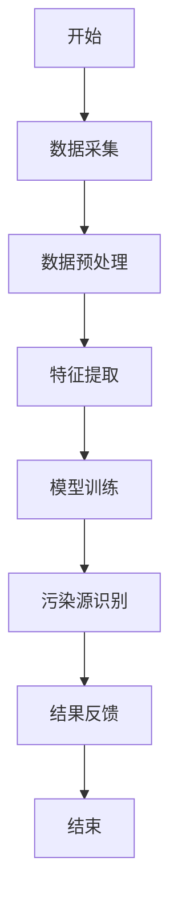
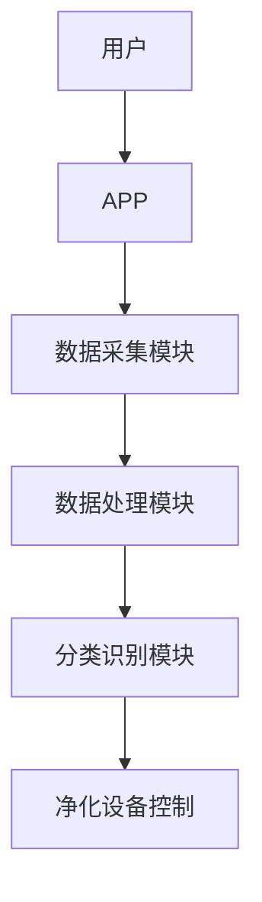
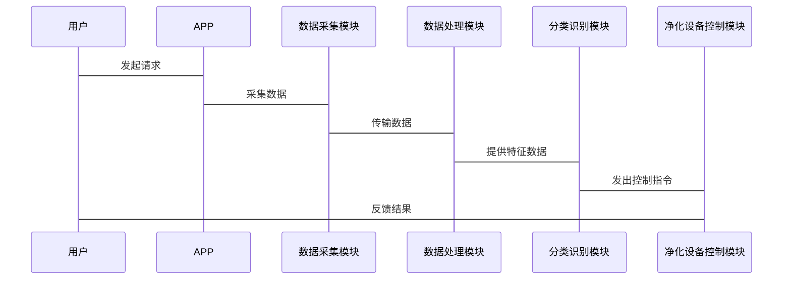

                 


# AI Agent在智能空气净化器中的污染源识别

> **关键词**：AI Agent，智能空气净化器，污染源识别，机器学习，实时监测

> **摘要**：本文探讨了AI Agent在智能空气净化器中的应用，重点分析了污染源识别的原理与实现。通过系统架构设计、算法原理、项目实战等多维度的详细讲解，全面剖析了AI Agent如何助力智能空气净化器实现高效、精准的污染源识别。本文旨在为相关领域的技术从业者提供理论指导和实践参考。

---

## 第一部分: AI Agent与智能空气净化器概述

### 第1章: AI Agent的基本概念与应用背景

#### 1.1 问题背景与问题描述

**1.1.1 空气污染的现状与挑战**

近年来，随着工业化进程的加速，空气污染问题日益严重。颗粒物（PM2.5、PM10）、有害气体（如SO2、NO2、CO等）以及生物污染物（如细菌、病毒）对人类健康和环境造成了巨大威胁。传统的空气净化器主要依赖物理过滤和化学反应技术，难以应对复杂多变的污染源。

**1.1.2 智能空气净化器的发展趋势**

智能空气净化器通过物联网技术（IoT）实现了远程控制和数据采集，但其核心功能仍局限于对已知污染物的被动过滤。为了实现对未知或复杂污染源的主动识别和应对，引入AI Agent（智能代理）成为必然趋势。

**1.1.3 AI Agent在空气净化中的作用**

AI Agent是一种能够感知环境、自主决策并执行任务的智能实体。在空气净化器中，AI Agent可以通过实时监测空气质量数据、分析污染源特征，并动态调整净化策略，从而实现高效、精准的污染源识别与处理。

#### 1.2 AI Agent的核心概念与特点

**1.2.1 AI Agent的定义与分类**

AI Agent是指具有感知能力、推理能力和执行能力的智能系统，能够根据环境信息做出决策并执行任务。根据应用场景的不同，AI Agent可以分为以下几类：

- **反应式AI Agent**：基于当前环境信息做出实时反应，适用于动态变化的场景。
- **认知式AI Agent**：具备复杂推理和规划能力，能够处理多目标优化问题。
- **混合式AI Agent**：结合反应式和认知式的特点，适用于复杂场景。

**1.2.2 智能空气净化器中的AI Agent功能**

在智能空气净化器中，AI Agent主要承担以下功能：

- **实时监测**：通过多种传感器（如PM2.5传感器、温湿度传感器、气体传感器等）采集空气质量数据。
- **污染源识别**：基于传感器数据和历史数据，识别空气中的污染源类型。
- **智能控制**：根据污染源特征动态调整净化模式（如开启UV灯、HEPA过滤器等）。
- **用户交互**：通过APP或语音助手向用户推送空气质量信息和净化建议。

**1.2.3 AI Agent与传统传感器的区别**

AI Agent的核心优势在于其智能化和自主性：

- **传统传感器**：只能采集单一类型的环境数据，无法进行复杂分析和决策。
- **AI Agent**：能够整合多种传感器数据，结合历史数据和环境模型，做出智能决策。

#### 1.3 污染源识别的背景与意义

**1.3.1 空气污染源的种类与特征**

空气污染源可以分为以下几类：

- **颗粒物**：如PM2.5、PM10。
- **有害气体**：如SO2、NO2、CO。
- **生物污染物**：如细菌、病毒、花粉。

不同类型的污染源具有不同的物理化学特征，例如颗粒物的粒径分布、有害气体的浓度变化等。

**1.3.2 污染源识别的难点与挑战**

污染源识别的难点主要体现在以下几点：

- **数据多样性**：需要整合多种传感器的数据（如颗粒物浓度、温湿度、气体浓度等）。
- **动态变化**：污染源的浓度和分布会随时间变化。
- **复杂环境**：室内环境中可能存在多个污染源，且污染源之间可能相互干扰。

**1.3.3 AI Agent在污染源识别中的优势**

AI Agent通过整合多种传感器数据，结合机器学习算法，能够实现对复杂污染源的精准识别和动态调整。

---

## 第二部分: AI Agent的核心概念与原理

### 第2章: AI Agent的核心概念与原理

#### 2.1 AI Agent的原理与工作流程

**2.1.1 数据采集与特征提取**

AI Agent通过多种传感器（如PM2.5传感器、气体传感器、温湿度传感器等）采集空气质量数据。数据采集后，需要进行预处理和特征提取，例如：

- **数据清洗**：去除噪声数据。
- **特征提取**：提取关键特征（如PM2.5浓度、温度、湿度等）。

**2.1.2 模型训练与分类识别**

AI Agent通过机器学习算法对特征数据进行训练，建立污染源识别模型。常用的算法包括：

- **支持向量机（SVM）**：适用于分类任务。
- **随机森林（Random Forest）**：适用于分类和回归任务。
- **卷积神经网络（CNN）**：适用于图像数据的特征提取。

**2.1.3 实时反馈与优化**

AI Agent根据识别结果动态调整净化策略，并通过反馈机制不断优化模型性能。

#### 2.2 AI Agent与智能空气净化器的结合

**2.2.1 系统架构与功能模块**

智能空气净化器的系统架构可以分为以下几个模块：

- **数据采集模块**：负责采集空气质量数据。
- **数据处理模块**：对采集的数据进行预处理和特征提取。
- **分类识别模块**：基于机器学习算法进行污染源识别。
- **控制模块**：根据识别结果调整净化设备的工作模式。
- **用户交互模块**：通过APP或语音助手与用户进行交互。

**2.2.2 实时监测与智能控制**

AI Agent通过实时监测空气质量数据，动态调整净化设备的工作模式。例如：

- 当检测到PM2.5浓度超标时，AI Agent会自动开启HEPA过滤器。
- 当检测到有害气体浓度超标时，AI Agent会自动开启UV灯。

**2.2.3 用户交互与反馈机制**

AI Agent通过APP或语音助手向用户推送空气质量信息和净化建议。例如：

- 当PM2.5浓度较高时，APP会推送提醒，并建议用户减少外出。
- 当检测到细菌或病毒时，APP会建议用户开启UV灯进行杀菌。

#### 2.3 污染源识别的数学模型与公式

**2.3.1 数据预处理与特征提取公式**

假设我们有多个传感器数据，例如：

- PM2.5浓度：$PM2.5$
- 温度：$T$
- 湿度：$H$
- 气体浓度：$C$

为了进行特征提取，我们可以将这些数据进行归一化处理：

$$
x_i = \frac{x_i - \mu}{\sigma}
$$

其中，$\mu$是均值，$\sigma$是标准差。

**2.3.2 分类算法的数学模型**

以支持向量机（SVM）为例，其数学模型可以表示为：

$$
y = \text{sign}(w \cdot x + b)
$$

其中，$w$是权重向量，$x$是输入特征，$b$是偏置项。

---

## 第三部分: AI Agent的算法原理与实现

### 第3章: AI Agent的算法原理与实现

#### 3.1 算法原理与流程图

**3.1.1 数据流与处理流程**

以下是AI Agent污染源识别的流程图：



**3.1.2 分类算法的选择与实现**

以下是支持向量机（SVM）的Python实现代码：

```python
from sklearn import svm

# 创建SVM分类器
clf = svm.SVC()

# 训练模型
clf.fit(X_train, y_train)

# 预测结果
y_pred = clf.predict(X_test)
```

**3.1.3 优化算法的实现与应用**

以下是随机森林（Random Forest）的Python实现代码：

```python
from sklearn.ensemble import RandomForestClassifier

# 创建随机森林分类器
clf = RandomForestClassifier()

# 训练模型
clf.fit(X_train, y_train)

# 预测结果
y_pred = clf.predict(X_test)
```

#### 3.2 算法实现的Python代码

**3.2.1 数据预处理代码**

```python
import numpy as np
from sklearn.preprocessing import StandardScaler

# 数据标准化
scaler = StandardScaler()
X_scaled = scaler.fit_transform(X)
```

**3.2.2 分类模型训练代码**

```python
from sklearn.model_selection import train_test_split
from sklearn.metrics import accuracy_score

# 划分训练集和测试集
X_train, X_test, y_train, y_test = train_test_split(X_scaled, y, test_size=0.2)

# 训练模型
clf.fit(X_train, y_train)

# 评估模型
accuracy = accuracy_score(y_test, y_pred)
print(f"模型准确率：{accuracy}")
```

**3.2.3 实时识别与反馈代码**

```python
import time
from sklearn.metrics import classification_report

# 实时监测
while True:
    # 采集实时数据
    X_real_time =采集数据()
    
    # 预处理
    X_real_time_scaled = scaler.transform(X_real_time)
    
    # 预测结果
    y_real_time_pred = clf.predict(X_real_time_scaled)
    
    # 反馈控制
    if y_real_time_pred == '高浓度PM2.5':
        开启HEPA过滤器()
    elif y_real_time_pred == '有害气体超标':
        开启UV灯()
    
    # 等待下一周期
    time.sleep(60)
```

---

## 第四部分: 系统分析与架构设计

### 第4章: 系统分析与架构设计

#### 4.1 系统功能设计

**4.1.1 数据采集模块**

- 负责采集空气质量数据，包括PM2.5、温度、湿度、气体浓度等。

**4.1.2 数据处理模块**

- 对采集的数据进行预处理和特征提取。

**4.1.3 分类识别模块**

- 基于机器学习算法进行污染源识别。

**4.1.4 用户交互模块**

- 通过APP或语音助手与用户进行交互，推送空气质量信息和净化建议。

#### 4.2 系统架构设计

**4.2.1 分层架构设计**

以下是系统的分层架构图：



**4.2.2 模块之间的接口设计**

- 数据采集模块与数据处理模块之间通过API进行交互。
- 数据处理模块与分类识别模块之间通过共享内存进行交互。
- 分类识别模块与净化设备控制模块之间通过GPIO进行交互。

**4.2.3 系统交互序列图**

以下是系统的交互序列图：



---

## 第五部分: 项目实战

### 第5章: 项目实战

#### 5.1 环境安装与配置

- **Python版本**：建议使用Python 3.6及以上版本。
- **依赖库安装**：需要安装以下库：
  - `numpy`
  - `pandas`
  - `scikit-learn`
  - `mermaid`
  - `matplotlib`

#### 5.2 系统核心实现源代码

**5.2.1 数据采集代码**

```python
import serial
import time

# 串口通信配置
ser = serial.Serial('COM3', 9600)

while True:
    # 读取传感器数据
    data = ser.readline().decode().strip()
    print("采集到的数据：", data)
    time.sleep(1)
```

**5.2.2 数据处理代码**

```python
import numpy as np
from sklearn.preprocessing import StandardScaler

# 数据标准化
scaler = StandardScaler()
X_scaled = scaler.fit_transform(X)
```

**5.2.3 分类识别代码**

```python
from sklearn.ensemble import RandomForestClassifier

# 创建随机森林分类器
clf = RandomForestClassifier()

# 训练模型
clf.fit(X_train, y_train)

# 预测结果
y_pred = clf.predict(X_test)
```

#### 5.3 案例分析与详细讲解

**5.3.1 案例分析**

假设我们有一个智能空气净化器，其传感器数据如下：

- PM2.5浓度：$PM2.5 = 50 \mu g/m^3$
- 温度：$T = 25^\circ C$
- 湿度：$H = 60\%$
- 气体浓度：$C = 0.2 ppm$

通过AI Agent的分析，识别出污染源为PM2.5超标，并自动开启HEPA过滤器。

**5.3.2 详细讲解**

- **数据采集**：通过传感器采集空气质量数据。
- **数据预处理**：对数据进行标准化处理。
- **特征提取**：提取关键特征（如PM2.5浓度、温度、湿度、气体浓度）。
- **分类识别**：基于随机森林算法进行污染源识别。
- **结果反馈**：根据识别结果调整净化设备的工作模式。

---

## 第六部分: 最佳实践

### 第6章: 最佳实践

#### 6.1 小结

本文详细讲解了AI Agent在智能空气净化器中的污染源识别技术，包括算法原理、系统架构设计和项目实战等内容。

#### 6.2 注意事项

- 数据采集的准确性是污染源识别的关键。
- 模型训练时需要保证数据的多样性和代表性。
- 系统运行时需要考虑实时性和稳定性。

#### 6.3 拓展阅读

- 《机器学习实战》
- 《Python机器学习》
- 《智能系统设计》

---

以上是文章的完整目录结构和部分内容。希望对您有所帮助！

