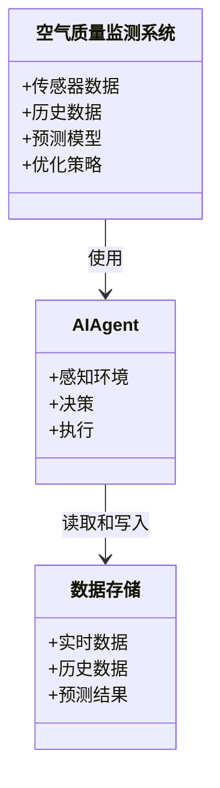
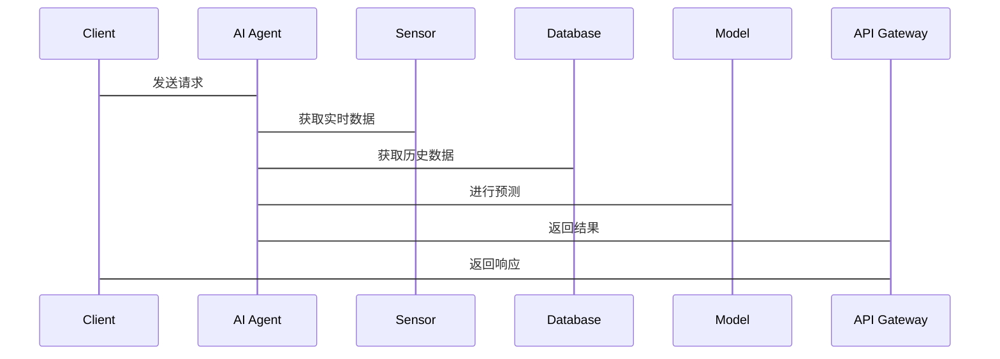

                 


# AI Agent在智能空气质量管理中的实践

> 关键词：AI Agent, 智能空气质量管理, 空气质量监测, 环境优化, 人工智能技术

> 摘要：本文深入探讨了AI Agent在智能空气质量管理中的应用，从背景概念到核心算法，再到系统架构和项目实战，详细分析了AI Agent如何通过实时数据处理、自适应学习和多目标优化来提升空气质量管理的效率和准确性。文章还结合实际案例，展示了AI Agent在空气质量监测和环境优化中的具体实现，为相关领域的研究和实践提供了有价值的参考。

---

# 第一部分: AI Agent在智能空气质量管理中的背景与概念

## 第1章: 空气质量管理问题背景

### 1.1 空气质量问题的现状与挑战

#### 1.1.1 全球空气质量问题的严重性
近年来，随着工业化进程的加快和城市化进程的加速，空气污染问题日益严重。世界卫生组织（WHO）数据显示，全球超过90%的人口生活在空气质量不达标的地区。空气污染不仅影响环境，还严重威胁人类健康，导致呼吸系统疾病、心血管疾病等，每年造成数百万人的早逝。

#### 1.1.2 空气污染对人类健康的影响
空气污染主要由PM2.5、PM10、SO2、NO2和O3等污染物引起。这些污染物通过呼吸道进入人体，引发哮喘、肺炎、心脏病等多种疾病。特别是儿童和老年人，对空气污染更为敏感。

#### 1.1.3 空气质量管理的复杂性与挑战
空气质量管理涉及多方面的因素，包括污染源的多样性（如工业排放、交通尾气、居民生活等）、气象条件的变化（如风速、温度、湿度等）以及政策法规的执行等。传统的基于规则的空气质量管理系统往往难以应对这些复杂性和不确定性。

### 1.2 AI Agent的定义与特点

#### 1.2.1 AI Agent的基本概念
AI Agent（智能体）是指在环境中能够感知并自主行动以实现目标的实体。它可以是一个软件程序、机器人或其他智能系统，具备感知、决策、执行和学习的能力。

#### 1.2.2 AI Agent的核心特点
- **自主性**：能够自主决策和行动，无需人工干预。
- **反应性**：能够实时感知环境变化并做出响应。
- **学习能力**：通过数据和经验不断优化自身的算法和策略。
- **协作性**：能够与其他智能体或系统协同工作，实现复杂任务。

#### 1.2.3 AI Agent与传统自动化系统的区别
传统的自动化系统基于预定义的规则和程序运行，缺乏灵活性和适应性。而AI Agent具备学习和自适应能力，能够根据环境变化动态调整策略。

---

## 第2章: AI Agent在空气质量管理中的应用价值

### 2.1 空气质量管理中的关键问题

#### 2.1.1 数据采集与处理的复杂性
空气质量监测需要收集来自多种传感器和数据源的实时数据，包括PM2.5、PM10、SO2等污染物的浓度数据，以及气象数据（如风速、温度、湿度）。

#### 2.1.2 污染源的多样性和不确定性
污染源的多样性和不确定性使得传统的基于规则的空气质量预测系统难以准确预测空气质量变化。

#### 2.1.3 空气质量预测的准确性要求
空气质量预测的准确性直接影响到政府和企业的决策，例如是否需要采取限产、限行等措施。

### 2.2 AI Agent在空气质量管理中的优势

#### 2.2.1 实时数据处理能力
AI Agent能够实时处理来自多种传感器的数据，并结合历史数据和气象数据，快速预测空气质量变化趋势。

#### 2.2.2 自适应学习与优化能力
通过机器学习算法，AI Agent能够不断优化自身的预测模型和决策策略，提高预测的准确性和响应的及时性。

#### 2.2.3 多目标协同优化能力
在空气质量管理中，AI Agent能够同时优化多个目标，例如在减少污染排放的同时，尽量减少对企业生产的影响。

---

# 第二部分: AI Agent的核心概念与原理

## 第3章: AI Agent的核心概念与体系结构

### 3.1 AI Agent的核心概念

#### 3.1.1 智能体的基本定义
AI Agent是一种能够感知环境、自主决策并执行行动的实体。它可以是一个软件程序，也可以是一个物理设备。

#### 3.1.2 AI Agent的感知与行动机制
AI Agent通过传感器或数据接口感知环境状态，然后通过决策算法选择最优行动，并通过执行器或接口将行动落实。

#### 3.1.3 多智能体系统的协作模式
在空气质量管理中，通常需要多个AI Agent协同工作。例如，一个AI Agent负责监测污染源，另一个负责预测空气质量变化，还有一个负责优化减排策略。

### 3.2 AI Agent的体系结构

#### 3.2.1 反应式体系结构
反应式体系结构是一种基于当前感知状态做出反应的体系结构。它适用于需要快速响应的场景，例如实时空气质量监测。

#### 3.2.2 计划式体系结构
计划式体系结构是一种基于预先制定的计划行动的体系结构。它适用于需要长期规划的场景，例如季度性空气质量管理计划。

#### 3.2.3 组织式体系结构
组织式体系结构是一种基于组织结构和角色分工的体系结构。它适用于需要多部门协同工作的场景，例如政府、企业和科研机构的联合行动。

## 第4章: AI Agent与空气质量数据的关系

### 4.1 空气质量数据的特征分析

#### 4.1.1 数据来源的多样性
空气质量数据来源于多种传感器和数据源，包括固定监测站、移动监测设备、卫星遥感数据等。

#### 4.1.2 数据特征的复杂性
空气质量数据具有时空异构性、非线性关系和不确定性等特征，传统的统计方法难以有效处理。

#### 4.1.3 数据关联性分析
空气质量数据之间存在复杂的关联性，例如PM2.5浓度与气象条件、污染源排放量等密切相关。

### 4.2 AI Agent对空气质量数据的处理流程

#### 4.2.1 数据采集与预处理
AI Agent通过多种传感器和数据接口采集空气质量数据，并进行数据清洗和标准化处理。

#### 4.2.2 数据特征提取与建模
通过机器学习算法（如支持向量机、随机森林、神经网络等）对空气质量数据进行特征提取和建模，建立空气质量预测模型。

#### 4.2.3 数据驱动的决策优化
基于预测模型和实时数据，AI Agent优化减排策略，例如调整工业排放、交通限行等措施，以实现空气质量最优。

---

## 第5章: AI Agent的核心算法原理

### 5.1 强化学习算法

#### 5.1.1 强化学习的基本原理
强化学习是一种通过试错机制学习策略的方法。智能体通过与环境交互，获得奖励或惩罚，并通过最大化累计奖励来优化决策策略。

#### 5.1.2 Q-learning算法的实现
Q-learning是一种经典的强化学习算法，适用于离散动作空间的决策问题。其核心思想是通过更新Q表来记录状态-动作对的期望奖励。

#### 5.1.3 策略梯度方法
策略梯度方法是一种基于梯度下降的强化学习方法，适用于连续动作空间的决策问题。它通过优化策略参数，直接最大化奖励函数。

### 5.2 监督学习算法

#### 5.2.1 线性回归与空气质量预测
线性回归是一种简单的监督学习算法，可以用于空气质量指数（AQI）的预测。通过建立污染物浓度与气象条件的线性关系模型，预测未来AQI。

#### 5.2.2 支持向量机与空气质量分类
支持向量机（SVM）是一种强大的监督学习算法，可以用于空气质量分类。通过将AQI分为不同类别（如优、良、轻度污染等），帮助决策者制定相应的措施。

### 5.3 推荐算法

#### 5.3.1 基于协同过滤的减排策略推荐
协同过滤是一种推荐算法，通过分析历史减排策略和效果，推荐最优的减排策略。

#### 5.3.2 基于内容的减排策略推荐
内容推荐算法通过分析减排策略的特征和属性，推荐相似的策略。

---

# 第三部分: AI Agent的系统分析与架构设计

## 第6章: 系统分析与架构设计

### 6.1 问题场景介绍

#### 6.1.1 空气质量监测与预测
通过部署AI Agent，实时监测空气质量数据，预测未来AQI，并制定减排策略。

#### 6.1.2 多智能体协同优化
多个AI Agent协同工作，分别负责数据采集、预测、决策等任务，实现整体最优。

### 6.2 系统功能设计

#### 6.2.1 数据采集与预处理
- 数据采集：通过传感器和数据接口采集空气质量数据。
- 数据清洗：处理缺失值、异常值和噪声数据。

#### 6.2.2 数据特征提取与建模
- 特征提取：通过PCA、LDA等方法提取关键特征。
- 模型训练：使用机器学习算法训练空气质量预测模型。

#### 6.2.3 数据驱动的决策优化
- 预测模型：基于历史数据，预测未来AQI。
- 策略优化：通过强化学习优化减排策略。

### 6.3 系统架构设计

#### 6.3.1 领域模型（Mermaid类图）


#### 6.3.2 系统架构（Mermaid架构图）


#### 6.3.3 系统接口设计
- 数据接口：AI Agent通过HTTP接口与传感器和数据存储系统交互。
- 模型接口：AI Agent通过API调用机器学习模型进行预测和优化。

#### 6.3.4 系统交互（Mermaid序列图）


---

## 第7章: 项目实战

### 7.1 环境安装与配置

#### 7.1.1 安装Python环境
```bash
python --version
pip install --upgrade pip
```

#### 7.1.2 安装必要的库
```bash
pip install numpy pandas scikit-learn tensorflow keras
```

### 7.2 核心代码实现

#### 7.2.1 数据预处理
```python
import pandas as pd
import numpy as np

# 读取数据
data = pd.read_csv('air_quality.csv')

# 数据清洗
data.dropna(inplace=True)
data = data[~data.duplicated()]
```

#### 7.2.2 模型训练与预测
```python
from sklearn.ensemble import RandomForestRegressor
from sklearn.metrics import mean_absolute_error

# 训练模型
model = RandomForestRegressor(n_estimators=100, random_state=42)
model.fit(X_train, y_train)

# 预测
y_pred = model.predict(X_test)
print(mean_absolute_error(y_test, y_pred))
```

#### 7.2.3 强化学习策略优化
```python
import tensorflow as tf
from tensorflow.keras import layers

# 定义网络
model = tf.keras.Sequential([
    layers.Dense(64, activation='relu'),
    layers.Dense(1)
])

# 编译模型
model.compile(optimizer='adam', loss='mean_squared_error')

# 训练模型
model.fit(X_train, y_train, epochs=100, batch_size=32)
```

### 7.3 实际案例分析

#### 7.3.1 数据来源与处理
以某城市空气质量数据为例，数据包括PM2.5、PM10、SO2、NO2、O3、CO等污染物浓度，以及气象数据。

#### 7.3.2 模型训练与验证
通过随机森林和神经网络模型训练空气质量预测模型，分别计算MAE、RMSE等指标，验证模型的准确性。

#### 7.3.3 策略优化与实施
基于强化学习算法优化减排策略，模拟不同策略下的空气质量变化，选择最优策略进行实施。

---

## 第8章: 最佳实践与小结

### 8.1 小结
AI Agent通过实时数据处理、自适应学习和多目标优化，显著提升了空气质量管理的效率和准确性。本文详细介绍了AI Agent的核心概念、算法原理和系统架构，并通过实际案例展示了其在空气质量管理中的应用价值。

### 8.2 注意事项
- 数据质量对模型性能影响重大，需确保数据的准确性和完整性。
- 强化学习算法的收敛速度和效果与奖励函数的设计密切相关。
- 多智能体协同优化需考虑通信延迟和计算资源限制。

### 8.3 拓展阅读
- 《强化学习导论》
- 《机器学习实战》
- 《分布式系统与多智能体协作》

---

通过本文的详细分析和实践，读者可以深入了解AI Agent在智能空气质量管理中的应用，并将其应用于实际场景中，为环境保护和人类健康做出贡献。

