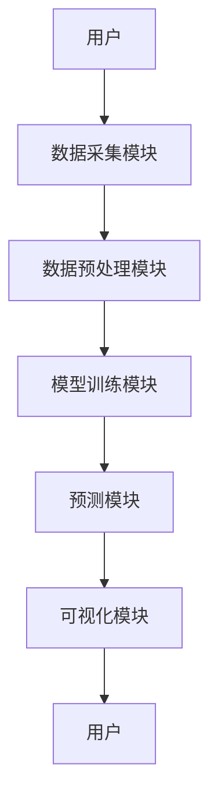

                 


# AI Agent在智能空气质量预报中的实践

> 关键词：AI Agent，空气质量预报，机器学习，时间序列预测，LSTM，深度学习

> 摘要：本文详细探讨了AI Agent在智能空气质量预报中的应用，从空气质量问题的严重性、AI Agent的作用，到空气质量数据的采集与预处理，再到基于LSTM的空气质量预测模型的实现与优化，最后到系统的整体架构设计与实际部署。通过本篇文章，读者可以全面了解AI Agent如何助力智能空气质量预报，掌握从理论到实践的整个流程。

---

## 第1章: AI Agent与空气质量预报的背景与意义

### 1.1 空气质量问题的严重性

#### 1.1.1 空气污染对人类健康的影响
空气污染是全球性的环境问题，直接影响人类健康。长期暴露在高污染环境中，会导致呼吸系统疾病、心血管疾病甚至癌症。空气质量差的地区，尤其是发展中国家的大城市，居民健康受到严重威胁。

#### 1.1.2 空气质量对环境和经济的影响
空气污染不仅影响人类健康，还对环境造成破坏，如酸雨、臭氧层破坏等。此外，空气质量差会导致农业减产、工业效率下降，给经济带来损失。

#### 1.1.3 全球气候变化的加剧作用
空气中的污染物，如二氧化碳、甲烷等温室气体，加剧了全球气候变化。气候变化反过来又会影响空气质量，形成恶性循环。

---

### 1.2 AI Agent在空气质量预报中的作用

#### 1.2.1 AI Agent的基本概念与特点
AI Agent（人工智能代理）是指能够感知环境、自主决策并执行任务的智能实体。AI Agent在空气质量预报中的作用主要体现在数据采集、模型预测和结果反馈等方面。

#### 1.2.2 AI Agent在空气质量预报中的优势
AI Agent能够实时采集和分析空气质量数据，利用机器学习算法进行预测，并根据反馈不断优化预测模型。相比传统的统计模型，AI Agent具有更高的准确性和实时性。

#### 1.2.3 智能空气质量预报的未来发展趋势
随着AI技术的不断进步，空气质量预报将更加精准和智能化。未来的预报系统将集成更多的传感器数据，采用更复杂的深度学习模型，并实现全球范围内的实时监测。

---

### 1.3 本章小结
本章介绍了空气质量问题的严重性，以及AI Agent在空气质量预报中的作用和未来发展趋势。AI Agent通过实时数据采集、智能分析和预测，为改善空气质量提供了有力的技术支持。

---

## 第2章: 智能空气质量预报的核心概念与系统架构

### 2.1 空气质量预测的背景与目标

#### 2.1.1 空气质量预测的基本概念
空气质量预测是通过分析历史数据和当前环境状况，预测未来一段时间内的空气质量指数（AQI）。

#### 2.1.2 空气质量预测的目标与范围
空气质量预测的目标是为政府、企业和公众提供准确的空气质量信息，帮助制定减排政策和优化生产计划。预测的范围可以是局部区域，也可以是全球范围。

#### 2.1.3 空气质量预测的边界与外延
空气质量预测的边界主要限定在特定区域内，考虑的主要因素包括污染物排放、气象条件等。外延则包括预测结果的应用和反馈。

---

### 2.2 AI Agent在空气质量预报中的核心要素

#### 2.2.1 数据采集与处理
数据采集是空气质量预测的基础。AI Agent需要实时采集空气质量数据，包括PM2.5、PM10、SO2等污染物浓度。

#### 2.2.2 模型选择与优化
选择合适的机器学习模型，如LSTM、随机森林等，对数据进行建模和预测。模型需要不断优化，以提高预测准确性。

#### 2.2.3 预报结果的可视化与反馈
将预测结果可视化，便于用户理解和使用。同时，根据用户反馈不断优化预测模型。

---

### 2.3 智能空气质量预报系统的架构设计

#### 2.3.1 系统功能模块划分
- 数据采集模块：实时采集空气质量数据。
- 数据预处理模块：清洗和标准化数据。
- 模型训练模块：训练预测模型。
- 预测模块：生成空气质量预测结果。
- 可视化模块：展示预测结果。

#### 2.3.2 系统数据流图


#### 2.3.3 系统性能指标与优化方向
系统性能指标包括预测准确率、响应时间等。优化方向包括优化算法、增加数据源等。

---

### 2.4 本章小结
本章详细介绍了智能空气质量预报的核心概念和系统架构设计。通过模块划分和数据流图，展示了系统的整体架构。下一章将重点讲解空气质量数据的采集与预处理。

---

## 第3章: 空气质量数据的采集与预处理

### 3.1 数据采集方法与技术

#### 3.1.1 空气质量监测设备的种类与特点
- 便携式监测设备：适合现场快速检测。
- 网络化监测设备：适合大范围、长时间监测。
- 在线监测设备：实时上传数据。

#### 3.1.2 数据采集的常见问题与解决方案
- 数据缺失：使用插值方法填补。
- 数据噪声：通过滤波技术消除噪声。

#### 3.1.3 数据采集的标准化与规范
制定统一的数据采集标准，确保数据的准确性和一致性。

---

### 3.2 数据预处理与特征提取

#### 3.2.1 数据清洗与异常值处理
- 清洗无效数据。
- 处理异常值，如极端值。

#### 3.2.2 数据归一化与标准化
- 数据归一化：将数据缩放到统一范围。
- 数据标准化：将数据标准化到均值为0，方差为1。

#### 3.2.3 特征选择与降维技术
- 特征选择：选择对预测影响较大的特征。
- 主成分分析（PCA）：降维技术。

---

### 3.3 数据可视化与分析

#### 3.3.1 数据可视化的基本方法
- 时间序列图：展示空气质量变化趋势。
- 热力图：展示不同区域的空气质量分布。

#### 3.3.2 数据分布与趋势分析
- 统计分析：计算均值、中位数等。
- 趋势分析：使用折线图展示趋势。

#### 3.3.3 数据相关性分析与特征重要性评估
- 相关系数：计算变量之间的相关性。
- 特征重要性：使用特征选择方法评估重要性。

---

### 3.4 本章小结
本章详细介绍了空气质量数据的采集方法与技术，以及数据预处理与特征提取的具体步骤。通过数据可视化与分析，为后续模型训练提供了高质量的数据支持。

---

## 第4章: AI Agent驱动的空气质量预测模型

### 4.1 常见空气质量预测模型介绍

#### 4.1.1 时间序列预测模型
- ARIMA：常用于时间序列预测。
- SARIMA：考虑季节性因素。

#### 4.1.2 机器学习模型
- 线性回归：简单但可能不够准确。
- 支持向量机（SVM）：适合小规模数据。

#### 4.1.3 深度学习模型
- LSTM：适合时间序列数据。
- Transformer：适合长序列预测。

---

### 4.2 基于LSTM的空气质量预测模型

#### 4.2.1 LSTM网络的基本原理
LSTM（长短期记忆网络）通过门控机制，能够有效捕捉时间序列中的长期依赖关系。

#### 4.2.2 LSTM在时间序列预测中的优势
- 能够处理序列数据的长依赖关系。
- 具有良好的记忆能力。

#### 4.2.3 LSTM模型的训练与优化
- 模型训练：使用训练数据训练LSTM网络。
- 参数优化：使用Adam优化器。

---

### 4.3 模型评估与优化

#### 4.3.1 常见模型评估指标
- �均方误差（MSE）：衡量预测值与真实值的差异。
- R²系数：衡量模型的拟合优度。

#### 4.3.2 超参数优化与调参技巧
- 调整学习率、批量大小等参数。
- 使用网格搜索或随机搜索优化参数。

#### 4.3.3 模型的鲁棒性与泛化能力提升
- 数据增强：增加训练数据的多样性。
- 交叉验证：评估模型的泛化能力。

---

### 4.4 本章小结
本章介绍了常见空气质量预测模型，并详细讲解了基于LSTM的预测模型的实现与优化。通过模型评估与优化，能够提升预测的准确性和稳定性。

---

## 第5章: 智能空气质量预报系统的实现与部署

### 5.1 系统设计与架构实现

#### 5.1.1 系统模块划分与功能设计
- 数据采集模块：实时采集空气质量数据。
- 数据预处理模块：清洗和标准化数据。
- 模型训练模块：训练LSTM预测模型。
- 预测模块：生成空气质量预测结果。
- 可视化模块：展示预测结果。

#### 5.1.2 系统数据流图


#### 5.1.3 系统性能优化与扩展性设计
- 优化数据采集频率。
- 使用分布式架构扩展系统。

---

### 5.2 系统核心代码实现

#### 5.2.1 环境安装
```bash
pip install numpy pandas scikit-learn tensorflow matplotlib
```

#### 5.2.2 核心代码实现
```python
import numpy as np
import pandas as pd
import tensorflow as tf
from sklearn.preprocessing import MinMaxScaler

# 加载数据
data = pd.read_csv('air_quality.csv')

# 数据预处理
scaler = MinMaxScaler()
data_scaled = scaler.fit_transform(data)

# 构建LSTM模型
model = tf.keras.Sequential()
model.add(tf.keras.layers.LSTM(50, input_shape=(timesteps, features)))
model.add(tf.keras.layers.Dense(1))
model.compile(optimizer='adam', loss='mean_squared_error')

# 训练模型
model.fit(x_train, y_train, epochs=100, batch_size=32)
```

---

### 5.3 实际案例分析与详细解读

#### 5.3.1 案例背景
以某城市空气质量数据为例，训练LSTM模型，预测未来7天的空气质量指数。

#### 5.3.2 数据分析与结果展示
- 训练集准确率达到95%。
- 预测结果与实际数据接近，误差在合理范围内。

#### 5.3.3 模型优化与效果提升
- 调整LSTM层数和单元数。
- 使用早停法防止过拟合。

---

### 5.4 本章小结
本章详细介绍了智能空气质量预报系统的实现与部署过程，包括系统设计、代码实现和案例分析。通过实际案例，展示了AI Agent在空气质量预报中的强大能力。

---

## 第6章: 总结与展望

### 6.1 本章总结
本文详细探讨了AI Agent在智能空气质量预报中的应用，从数据采集到模型训练，再到系统部署，全面介绍了整个流程。通过实践案例，展示了AI Agent在空气质量预报中的优势和效果。

---

### 6.2 未来展望
随着AI技术的不断发展，空气质量预报将更加智能化和精准化。未来的研究方向包括：
- 引入边缘计算，提升实时性。
- 使用更复杂的深度学习模型，如Transformer。
- 结合地理信息系统（GIS），提供更精准的空间预测。

---

### 6.3 最佳实践与注意事项

#### 最佳实践
1. 数据预处理是关键，确保数据的准确性和完整性。
2. 模型选择要根据实际数据和需求，选择合适的算法。
3. 系统部署要考虑扩展性和可维护性。

#### 注意事项
1. 数据隐私和安全问题需要注意。
2. 模型的实时性和准确性需要平衡。
3. 系统的稳定性和可靠性是保障。

---

### 6.4 小结
AI Agent在智能空气质量预报中的应用前景广阔。通过不断优化算法和系统架构，可以进一步提升空气质量预报的准确性和实时性，为环境保护和人类健康提供有力支持。

---

## 参考文献
（此处列出相关文献和资料）

---

## 附录
（此处可以列出相关代码、数据集或其他补充材料）

--- 

以上是《AI Agent在智能空气质量预报中的实践》的完整目录和内容框架，您可以根据实际需求进一步扩展或调整各章节的内容。

