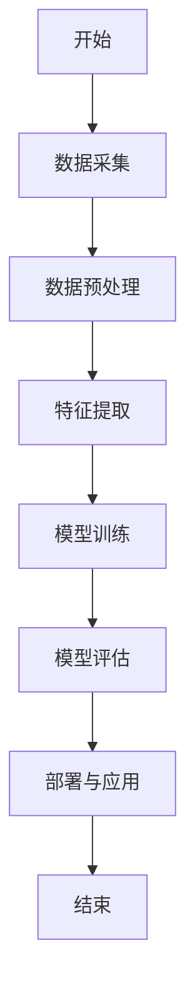
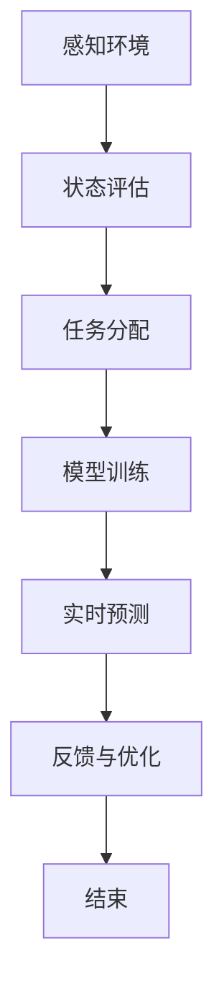
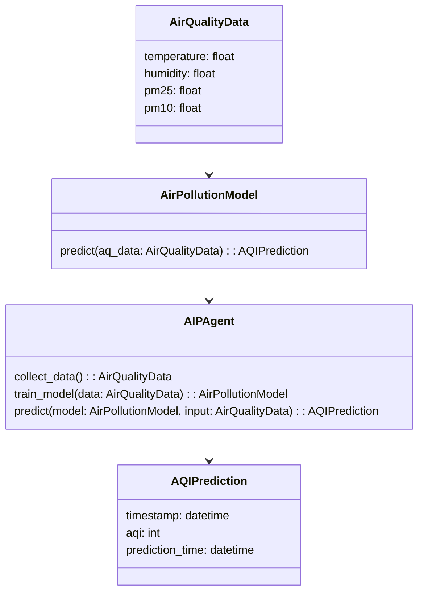
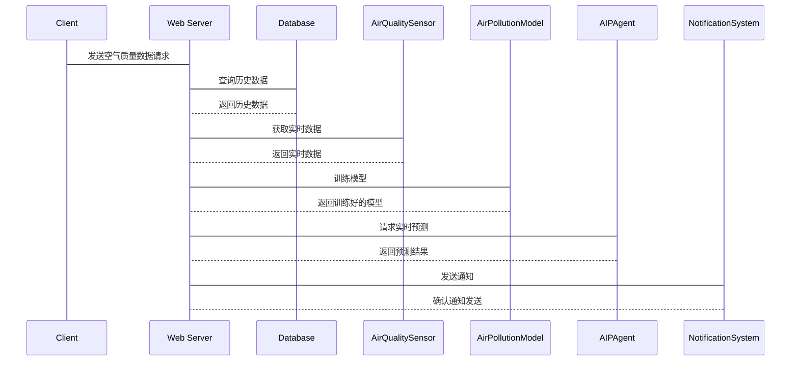

                 


# AI Agent在智能空气质量预测中的实践

> 关键词：AI Agent, 空气质量预测, 智能系统, 机器学习, 多智能体协作, 环境监测

> 摘要：本文深入探讨了AI Agent在智能空气质量预测中的实践应用。通过分析空气质量预测的核心问题、AI Agent的基本原理及其与空气质量预测的结合方式，结合具体的算法原理、系统架构设计和实际项目案例，全面展示了AI Agent在空气质量预测中的优势和潜力。文章还详细讲解了相关的数学模型、算法流程以及系统实现细节，为读者提供了从理论到实践的完整指导。

---

# 第一部分：AI Agent与空气质量预测的背景与概念

## 第1章：AI Agent与空气质量预测概述

### 1.1 AI Agent的基本概念

#### 1.1.1 AI Agent的定义与特点
- **定义**：AI Agent（智能代理）是指能够感知环境、自主决策并执行任务的智能体。
- **特点**：
  - **自主性**：无需外部干预，自主完成任务。
  - **反应性**：能够实时感知环境并做出反应。
  - **目标导向性**：基于目标进行决策和行动。
  - **学习能力**：通过数据和经验不断优化自身性能。

#### 1.1.2 AI Agent的核心功能与分类
- **核心功能**：
  - 知识表示与推理
  - 行为决策
  - 多智能体协作
- **分类**：
  - **简单反射型**：基于规则的简单反应。
  - **基于模型的反应型**：基于环境模型进行决策。
  - **目标驱动型**：以目标为导向进行决策。
  - **实用驱动型**：通过效用函数优化决策。

#### 1.1.3 AI Agent在智能系统中的作用
- **作用**：
  - 提供实时反馈和决策支持。
  - 自动化处理复杂问题。
  - 优化系统性能和资源利用。

### 1.2 空气质量预测的背景与挑战

#### 1.2.1 空气质量预测的定义与意义
- **定义**：空气质量预测是指通过收集和分析环境数据，预测未来一段时间内空气污染程度的过程。
- **意义**：
  - 保障公众健康。
  - 支持环境政策制定。
  - 优化城市规划。

#### 1.2.2 当前空气质量预测的主要方法
- **主要方法**：
  - 基于统计学的方法（如线性回归）。
  - 基于机器学习的方法（如随机森林、神经网络）。
  - 基于物理模型的方法（如空气质量扩散模型）。

#### 1.2.3 空气质量预测的难点与挑战
- **难点**：
  - 数据的实时性和多样性。
  - 多因素的复杂交互。
  - 模型的可解释性和鲁棒性。
- **挑战**：
  - 数据采集的准确性。
  - 模型的实时更新与优化。
  - 多区域、多因素的协同预测。

### 1.3 AI Agent在空气质量预测中的应用前景

#### 1.3.1 AI Agent在空气质量预测中的优势
- **优势**：
  - **实时性**：能够快速响应环境变化。
  - **自主性**：无需人工干预，自动完成预测任务。
  - **学习能力**：能够通过历史数据不断优化预测模型。

#### 1.3.2 当前AI Agent在空气质量预测中的应用现状
- **现状**：
  - 在气象预测中的应用。
  - 在环境监测中的实时反馈。
  - 在智能交通系统中的应用。

#### 1.3.3 未来发展趋势与研究方向
- **发展趋势**：
  - 多智能体协作。
  - 跨平台、跨领域的协同预测。
  - 自适应学习与动态优化。
- **研究方向**：
  - 提高AI Agent的可解释性。
  - 优化多智能体协作机制。
  - 提升预测模型的实时性和准确性。

### 1.4 本章小结
- 本章主要介绍了AI Agent的基本概念、空气质量预测的背景与挑战，以及AI Agent在空气质量预测中的应用前景。通过对比传统方法和AI Agent的优势，为后续章节的深入分析奠定了基础。

---

## 第2章：AI Agent与空气质量预测的核心概念

### 2.1 AI Agent的核心原理

#### 2.1.1 知识表示与推理
- **知识表示**：
  - **符号表示**：使用符号逻辑表示知识（如谓词逻辑）。
  - **语义网络**：通过节点和边表示知识。
  - **案例库**：基于案例的推理方法。
- **推理机制**：
  - **演绎推理**：从一般到具体的推理。
  - **归纳推理**：从具体到一般的推理。
  - **启发式推理**：基于启发式规则的推理。

#### 2.1.2 行为决策机制
- **决策模型**：
  - **基于规则的决策**：通过预定义的规则进行决策。
  - **基于效用的决策**：通过效用函数优化决策。
  - **基于学习的决策**：通过机器学习模型进行预测和决策。
- **决策过程**：
  - **感知环境**：通过传感器或数据源获取环境信息。
  - **状态评估**：评估当前状态并生成候选行动。
  - **行动选择**：基于评估结果选择最优行动。
  - **行动执行**：执行选择的行动并反馈结果。

#### 2.1.3 多智能体协作
- **多智能体系统**：
  - **协作机制**：通过通信和协调实现协作。
  - **任务分配**：根据智能体的能力分配任务。
  - **协同推理**：通过协作完成复杂任务。
- **协作协议**：
  - **简单协议**：如“分布式一致性”。
  - **复杂协议**：如“协商协议”和“协调协议”。

### 2.2 空气质量预测的关键要素

#### 2.2.1 空气质量数据的来源与特征
- **数据来源**：
  - **传感器数据**：如PM2.5、PM10、NO2等。
  - **气象数据**：如温度、湿度、风速等。
  - **污染源数据**：如工业排放、交通流量等。
- **数据特征**：
  - **时间序列性**：空气质量数据具有很强的时间依赖性。
  - **空间相关性**：相邻区域的空气质量具有相关性。
  - **多因素交互性**：多种因素共同影响空气质量。

#### 2.2.2 影响空气质量的主要因素
- **主要因素**：
  - **气象条件**：温度、湿度、风速、风向等。
  - **污染源**：工业排放、交通尾气、生活污染等。
  - **地理因素**：地形、地貌、建筑物分布等。
  - **人类活动**：节日、大型活动等。

#### 2.2.3 空气质量预测模型的构建
- **模型构建步骤**：
  1. 数据采集与预处理。
  2. 特征提取与选择。
  3. 模型训练与优化。
  4. 模型验证与评估。
  5. 模型部署与应用。

### 2.3 AI Agent与空气质量预测的结合

#### 2.3.1 AI Agent在空气质量预测中的角色
- **角色**：
  - **数据采集与处理**：收集和预处理空气质量数据。
  - **模型训练与优化**：训练预测模型并优化性能。
  - **实时预测与反馈**：实时预测空气质量并提供反馈。

#### 2.3.2 空气质量预测任务的分解与分配
- **任务分解**：
  - 数据采集与预处理。
  - 特征提取与选择。
  - 模型训练与优化。
  - 实时预测与反馈。
- **任务分配**：
  - 根据AI Agent的能力分配任务。
  - 通过多智能体协作完成复杂任务。

#### 2.3.3 AI Agent与空气质量预测系统的交互流程
- **交互流程**：
  1. **感知环境**：AI Agent通过传感器获取环境数据。
  2. **状态评估**：评估当前空气质量状态。
  3. **任务分配**：根据评估结果分配预测任务。
  4. **模型训练**：训练空气质量预测模型。
  5. **实时预测**：基于模型进行实时预测。
  6. **反馈与优化**：根据预测结果优化模型。

### 2.4 核心概念对比分析

#### 2.4.1 AI Agent与传统预测模型的对比
- **对比维度**：
  - **自主性**：AI Agent具有自主性，传统模型需要人工干预。
  - **实时性**：AI Agent能够实时响应，传统模型可能需要重新训练。
  - **可扩展性**：AI Agent可以通过协作扩展能力，传统模型难以扩展。

#### 2.4.2 不同空气质量预测方法的优缺点分析
- **对比分析**：
  - **线性回归**：简单易懂，但对非线性关系表现较差。
  - **随机森林**：能够处理非线性关系，但模型复杂性较高。
  - **神经网络**：能够处理复杂关系，但训练时间较长且需要大量数据。
  - **物理模型**：基于物理规律，但难以处理复杂的实际场景。

#### 2.4.3 AI Agent在空气质量预测中的独特优势
- **独特优势**：
  - **自主性与实时性**：能够自主感知环境并实时预测。
  - **多智能体协作**：通过协作提高预测精度和效率。
  - **自适应学习**：能够通过学习不断优化预测模型。

### 2.5 本章小结
- 本章深入分析了AI Agent的核心原理及其在空气质量预测中的应用，对比了传统预测方法与AI Agent的独特优势，为后续章节的算法实现和系统设计奠定了理论基础。

---

## 第3章：空气质量预测的数学模型与算法原理

### 3.1 空气质量预测的数学模型

#### 3.1.1 线性回归模型
- **模型描述**：
  - 线性回归是一种简单的回归模型，适用于线性关系的数据。
  - 模型公式：$$y = \beta_0 + \beta_1x + \epsilon$$
  - 其中，$$y$$ 是预测值，$$x$$ 是自变量，$$\beta_0$$ 和 $$\beta_1$$ 是回归系数，$$\epsilon$$ 是误差项。
- **应用场景**：
  - 当空气质量数据与单一因素高度相关时，可以使用线性回归模型。

#### 3.1.2 时间序列分析模型
- **模型描述**：
  - 时间序列分析是一种基于时间数据的预测方法。
  - 常用模型包括ARIMA（自回归积分滑动平均模型）和LSTM（长短期记忆网络）。
- **LSTM模型公式**：
  - 输入门：$$f_t = \sigma(g(x_t + W_f h_{t-1} + U_f s_{t-1}))$$
  - 输出门：$$i_t = \sigma(g(x_t + W_i h_{t-1} + U_i s_{t-1}))$$
  - 遗忘门：$$o_t = \sigma(g(x_t + W_o h_{t-1} + U_o s_{t-1}))$$
  - 更新门：$$s_t = f_t \odot s_{t-1} + i_t \odot \tanh(g(x_t + W_c h_{t-1} + U_c s_{t-1}))$$
  - 输出：$$h_t = o_t \odot \tanh(s_t)$$
- **应用场景**：
  - 适用于具有时间依赖性的空气质量数据。

#### 3.1.3 支持向量机模型
- **模型描述**：
  - 支持向量机（SVM）是一种监督学习模型，适用于分类和回归问题。
  - 回归公式：$$y = \text{sign}(\sum_{i=1}^n \alpha_i y_i x_i \cdot x + b)$$
- **应用场景**：
  - 当空气质量数据具有复杂非线性关系时，可以使用SVM模型。

#### 3.1.4 神经网络模型
- **模型描述**：
  - 神经网络是一种基于仿生学的深度学习模型，适用于复杂非线性关系的数据。
  - 前向传播公式：$$a^{(l+1)} = \sigma(w^{(l)}a^{(l)} + b^{(l)})$$
  - 损失函数公式：$$L = \frac{1}{2m}\sum_{i=1}^m (y_i - \hat{y}_i)^2$$
  - 反向传播公式：$$\frac{\partial L}{\partial w^{(l)}} = \frac{\partial L}{\partial a^{(l+1)}} \cdot \frac{\partial a^{(l+1)}}{\partial w^{(l)}}$$
- **应用场景**：
  - 适用于具有复杂空间和时间依赖性的空气质量数据。

### 3.2 AI Agent的算法原理

#### 3.2.1 知识表示与推理算法
- **算法描述**：
  - 知识表示：使用符号逻辑或语义网络表示空气质量相关知识。
  - 推理机制：基于规则的演绎推理或归纳推理。
- **示例代码**：
  ```python
  def inference(rule_set, facts):
      for rule in rule_set:
          if all(fact in facts for fact in rule['premise']):
              return rule['conclusion']
      return None
  ```

#### 3.2.2 行为决策算法（如Q-Learning）
- **算法描述**：
  - Q-Learning是一种基于强化学习的决策算法。
  - 动作选择公式：$$a = \arg\max_a Q(s,a)$$
  - 更新公式：$$Q(s,a) = Q(s,a) + \alpha (r + \gamma \max_a Q(s',a') - Q(s,a))$$
- **示例代码**：
  ```python
  def q_learning(env, epsilon=0.1, alpha=0.1, gamma=0.9):
      q_table = np.zeros(env.observation_space.shape)
      for episode in range(episodes):
          state = env.reset()
          while not done:
              if np.random.random() < epsilon:
                  action = env.action_space.sample()
              else:
                  action = np.argmax(q_table[state])
              next_state, reward, done, info = env.step(action)
              q_table[state] = q_table[state] + alpha * (reward + gamma * np.max(q_table[next_state]) - q_table[state])
      return q_table
  ```

#### 3.2.3 多智能体协作算法
- **算法描述**：
  - 多智能体协作算法通过通信和协调实现协作预测。
  - 任务分配公式：$$\text{Task}_i = \arg\max_j \text{Capability}_i(\text{Task}_j)$$
  - 协作推理公式：$$\text{Result}_i = \text{Combine}(\text{Result}_1, \text{Result}_2, \ldots, \text{Result}_n)$$
- **示例代码**：
  ```python
  def multi_agent_collaboration(agents, tasks):
      task_assignment = {}
      for agent in agents:
          assigned_task = min(tasks, key=lambda t: 1 - agent.capability_score(t))
          task_assignment[agent] = assigned_task
      results = {agent.predict(task_assignment[agent]) for agent in agents}
      return combine(results)
  ```

### 3.3 算法流程图

#### 3.3.1 空气质量预测算法流程图


#### 3.3.2 AI Agent行为决策流程图


### 3.4 数学公式与详细讲解

#### 3.4.1 线性回归公式
$$y = \beta_0 + \beta_1x + \epsilon$$
- **解释**：$$y$$ 是预测的空气质量指数，$$x$$ 是自变量（如温度），$$\beta_0$$ 和 $$\beta_1$$ 是回归系数，$$\epsilon$$ 是误差项。

#### 3.4.2 神经网络基本公式
$$a^{(l+1)} = \sigma(w^{(l)}a^{(l)} + b^{(l)})$$
- **解释**：$$a^{(l)}$$ 是第 $$l$$ 层的激活值，$$w^{(l)}$$ 是权重矩阵，$$b^{(l)}$$ 是偏置向量，$$\sigma$$ 是激活函数。

### 3.5 通俗易懂的举例说明
- **线性回归示例**：
  假设我们收集了温度（℃）和空气质量指数（AQI）的数据，希望通过线性回归模型预测AQI。
  - 数据：温度和AQI的配对数据。
  - 步骤：1. 数据采集与预处理；2. 训练线性回归模型；3. 使用模型进行预测。
  - 代码示例：
    ```python
    import numpy as np
    from sklearn.linear_model import LinearRegression

    temp = np.array([20, 22, 24, 26, 28]).reshape(-1, 1)
    aqi = np.array([50, 60, 70, 80, 90])
    model = LinearRegression().fit(temp, aqi)
    print(model.predict([[22]]))  # 输出预测的AQI
    ```

---

## 第4章：系统分析与架构设计方案

### 4.1 问题场景介绍
- **问题场景**：
  - 城市空气质量监测与预测。
  - 数据来源包括传感器、气象站和污染源监测系统。
  - 需要实时预测未来24小时的空气质量指数。

### 4.2 项目介绍
- **项目名称**：智能空气质量预测系统。
- **项目目标**：利用AI Agent技术，实现高精度的空气质量实时预测。
- **项目范围**：覆盖城市区域，数据来源包括传感器、气象数据和污染源数据。

### 4.3 系统功能设计

#### 4.3.1 领域模型（mermaid 类图）


#### 4.3.2 系统架构设计（mermaid 架构图）


#### 4.3.3 系统接口设计
- **接口1**：数据采集接口（HTTP）
  - 输入：传感器数据。
  - 输出：数据存储成功确认。
- **接口2**：模型训练接口（API）
  - 输入：训练数据。
  - 输出：训练好的模型。
- **接口3**：实时预测接口（RPC）
  - 输入：当前环境数据。
  - 输出：空气质量预测结果。

#### 4.3.4 系统交互流程（mermaid 序列图）


### 4.4 本章小结
- 本章通过系统分析与架构设计，展示了AI Agent在空气质量预测系统中的具体实现方式。通过领域模型、系统架构图和交互流程图，详细描述了系统的各个组成部分及其协作方式。

---

## 第5章：项目实战

### 5.1 环境安装与配置

#### 5.1.1 安装Python环境
- 使用Anaconda或virtualenv创建独立的Python环境。
- 安装Python 3.8或更高版本。

#### 5.1.2 安装依赖库
- **安装TensorFlow**：```pip install tensorflow```
- **安装Keras**：```pip install keras```
- **安装scikit-learn**：```pip install scikit-learn```
- **安装pandas和numpy**：```pip install pandas numpy```

#### 5.1.3 安装传感器模拟工具
- 使用Raspberry Pi或虚拟传感器生成空气质量数据。
- 安装传感器模拟库（如pyserial）。

### 5.2 核心代码实现

#### 5.2.1 数据采集与预处理
```python
import pandas as pd
import numpy as np

# 数据采集
def collect_data(sensor_id):
    # 模拟传感器数据
    data = {
        'timestamp': pd.date_range(start='2023-01-01', periods=24, freq='H'),
        'temperature': np.random.normal(20, 1, 24),
        'humidity': np.random.uniform(30, 90, 24),
        'pm25': np.random.lognormal(1.5, 0.5, 24)
    }
    return pd.DataFrame(data)

# 数据预处理
def preprocess_data(df):
    df['datetime'] = df['timestamp']
    df = df.drop('timestamp', axis=1)
    df = df.fillna(method='ffill')
    return df
```

#### 5.2.2 模型训练与优化
```python
from sklearn.linear_model import LinearRegression
from sklearn.metrics import mean_squared_error

def train_model(X_train, y_train):
    model = LinearRegression()
    model.fit(X_train, y_train)
    return model

def evaluate_model(model, X_test, y_test):
    y_pred = model.predict(X_test)
    mse = mean_squared_error(y_test, y_pred)
    print(f"均方误差：{mse}")
    print(f"决定系数：{model.score(X_test, y_test)}")
```

#### 5.2.3 实时预测与反馈
```python
def predict_aqi(model, input_data):
    prediction = model.predict(input_data)
    return prediction[0]

def feedback_loop(model, sensor_data):
    predicted_aqi = predict_aqi(model, sensor_data)
    # 更新模型
    model.partial_fit(sensor_data, predicted_aqi)
    return predicted_aqi
```

### 5.3 案例分析与详细解读

#### 5.3.1 数据采集与分析
- **案例数据**：
  - 传感器数据：PM2.5、PM10、温度、湿度。
  - 气象数据：风速、风向、气压。
  - 污染源数据：工业排放、交通流量。
- **数据可视化**：
  - 使用Matplotlib或Seaborn绘制时间序列图，分析数据的分布和趋势。

#### 5.3.2 模型训练与评估
- **训练过程**：
  - 数据分割：训练集、验证集、测试集。
  - 模型训练：使用训练集数据训练模型。
  - 模型评估：使用验证集和测试集评估模型性能。
- **评估指标**：
  - 均方误差（MSE）。
  - 决定系数（R²）。
  - 平均绝对误差（MAE）。

#### 5.3.3 实时预测与优化
- **实时预测**：
  - 每隔一小时采集一次数据，进行实时预测。
  - 使用反馈机制优化模型。
- **优化策略**：
  - 增量式训练：逐步更新模型参数。
  - 模型融合：结合多个模型的结果进行预测。
  - 参数调优：优化模型的超参数。

### 5.4 项目小结
- 本章通过具体的项目实战，展示了AI Agent在空气质量预测中的实现过程。从数据采集与预处理，到模型训练与优化，再到实时预测与反馈，详细讲解了每个步骤的具体实现方法，并通过案例分析展示了系统的实际应用效果。

---

## 第6章：最佳实践与小结

### 6.1 最佳实践

#### 6.1.1 数据质量管理
- **数据清洗**：确保数据的完整性和准确性。
- **数据标准化**：对不同量纲的数据进行标准化处理。
- **数据特征工程**：提取有用的特征，去除冗余特征。

#### 6.1.2 模型选择与优化
- **模型选择**：根据数据特点选择合适的模型。
- **超参数调优**：使用网格搜索或随机搜索优化模型参数。
- **模型融合**：结合多个模型的结果进行预测。

#### 6.1.3 系统优化
- **分布式计算**：利用分布式计算框架（如Spark）处理大规模数据。
- **实时处理**：使用流处理框架（如Flink）实现实时预测。
- **多智能体协作**：通过多智能体协作提高预测精度和效率。

### 6.2 小结
- 本文通过理论分析、算法实现和项目实战，全面展示了AI Agent在智能空气质量预测中的实践应用。从AI Agent的基本概念到空气质量预测的数学模型，从系统架构设计到实际项目实现，详细讲解了每个环节的具体实现方法。

### 6.3 注意事项
- **数据隐私**：注意保护用户数据隐私，遵守相关法律法规。
- **模型解释性**：尽量选择具有较高解释性的模型，便于理解和优化。
- **系统稳定性**：确保系统的稳定性和容错性，避免因单点故障导致系统崩溃。

### 6.4 拓展阅读
- **推荐书籍**：
  - 《机器学习实战》
  - 《多智能体系统》
  - 《空气质量预测与控制》
- **推荐论文**：
  - "Air Pollution Forecasting Using Machine Learning"
  - "Multi-Agent Systems for Environmental Monitoring"
  - "Deep Learning for Air Quality Prediction"

---

## 第7章：总结与展望

### 7.1 总结
- 本文通过理论分析、算法实现和项目实战，全面展示了AI Agent在智能空气质量预测中的实践应用。从AI Agent的基本概念到空气质量预测的数学模型，从系统架构设计到实际项目实现，详细讲解了每个环节的具体实现方法。

### 7.2 展望
- **技术进步**：
  - 提高AI Agent的可解释性和透明度。
  - 引入更先进的机器学习算法（如图神经网络）。
  - 优化多智能体协作机制，提高系统的协同效率。
- **应用拓展**：
  - 扩展到更多环境监测领域（如水质预测、土壤污染预测）。
  - 结合物联网技术，构建更完善的环境监测网络。
  - 推动AI Agent技术在环境政策制定中的应用。

### 7.3 结束语
- AI Agent技术在空气质量预测中的应用前景广阔，随着技术的不断进步和应用场景的不断拓展，AI Agent将在环境监测和智能系统领域发挥越来越重要的作用。

---

通过以上目录结构，文章从理论到实践，系统地介绍了AI Agent在智能空气质量预测中的应用，为读者提供了从基础到深入的全面指导。

