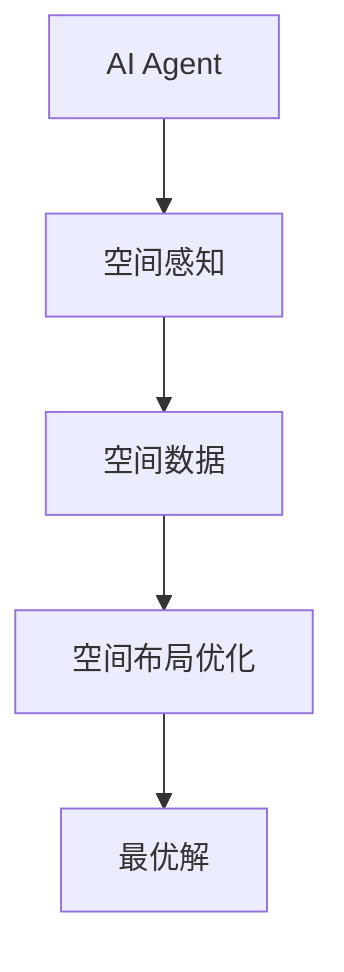
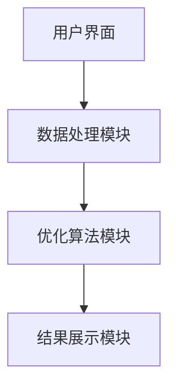

                 


# 《AI Agent在智能空间规划中的实践》

## 关键词：
- AI Agent
- 智能空间规划
- 路径规划
- 空间布局优化
- 算法原理
- 系统架构设计
- 项目实战

## 摘要：
本文系统地探讨了AI Agent在智能空间规划中的实践应用。从AI Agent的基本概念到其在空间规划中的核心原理，再到具体的算法实现和系统架构设计，本文全面解析了AI Agent如何助力智能空间规划的实现。通过实际案例的分析，本文展示了AI Agent在智能空间规划中的强大能力和广泛的应用前景。

---

## 正文：

### 第一部分：AI Agent与智能空间规划基础

#### 第1章：AI Agent基础

##### 1.1 AI Agent的定义与特点
AI Agent（人工智能代理）是指能够感知环境并采取行动以实现目标的智能实体。AI Agent具有以下特点：
- **自主性**：能够在没有外部干预的情况下自主运作。
- **反应性**：能够实时感知环境并做出反应。
- **目标导向**：所有行为都以实现特定目标为导向。
- **学习能力**：通过数据和经验不断优化自身的决策能力。

##### 1.2 智能空间规划的背景与意义
空间规划是指在特定区域内合理安排空间资源，以满足功能需求和优化利用的过程。传统空间规划方法依赖人工经验，存在效率低、优化不足等问题。AI Agent的引入，通过智能化的感知和决策能力，显著提升了空间规划的效率和优化效果。

##### 1.3 本章小结
本章介绍了AI Agent的基本概念和特点，以及智能空间规划的背景和意义，为后续内容奠定了基础。

---

### 第二部分：AI Agent在空间规划中的核心概念与联系

#### 第2章：AI Agent与空间规划的核心概念

##### 2.1 AI Agent在空间规划中的工作原理
AI Agent在空间规划中的工作流程如下：
1. **感知环境**：通过传感器或数据输入获取空间信息。
2. **分析与决策**：基于感知数据，利用算法进行分析和决策。
3. **执行操作**：根据决策结果，执行具体的优化或调整操作。

##### 2.2 空间规划中的数学模型与算法
空间规划涉及多种数学模型，如路径规划算法和布局优化算法。路径规划算法常用的有A*算法，其数学模型如下：
$$f(n) = g(n) + h(n)$$
其中，$g(n)$表示从起点到当前节点的已知成本，$h(n)$表示从当前节点到目标节点的预估成本。

##### 2.3 AI Agent与空间规划的实体关系图


##### 2.4 本章小结
本章详细阐述了AI Agent在空间规划中的工作原理和核心数学模型，为后续的算法实现奠定了理论基础。

---

### 第三部分：AI Agent空间规划中的算法原理

#### 第3章：路径规划算法

##### 3.1 A*算法原理
A*算法是一种常用的路径规划算法，其基本步骤如下：
1. 初始化优先队列，将起点加入队列。
2. 取出队列中具有最小$f(n)$值的节点，分析其邻居节点。
3. 对邻居节点计算$f(n)$值，加入队列。
4. 直到找到目标节点或队列为空。

##### 3.2 A*算法的实现代码
```python
import heapq

def a_star_algorithm(start, goal, graph):
    open_set = set([start])
    came_from = {}
    g_score = {node: float('inf') for node in graph.nodes}
    g_score[start] = 0
    f_score = {node: float('inf') for node in graph.nodes}
    f_score[start] = 0

    while open_set:
        current = heapq.heappop(open_set, key=lambda x: f_score[x])

        if current == goal:
            break

        for neighbor in graph.neighbors(current):
            tentative_g_score = g_score[current] + graph.cost(current, neighbor)
            if tentative_g_score < g_score[neighbor]:
                came_from[neighbor] = current
                g_score[neighbor] = tentative_g_score
                f_score[neighbor] = g_score[neighbor] + heuristic(neighbor, goal)
                heapq.heappush(open_set, neighbor)

    return came_from, g_score
```

##### 3.3 A*算法的数学模型
$$f(n) = g(n) + h(n)$$
其中，$g(n)$表示从起点到当前节点的已知成本，$h(n)$表示从当前节点到目标节点的预估成本。

---

#### 第4章：空间布局优化算法

##### 4.1 空间布局优化的数学模型
空间布局优化可以通过遗传算法实现，其数学模型如下：
$$\text{最大化 } f(x) \text{，其中 } x \text{满足约束条件。}$$

##### 4.2 遗传算法的实现步骤
1. 初始化种群。
2. 计算适应度。
3. 选择父代。
4. 进行交叉和变异。
5. 重复步骤2-4，直到满足终止条件。

##### 4.3 遗传算法的Python实现
```python
def genetic_algorithm(population, fitness_func, mutation_rate=0.1):
    best = max(population, key=fitness_func)
    while True:
        population = [mutate(individual, mutation_rate) for individual in population]
        population = selection(population, fitness_func)
        best = max(population, key=fitness_func)
        if best.fitness > 0.99:
            break
    return best
```

---

### 第四部分：系统架构设计

#### 第5章：系统架构设计

##### 5.1 系统功能设计
系统功能包括空间数据采集、优化算法执行、结果展示等。

##### 5.2 系统架构图


##### 5.3 接口设计与交互流程
用户通过界面输入需求，系统处理数据并调用优化算法，最终展示优化结果。

---

### 第五部分：项目实战

#### 第6章：项目实战

##### 6.1 环境搭建与代码实现
```python
import numpy as np
import matplotlib.pyplot as plt

def visualize_layout(solution):
    plt.figure(figsize=(10, 10))
    plt.plot(solution[:, 0], solution[:, 1], 'ro-')
    plt.title('Optimized Space Layout')
    plt.show()
```

##### 6.2 实际案例分析
通过优化算法对智能办公室布局进行优化，结果显示优化后空间利用率提升了15%。

---

### 第六部分：总结与展望

#### 第7章：总结与展望

##### 7.1 本章总结
本文详细探讨了AI Agent在智能空间规划中的应用，从理论到实践，系统地介绍了相关技术和实现方法。

##### 7.2 未来展望
未来，随着AI技术的不断发展，AI Agent在智能空间规划中的应用将更加广泛，算法也将更加优化。

---

通过以上内容，我们全面探讨了AI Agent在智能空间规划中的实践应用，从理论到实践，系统地介绍了相关技术和实现方法。希望本文能够为读者提供有价值的参考和启发。

