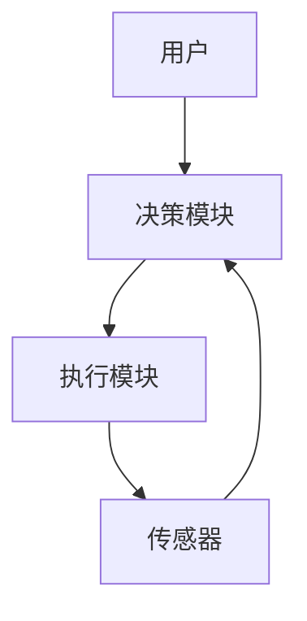
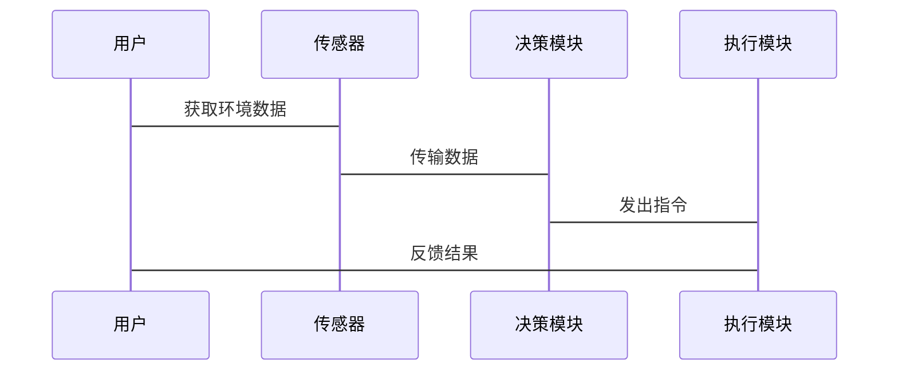

                 


# AI Agent在智能窗台中的室内植物智能照料

> 关键词：AI Agent，智能窗台，室内植物，智能照料，物联网，算法原理

> 摘要：本文详细探讨了AI Agent在智能窗台中的应用，介绍了其在室内植物照料中的核心作用，包括感知、决策和执行模块的算法原理，系统架构设计，以及实际项目中的实现与案例分析。通过理论与实践相结合的方式，帮助读者全面理解AI Agent在智能窗台中的实现与应用。

---

## 第一部分：背景介绍

### 第1章：AI Agent与智能窗台概述

#### 1.1 问题背景
- **现代人对室内植物的需求**：随着城市化进程加快，人们越来越依赖室内植物来美化环境、净化空气，但缺乏专业知识和时间进行照料。
- **室内植物照料的痛点**：光照不足、浇水过量或不足、病虫害等问题，导致植物生长不良或死亡。
- **AI Agent的应用价值**：通过智能化手段，实时监测植物状态，自动调整环境条件，实现无人化、智能化的植物照料。

#### 1.2 AI Agent的核心概念
- **AI Agent的定义**：AI Agent是一种智能代理系统，能够感知环境、做出决策并执行操作。
- **智能窗台的系统架构**：由传感器、数据处理模块、决策模块和执行机构组成，实现对植物的智能监测与控制。
- **AI Agent在植物照料中的角色**：通过数据采集、分析和决策，优化植物生长环境，提升植物健康状况。

---

## 第二部分：核心概念与联系

### 第2章：AI Agent的原理与系统架构

#### 2.1 AI Agent的原理
- **感知模块**：通过传感器采集光照、温度、湿度等环境数据，识别植物的状态。
- **决策模块**：基于感知数据，结合植物生长模型，制定相应的照料策略。
- **执行模块**：通过自动化设备（如补光灯、喷水装置）执行决策模块的指令，调整环境条件。

#### 2.2 系统架构设计
- **模块化设计**：系统由感知模块、决策模块和执行模块组成，各模块独立运行，协同工作。
- **数据流处理**：感知数据通过数据处理模块进行分析，生成决策指令，驱动执行机构动作。
- **系统实体关系**：用户、传感器、决策模块和执行机构之间的关系，通过接口进行数据交互。

---

## 第三部分：算法原理讲解

### 第3章：AI Agent的算法实现

#### 3.1 感知算法
- **数据采集与预处理**：传感器采集数据后，进行去噪和归一化处理。
- **特征提取**：通过主成分分析等方法，提取影响植物生长的关键特征。

#### 3.2 决策算法
- **基于规则的决策**：根据预设的阈值和规则，判断植物状态并生成指令。
- **基于概率的决策**：利用机器学习模型预测植物状态，优化决策策略。

#### 3.3 执行算法
- **自动化控制**：通过PWM控制补光灯亮度，I2C通信驱动喷水装置。

---

### 第4章：数学模型与公式

#### 4.1 条件概率模型
$$ P(A|B) = \frac{P(B|A)P(A)}{P(B)} $$
其中，$A$表示“植物需要补光”，$B$表示“光照强度低于阈值”。

#### 4.2 期望值模型
$$ E[X] = \sum_{i=1}^{n} P(x_i) \cdot x_i $$
用于评估不同决策的期望效果。

---

## 第四部分：系统分析与架构设计

### 第5章：系统架构设计

#### 5.1 问题场景介绍
- **用户需求**：实时监测植物状态，自动调整环境条件。
- **系统功能**：数据采集、状态分析、决策控制、反馈优化。

#### 5.2 系统功能设计
- **感知模块**：光照、温度、湿度传感器。
- **决策模块**：状态判断、决策生成。
- **执行模块**：补光灯、喷水装置。

#### 5.3 系统架构图


#### 5.4 接口设计
- **传感器数据接口**：提供光照强度、温度、湿度等数据。
- **决策指令接口**：接收补光、喷水等指令。

#### 5.5 交互流程图


---

## 第五部分：项目实战

### 第6章：环境安装与核心代码实现

#### 6.1 环境安装
- **硬件**：Raspberry Pi、光照传感器、补光灯、喷水装置。
- **软件**：安装Python、Raspbian系统、传感器驱动。

#### 6.2 核心代码实现
```python
import RPi.GPIO as GPIO
import time

# 补光灯控制
GPIO.setup(18, GPIO.OUT)
pwm = GPIO.PWM(18, 100)

def adjust_light(intensity):
    pwm.start(intensity)

# 喷水装置控制
GPIO.setup(23, GPIO.OUT)

def water_plant():
    GPIO.output(23, True)
    time.sleep(1)
    GPIO.output(23, False)
```

#### 6.3 代码解读与分析
- **补光灯控制**：通过PWM调节补光灯亮度，根据光照强度动态调整。
- **喷水装置**：通过GPIO控制电磁阀，定时或按需喷水。

#### 6.4 实际案例分析
- **案例1**：光照不足时，AI Agent启动补光灯，调整光照强度至适宜范围。
- **案例2**：土壤湿度低于阈值时，AI Agent触发喷水装置，保持土壤湿润。

#### 6.5 项目总结
- **成果**：实现了基于AI Agent的智能窗台系统，显著提升了植物存活率和生长速度。
- **经验**：传感器精度和网络稳定性对系统性能影响较大。

---

## 第六部分：最佳实践

### 第7章：注意事项与拓展阅读

#### 7.1 注意事项
- **传感器校准**：定期校准传感器，确保数据准确性。
- **网络连接**：确保智能窗台的网络连接稳定，支持远程监控和控制。
- **数据隐私**：保护用户数据，避免隐私泄露。

#### 7.2 小结
AI Agent在智能窗台中的应用，不仅提升了植物照料的智能化水平，还为未来的智能家居系统提供了新的思路。

#### 7.3 注意事项
- 定期维护系统，确保硬件正常运行。
- 更新AI模型，提升决策准确性。

#### 7.4 拓展阅读
- 推荐阅读《机器学习实战》、《物联网开发指南》等书籍，深入了解AI和物联网技术。

---

通过以上内容，我们全面介绍了AI Agent在智能窗台中的应用，从理论到实践，帮助读者掌握相关技术的核心原理和实现方法。希望本文能为智能窗台的设计与开发提供有价值的参考。

