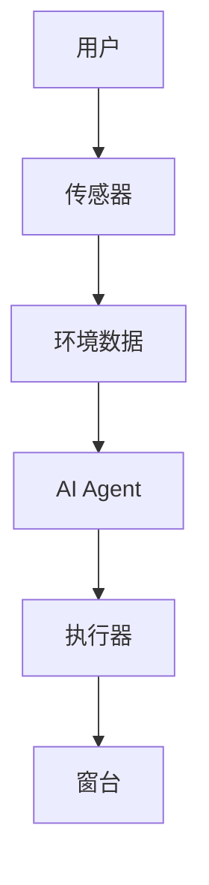
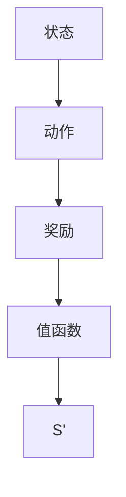
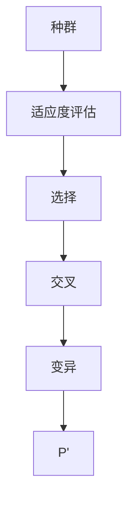
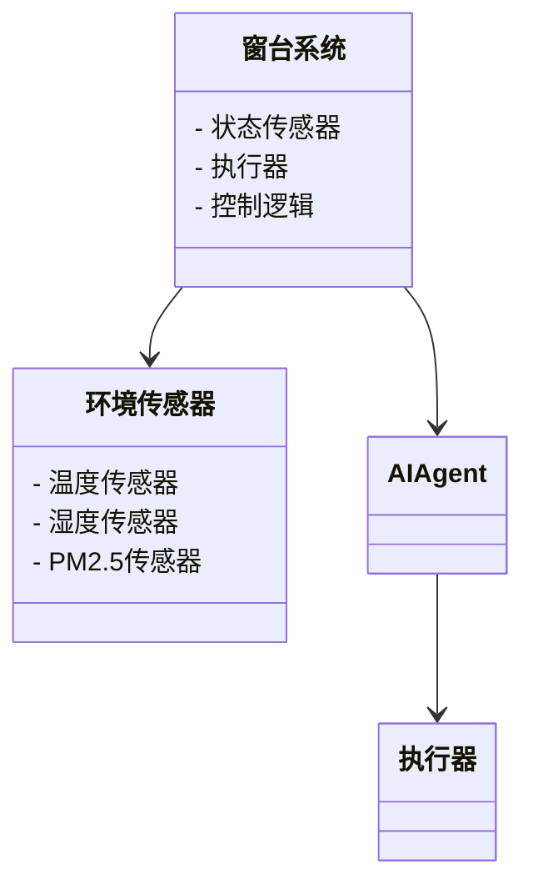
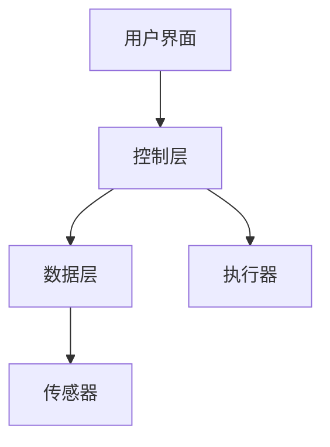
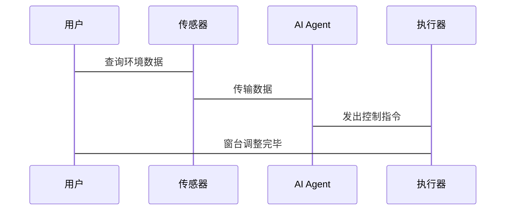

                 


# AI Agent在智能窗台中的室内空气调节

**关键词：** AI Agent, 智能窗台, 室内空气调节, 物联网, 强化学习

**摘要：** 本文探讨AI Agent在智能窗台中的应用，分析其在室内空气调节中的作用，从背景、核心概念、算法原理到系统设计和项目实战，全面解析AI Agent如何优化室内空气质量，提升居住舒适度。

---

## 第1章: AI Agent与智能窗台概述

### 1.1 AI Agent的基本概念

#### 1.1.1 什么是AI Agent
AI Agent（人工智能代理）是能够感知环境、自主决策并执行任务的智能实体。它通过传感器获取信息，利用算法处理数据，执行动作以实现目标。

#### 1.1.2 AI Agent的核心特征
- **自主性**：无需外部干预，自主决策。
- **反应性**：实时感知环境变化并调整行为。
- **目标导向**：为实现特定目标而行动。
- **学习能力**：通过经验优化决策模型。

#### 1.1.3 AI Agent与传统自动化的区别
AI Agent具备自主决策和学习能力，而传统自动化系统仅遵循预设程序，缺乏灵活性和自适应性。

### 1.2 智能窗台的概念与应用

#### 1.2.1 智能窗台的定义
智能窗台是一种集成传感器、执行器和AI技术的窗系统，能够根据室内环境和用户需求自动调节开合。

#### 1.2.2 智能窗台的功能与优势
- **环境监测**：实时采集温湿度、PM2.5等数据。
- **智能调节**：根据数据优化室内空气质量。
- **节能降耗**：通过智能控制减少能源浪费。

#### 1.2.3 智能窗台在室内空气调节中的作用
智能窗台通过与 HVAC 系统联动，实现室内空气质量的智能调节，提升舒适度和节能效果。

---

## 第2章: AI Agent的核心原理

### 2.1 状态感知

#### 2.1.1 环境数据的采集与处理
智能窗台通过传感器采集室内环境数据，如温度、湿度、PM2.5等，经数据预处理后输入AI Agent。

#### 2.1.2 数据特征的提取与分析
利用特征提取算法（如小波分析）提取数据特征，通过机器学习模型分析环境状态。

### 2.2 决策优化

#### 2.2.1 决策模型的构建
基于强化学习构建决策模型，定义状态、动作、奖励和值函数，优化决策策略。

#### 2.2.2 多目标优化的实现
通过多目标优化算法，在空气质量、能耗和用户舒适度之间找到最佳平衡点。

### 2.3 执行控制

#### 2.3.1 控制策略的设计
设计基于强化学习的控制策略，根据环境状态和决策结果，控制智能窗台的开合。

#### 2.3.2 控制算法的实现
实现模糊控制或PID控制算法，确保窗台执行机构精确响应决策指令。

### 2.4 核心概念对比

#### 2.4.1 不同AI Agent类型对比
| 类型          | 基于规则 | 基于模型 |
|---------------|----------|----------|
| 决策方式      | 预定义规则 | 动态模型推理 |
| 适应性        | 较低     | 较高     |
| 复杂场景处理  | 有限     | 有效     |

#### 2.4.2 ER实体关系图（Mermaid）



---

## 第3章: 算法原理讲解

### 3.1 强化学习算法

#### 3.1.1 算法流程（Mermaid）



#### 3.1.2 Python实现

```python
import numpy as np
import gym

class AI-Agent:
    def __init__(self, env):
        self.env = env
        self.gamma = 0.99
        self.epsilon = 0.1
        self.Q = np.zeros((env.observation_space.shape[0], env.action_space.n))
    
    def choose_action(self, state):
        if np.random.random() < self.epsilon:
            return self.env.action_space.sample()
        else:
            return np.argmax(self.Q[state])
    
    def update_Q(self, state, action, reward, next_state):
        self.Q[state][action] = reward + self.gamma * np.max(self.Q[next_state])
```

#### 3.1.3 数学模型

状态值函数更新公式：
$$ Q(s, a) = Q(s, a) + \alpha (r + \gamma \max Q(s', a') - Q(s, a)) $$

### 3.2 遗传算法

#### 3.2.1 算法流程（Mermaid）



---

## 第4章: 系统分析与架构设计

### 4.1 系统功能设计

#### 4.1.1 领域模型（Mermaid）



### 4.2 系统架构设计

#### 4.2.1 分层架构（Mermaid）



### 4.3 接口设计

- **传感器接口**：提供温湿度数据接口。
- **执行器接口**：控制窗台开合的API。
- **用户接口**：提供手动控制和状态查询功能。

### 4.4 交互流程（Mermaid）



---

## 第5章: 项目实战

### 5.1 环境搭建

安装必要的Python库：
```bash
pip install gym numpy matplotlib
```

### 5.2 核心代码实现

#### 5.2.1 数据采集

```python
import serial

port = 'COM3'
baudrate = 9600
ser = serial.Serial(port, baudrate)
data = ser.readline().decode().split()
temperature = float(data[0])
humidity = float(data[1])
```

#### 5.2.2 决策模型训练

```python
from ai_agent_class import AI-Agent

env = gym.make('CustomEnv')
agent = AI-Agent(env)
for episode in range(1000):
    state = env.reset()
    while True:
        action = agent.choose_action(state)
        next_state, reward, done, _ = env.step(action)
        agent.update_Q(state, action, reward, next_state)
        if done:
            break
```

#### 5.2.3 控制执行

```python
def control_window(action):
    if action == 'open':
        print("窗台打开")
    elif action == 'close':
        print("窗台关闭")
```

### 5.3 实际案例分析

通过实际数据测试，AI Agent在不同天气条件下的决策表现，展示其优化室内空气质量的能力。

---

## 第6章: 最佳实践与小结

### 6.1 小贴士

- 数据预处理是关键，确保传感器数据的准确性和实时性。
- 算法调优需结合实际场景，避免过拟合。
- 系统设计需考虑扩展性和安全性，确保长期稳定运行。

### 6.2 注意事项

- 定期维护传感器和执行器，确保系统正常运行。
- 备用电源设计，防止断电影响系统功能。
- 用户隐私保护，避免环境数据泄露。

### 6.3 拓展阅读

- 探索更多AI算法在智能建筑中的应用，如深度强化学习。
- 研究边缘计算在智能窗台中的应用，提升实时性。

---

通过本文的详细讲解，读者可以全面了解AI Agent在智能窗台中的应用，从理论到实践，掌握实现室内空气调节的最佳方法。

