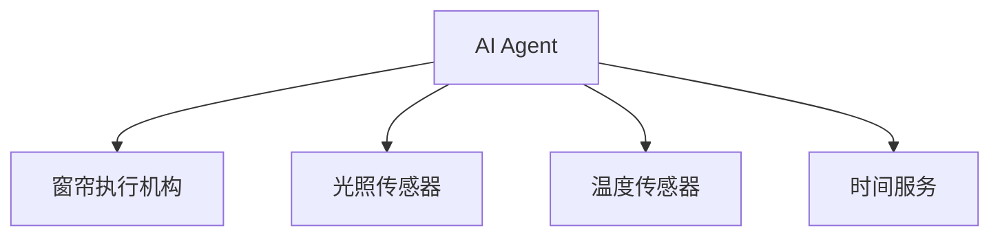
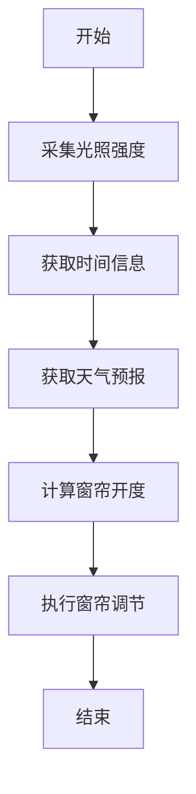
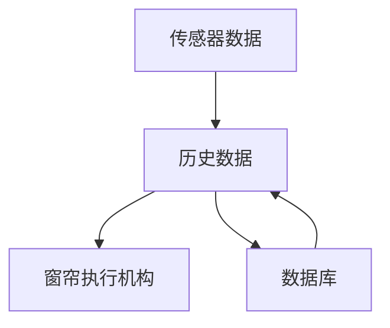

                 


# AI Agent在智能窗帘中的季节性光照调节

## 关键词：AI Agent，智能窗帘，季节性光照调节，算法设计，系统架构

## 摘要：本文探讨AI Agent在智能窗帘中的应用，重点分析如何通过AI技术实现季节性光照调节。从背景介绍到系统设计，再到项目实战，详细阐述AI Agent的工作原理、算法实现及系统架构，旨在为读者提供全面的技术指导。

---

## 第一部分：背景介绍

### 第1章：问题背景与描述

#### 1.1 季节性光照调节的背景
- **光照对室内环境的影响**：光照强度和时间直接影响室内温度、湿度和舒适度。
- **季节变化对光照需求的影响**：夏季需要更多自然光，冬季则需减少直射阳光以保持温暖。
- **传统调节方式的不足**：固定时间表或简单传感器调节无法适应季节变化。

#### 1.2 智能窗帘的发展历程
- **基本概念**：智能窗帘通过自动化技术调节开合。
- **技术演进**：从手动控制到自动化，再到AI驱动的智能调节。
- **季节性调节的需求与挑战**：传统方法难以灵活应对季节变化。

---

## 第二部分：核心概念与联系

### 第2章：AI Agent的基本原理

#### 2.1 AI Agent的核心概念
- **定义与特征**：AI Agent能够感知环境并自主决策。
- **在智能窗帘中的应用**：AI Agent通过数据驱动调节窗帘状态。

#### 2.2 AI Agent与智能窗帘的结合
- **环境感知**：采集光照、温度、湿度等数据。
- **智能决策**：基于历史数据和当前状态预测最佳调节方案。

#### 2.3 核心概念对比
| 概念 | 描述 |
|------|------|
| AI Agent | 具备感知和决策能力的智能体 |
| 智能窗帘 | 集成传感器和执行机构的自动化窗帘 |
| 季节性调节 | 根据季节变化调整窗帘开合 |

#### 2.4 系统架构图


---

## 第三部分：算法原理

### 第3章：AI Agent的算法实现

#### 3.1 数据采集与处理
- **光照强度的采集**：使用光敏传感器获取实时光照值。
- **环境数据的预处理**：对数据进行归一化处理，去除异常值。

#### 3.2 决策逻辑
- **基于光照强度的决策模型**：根据光照强度和时间决定窗帘开合程度。
- **数学模型**：光照强度 $I$ 与窗帘开度 $S$ 的关系可表示为：
  $$ S = \text{max}(0, \text{min}(1, \alpha I + \beta)) $$
  其中，$\alpha$ 和 $\beta$ 为训练得到的参数。

#### 3.3 季节性调整算法
- **数据训练**：利用历史光照数据训练AI Agent，使其适应不同季节的需求。
- **动态调整**：根据实时天气预报调整窗帘开合策略。

#### 3.4 算法流程图


---

## 第四部分：系统分析与架构设计

### 第4章：系统架构设计

#### 4.1 系统功能设计
- **光照监测模块**：实时采集光照强度。
- **AI Agent决策模块**：分析数据并做出调节决策。
- **窗帘执行模块**：根据决策调整窗帘状态。

#### 4.2 系统架构图


#### 4.3 接口与交互
- **传感器接口**：通过I2C或UART连接光照和温度传感器。
- **用户界面**：提供手动调节和查看调节历史的功能。

---

## 第五部分：项目实战

### 第5章：环境安装与代码实现

#### 5.1 环境安装
- **安装Python环境**：推荐使用Anaconda。
- **安装库与工具**：如Python的`gpiozero`库用于控制硬件，`tensorflow`用于机器学习。

#### 5.2 核心代码实现
```python
# 示例代码：AI Agent的核心逻辑
import numpy as np
from gpiozero import LED

class AICurtainAgent:
    def __init__(self):
        self.led = LED(17)  # 假设引脚为17

    def adjust_curtain(self, light_intensity):
        # 简单的调节逻辑：光照强度低于阈值时打开窗帘
        threshold = 50  # 光照强度阈值
        if light_intensity < threshold:
            self.led.on()
        else:
            self.led.off()

# 示例代码：数据采集模块
import time

def get_light_intensity():
    # 简单模拟光照传感器数据
    return np.random.randint(0, 100)
```

#### 5.3 代码解读与分析
- **AI Agent类**：包含窗帘调节方法，根据光照强度决定是否开启窗帘。
- **数据采集模块**：模拟传感器数据，实际应用中需替换为真实传感器接口。

#### 5.4 实际案例分析
- **案例1**：夏季高温，光照强度高，AI Agent决定关闭窗帘以减少热量进入。
- **案例2**：冬季阴天，光照强度低，AI Agent开启窗帘以增加室内光线。

---

## 第六部分：总结与展望

### 第6章：总结与最佳实践

#### 6.1 总结
- **优势**：AI Agent能够根据季节变化智能调节窗帘，提升舒适度和能源效率。
- **局限性**：需要持续的数据采集和模型优化，硬件成本较高。

#### 6.2 最佳实践
- **数据质量**：确保传感器数据的准确性和实时性。
- **系统稳定性**：选择可靠的硬件和稳定的网络连接。
- **用户反馈**：定期收集用户反馈，优化调节策略。

#### 6.3 注意事项
- **隐私问题**：避免用户数据泄露。
- **系统维护**：定期更新软件和模型，确保系统正常运行。

#### 6.4 拓展阅读
- 推荐阅读《机器学习实战》和《物联网开发指南》。

---

通过以上详细的设计和分析，我们可以看到AI Agent在智能窗帘中的应用潜力巨大。未来，随着技术的发展，AI Agent将更加智能化，为用户提供更舒适、更节能的居住环境。

