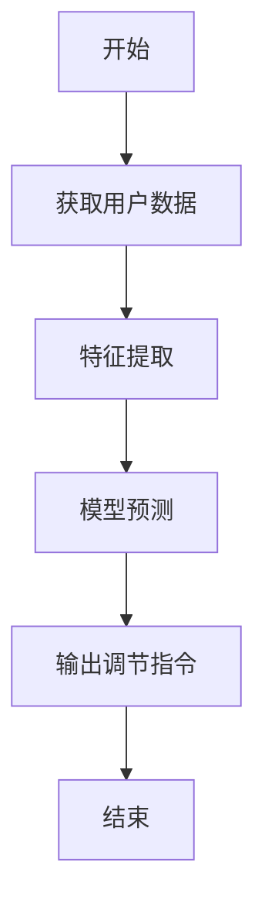
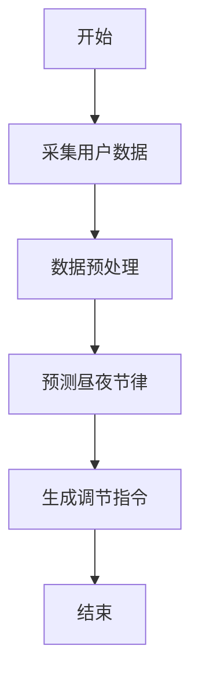
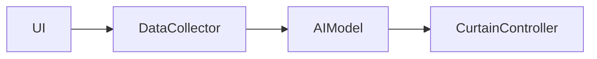
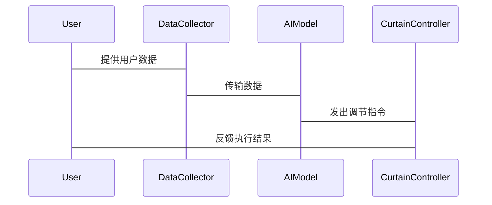

                 


# AI Agent在智能窗帘中的昼夜节律调节

> **关键词**: AI Agent, 智能窗帘, 昼夜节律, 环境感知, 机器学习, 强化学习

> **摘要**: 本文探讨AI Agent在智能窗帘中的应用，特别是如何通过调节窗帘行为优化昼夜节律。从背景、原理到系统设计、项目实现，详细分析AI代理在智能窗帘中的技术实现和实际应用。

---

## 第1章 引言

### 1.1 背景介绍

#### 1.1.1 人类昼夜节律的重要性
- 昼夜节律对身体健康的影响
- 现代生活方式对昼夜节律的干扰

#### 1.1.2 智能家居的发展现状
- 智能家居的普及
- 智能窗帘的功能与局限

#### 1.1.3 AI Agent在智能家居中的潜力
- AI Agent的优势
- 智能窗帘与AI Agent的结合

### 1.2 问题描述

#### 1.2.1 昼夜节律紊乱的常见原因
- 不规律的作息
- 环境因素的影响

#### 1.2.2 智能窗帘调节的现状与问题
- 手动调节的不便
- 现有自动化调节的不足

#### 1.2.3 当前调节方法的局限性
- 缺乏个性化
- 无法实时反馈

### 1.3 AI Agent的作用

#### 1.3.1 AI Agent如何解决调节问题
- 通过学习用户行为优化调节策略
- 实现实时反馈与动态调整

#### 1.3.2 边界条件与适用场景
- 用户数据收集的范围
- 系统运行的环境条件

#### 1.3.3 功能的外延与限制
- 考虑的因素
- 不考虑的因素

### 1.4 核心概念与结构

#### 1.4.1 昼夜节律调节的核心要素
- 用户行为数据
- 环境传感器数据
- 调节指令输出

#### 1.4.2 AI Agent的组成部分
- 数据采集模块
- 算法模型
- 执行模块

#### 1.4.3 智能窗帘系统的架构
- 用户界面
- 环境传感器
- 调节执行机构

### 1.5 本章小结
- 总结本章内容
- 引入下一章的核心概念

---

## 第2章 AI Agent与昼夜节律调节的核心概念

### 2.1 核心概念原理

#### 2.1.1 昼夜节律的生物钟机制
- 内源性昼夜节律
- 外源性因素的影响

#### 2.1.2 AI Agent的基本原理
- 数据采集与处理
- 模型训练与预测
- 执行策略生成

#### 2.1.3 智能窗帘调节的实现机制
- 窗帘的物理操作
- 调节指令的执行

### 2.2 核心概念对比表
| 概念       | 昼夜节律调节 | AI Agent | 智能窗帘 |
|------------|-------------|----------|----------|
| 核心目标   | 调节生物钟   | 执行任务 | 提供环境支持 |
| 输入       | 用户行为数据 | 用户指令 | 环境传感器数据 |
| 输出       | 窗帘调节指令 | 窗帘控制信号 | 窗帘动作 |

### 2.3 ER实体关系图

```mermaid
erDiagram
    用户数据 : 用户行为数据
    窗帘系统 : 窗帘状态
    AI Agent : AI算法模型
    用户数据 --> AI Agent : 输入
    AI Agent --> 窗帘系统 : 输出
```

### 2.4 本章小结
- 总结核心概念
- 为后续算法讲解打下基础

---

## 第3章 AI Agent算法原理与数学模型

### 3.1 算法原理

#### 3.1.1 基于机器学习的昼夜节律预测
- 机器学习的基本概念
- 昼夜节律预测的算法选择

#### 3.1.2 基于强化学习的窗帘调节优化
- 强化学习的基本原理
- 应用于窗帘调节的优势

#### 3.1.3 算法流程图



### 3.2 数学模型与公式

#### 3.2.1 昼夜节律预测模型

$$ y = \beta_0 + \beta_1 x_1 + \beta_2 x_2 + \epsilon $$

其中：
- $y$ 是预测的昼夜节律指数
- $x_1, x_2$ 是用户行为和环境数据特征
- $\beta_0, \beta_1, \beta_2$ 是模型参数
- $\epsilon$ 是误差项

#### 3.2.2 强化学习模型

$$ Q(s, a) = r + \gamma \max_{a'} Q(s', a') $$

其中：
- $s$ 是当前状态
- $a$ 是当前动作
- $r$ 是奖励
- $\gamma$ 是折扣因子
- $Q(s', a')$ 是下一个状态的最佳动作值

### 3.3 本章小结
- 总结算法原理
- 引入系统设计部分

---

## 第4章 系统分析与架构设计

### 4.1 问题场景介绍

#### 4.1.1 使用场景
- 用户日常生活中的应用场景
- 特殊情况下的处理

#### 4.1.2 需求分析
- 用户需求
- 系统需求

### 4.2 系统功能设计

#### 4.2.1 功能模块划分
- 数据采集模块
- 数据处理模块
- 调节执行模块

#### 4.2.2 功能实现
- 数据采集与预处理
- 昼夜节律预测
- 调节指令生成

#### 4.2.3 功能流程图



### 4.3 系统架构设计

#### 4.3.1 模块化设计
- 数据层
- 逻辑层
- 表现层

#### 4.3.2 系统架构图



### 4.4 系统接口设计

#### 4.4.1 接口定义
- 数据接口
- 控制接口

#### 4.4.2 接口协议
- HTTP
- MQTT

### 4.5 系统交互序列图



### 4.6 本章小结
- 总结系统设计
- 引入实现部分

---

## 第5章 项目实战

### 5.1 环境安装与配置

#### 5.1.1 开发环境
- Python 3.8+
- Python库：pandas, scikit-learn, MQTT库

#### 5.1.2 安装步骤
```bash
pip install pandas scikit-learn paho-mqtt
```

### 5.2 核心代码实现

#### 5.2.1 数据预处理代码
```python
import pandas as pd

def preprocess_data(data):
    # 假设data是一个包含用户行为和环境数据的DataFrame
    # 这里进行简单的清洗和特征提取
    data['time'] = pd.to_datetime(data['time'])
    features = data[['user_id', 'activity', 'light_level']]
    return features
```

#### 5.2.2 机器学习模型训练
```python
from sklearn.linear_model import LinearRegression

model = LinearRegression()
model.fit(X_train, y_train)
```

#### 5.2.3 强化学习策略实现
```python
import numpy as np

class QLearning:
    def __init__(self, actions):
        self.actions = actions
        self.q_table = np.zeros(len(actions), dtype=np.float)
    
    def choose_action(self, state, epsilon=0.1):
        if np.random.random() < epsilon:
            return np.random.choice(self.actions)
        else:
            return np.argmax(self.q_table)
    
    def learn(self, state, action, reward):
        self.q_table[action] = reward
```

#### 5.2.4 调节指令生成
```python
def generate_instruction(action):
    # action可以是'open', 'close', 'adjust'
    return f"执行{action}窗帘操作"
```

### 5.3 代码解读与分析

#### 5.3.1 数据预处理
- 输入数据清洗
- 特征提取

#### 5.3.2 模型训练
- 线性回归模型
- 强化学习策略网络

#### 5.3.3 指令生成
- 根据模型输出生成调节指令

### 5.4 实际案例分析

#### 5.4.1 案例介绍
- 用户数据示例
- 系统处理过程

#### 5.4.2 调节效果分析
- 昼夜节律改善
- 系统反馈

### 5.5 项目总结
- 成果展示
- 经验总结

---

## 第6章 最佳实践与优化建议

### 6.1 关键技术总结

#### 6.1.1 数据采集与处理
- 数据质量的重要性
- 特征工程的优化

#### 6.1.2 算法选择
- 根据场景选择算法
- 模型调优

### 6.2 注意事项

#### 6.2.1 数据隐私保护
- 用户数据的安全性
- 合法合规使用

#### 6.2.2 系统稳定性
- 系统容错设计
- 故障恢复机制

#### 6.2.3 用户体验
- 界面友好
- 反馈及时

### 6.3 拓展阅读

#### 6.3.1 相关技术
- 其他AI算法
- 其他智能家居设备

#### 6.3.2 最新研究进展
- AI在健康科技中的应用
- 智能家居的未来发展

---

## 第7章 总结

### 7.1 核心内容回顾
- AI Agent在智能窗帘中的应用
- 昼夜节律调节的技术实现

### 7.2 未来展望
- 更多AI技术的应用
- 多设备协同优化

---

## 第8章 拓展阅读

### 8.1 推荐书籍
- 《人工智能: A Modern Approach》
- 《机器学习实战》

### 8.2 相关论文
- 基于强化学习的智能家居控制
- AI在健康监测中的应用

---

**结束**

