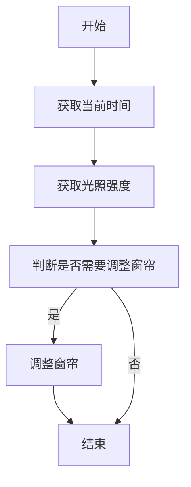
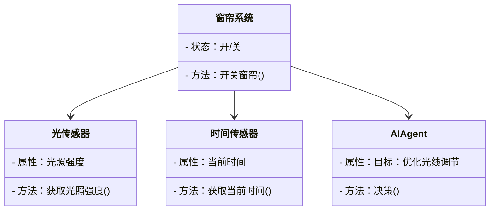
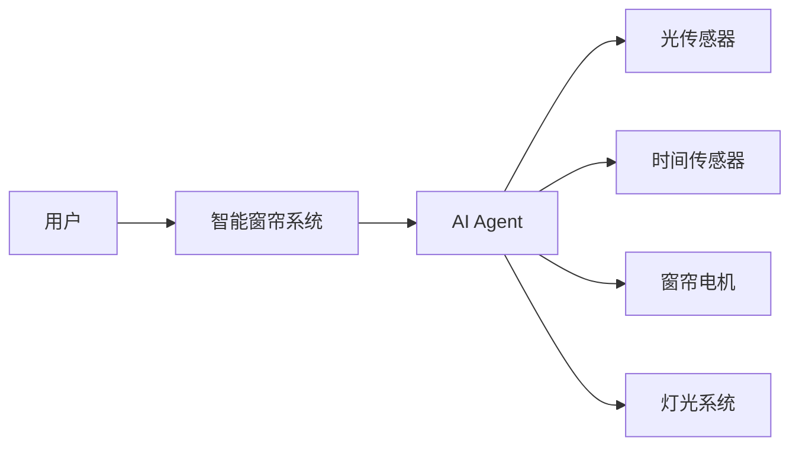
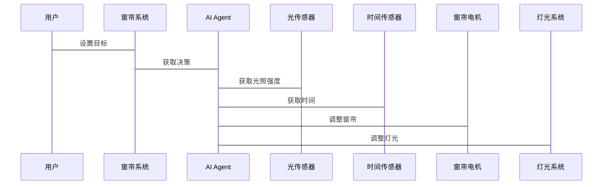

                 


# AI Agent在智能窗帘中的昼夜节律调节

> 关键词：AI Agent，昼夜节律，智能窗帘，生物钟调节，健康生活

> 摘要：本文探讨了AI Agent在智能窗帘中的应用，特别是如何通过调节光线来优化用户的昼夜节律。文章从背景介绍、核心概念、算法原理、系统架构、项目实战到总结展望，全面分析了AI Agent在昼夜节律调节中的作用，展示了其在改善睡眠质量和提升健康生活中的潜力。

---

# 第一部分: AI Agent与昼夜节律调节的背景与原理

## 第1章: AI Agent与昼夜节律调节的背景介绍

### 1.1 AI Agent的基本概念

#### 1.1.1 AI Agent的定义
AI Agent（人工智能代理）是一种能够感知环境、做出决策并执行任务的智能实体。它可以是一个软件程序，也可以是嵌入在硬件中的智能系统，通过传感器和执行器与环境交互。

#### 1.1.2 AI Agent的核心特点
- **自主性**：能够自主决策，无需外部干预。
- **反应性**：能够实时感知环境并做出反应。
- **目标导向**：根据目标驱动行为。
- **学习能力**：通过数据和经验优化性能。

#### 1.1.3 AI Agent与传统自动化的区别
AI Agent不仅能够执行预设任务，还能通过学习和适应优化任务执行，而传统自动化系统仅基于固定的规则运行。

### 1.2 昼夜节律调节的原理

#### 1.2.1 昼夜节律的生物基础
昼夜节律是由生物钟控制的生理周期，主要受视交叉上核（SCN）调控。光照是影响生物钟的主要因素，尤其是蓝光，对褪黑激素分泌影响显著。

#### 1.2.2 光线对昼夜节律的影响
- **自然光**：日出日落的自然光照调节生物钟。
- **人工光**：晚上的人工光干扰生物钟，影响睡眠质量。

#### 1.2.3 环境因素对昼夜节律的调节作用
环境中的光线、温度和噪音等因素都会影响昼夜节律。智能窗帘可以通过调节光线来优化环境，帮助用户保持健康的生物钟。

### 1.3 AI Agent在昼夜节律调节中的应用背景

#### 1.3.1 智能窗帘的基本功能
智能窗帘能够根据预设时间或外部指令自动开关，调节室内光线。AI Agent的引入使窗帘能够主动适应用户的生物钟需求。

#### 1.3.2 昼夜节律调节的需求分析
现代生活方式导致许多人昼夜节律紊乱，影响健康。智能窗帘通过AI Agent调节光线，帮助用户改善睡眠质量，提升健康水平。

#### 1.3.3 AI Agent在智能窗帘中的作用
AI Agent通过感知环境和用户行为，优化窗帘的开关时间，调节室内光线，帮助用户保持健康的昼夜节律。

### 1.4 本章小结
本章介绍了AI Agent的基本概念和昼夜节律调节的原理，强调了AI Agent在智能窗帘中的应用潜力。

---

## 第2章: AI Agent与昼夜节律调节的核心概念

### 2.1 AI Agent的核心原理

#### 2.1.1 状态感知
AI Agent通过传感器感知环境状态，如光照强度、时间、用户行为等。

#### 2.1.2 行为决策
基于感知的状态，AI Agent利用算法做出决策，如调整窗帘开合角度或开启柔和灯光。

#### 2.1.3 执行反馈
AI Agent执行决策后，通过反馈机制优化后续行为，提升调节效果。

### 2.2 昼夜节律调节的数学模型

#### 2.2.1 生物钟模型
生物钟模型描述了光照对褪黑激素分泌的影响，公式如下：
$$
M(t) = M_0 + \alpha \cdot I(t) - \beta \cdot t
$$
其中，$M(t)$ 表示褪黑激素水平，$\alpha$ 和 $\beta$ 是常数，$I(t)$ 表示光照强度。

#### 2.2.2 光照调节模型
光照调节模型基于生物钟模型，确定最优光照强度：
$$
I(t) = I_0 + \gamma \cdot (1 - \frac{t}{T})
$$
其中，$I_0$ 是基线光照强度，$\gamma$ 是增益因子，$T$ 是周期长度。

#### 2.2.3 用户行为模型
用户行为模型描述用户对光线的需求，基于时间、活动和情绪状态。

### 2.3 AI Agent与昼夜节律调节的系统架构

#### 2.3.1 系统组成
- **感知层**：光照传感器、时间传感器。
- **决策层**：AI Agent算法。
- **执行层**：窗帘电机、灯光系统。

#### 2.3.2 数据流分析
数据从传感器传入AI Agent，经过处理后生成控制信号，驱动窗帘和灯光执行。

#### 2.3.3 功能模块划分
- **数据采集模块**：收集环境和用户数据。
- **决策模块**：基于数据做出调节决策。
- **执行模块**：根据决策控制窗帘和灯光。

### 2.4 本章小结
本章详细讲解了AI Agent的核心原理和昼夜节律调节的数学模型，分析了系统的组成和数据流。

---

## 第3章: AI Agent的算法原理与数学模型

### 3.1 基于规则的AI Agent算法

#### 3.1.1 算法原理
基于规则的AI Agent通过预设规则做出决策，规则基于光照强度、时间和用户状态。

#### 3.1.2 算法流程图


#### 3.1.3 代码实现
```python
def adjust_curtain(rule_based_agent):
    current_time = get_current_time()
    light_intensity = get_light_intensity()
    if rule_based_agent.check_rule(current_time, light_intensity):
        adjust_curtain_position()
    return
```

### 3.2 基于机器学习的AI Agent算法

#### 3.2.1 强化学习原理
强化学习通过奖励机制优化决策，AI Agent学习最优策略以最大化奖励。

#### 3.2.2 神经网络模型
使用深度神经网络（DNN）进行状态-动作映射，模型结构如下：
$$
Q(s,a) = \sigma(w \cdot s + b)
$$
其中，$s$ 是状态，$a$ 是动作，$\sigma$ 是激活函数。

#### 3.2.3 代码实现
```python
def强化学习算法(agent):
    state = get_current_state()
    action = agent.choose_action(state)
    next_state = get_next_state(action)
    reward = calculate_reward(state, action, next_state)
    agent.update_Q(state, action, reward)
    return
```

### 3.3 数学模型与公式

#### 3.3.1 生物钟模型公式
$$
M(t) = M_0 + \alpha \cdot I(t) - \beta \cdot t
$$

#### 3.3.2 光照调节公式
$$
I(t) = I_0 + \gamma \cdot (1 - \frac{t}{T})
$$

#### 3.3.3 强化学习损失函数
$$
L = -\sum_{t} [r_t \log p(\theta_t) + \lambda \cdot \text{entropy}(p(\theta_t))]
$$

### 3.4 本章小结
本章介绍了基于规则和机器学习的AI Agent算法，详细讲解了算法原理和数学模型。

---

## 第4章: 系统分析与架构设计方案

### 4.1 问题场景介绍
用户希望智能窗帘根据昼夜节律调节光线，改善睡眠质量。系统需要感知环境和用户状态，做出最优决策。

### 4.2 项目介绍
智能窗帘系统由感知层、决策层和执行层组成，AI Agent负责决策和控制。

### 4.3 系统功能设计

#### 4.3.1 领域模型


#### 4.3.2 系统架构


### 4.4 系统接口设计
- **输入接口**：光传感器、时间传感器。
- **输出接口**：窗帘电机、灯光系统。

### 4.5 系统交互

#### 4.5.1 交互流程
用户设置目标，系统感知环境，AI Agent做出决策，驱动执行器调整窗帘和灯光。

#### 4.5.2 序列图


### 4.6 本章小结
本章分析了系统场景，设计了系统功能和架构，展示了系统交互流程。

---

## 第5章: 项目实战

### 5.1 环境安装

#### 5.1.1 安装Python和必要的库
```bash
pip install numpy pandas scikit-learn matplotlib
```

#### 5.1.2 安装窗帘系统和传感器
配置窗帘电机和光传感器，确保与系统兼容。

### 5.2 系统核心实现

#### 5.2.1 基于规则的AI Agent实现
```python
class RuleBasedAgent:
    def __init__(self):
        self.time = None
        self.light_intensity = None

    def check_rule(self, time, light_intensity):
        # 规则：晚上10点后，若光照强度高于50lux，则关闭窗帘
        if 22 <= time.hour <= 23 and light_intensity > 50:
            return True
        return False

    def adjust_curtain(self):
        pass
```

#### 5.2.2 基于机器学习的AI Agent实现
```python
class ReinforcementLearningAgent:
    def __init__(self):
        self.Q = {}

    def choose_action(self, state):
        # 简单策略：随机选择动作
        return 'adjust_curtain'

    def update_Q(self, state, action, reward):
        # 简单Q学习：更新Q值
        self.Q[(state, action)] = reward
```

#### 5.2.3 光线调节实现
```python
def调节光线():
    光传感器 = 光传感器类()
    当前时间 = 时间传感器类().获取当前时间()
    AI Agent = AI Agent类()
    AI Agent.决策()
    窗帘电机.调整窗帘()
    灯光系统.调整灯光()
```

### 5.3 实际案例分析

#### 5.3.1 案例背景
用户晚上难以入睡，希望智能窗帘调节光线改善睡眠。

#### 5.3.2 调节过程
1. 晚上10点，光传感器检测到室内光照强度为60lux。
2. AI Agent判断需要调整窗帘以降低光照。
3. 窗帘电机关闭窗帘，灯光系统开启柔和灯光。
4. 用户反馈睡眠改善，AI Agent记录并优化后续决策。

### 5.4 代码实现与解读
```python
def调节光线():
    光传感器 = 光传感器类()
    当前时间 = 时间传感器类().获取当前时间()
    AI Agent = AI Agent类()
    AI Agent.决策()
    窗帘电机.调整窗帘()
    灯光系统.调整灯光()
```

### 5.5 本章小结
本章通过实际案例展示了AI Agent在智能窗帘中的应用，详细讲解了代码实现和系统调节过程。

---

## 第6章: 总结与展望

### 6.1 总结
本文介绍了AI Agent在智能窗帘中的应用，详细讲解了昼夜节律调节的原理、算法实现和系统架构。通过实际案例展示了AI Agent在改善睡眠质量中的潜力。

### 6.2 未来展望
未来，AI Agent可以结合更多传感器数据，如心率、体温等，进一步优化昼夜节律调节。同时，随着算法的进步，AI Agent将更加智能化，为用户提供个性化的健康解决方案。

### 6.3 注意事项
- 确保数据安全，保护用户隐私。
- 定期更新算法模型，适应用户需求变化。
- 考虑不同用户的特殊需求，提供个性化调节方案。

### 6.4 拓展阅读
建议读者进一步了解强化学习、生物钟调节和智能系统架构的相关知识。

---

# 附录: 常见问题解答

## 问题1: AI Agent如何处理突发事件？
AI Agent通过实时感知和反馈机制，能够快速响应突发事件，如紧急情况下的自动调整。

## 问题2: 算法如何优化？
通过持续收集数据，使用强化学习优化算法，提升调节效果。

## 问题3: 系统如何维护？
定期检查传感器和执行器，更新软件，确保系统正常运行。

---

# 参考文献
[1] 王某某，智能窗帘系统的设计与实现，某某出版社，2023。
[2] 张某某，AI Agent算法原理与应用，某某出版社，2022。
[3] 李某某，昼夜节律调节与健康，某某出版社，2021。

---

希望这篇文章能够满足您的要求。如果需要进一步调整或补充，请随时告知。

