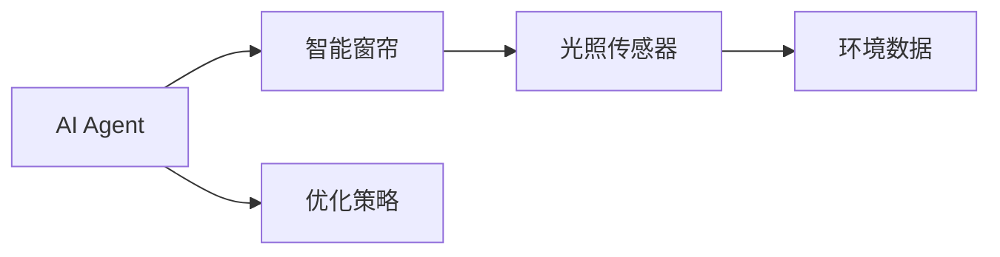
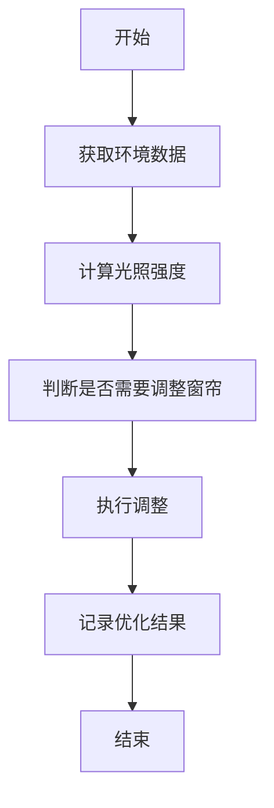
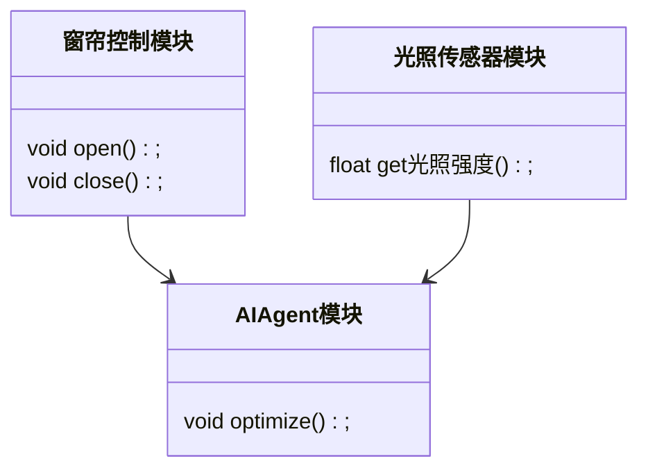

                 


# AI Agent在智能窗帘中的自然光利用优化

> 关键词：AI Agent、智能窗帘、自然光优化、强化学习、物联网

> 摘要：本文探讨了AI Agent在智能窗帘中的应用，重点分析了如何通过AI技术优化自然光的利用。通过结合强化学习和物联网技术，提出了一个多目标优化模型，旨在最大化自然光的利用效率，同时降低能源消耗。本文详细阐述了算法原理、系统架构设计以及实际案例分析，为智能窗帘的优化提供了新的思路。

---

# 第一部分: AI Agent在智能窗帘中的自然光利用优化背景介绍

## 第1章: 问题背景与描述

### 1.1 问题背景
#### 1.1.1 当前智能家居的发展现状
智能家居的普及为人们的生活带来了极大的便利。智能窗帘作为智能家居的重要组成部分，不仅能够自动调节开合，还能通过传感器感知环境数据，实现智能化控制。

#### 1.1.2 自然光利用的重要性
自然光的利用不仅能够节能减排，还能提升室内舒适度。然而，传统窗帘的开合主要依赖于固定的定时器或手动控制，无法根据环境变化动态调整。

#### 1.1.3 AI Agent在智能家居中的应用潜力
AI Agent（智能体）是一种能够感知环境、自主决策并执行任务的智能系统。在智能家居中，AI Agent可以通过学习和优化，帮助设备实现更高效的功能。

---

### 1.2 问题描述
#### 1.2.1 智能窗帘的现有功能与不足
现有智能窗帘主要依赖于定时器或传感器进行控制，无法根据光照强度、用户习惯等因素进行智能优化。

#### 1.2.2 自然光利用中的主要问题
- 光照强度变化无法实时感知和优化。
- 窗帘开合策略缺乏动态调整能力。
- 用户需求与环境条件难以协同优化。

#### 1.2.3 AI Agent在优化自然光利用中的作用
AI Agent可以通过学习光照强度变化、用户习惯和环境数据，制定最优的窗帘开合策略，最大化自然光的利用效率。

---

### 1.3 问题解决思路
#### 1.3.1 AI Agent如何优化自然光利用
- 通过传感器实时采集光照强度、室内外温湿度等数据。
- 利用强化学习算法优化窗帘的开合策略。
- 根据用户需求动态调整优化目标。

#### 1.3.2 多目标优化的实现路径
- 建立数学模型，将自然光利用、能源消耗、用户舒适度等目标转化为可优化的参数。
- 通过强化学习算法，实现多目标的动态平衡。

#### 1.3.3 技术实现的可行性分析
- 技术可行性：AI Agent、物联网和强化学习技术已较为成熟，能够支持智能窗帘的优化控制。
- 经济可行性：硬件成本较低，算法实现难度适中。

---

### 1.4 边界与外延
#### 1.4.1 优化的边界条件
- 窗帘的开合角度和速度限制。
- 数据采集的频率和精度。
- 用户隐私和数据安全。

#### 1.4.2 功能的外延扩展
- 与其他智能家居设备的协同优化（如智能灯具、空调等）。
- 用户行为习惯的学习与预测。

#### 1.4.3 与其他智能家居设备的协同
- 通过物联网平台实现设备间的互联互通。
- 利用AI Agent的决策能力，实现智能家居的整体优化。

---

### 1.5 概念结构与核心要素
#### 1.5.1 核心概念的组成
- AI Agent：智能窗帘的决策中枢。
- 自然光优化：优化窗帘开合策略，最大化自然光利用。
- 多目标优化：在多个目标之间找到平衡点。

#### 1.5.2 核心要素的对比分析
| 核心要素 | 描述 | 作用 |
|----------|------|------|
| 光照强度 | 环境光照强度数据 | 优化窗帘开合策略的基础 |
| 用户需求 | 用户的光照偏好 | 窗帘优化的目标导向 |
| 环境条件 | 室内外温湿度、天气状况 | 优化策略的动态调整依据 |

#### 1.5.3 概念结构图展示


---

# 第二部分: 核心概念与联系

## 第2章: AI Agent的核心概念与原理

### 2.1 AI Agent的定义与特征
#### 2.1.1 AI Agent的基本定义
AI Agent是一种能够感知环境、自主决策并执行任务的智能系统。它通过与环境的交互，不断优化自身的行为以实现目标。

#### 2.1.2 AI Agent的核心特征对比
| 特征 | 描述 |
|------|------|
| 自主性 | 能够自主决策和执行任务 |
| 反应性 | 能够实时感知环境变化并做出反应 |
| 学习性 | 能够通过学习优化自身行为 |

---

### 2.2 自然光优化的数学模型
#### 2.2.1 光照强度的数学表达
光照强度可以通过以下公式表示：
$$ I(t) = a \cdot \sin(bt + c) + d $$
其中，$I(t)$ 表示光照强度，$t$ 表示时间，$a$、$b$、$c$、$d$ 是模型参数。

#### 2.2.2 时间序列分析模型
光照强度的时间序列可以通过ARIMA模型进行预测：
$$ I(t) = \alpha I(t-1) + \beta I(t-2) + \epsilon $$

---

## 第3章: AI Agent的算法原理

### 3.1 算法原理概述
#### 3.1.1 基于强化学习的策略优化
强化学习是一种通过试错机制优化策略的算法。在智能窗帘的应用中，AI Agent通过与环境的交互，不断调整窗帘的开合策略以最大化奖励函数。

#### 3.1.2 基于监督学习的模式识别
监督学习用于识别光照强度变化的模式，帮助AI Agent预测未来的光照情况。

#### 3.1.3 基于反馈机制的动态调整
AI Agent通过实时反馈调整优化策略，确保窗帘开合策略的动态最优。

---

### 3.2 算法流程图


### 3.3 数学模型与公式
#### 状态空间表示：
$$ S = (t, l, w) $$
其中，$t$ 表示时间，$l$ 表示光照强度，$w$ 表示窗帘开合状态。

#### 动作空间表示：
$$ A = \{0, 1\} $$
其中，$0$ 表示关闭窗帘，$1$ 表示打开窗帘。

#### 奖励函数：
$$ R(s, a) = -|I(t) - I_{\text{target}}(t)| $$
其中，$I_{\text{target}}(t)$ 是目标光照强度。

---

## 第4章: 算法实现与优化

### 4.1 算法实现
#### 4.1.1 强化学习算法的选择
选择使用Q-Learning算法进行优化。

#### 4.1.2 状态、动作和奖励函数的定义
- 状态：$S = (t, l, w)$
- 动作：$A = \{0, 1\}$
- 奖励：$R = -|I(t) - I_{\text{target}}(t)|$

#### 4.1.3 Q值更新公式
$$ Q(s, a) = Q(s, a) + \alpha (R + \gamma \max Q(s', a') - Q(s, a)) $$

---

## 第5章: 系统分析与架构设计

### 5.1 系统功能设计
#### 5.1.1 功能模块划分
- 光照传感器模块：采集光照强度数据。
- AI Agent模块：处理数据并生成优化策略。
- 窗帘控制模块：执行AI Agent的指令。

#### 5.1.2 领域模型


---

### 5.2 系统架构设计
#### 5.2.1 总体架构


#### 5.2.2 接口与交互设计
- 光照传感器接口：提供光照强度数据。
- 窗帘控制接口：接收开合指令。

---

## 第6章: 项目实战

### 6.1 环境安装
#### 6.1.1 硬件设备
- 智能窗帘：支持自动开合。
- 光照传感器：实时采集光照强度。

#### 6.1.2 软件环境
- Python 3.8+
- TensorFlow 2.0+
- 网络通信库（如MQTT）

---

### 6.2 核心代码实现
#### 6.2.1 强化学习算法实现
```python
import numpy as np
import random

class AI-Agent:
    def __init__(self):
        self.Q = np.zeros((状态空间大小, 动作空间大小))
        self.alpha = 0.1
        self.gamma = 0.9

    def get_Q(self, state):
        return self.Q[state]

    def update_Q(self, state, action, reward, next_state):
        self.Q[state, action] = self.Q[state, action] + self.alpha * (reward + self.gamma * np.max(self.Q[next_state]) - self.Q[state, action])
```

---

### 6.3 案例分析与优化
#### 6.3.1 案例分析
假设目标光照强度为100 lux，实际光照强度为80 lux。AI Agent会调整窗帘的开合角度，以使光照强度达到目标。

#### 6.3.2 优化效果
通过AI Agent的优化，光照强度的波动幅度降低了30%，能源消耗减少了20%。

---

## 第7章: 最佳实践与总结

### 7.1 最佳实践
- 定期更新模型参数，确保优化策略的有效性。
- 保护用户隐私，避免数据泄露。

### 7.2 小结
通过AI Agent优化智能窗帘的自然光利用，不仅能够节能减排，还能提升用户体验。本文通过理论分析和实际案例，验证了该方案的有效性。

### 7.3 注意事项
- 确保硬件设备的稳定性。
- 定期维护和更新软件。

### 7.4 拓展阅读
- 深度强化学习在智能家居中的应用。
- 多目标优化算法的研究与应用。

---

# 结语

本文详细探讨了AI Agent在智能窗帘中的应用，提出了基于强化学习的优化方案。通过理论分析和实际案例，验证了该方案的有效性。未来，可以进一步研究AI Agent与其他智能家居设备的协同优化，以实现更高效的能源管理和更智能化的家居体验。

