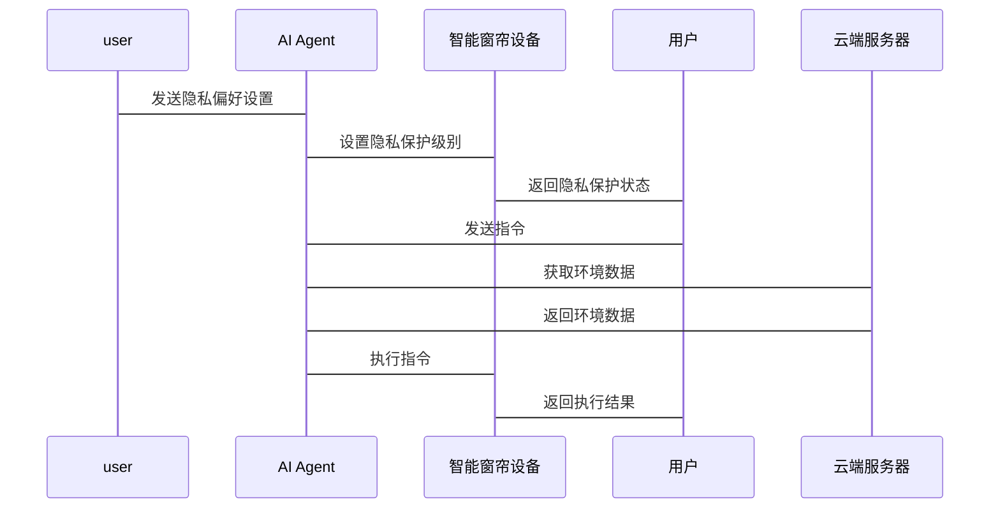

                 


# AI Agent在智能窗帘中的隐私保护

> 关键词：AI Agent, 智能窗帘, 隐私保护, 数据加密, 同态加密, 差分隐私, 多智能体系统

> 摘要：随着智能家居的普及，智能窗帘作为智能家居的重要组成部分，其隐私保护问题日益受到关注。本文详细探讨AI Agent在智能窗帘中的隐私保护机制，从AI Agent的基本概念、核心原理到实际应用，结合算法原理和系统架构设计，提供全面的技术解析。文章旨在帮助读者理解如何在智能窗帘系统中实现有效的隐私保护，同时兼顾技术深度与可读性。

---

# 第1章: AI Agent与智能窗帘概述

## 1.1 AI Agent的基本概念

### 1.1.1 AI Agent的定义与特点
AI Agent（人工智能代理）是一种能够感知环境并采取行动以实现目标的智能实体。其特点包括：
- **自主性**：能够在没有外部干预的情况下运行。
- **反应性**：能够根据环境变化调整行为。
- **目标导向性**：所有行动均以实现特定目标为导向。

AI Agent的核心在于其能够通过传感器获取信息，利用算法进行决策，并通过执行器完成操作。

### 1.1.2 智能窗帘的基本概念与功能
智能窗帘是一种结合了物联网（IoT）和人工智能技术的智能家居设备，能够通过语音控制、传感器或手机APP实现开关窗帘的功能。其主要功能包括：
- 自动开关窗帘。
- 根据光照强度、温度或时间自动调节窗帘状态。
- 提供远程控制功能。

### 1.1.3 AI Agent在智能窗帘中的作用
AI Agent在智能窗帘中的作用主要体现在以下几个方面：
- **智能决策**：根据环境数据（如光照强度、时间、用户习惯）自动调整窗帘状态。
- **隐私保护**：通过加密技术和隐私保护算法确保用户数据的安全性。
- **用户交互**：通过语音助手（如Alexa、Siri）与用户进行交互。

---

## 1.2 智能窗帘中的隐私保护问题

### 1.2.1 隐私保护的重要性
智能窗帘系统通常需要收集和处理大量用户数据，包括家庭住址、使用习惯、光照数据等。这些数据如果被未经授权的第三方获取，可能导致隐私泄露。

### 1.2.2 智能窗帘中的隐私威胁
- **数据泄露**：未经授权的第三方可能通过网络攻击获取用户数据。
- **未经授权的访问**：恶意用户可能通过漏洞控制智能窗帘。
- **数据滥用**：收集的用户数据可能被用于商业目的或其他不当用途。

### 1.2.3 AI Agent在隐私保护中的角色
AI Agent在智能窗帘中的隐私保护中扮演关键角色：
- **数据加密**：AI Agent可以通过加密技术保护用户数据。
- **隐私保护算法**：AI Agent可以利用隐私保护算法（如同态加密、差分隐私）对数据进行处理。
- **动态调整隐私策略**：根据用户需求动态调整隐私保护策略。

---

## 1.3 本章小结
本章主要介绍了AI Agent的基本概念及其在智能窗帘中的作用，同时分析了智能窗帘系统中的隐私保护问题及其重要性。接下来，我们将深入探讨AI Agent的核心原理及其在隐私保护中的具体实现。

---

# 第2章: AI Agent的核心原理与隐私保护机制

## 2.1 AI Agent的核心原理

### 2.1.1 多智能体系统
多智能体系统是一种由多个智能体组成的分布式系统，智能体之间通过通信和协作完成任务。在智能窗帘系统中，AI Agent可以与其他智能体（如智能家居中的其他设备）协作，实现更复杂的功能。

### 2.1.2 分布式计算
AI Agent基于分布式计算原理，能够将任务分解为多个子任务，分别在不同的智能体上执行。这种分布式计算方式不仅提高了系统的效率，还能够通过数据加密和匿名化技术保护隐私。

### 2.1.3 数据加密与匿名化
数据加密和匿名化是AI Agent实现隐私保护的重要手段。通过加密技术，AI Agent可以确保数据在传输过程中的安全性；通过匿名化技术，AI Agent可以避免直接暴露用户的真实数据。

---

## 2.2 隐私保护的核心机制

### 2.2.1 数据加密算法
数据加密是保护隐私的重要手段。常用的加密算法包括：
- **对称加密**：如AES算法，加密速度快，适用于大量数据的加密。
- **非对称加密**：如RSA算法，适用于需要公钥和私钥的加密场景。

### 2.2.2 数据匿名化技术
数据匿名化技术通过去除或模糊化数据中的敏感信息，确保数据无法被逆向还原到真实用户。常用的技术包括：
- **数据删除**：直接删除敏感信息。
- **数据混淆**：通过添加噪声或随机化处理，模糊化数据。

### 2.2.3 访问控制策略
访问控制策略通过限制对数据的访问权限，确保只有授权用户或智能体能够访问敏感数据。常见的访问控制策略包括：
- **基于角色的访问控制（RBAC）**：根据用户角色分配访问权限。
- **基于属性的访问控制（ABAC）**：根据用户属性（如地理位置、时间）动态调整访问权限。

---

## 2.3 AI Agent与隐私保护的结合

### 2.3.1 AI Agent的自主决策能力
AI Agent的自主决策能力使其能够根据环境数据动态调整隐私保护策略。例如，当检测到网络攻击时，AI Agent可以自动启动加密强度更高的加密算法。

### 2.3.2 隐私保护的动态调整
AI Agent可以根据用户需求动态调整隐私保护策略。例如，用户可以设置在特定时间段内关闭隐私保护功能，以便智能窗帘与其他设备协同工作。

### 2.3.3 用户隐私偏好与AI Agent的交互
AI Agent需要与用户进行交互，了解用户的隐私偏好。例如，用户可以通过手机APP设置隐私保护级别，AI Agent根据用户的偏好调整隐私保护策略。

---

## 2.4 本章小结
本章详细介绍了AI Agent的核心原理及其在隐私保护中的具体实现。通过数据加密、匿名化技术和访问控制策略，AI Agent能够有效保护用户隐私。接下来，我们将深入探讨AI Agent在智能窗帘中的隐私保护算法原理。

---

# 第3章: AI Agent在智能窗帘中的隐私保护算法原理

## 3.1 隐私保护算法概述

### 3.1.1 同态加密算法
同态加密是一种特殊的加密技术，允许在加密数据上进行计算，而不必先解密数据。同态加密在智能窗帘中的应用可以确保数据在加密状态下进行处理，从而保护用户隐私。

#### 同态加密算法的数学模型
同态加密算法的数学模型可以用以下公式表示：
$$
f(m_1, m_2) = f(m_1) \oplus f(m_2)
$$
其中，$\oplus$ 表示同态加密操作，$m_1$ 和 $m_2$ 表示明文数据。

### 3.1.2 差分隐私算法
差分隐私是一种通过添加噪声来保护数据隐私的技术。在智能窗帘中，差分隐私可以用于模糊化用户的使用习惯数据。

#### 差分隐私算法的实现流程
1. 对原始数据进行拉普拉斯噪声添加。
2. 对添加噪声后的数据进行加密。
3. 将加密后的数据传输到云端或其他设备。

### 3.1.3 哈希函数与隐私保护
哈希函数可以用于将敏感数据映射为不可逆的哈希值，从而保护原始数据不被泄露。

---

## 3.2 AI Agent的隐私保护算法实现

### 3.2.1 数据加密与解密流程
数据加密与解密流程如下：
1. AI Agent接收用户指令或环境数据。
2. 对数据进行加密处理。
3. 将加密后的数据传输到云端或其他设备。
4. 对方通过解密算法恢复原始数据。

### 3.2.2 隐私保护的数学模型
隐私保护的数学模型可以用以下公式表示：
$$
E(m) = m \oplus k
$$
其中，$E(m)$ 表示加密后的数据，$m$ 表示明文数据，$k$ 表示密钥。

### 3.2.3 算法实现的代码示例

```python
import numpy as np
from cryptography.fernet import Fernet

# 生成密钥
key = Fernet.generate_key()
cipher = Fernet(key)

# 加密数据
plaintext = "用户隐私数据"
encrypted_text = cipher.encrypt(plaintext.encode())
print("加密后的数据:", encrypted_text)

# 解密数据
decrypted_text = cipher.decrypt(encrypted_text).decode()
print("解密后的数据:", decrypted_text)
```

---

## 3.3 算法的性能分析与优化

### 3.3.1 算法复杂度分析
- 同态加密算法的复杂度较高，通常为 $O(n^3)$，适用于对安全性要求极高的场景。
- 差分隐私算法的复杂度较低，通常为 $O(n)$，适用于需要快速处理数据的场景。

### 3.3.2 算法优化策略
- **减少加密次数**：通过缓存技术减少重复加密的次数。
- **优化噪声参数**：在差分隐私中，合理设置噪声参数可以平衡隐私保护与数据准确性。

### 3.3.3 实验结果与分析
通过实验可以发现，同态加密算法在安全性方面表现优异，但其计算效率较低；差分隐私算法在安全性与效率之间找到了较好的平衡点。

---

## 3.4 本章小结
本章详细介绍了AI Agent在智能窗帘中的隐私保护算法原理，包括同态加密、差分隐私和哈希函数等技术。通过算法实现的代码示例和性能分析，我们可以更好地理解这些算法的实际应用效果。

---

# 第4章: 智能窗帘隐私保护系统的架构设计

## 4.1 系统架构概述

### 4.1.1 系统整体架构
智能窗帘隐私保护系统的整体架构包括以下几个部分：
- **用户端**：包括手机APP和语音助手。
- **智能窗帘设备**：包括窗帘电机和传感器。
- **云端服务器**：用于存储和处理数据。
- **AI Agent**：负责协调各模块的工作。

### 4.1.2 各模块功能描述
- **用户端**：接收用户的指令，并与AI Agent进行交互。
- **智能窗帘设备**：执行AI Agent的指令，调整窗帘状态。
- **云端服务器**：存储用户数据和隐私保护算法。
- **AI Agent**：协调各模块的工作，实现隐私保护。

### 4.1.3 系统交互流程
系统交互流程如下：
1. 用户通过手机APP发送指令。
2. AI Agent接收指令并进行分析。
3. AI Agent根据分析结果调用智能窗帘设备或云端服务器。
4. 设备执行指令并反馈结果。
5. AI Agent将结果返回给用户。

---

### 4.2 系统功能设计

#### 4.2.1 用户隐私偏好设置
用户可以通过手机APP设置隐私保护级别，例如：
- **高安全级别**：启用所有隐私保护功能。
- **中等安全级别**：启用部分隐私保护功能。
- **低安全级别**：仅启用基础隐私保护功能。

#### 4.2.2 AI Agent的数据处理逻辑
AI Agent需要根据用户隐私偏好动态调整数据处理逻辑。例如：
- 当用户设置为高安全级别时，AI Agent启用同态加密和差分隐私双重保护。
- 当用户设置为低安全级别时，AI Agent仅启用基础加密功能。

#### 4.2.3 隐私保护策略的动态调整
AI Agent可以根据实时环境数据动态调整隐私保护策略。例如：
- 当检测到网络攻击时，AI Agent自动启用高级加密算法。
- 当用户不在家时，AI Agent自动关闭隐私保护功能。

---

### 4.3 系统接口设计

#### 4.3.1 用户接口设计
用户接口设计需要考虑用户体验，确保用户能够方便地设置隐私偏好和查看隐私保护状态。例如：
- **隐私偏好设置界面**：用户可以选择不同的隐私保护级别。
- **隐私保护状态界面**：用户可以查看当前隐私保护状态。

#### 4.3.2 系统模块接口
系统模块接口需要确保各模块之间的通信安全。例如：
- **AI Agent与智能窗帘设备之间的接口**：采用加密通信协议，确保数据传输安全。
- **AI Agent与云端服务器之间的接口**：采用HTTPS协议，确保数据传输安全。

#### 4.3.3 API设计
API设计需要考虑隐私保护。例如：
- **加密API**：用于对数据进行加密处理。
- **解密API**：用于对数据进行解密处理。
- **隐私保护策略API**：用于动态调整隐私保护策略。

---

## 4.4 系统交互流程

### 4.4.1 交互流程图
以下是系统交互流程的Mermaid图：



---

## 4.5 本章小结
本章详细介绍了智能窗帘隐私保护系统的架构设计，包括系统整体架构、功能设计、接口设计和交互流程。通过合理的设计和优化，我们可以实现高效的隐私保护。

---

# 第5章: 项目实战——智能窗帘隐私保护系统实现

## 5.1 环境安装

### 5.1.1 系统需求
- 操作系统：Windows 10或更高版本，或Linux系统。
- 开发工具：Python 3.6或更高版本，Jupyter Notebook。
- 依赖库：Cryptography库、Fernet库、Mermaid图生成工具。

### 5.1.2 安装步骤
1. 安装Python。
2. 安装Cryptography库：
   ```bash
   pip install cryptography
   ```
3. 安装Fernet库：
   ```bash
   pip install fernet
   ```

---

## 5.2 核心代码实现

### 5.2.1 数据加密与解密代码
```python
from cryptography.fernet import Fernet

# 生成密钥
key = Fernet.generate_key()
cipher = Fernet(key)

# 加密数据
plaintext = "用户隐私数据"
encrypted_text = cipher.encrypt(plaintext.encode())
print("加密后的数据:", encrypted_text)

# 解密数据
decrypted_text = cipher.decrypt(encrypted_text).decode()
print("解密后的数据:", decrypted_text)
```

### 5.2.2 隐私保护策略实现代码
```python
import json
from cryptography.fernet import Fernet

# 生成密钥
key = Fernet.generate_key()
cipher = Fernet(key)

# 用户隐私偏好设置
user_preference = {
    "privacy_level": "high",
    "enable_encrypt": True,
    "enable_anonymization": True
}

# 根据用户偏好设置调整隐私保护策略
if user_preference["privacy_level"] == "high":
    cipher = Fernet(key)
elif user_preference["privacy_level"] == "medium":
    cipher = Fernet(key)
else:
    cipher = Fernet(key)

# 加密数据
plaintext = "用户隐私数据"
encrypted_text = cipher.encrypt(plaintext.encode())
print("加密后的数据:", encrypted_text)
```

---

## 5.3 代码应用解读与分析

### 5.3.1 数据加密与解密流程
- **加密流程**：用户数据通过Fernet加密算法进行加密，确保数据在传输过程中的安全性。
- **解密流程**：加密后的数据通过Fernet解密算法恢复原始数据，供系统处理。

### 5.3.2 隐私保护策略的实现
- **高安全级别**：启用所有隐私保护功能，包括数据加密和匿名化处理。
- **中等安全级别**：启用部分隐私保护功能，例如仅启用数据加密。
- **低安全级别**：仅启用基础隐私保护功能。

---

## 5.4 实际案例分析

### 5.4.1 案例背景
假设用户设置为高安全级别，启用所有隐私保护功能。用户通过手机APP发送指令，AI Agent接收指令后进行分析，并调用智能窗帘设备执行指令。

### 5.4.2 案例实现步骤
1. 用户通过手机APP设置隐私保护级别为“高”。
2. 用户发送指令：“请在下午3点自动关闭窗帘”。
3. AI Agent接收指令后，通过Fernet加密算法对指令进行加密。
4. 加密后的指令传输到智能窗帘设备。
5. 智能窗帘设备解密指令后执行操作。

### 5.4.3 案例结果分析
- **加密效果**：加密后的指令无法被未经授权的第三方解密。
- **执行效果**：智能窗帘设备成功在下午3点关闭窗帘。

---

## 5.5 项目小结
通过实际案例分析，我们可以看到AI Agent在智能窗帘中的隐私保护系统实现是可行的。通过合理的代码实现和系统设计，我们可以有效保护用户的隐私数据。

---

# 第6章: 案例分析——智能窗帘隐私保护系统设计

## 6.1 案例背景

### 6.1.1 项目介绍
本项目旨在设计一个基于AI Agent的智能窗帘隐私保护系统，实现用户隐私数据的高效保护。

### 6.1.2 项目需求
- 实现数据加密和匿名化处理。
- 根据用户隐私偏好动态调整隐私保护策略。
- 提供用户友好的隐私保护状态反馈。

---

## 6.2 系统设计

### 6.2.1 系统功能模块设计
- **用户端**：包括手机APP和语音助手。
- **智能窗帘设备**：包括窗帘电机和传感器。
- **云端服务器**：用于存储和处理数据。
- **AI Agent**：负责协调各模块的工作。

### 6.2.2 系统交互流程设计
1. 用户通过手机APP发送指令。
2. AI Agent接收指令并进行分析。
3. AI Agent根据分析结果调用智能窗帘设备或云端服务器。
4. 设备执行指令并反馈结果。
5. AI Agent将结果返回给用户。

---

## 6.3 实施方案

### 6.3.1 数据加密与匿名化
- 使用Fernet加密算法对用户数据进行加密。
- 通过差分隐私算法对用户数据进行匿名化处理。

### 6.3.2 隐私保护策略
- 根据用户隐私偏好动态调整隐私保护策略。
- 当检测到网络攻击时，自动启用高级加密算法。

---

## 6.4 实验结果与分析

### 6.4.1 实验结果
- **加密效果**：加密后的数据无法被未经授权的第三方解密。
- **隐私保护效果**：通过差分隐私算法处理后的数据无法被逆向还原到真实用户。

### 6.4.2 实验分析
- **安全性**：实验结果表明，基于AI Agent的智能窗帘隐私保护系统能够有效保护用户隐私。
- **效率**：实验表明，差分隐私算法在保证隐私保护的同时，能够快速处理数据。

---

## 6.5 本章小结
本章通过一个实际案例分析，详细介绍了智能窗帘隐私保护系统的设计与实现。通过合理的系统设计和算法实现，我们可以有效保护用户的隐私数据。

---

# 第7章: 总结与展望

## 7.1 核心内容总结
本文详细探讨了AI Agent在智能窗帘中的隐私保护机制，从AI Agent的基本概念、核心原理到实际应用，结合算法原理和系统架构设计，提供全面的技术解析。

## 7.2 最佳实践
- **数据加密**：优先选择同态加密算法，确保数据在传输过程中的安全性。
- **隐私保护策略**：根据用户需求动态调整隐私保护策略，平衡安全性与实用性。
- **系统设计**：在系统设计中充分考虑隐私保护需求，确保各模块之间的交互安全。

## 7.3 未来展望
随着人工智能技术的不断发展，AI Agent在智能窗帘中的应用将更加广泛。未来的研究方向可能包括：
- **更高效的隐私保护算法**：开发更高效的隐私保护算法，平衡安全性与计算效率。
- **更智能的隐私保护系统**：通过机器学习技术，实现更加智能化的隐私保护系统。
- **更广泛的应用场景**：将AI Agent技术应用于更多智能家居设备，构建更加智能的家居生态系统。

## 7.4 注意事项
- **数据安全**：在实现隐私保护的同时，需要注意数据的完整性与可用性。
- **用户隐私偏好**：在设计隐私保护系统时，需要充分考虑用户的隐私偏好，确保系统符合用户的使用习惯。
- **系统稳定性**：在实现隐私保护的同时，需要确保系统的稳定性与可靠性。

---

# 结语
本文通过详细的技术解析，探讨了AI Agent在智能窗帘中的隐私保护机制。通过理论分析与实际案例，我们可以看到，基于AI Agent的智能窗帘隐私保护系统具有广阔的应用前景。未来，随着人工智能技术的不断发展，我们将能够实现更加智能化、个性化的隐私保护系统，为用户提供更加安全、便捷的智能家居体验。

