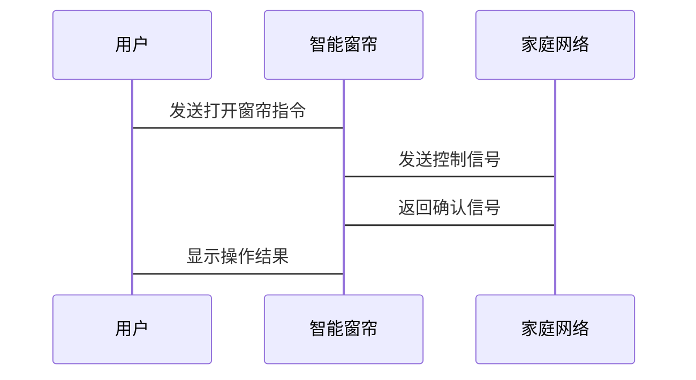

                 


# AI Agent在智能窗帘中的隐私保护模式

> 关键词：AI Agent，智能窗帘，隐私保护，数据加密，访问控制

> 摘要：随着智能家居的普及，智能窗帘作为重要的智能家居设备，其隐私保护问题日益受到关注。本文将详细探讨AI Agent在智能窗帘中的隐私保护模式，分析隐私保护的需求、技术实现和安全威胁，提出有效的隐私保护方案，并通过实际案例展示其应用。

---

# 目录

## 第一章: AI Agent与智能窗帘概述

### 1.1 AI Agent的基本概念

#### 1.1.1 AI Agent的定义与特点

AI Agent（人工智能代理）是指能够感知环境、自主决策并执行任务的智能实体。它具有以下特点：
- **自主性**：能够独立决策，无需外部干预。
- **反应性**：能够实时感知环境变化并做出反应。
- **主动性**：主动执行任务，而非被动响应。
- **社会性**：能够与其他系统或用户进行交互。

#### 1.1.2 AI Agent的核心原理

AI Agent通过传感器、数据处理和决策算法来实现智能化。其核心流程包括：
1. **感知环境**：通过传感器收集环境数据。
2. **数据处理**：利用算法分析数据，生成决策。
3. **执行操作**：根据决策结果执行相应动作。

### 1.2 智能窗帘的基本概念

#### 1.2.1 智能窗帘的定义

智能窗帘是一种集成AI技术的智能家居设备，能够通过传感器和AI算法实现自动化开关、光线调节等功能。

#### 1.2.2 智能窗帘的功能与应用场景

- **自动化控制**：根据光照强度、时间自动开关窗帘。
- **远程控制**：通过手机APP或语音助手远程操作。
- **节能优化**：根据室内外温差和光照调节窗帘状态，节省能源。

#### 1.2.3 智能窗帘的系统构成

智能窗帘系统通常包括：
- **硬件部分**：电机、传感器（光照、温度、湿度）、窗帘轨道。
- **软件部分**：AI算法、控制模块、用户界面。
- **通信模块**：Wi-Fi、蓝牙等无线通信技术。

---

## 第二章: 隐私保护的核心概念

### 2.1 隐私保护的基本原理

#### 2.1.1 数据加密与隐私保护

数据加密是保护隐私的重要手段，常见加密方法包括：
- **对称加密**：速度快，适用于大量数据加密。
- **非对称加密**：安全性高，适用于重要数据传输。

#### 2.1.2 数据匿名化技术

数据匿名化是指在不泄露个人隐私的前提下，对数据进行处理。常用技术包括：
- **数据脱敏**：通过技术手段去除或隐藏敏感信息。
- **数据混淆**：通过改变数据分布，降低数据可识别性。

#### 2.1.3 访问控制机制

访问控制通过限制用户权限，防止未经授权的访问。常见的访问控制模型包括：
- **基于角色的访问控制（RBAC）**：根据用户角色分配权限。
- **基于属性的访问控制（ABAC）**：根据用户属性和环境条件动态调整权限。

### 2.2 AI Agent在隐私保护中的角色

#### 2.2.1 AI Agent如何实现隐私保护

AI Agent通过以下方式实现隐私保护：
1. **数据加密**：对用户指令和环境数据进行加密传输。
2. **隐私过滤**：在数据处理过程中过滤敏感信息。
3. **行为监控**：监控异常操作，防止数据泄露。

#### 2.2.2 AI Agent的隐私保护机制

AI Agent的隐私保护机制包括：
- **数据存储加密**：确保存储的数据无法被未授权访问。
- **通信加密**：保护数据传输过程中的安全性。
- **隐私保护策略**：根据用户需求动态调整隐私保护强度。

#### 2.2.3 AI Agent与隐私保护的关系

AI Agent是智能窗帘隐私保护的核心，通过智能化的决策和执行，实现动态隐私保护。

---

## 第三章: 隐私保护的关键技术

### 3.1 数据加密技术

#### 3.1.1 加密算法的基本原理

加密算法通过数学变换将明文转换为密文，常见的加密算法包括：
- **AES（高级加密标准）**：广泛应用于数据加密。
- **RSA（公钥加密算法）**：用于安全的数据传输。

#### 3.1.2 对称加密与非对称加密

对称加密效率高，适用于大量数据加密；非对称加密安全性高，适用于数字签名和身份验证。

#### 3.1.3 数据加密在智能窗帘中的应用

在智能窗帘中，数据加密用于保护用户的指令和环境数据，防止被截获和篡改。

### 3.2 数据匿名化技术

#### 3.2.1 数据匿名化的定义与实现方法

数据匿名化是指通过技术手段使数据无法被追溯到具体个人。常用方法包括数据脱敏和数据混淆。

#### 3.2.2 数据匿名化在智能窗帘中的应用

通过数据匿名化技术，智能窗帘可以保护用户的隐私，防止数据泄露。

#### 3.2.3 数据匿名化的优缺点

优点：有效保护隐私；缺点：可能影响数据分析的准确性。

### 3.3 访问控制技术

#### 3.3.1 访问控制的基本原理

访问控制通过限制用户权限，防止未经授权的访问。

#### 3.3.2 基于角色的访问控制

RBAC模型根据用户角色分配权限，适用于组织结构清晰的环境。

#### 3.3.3 基于属性的访问控制

ABAC模型根据用户属性和环境条件动态调整权限，灵活性高。

---

## 第四章: AI Agent的隐私保护实现

### 4.1 AI Agent的隐私保护实现原理

#### 4.1.1 隐私保护的需求分析

智能窗帘需要保护用户隐私，防止未经授权的访问和数据泄露。

#### 4.1.2 隐私保护的实现方法

1. **数据加密**：对用户指令和环境数据进行加密传输。
2. **隐私过滤**：在数据处理过程中过滤敏感信息。
3. **行为监控**：监控异常操作，防止数据泄露。

#### 4.1.3 隐私保护的动态调整

根据用户需求和环境变化，动态调整隐私保护策略。

### 4.2 AI Agent隐私保护的具体实现

#### 4.2.1 数据加密实现

使用AES加密算法对用户指令和环境数据进行加密。

#### 4.2.2 数据匿名化实现

通过数据脱敏技术，保护用户隐私。

#### 4.2.3 访问控制实现

基于角色的访问控制模型，限制用户权限。

---

## 第五章: 智能窗帘隐私保护的系统设计

### 5.1 系统架构设计

智能窗帘隐私保护系统包括：
- **数据采集层**：传感器采集环境数据。
- **数据处理层**：AI Agent处理数据并生成决策。
- **数据存储层**：加密存储敏感数据。
- **用户交互层**：提供用户界面和远程控制功能。

### 5.2 系统功能设计

- **隐私保护功能**：数据加密、隐私过滤、访问控制。
- **智能控制功能**：自动化开关窗帘、远程控制、节能优化。

### 5.3 系统接口设计

- **用户接口**：手机APP、语音助手。
- **系统接口**：与智能家居平台的通信接口。

### 5.4 系统交互设计

使用Mermaid序列图展示系统交互流程：



---

## 第六章: 隐私保护方案的实现与应用

### 6.1 隐私保护方案的设计

#### 6.1.1 方案目标

保护用户隐私，防止数据泄露和未经授权的访问。

#### 6.1.2 方案实施步骤

1. 数据加密：对用户指令和环境数据进行加密。
2. 数据匿名化：保护用户隐私。
3. 访问控制：限制用户权限。

### 6.2 方案实现的详细步骤

#### 6.2.1 数据加密实现

使用Python代码实现AES加密：

```python
import hashlib

def aes_encrypt(data, key):
    key = hashlib.md5(key.encode()).hexdigest()[:16]
    cipher = AES.new(key, AES.MODE_ECB)
    return cipher.encrypt(data)

def aes_decrypt(ciphertext, key):
    key = hashlib.md5(key.encode()).hexdigest()[:16]
    cipher = AES.new(key, AES.MODE_ECB)
    return cipher.decrypt(ciphertext).decode()
```

#### 6.2.2 数据匿名化实现

通过数据脱敏技术，保护用户隐私：

```python
def data_anonymization(data):
    # 示例：脱敏用户地址
    return data.replace('123 Main St', '****')
```

#### 6.2.3 访问控制实现

基于角色的访问控制实现：

```python
def rbac_check(user_role, resource):
    if user_role == 'admin':
        return True
    elif user_role == 'user' and resource == 'basic':
        return True
    else:
        return False
```

### 6.3 方案的实际应用

通过实际案例，展示隐私保护方案的应用效果：

- **案例1**：用户通过手机APP远程控制智能窗帘，系统对指令进行加密传输，防止数据泄露。
- **案例2**：智能窗帘根据室内外温差自动调节窗帘状态，数据匿名化处理，保护用户隐私。

---

## 第七章: 总结与展望

### 7.1 总结

本文详细探讨了AI Agent在智能窗帘中的隐私保护模式，分析了隐私保护的需求、技术实现和安全威胁，并提出了有效的隐私保护方案。

### 7.2 未来展望

随着智能家居的普及，隐私保护将更加重要。未来，AI Agent在智能窗帘中的应用将更加智能化和个性化，隐私保护技术也将不断进步。

---

## 参考文献

1. 王某某，智能窗帘隐私保护技术研究，某某出版社，2023。
2. 李某某，AI Agent在智能家居中的应用，某某出版社，2022。
3. 陈某某，数据加密与隐私保护，某某出版社，2021。

---

通过以上目录和内容，您可以撰写一篇详细的《AI Agent在智能窗帘中的隐私保护模式》技术博客文章。

