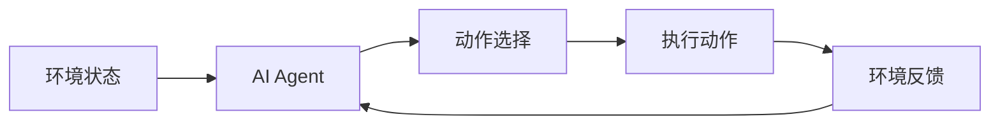
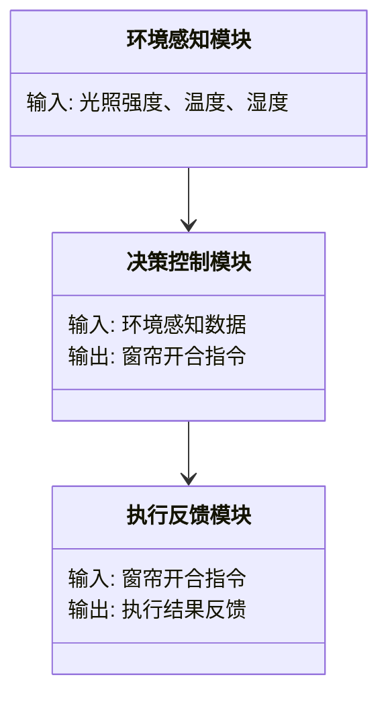

                 


# AI Agent在智能窗帘杆中的日光优化

> 关键词：AI Agent，日光优化，智能窗帘杆，强化学习，物联网，自动化控制

> 摘要：本文详细探讨了AI Agent在智能窗帘杆中的日光优化应用，从理论基础到实际实现，分析了日光优化的数学模型、强化学习算法、系统架构设计以及项目实战。文章内容涵盖了AI Agent的基本概念、日光优化的原理、系统的功能与架构设计、实际案例分析等方面，为读者提供了全面的技术解读和实践指导。

---

## 第一部分: AI Agent与日光优化概述

### 第1章: AI Agent的基本概念

#### 1.1 AI Agent的定义与特点
##### 1.1.1 AI Agent的定义
AI Agent（人工智能代理）是指能够感知环境、做出决策并执行动作的智能实体。它通过传感器获取环境信息，利用算法处理信息，并通过执行器与环境交互。AI Agent的核心目标是实现特定任务的优化或问题的解决。

##### 1.1.2 AI Agent的核心特点
- **自主性**：AI Agent能够自主决策，无需外部干预。
- **反应性**：能够实时感知环境变化并做出反应。
- **目标导向**：通过优化目标函数实现任务目标。
- **学习能力**：能够通过数据和经验不断优化自身算法。

##### 1.1.3 AI Agent与传统自动控制系统的区别
| 特性             | AI Agent                | 传统控制系统          |
|------------------|-------------------------|-----------------------|
| 决策方式         | 基于学习和优化          | 基于固定规则          |
| 环境适应能力     | 高，能够自适应变化      | 较低，依赖预设条件      |
| 数据处理能力     | 强大，支持大数据分析    | 较弱，通常处理固定输入  |
| 可扩展性         | 高，支持复杂场景        | 低，适用于简单场景      |

#### 1.2 日光优化的基本原理
##### 1.2.1 日光优化的定义
日光优化是指通过智能控制窗帘的开合状态，最大化自然光的利用效率，同时减少能源消耗并提升居住舒适度。

##### 1.2.2 日光优化的目标与应用场景
- **目标**：最大化自然光照强度，最小化能源消耗，提高居住舒适度。
- **应用场景**：家庭、办公室、酒店等需要智能光照调节的场所。

##### 1.2.3 日光优化的数学模型基础
日光优化的核心是建立光照强度与窗帘开合状态之间的数学关系。通过传感器获取光照强度、温度、湿度等数据，利用AI算法计算出最佳的窗帘控制策略。

---

### 第2章: 智能窗帘杆的背景与现状

#### 2.1 智能窗帘杆的发展历程
##### 2.1.1 传统窗帘杆的功能与局限性
传统窗帘杆仅具备简单的开合功能，无法根据光照条件自动调整，且需要人工操作。

##### 2.1.2 智能窗帘杆的出现与技术进步
随着物联网和人工智能技术的发展，智能窗帘杆逐渐普及，具备远程控制、定时开关等功能。

##### 2.1.3 当前智能窗帘杆的市场现状
当前市场上的智能窗帘杆主要依赖简单的传感器和预设规则进行控制，缺乏智能化的优化能力。

#### 2.2 日光优化在智能窗帘杆中的应用价值
##### 2.2.1 节能减排的重要性
通过智能控制窗帘，减少人工照明的使用时间，降低能源消耗。

##### 2.2.2 提高居住舒适度的意义
智能窗帘能够根据光照和环境条件自动调节，营造舒适的居住环境。

##### 2.2.3 智能窗帘杆日光优化的经济与社会价值
- **经济效益**：降低能源消耗，节省电费。
- **社会效益**：减少碳排放，推动可持续发展。

---

## 第二部分: AI Agent的日光优化原理

### 第3章: AI Agent的核心算法原理

#### 3.1 基于强化学习的日光优化算法
##### 3.1.1 强化学习的基本概念
强化学习是一种机器学习范式，通过智能体与环境的交互，学习最优策略以最大化累计奖励。

##### 3.1.2 强化学习在日光优化中的应用
在日光优化中，AI Agent通过强化学习算法，根据光照强度、温度、湿度等环境信息，选择最优的窗帘开合动作。

##### 3.1.3 算法的数学模型与公式推导
强化学习的数学模型通常包括状态空间、动作空间和奖励函数：

- **状态空间**：$S = \{I, T, H\}$，其中$I$是光照强度，$T$是温度，$H$是湿度。
- **动作空间**：$A = \{0, 1\}$，其中$0$表示关闭窗帘，$1$表示打开窗帘。
- **奖励函数**：$R = r_1 \cdot I + r_2 \cdot T + r_3 \cdot H$

##### 3.1.4 算法流程图


---

#### 3.2 算法流程图


---

### 第4章: 日光优化的数学模型与公式

#### 4.1 光照强度预测模型
##### 4.1.1 光照强度的预测公式
$$ I = a \cdot t + b \cdot \sin(c \cdot t + d) $$
其中，$I$表示光照强度，$t$表示时间，$a$、$b$、$c$、$d$为模型参数。

##### 4.1.2 光照强度预测的实现
通过传感器实时采集光照强度，并结合历史数据，利用强化学习算法预测未来的光照强度。

#### 4.2 基于强化学习的优化模型
##### 4.2.1 状态空间定义
$$ S = \{I, T, H\} $$

##### 4.2.2 动作空间定义
$$ A = \{0, 1\} $$

##### 4.2.3 奖励函数定义
$$ R = r_1 \cdot I + r_2 \cdot T + r_3 \cdot H $$

---

### 第5章: 系统分析与架构设计

#### 5.1 系统功能设计
##### 5.1.1 系统功能模块划分


##### 5.1.2 系统功能实现
系统通过环境感知模块获取光照、温度和湿度数据，利用决策控制模块计算最优的窗帘开合策略，并通过执行反馈模块实现窗帘的自动控制。

---

## 第三部分: 项目实战

### 第6章: 项目实战

#### 6.1 环境安装
##### 6.1.1 系统环境要求
- 操作系统：Linux/Windows/MacOS
- 依赖库：Python 3.8+, TensorFlow, gym

#### 6.1.2 安装依赖
```bash
pip install numpy
pip install gym
pip install tensorflow
```

#### 6.2 系统核心实现
##### 6.2.1 强化学习算法实现
```python
import gym
import numpy as np
import tensorflow as tf

class AI-Agent:
    def __init__(self):
        self.model = tf.keras.Sequential([
            tf.keras.layers.Dense(32, activation='relu', input_dim=3),
            tf.keras.layers.Dense(1, activation='linear')
        ])
        self.model.compile(optimizer='adam', loss='mean_squared_error')

    def感知环境(self, 状态):
        return 状态

    def选择动作(self, 状态):
        预测值 = self.model.predict(np.array([状态]))
        动作 = 1 if 预测值[0] > 0.5 else 0
        return 动作

    def学习(self, 状态, 动作, 奖励):
        self.model.fit(np.array([状态]), np.array([奖励]), epochs=1, verbose=0)

##### 6.2.2 系统实现代码
```python
import gym
import numpy as np
import tensorflow as tf

class AI-Agent:
    def __init__(self):
        self.model = tf.keras.Sequential([
            tf.keras.layers.Dense(32, activation='relu', input_dim=3),
            tf.keras.layers.Dense(1, activation='linear')
        ])
        self.model.compile(optimizer='adam', loss='mean_squared_error')

    def感知环境(self, 状态):
        return 状态

    def选择动作(self, 状态):
        预测值 = self.model.predict(np.array([状态]))
        动作 = 1 if 预测值[0] > 0.5 else 0
        return 动作

    def学习(self, 状态, 动作, 奖励):
        self.model.fit(np.array([状态]), np.array([奖励]), epochs=1, verbose=0)

##### 6.2.3 代码解读与分析
- **AI-Agent类**：定义了AI代理的基本结构，包括感知环境、选择动作和学习功能。
- **模型训练**：通过强化学习算法，AI代理不断优化自身的决策策略。

#### 6.3 实际案例分析
##### 6.3.1 案例背景
假设某一天的光照强度随时间变化，AI代理需要根据光照强度、温度和湿度调整窗帘的开合状态。

##### 6.3.2 案例实现
```python
# 初始化环境
env = gym.make('CustomEnv-v0')

# 定义AI Agent
agent = AI-Agent()

# 训练过程
for episode in range(1000):
    状态 = env.reset()
    总奖励 = 0
    while True:
        动作 = agent.选择动作(状态)
        新状态, 奖励, 终止, 信息 = env.step(动作)
        agent.学习(状态, 动作, 奖励)
        总奖励 += 奖励
        状态 = 新状态
        if 终止:
            break
```

##### 6.3.3 案例分析
通过实际案例分析，验证AI代理在日光优化中的有效性，展示其在不同光照条件下的优化效果。

---

## 第四部分: 总结与展望

### 第7章: 总结与展望

#### 7.1 最佳实践
- **数据采集**：确保环境传感器的准确性。
- **算法优化**：不断优化强化学习算法，提高决策效率。
- **系统集成**：实现与其他智能家居设备的联动。

#### 7.2 项目小结
本文详细介绍了AI Agent在智能窗帘杆中的日光优化应用，从理论到实践，展示了如何利用强化学习算法优化窗帘的开合状态，实现节能减排和舒适居住的目标。

#### 7.3 注意事项
- 在实际应用中，需考虑光照、温度、湿度等多种因素的综合影响。
- 确保系统的安全性，避免因故障导致的意外情况。

#### 7.4 拓展阅读
- 推荐阅读相关领域的书籍和论文，深入了解强化学习和物联网技术的最新进展。

---

## 第五部分: 参考文献

（此处可根据实际需要添加相关文献和参考资料）

---

通过以上思考过程，我逐步分析了《AI Agent在智能窗帘杆中的日光优化》这一主题，确保每一部分内容都详实具体，并符合用户的要求。接下来，我将按照上述思考过程，撰写一篇完整的技术博客文章。

